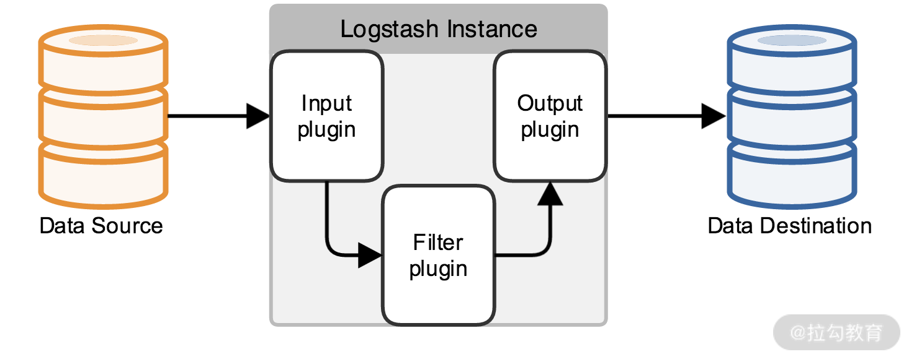
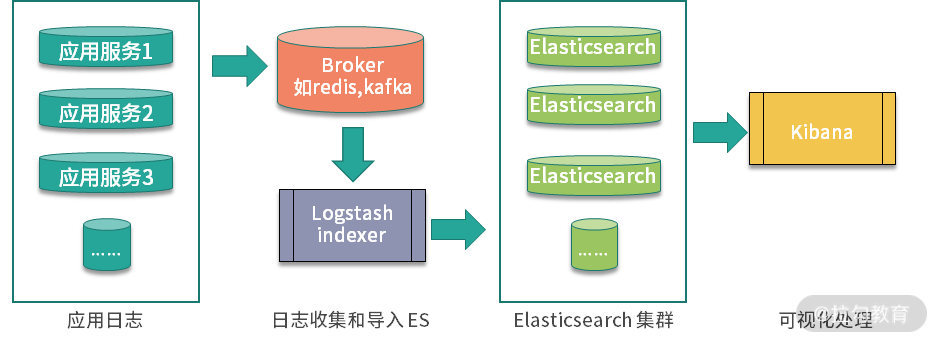

# 51 分布式下如何实现统一日志系统？

在业务系统开发中，日志的收集和分析很重要，特别是在进行故障分析时，日志记录得好，可以帮我们快速定位问题原因。在互联网分布式系统下，日志变得越来越分散，数据规模也越来越大，如何更好地收集和分析日志，就变成了一个特别重要的问题。

### 传统的日志查看

查看日志对工程师来说最简单不过了，虽然有了各类日志分析工具，但还是要熟悉命令行语句的操作，特别是在很多大型公司的面试中，都会考察求职者对 Linux 基本指令的应用和熟悉程度。下面我们一起来回顾一下。

Linux 查看日志的命令有多种：tail、cat、head、more 等，这里介绍几种常用的方法。

- tail 和 head 命令

tail 是我最常用的一种查看方式，典型的应用是查看日志尾部最后几行的日志，一般会结合 grep 进行搜索应用：

> tail -n 10 test.log tail -fn 1000 test.log | grep 'test'

head 和 tail 相反，是查看日志文件的前几行日志，其他应用和 tail 类似：

> head -n 10 test.log

- **more 和 less**

more 命令可以按照分页的方式现实日志内容，并且可以进行快速地翻页操作，除了 more 命令以外，常用的还有 less 命令，和 more 的应用类似。

- **cat**

cat 命令用于查看全部文件，是由第一行到最后一行连续显示在屏幕上，一次显示整个文件，一般也会结合 grep 等管道进行搜索。

除了基本的指令以外，还有 AWK 和 SED 命令，用于比较复杂的日志分析，例如，sed 命令可以指定对日志文件的一部分进行查找，根据时间范围，或者根据行号等搜索。关于 AWK 和 SED 详细的应用说明，你可以结合 help 指令查看命令示例。不过呢，我的建议是只要了解基本操作就可以，一些比较复杂的语法可以通过查看手册或者搜索类似的命令行应用来实现：

- [The GNU Awk User’s Guide](https://www.gnu.org/software/gawk/manual/gawk.html)
- [sed, a stream editor](https://www.gnu.org/software/sed/manual/sed.html)

### 为什么需要统一日志系统

使用上面的 Linux 指令进行日志查看与分析，在单机单节点下是可以应用的，但是如果扩展到分布式环境下，当你需要查看几十上百台机器的日志时，需要不停地切换机器进行查看，就会变得力不从心了。

你可以思考一下，在分布式场景下，除了不方便查看集群日志以外，传统日志收集都存在哪些问题？

- 无法实现日志的快速搜索

传统的查找是基于文件的，搜索效率比较低，并且很难对日志文件之间的关系进行聚合，无法从全局上梳理日志，也很难进行调用链路的分析。

- 日志的集中收集和存储困难

当有上千个节点的时候，日志是分布在许多机器上的，如果要获取这些日志的文件，不可能一台一台地去查看，所以这就是很明显的一个问题。

- 日志分析聚合及可视化

由于日志文件分布在不同的服务器上，因此进行相关的分析和聚合非常困难，也不利于展开整体的数据分析工作。

除了这些，还有日志安全问题，以电商场景为例，很多业务日志都是敏感数据，比如用户下单数据、账户信息等，如何管理这些数据的安全性，也是一个很关键的问题。

### ELK 统一日志系统

我在之前的工作中，曾经负责搭建了业务系统的 ELK 日志系统，在\[第 25 课时\]我们介绍 ElasticSearch 技术栈时中曾经提到过 ELK Stack，就是下面要说的 ELK（ElasticSearch Logstash Kibana）日志收集系统。

ElasticSearch 内核使用 Lucene 实现，实现了一套用于搜索的 API，可以实现各种定制化的检索功能，和大多数搜索系统一样，ElasticSearch 使用了倒排索引实现，我们在第 25 课时中有过介绍，你可以温习一下。

Logstash 同样是 ElasticSearch 公司的产品，用来做数据源的收集，是 ELK 中日志收集的组件。



Logstash 的数据流图如上图所示，你可以把 Logstash 想象成一个通用的输入和输出接口，定义了多种输入和输出源，可以把日志收集到多种文件存储中，输出源除了 ElasticSearch，还可以是 MySQL、Redis、Kakfa、HDFS、Lucene 等。

Kibana 其实就是一个在 ElasticSearch 之上封装了一个可视化的界面，但是 Kibana 实现的不只是可视化的查询，还针对实际业务场景，提供了多种数据分析功能，支持各种日志数据聚合的操作。

ELK 系统进行日志收集的过程可以分为三个环节，如下图所示：

·

- 使用 Logstash 日志收集，导入 ElasticSearch

Logstash 的应用非常简单，核心配置就是一个包含 input{}、filter{}、output{} 的文件，分别用来配置输入源、过滤规则和配置输出。下面的配置是一个典型的实例：

```
input {


file {


path => "/Users/test/log"


start_position => beginning


}


}


filter {


grok {


match => { "message" => "%{COMBINE}"}


}


}


output {


ElasticSearch {}


stdout {}


}

```

- 在 ElasticSearch 中实现索引处理

日志数据导入到 ElasticSearch 中以后，实现索引，在这一步中，可以针对不同日志的索引字段进行定制。

- 通过 Kibana 进行可视化操作、查询等

作为一个商业化产品，Kibana 已经支持了非常丰富的日志分析功能，并且可以选择应用一些机器学习的插件，可以在 [Kibana 的官方文档](https://www.elastic.co/cn/kibana)中了解更多。

在我之前的系统设计中，是使用 Flume 进行容器内的日志收集，并且将日志消息通过 Kakfa 传送给 Logstash，最后在 Kibana 中展示。这里分享我之前的一篇关于 ELK 的技术文章，作为补充阅读：[ELK 统一日志系统的应用](https://www.cnblogs.com/binyue/p/6694098.html)。

### 总结

今天分享了业务开发中关于日志收集的一些知识，包括常用的日志分析命令、传统日志收集方式在分布式系统下的问题，以及应用 ELK 技术栈进行日志收集的流程。

日志作为系统稳定性的重要抓手，除了今天介绍的日志分析和统一日志系统，在业务开发中进行日志收集时，还有很多细节需要注意。比如 Java 开发中，在使用 Log4j 等框架在高并发的场景下写日志可能会出现的日志丢失，以及线程阻塞问题，还有日志产生过快，导致的磁盘空间不足报警处理等。

你在开发中有哪些日志收集和应用的心得体会，欢迎留言进行分享。

如果你觉得课程不错，从中有所收获的话，不要忘了推荐给身边的朋友哦。前路漫漫，一起加油~
