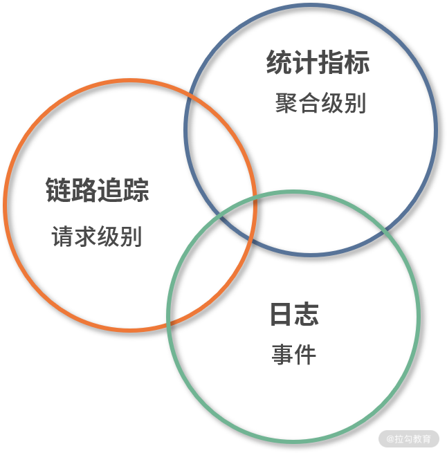
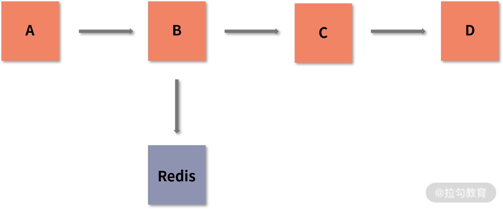
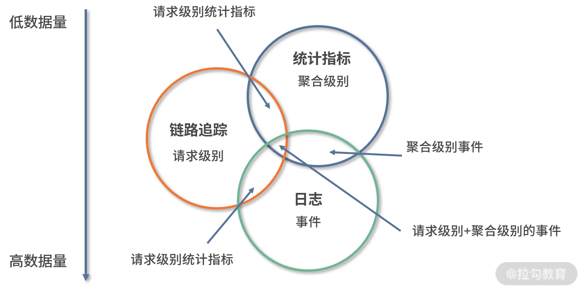

01 数据观测：数据追踪的基石从哪里来？
====================

我们在日常开发过程中无时无刻不在和数据打交道，想要让程序运行得稳定顺畅就要实时对数据进行观测。本课时我就先来讲解观测的数据到底从哪里来的？

### 监控数据来源

我们一般讲的数据观测，其实观测的就是从发起请求，到真正查询的这个过程中的数据。那在这个过程中，我们需要关注哪几个层次的数据呢？接下来，我会从数据请求发起的用户端到数据查询响应的服务端逐层分析。

#### 端上访问

首先是用户侧的端上访问，这应该是最容易理解的。在互联网发展的早期，我们通过 PC 浏览网页，就属于端上访问的范畴。随着移动互联网的发展，端上访问的范围得以扩大。我们打开各种 App，或是访问 App 中的小程序/H5 页面，都属于端上访问。用户通过端上访问，也最能直观地感受到我们程序的响应速度，所以端上访问的数据就变得十分重要。

我们一般可以通过以下几个方式获取端上访问的数据：

1. **用户体验监控 **：Web 页面中的白屏时间、DOM 元素/资源加载耗时、文档网络耗时；App 的卡顿率、崩溃率、热启动加载时长等。
2.** 日志 **：在 Web 页面中，如果出现脚本错误，则需要将相应的异常信息通过日志的方式上报服务器；App 也会有相应的日志输出，但移动端更关注系统崩溃或出现异常时的日志信息。
3.** 端到端 **：指的是用户端（Web/App）到后端服务器的请求情况，比如访问量、成功率、响应时间等。通过端到端观测时，我们还需要了解端上所处的地区、网络环境、响应状态码等信息，才能更好地掌握用户真实的使用情况。
4.** 可用率**：因运营商和地区的不同，会导致访问端上时有一些差异，比如访问是否可用、响应耗时长短等。这与 CDN、DNS 等公共资源有莫大的关系。

#### 应用程序

当端上发起请求后，一般会到达应用程序。这里是代码运行，以及处理用户请求的地方。在应用程序中，我们可能会集成各种第三方组件，比如常见的 Kafka、Redis、MySQL。应用程序的执行效率最终会通过端上响应情况反映出来，直接影响到用户的使用体验。

如果我们想要提升程序的响应速度，就不得不关注以下几个指标：

1.**执行情况 **：我们常说的响应时间、QPS 等，都可以反映应用程序的执行情况。针对端上的请求，或者我们的定时任务，应用程序的执行情况就十分关键。执行情况越差，用户的直观体验也会越差。在组件级别，像 MySQL 中的慢查询监控，Kafka 中的 Lag 监控等，也可以反映应用程序的执行情况。
2.** 资源消耗 **：应用程序部署后，会消耗一定的资源，例如内存级别的 Redis 会消耗大量的内存，Kakfa 则因为要进行磁盘写入所以会要求较好的 I/O。我们的应用程序会区分 I/O 密集型和 CPU 密集型，它们所对应的资源消耗是不同的。
3.** VM 指标监控 **：指的是 JVM 监控，比如 GC 时间、线程数、FGC/YGC 耗时等信息。当然，其他语言也有其独特的统计指标信息。
4.** 容量 **：指单个系统可最大承受的容量。容量也是一个非常重要的指标，当应用访问量到达阈值时，我们一般会对这个应用的访问容量进行扩缩容。
5.** 服务关系 **：随着分布式系统架构的流行，我们在监控单体应用的基础上，还必须考虑应用之间的调用关系和调用速度，比如是否会存在两个服务之间的相互循环引用，下游服务出现问题是否会干扰整个流程的执行，又或是服务之间的响应时长、上下游服务的依赖程度等。
6.** 应用日志 **：应用日志应该是我们再熟悉不过的内容了。我们开发的应用程序，会记录下自身的日志，第三方组件也会有相应的日志，比如 MySQL 的进程日志、慢查询日志等。充分利用应用日志，可以大幅提高我们的排错能力。
7.** 健康情况**：当前服务是否存活、服务运行是否稳定等，这也是十分关键的指标。我们在 ES 中可以看到服务的状态（RED、YELLOW、GREEN）。

#### 业务监控

业务监控也是可观测系统中一个重要的内容，如果你只是让应用程序稳定运行那肯定是远远不够的。因此，我们常常会对具体业务产生的数据进行监控，例如网站系统中我们会关注 PV、UV 等参数；在支付系统中，我们则会关注创建订单量、成单量等。

业务指标能很好地体现出系统是否稳定。任何系统，如果出现了问题，最先受到影响的肯定是业务指标。当然，如果影响不是特别大，那就说明对这个指标进行监控的意义也不是很大。

业务指标也可以衡量上线后的成效。如果我们需要通过 A/B Test 了解用户更偏好哪一种模式，可以分别观察两种模式下的业务指标来比对用户喜好。再或者，我们可以通过业务指标得出的结论，在上线前进行一些改进（例如选择用户更偏好的模式）来提高成单率。

核心业务指标的设定因具体的业务和场景而异，因此开发人员也需要对业务和代码有一定的了解。

#### 基础设施

基础监控我想你也不陌生。我们的应用程序/组件一般都是运行在云主机、操作系统上的，如果基础设施出现了严重问题，会影响到云主机和操作系统，进而牵连应用程序/组件的正常运行。

为了避免这种情况，我们会对基础设施进行监控，以保证它们可以良好地运行着。

我们一般会从 2 个方向监控：

1.**资源利用 **：这个很好理解，像 I/O 使用率、CPU 利用率、内存使用率、磁盘使用率、网络使用率、负载等都属于资源利用的范畴。
2.** 通信情况**：这里是指主机与主机之间的网络情况。通信是互联网中最重要的基石之一，如果两台主机之间出现如网络延迟时间大、丢包率高这样的网络问题，会导致业务受阻。

### 可观测性核心概念

基于上面几个层次的数据来源的介绍，你应该对要观测的数据有了一个大概的了解。

为了解决我在“开篇词”中提到的 3 个问题，我们通常会通过几个维度来观测这些数据，这也是我接下来要为你介绍的可观测性中比较关键的概念：**日志 **、** 统计指标 **和** 链路跟踪**。

#### 日志（Logging）**日志**是系统中的常见功能，我们前面说的数据来源的各个部分都有可能产生日志。日志一般的描述是：在特定时间发生的事件，被以结构化的形式记录并产生的文本数据

日志可以为我们展现系统在任意时间的运行状态，又因为它是结构化的文本，所以我们很容易通过某种格式来进行检索，比如下图就是对 7 月 24 日用户支付下单操作的记录：

由于日志是最容易生成的，如果它大量地输出，会占据比较大的存储空间，进而影响整个应用程序的性能，比如 Java 中 logback 的日志框架，就算使用了异步线程来执行，也会对磁盘和 I/O 的使用率造成影响。

当然，也有一部分系统是利用日志可追溯、结构化的特点，来实现相关功能的，比如我们最常见的 WAL（Write-Ahead Logging）。WAL 就是在操作之前先进行日志写入，再执行操作；如果没有执行操作，那么在下次启动时就可以通过日志中结构化的，有时间标记的信息恢复操作，其中最典型的就是 MySQL 中的 Redo log。

#### 统计指标（Metrics）**统计指标**也是我们经常使用的。它是一种可累加的聚合的数值结果，具有原子性。因此，我们可以通过各种数学计算方式来获取一段时间内的数值

统计指标针对数据的存储、处理、压缩和检索进行了优化，所以一般可以长期存储并以很简单的方式（聚合）查询。但由于涉及数据的处理（数学计算方式）和压缩，所以它也会占用一定的 CPU 资源。

统计指标是一个压缩后的数值，因此如果指标出现异常，我们很难得知是什么原因导致的异常。此外，如果我们使用了一个高基数的指标来作为统计的维度，那么统计就很容易给机器带来高性能损耗，比如，在基于用户 ID 的维度去做数据统计时，因为在统计的时候需要一段时间范围，如果数据过多就必然会造成内存上的占用。

讲到这里，你应该对指标有了一定的认识。我们后端经常说的 QPS、TPS、SLA 都是计算后得到的指标；基础设施中的 CPU 使用率、负载情况也可以认为是指标。

#### 链路追踪（Tracing）**链路追踪**可能是一个较新的概念，但是“全链路压测”这个词你一定不陌生。链路追踪中的“链路”和全链路压测中的“链路”，它们的概念是一样的，只不过链路追踪是将链路的完整行为信息进行记录，然后通过可视化的形式展现出来。这里我用一张图来说明

假设我们程序中的一个接口总共有 4 个服务参与，调用的关系分别是 A->B->C->D，其中 B 服务还与 Redis 这种第三方应用产生了调用/请求关系。这一过程，我们就可以在链路追踪中，通过类似于上面这张图的形式来展示。当然，这只是个例子，在实际中，链路追踪展示的图会比这个更加清楚。我会在后面的课程中更加详细地讲解，这里就不加赘述了。

链路是支持跨应用的，比如我们常见的 RPC 请求，就可以说是链路中的一部分。

与日志一样，链路追踪也会造成一定的性能损耗，因为任何形式的观测都需要存储一定的数据和时间信息，这必然会占用一定的 CPU 和内存资源。我们一般可以通过采样的方式解决资源占用的问题，我会在后面“链路追踪”章节中介绍。

链路追踪是整个可观测性中一个很有趣，也是很重要的部分。希望通过这个简单的说明，能让你对它有一个基础的认识。

#### 三者之间关系

我们一般可以将数据的来源分为 2 个级别：

1.**请求级别： **数据来源于真实的请求，比如一次 HTTP 调用，RPC 调用；
2.** 聚合级别：**真实的请求指标，或是系统的一些参数数据聚合，比如 QPS、CPU 数值。

根据这 2 个级别，我们可以对上面的 3 个内容加以细化，其中**链路追踪 **是请求级别，因为它和每个请求都挂钩；** 日志 **和** 统计指标**可以是请求级别，也可以是聚合级别，因为它们可能是真实的请求，也可能是系统在对自身诊断时记录下来的信息。

那么当它们两两组合之后又是什么关系呢？我们可以从下图中看到：

1.**链路追踪+统计指标 **（Request-scoped metrics）** ，请求级别的统计 **：在链路追踪的基础上，与相关的统计数据结合，从而得知数据与数据、应用与应用之间的关系。
2.** 链路追踪+日志 **（Request-scoped events）** ，请求级别的事件 **：这是链路中一个比较常见的组合模式。日志本身是每一条单独存在的，将链路追踪收集到的信息集成在日志中，可以让日志之间具备关联性，使其具有除了事件维度以外的另一个新的维度，上下文信息。
3.** 日志+统计指标 **（Aggregatable events）** ，聚合级别的事件 **：这是在日志中的比较常见的组合。通过解析这部分具有统计指标的信息，我们可以获取相关的指标数据。
4.** 三者结合 **（Request-scoped,aggregatable events）：三者结合可以理解为** 请求级别+聚合级别的事件**，由此就形成了一个丰富的、全局的观测体系。

根据以上这 3 个概念，我们再来想想它们最终会输出的**数据量（Volume） **。** 统计指标 **是数值的形式，同时又可以压缩，所以它所需的存储量是最小的；** 日志 **的输出量最大，但相对的，它也有比较全的内容记录；** 链路追踪**则正好处于二者之间，它不会像日志一样大量地输出，也不像统计指标一样节能。

于是，这三者的关系就形成了我们图中最左侧的竖线。

#### 结语

我相信通过这节课的学习，你已经对可观测性有了一个整体的认识。在接下来的课程中，我会分别对日志、统计指标、链路追踪这 3 个概念做更深入的讲解。当然，我也会以开发的角度，从更细的维度来介绍我们该如何去参与其中。

最后，给你留道思考题，除了这三个关键点以外，你觉得在观测中还有什么也是必不可少的？欢迎你在留言区留言，分享你的理解和在工作中的经验。
