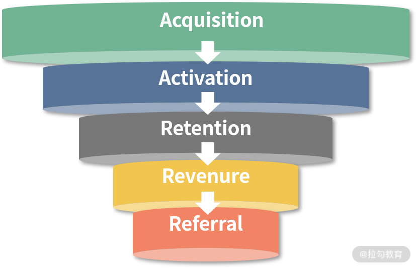
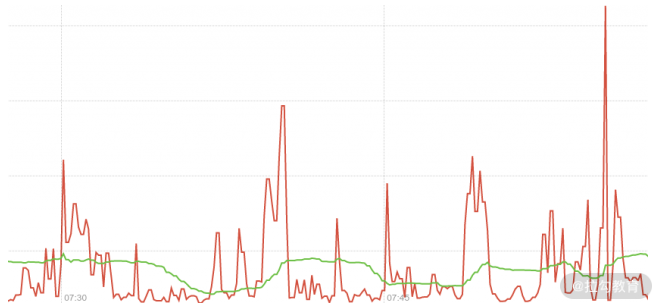

07 指标编写：如何编写出更加了解系统的指标？
=======================

通过前 2 个课时的学习，相信你已经对各个端中需要监控的指标有了一个全面的认识。这一节课，我会从业务开发的角度，带你了解哪些是需要自定义的指标，你又怎样通过这些指标去了解你的系统，更好地定位问题。

### 编写方向

咱们先来讨论一下哪些地方需要添加指标信息，它们一般分为 **产品层** 和**性能层 **，对应** 业务数据 **和** 性能数据**。

#### 业务数据

产品层的数据可以帮助开发、产品、运营等业务人员更好地监测业务，例如评估产品功能、活动效果。业务人员可以通过数据指标预测发展的方向，并用一些策略来提升相应的数据指标。业务不同，数据指标的体系也不一样。目前互联网的产品都和用户相关，在 1 个用户的生命周期中，会有一些比较常见的指标，我们可以通过这些指标搭建模型。

这里我简单介绍一个比较常见的模型，AARRR。它是一个用户增长模型，AARRR 的模型名称来源于组成它的 5 个重要的类别：获客、激活、留存、营收、传播，这 5 个类别又构成一个流程：

1.**获客 **（acquisition）：该类指标可以监测用户是从何处得知你的产品的，例如现在的微信公众号推文、广告等，通过各种手段博取用户眼球，其中最典型的就是点击率，用户点击进入时，我们通常会通过指标上报来获取点击次数。
2.** 激活 **（acvatation）：将获取的用户变成产品真正的参与者、使用者，比如程序的注册人数。
3.** 留存 **（retention）：用户初次使用后是否会再次使用，用户是否在最近一段时间持续使用你的产品。该类指标一般用来监测用户黏性，比如次日留存、七日留存、流失率等。
4.** 营收 **（revenue）：公司是否从用户这里获得了营收，其中最典型的就是用户购买了你的内容，你所获得的成单金额。
5.** 传播 **（referral）：老用户对潜在用户的病毒式传播及口碑传播，进行“** 老拉新**”，比如拉勾教育的分销就可以认为是传播，并由此算出传播系数。



在这一流程中，你会发现其中每个部分都可以根据不同的功能，产生不同的数据指标，然后你可以通过这些更细化的指标优化产品，从而让产品更具有商业价值。

#### 性能数据

性能层的数据会更加方便研发人员了解程序的运行情况。通过观测这部分数据，你能快速感知是哪些业务出现了异常，再结合日志或是我在下一课时要讲的链路，来快速定位问题出现的原因。

我将性能层，在开发时需要注意的数据分为 5 类，分别是**操作行为 **、** 自定义数据处理 **、** 定时/大任务处理 **、** 第三方服务商对接 **、** 执行异常**。

##### 操作行为

用户请求时，肯定会执行某些业务流程，在业务流程中，有 3 个关键点需要添加指标信息：

1.**关键路径 **：业务实现时，会经过一些比较关键的路径，这其中有些指标并不是业务人员所关心的，但它们对开发人员十分重要。以拉勾教育为例，拉勾教育中有一个接口是用来记录用户学习时长的。当初产品提出，需要一个可以记录用户学习时长的功能的时候，他们只需要这个功能可以上线，但并不知道这个功能是如何实现的。对于开发人员，就需要保证这个功能上线之后可以稳定运行，所以我们会在打点上报时，通过监控打点的次数和耗时，保证服务稳定。
2.** 处理流程 **：在业务实现时，可能有很多关键节点是需要你关注的，通过统计处理流程中的关键点，我们可以在出现问题时，确定是哪一个环节导致的 。我还是以拉勾教育为例，在拉勾教育中购买课程时，从购买开始到购买完成是一个处理流程，在这个过程中会有获取用户信息、创建订单、购买等关键节点，通过这些关键节点，我们可以更好地找出问题的根源。假设有一万个用户在拉勾教育购买了课程，拉勾教育会创建一万笔订单，但支付时需要调用微信接口，如果最后只有九千个订单创建成功了，我们从拉勾教育的程序中看到订单减少，可以判断是微信接口出现了问题。 支付业务中，可能会有很多不同的支付渠道，比如支付宝，微信等。针对支付业务，你就可以关注这些不同渠道中的** 创建订单数 **、** 成单数量 **、** 平均成单时间 **等。通过这些信息，你可以了解哪个渠道支付人数更多，然后优化相关渠道的购买流程，提升用户的购买体验。
3.** 触发行为 **：业务在执行流程时会触发一些业务行为，这就是** 触发行为 **。假设我们要通知用户，根据用户联系方式的不同，比如手机号或者邮箱，我们会通过不同的渠道通知。这时候就可以统计每个渠道的** 发送次数 **和** 耗时情况**，来了解这个业务哪个渠道的用户更多。

##### 自定义数据处理

相信你在业务开发过程中，肯定有因为某些业务流程**处理复杂 **或者相对** 耗时较长 **，而选择使用** 自定义线程池 **或是** 内部队列的形式 **去实现某个业务逻辑的情况。** 生产者消费者模式**就是一个很典型的例子。这样的处理方式使你可以充分利用系统资源，从而提升效率。在数据处理时的有 2 个常用技术方案点，分别是队列和线程池。

1.**队列 **：队列是在任务处理时的数据容器。当我们将任务放入队列准备让其异步执行时，我们需要关注两个比较关键的内容：放入的数据个数、队列剩余任务数。
2.** 线程池**：线程池是进行数据处理时的线程集合。任务处理时，线程池也是必不可少。这时候你可能会区分不同的线程池模型来定义不同的统计指标：
    1.  Fix 模式：使用固定的线程数量来处理，也是我们最常用的。我们要获取到线程池中的使用率（活跃线程数 / 总计线程数）。
    2.  Cache 模式：当线程不够时主动创建线程。这种的话我们一般除了要关注使用率，还要总计线程数的增长率。如果长期出现增长的情况，则可能要考虑更换方案，因为大量的线程可能会造成系统负载飙高，从而影响性能。

通过观测这两部分的数据，开发人员能清楚地得知任务处理时的处理进度，当处理能力不足时，可以针对具体的指标来进行更细致的优化。

##### 定时/大任务处理

当需要指定时间执行某个业务，或是某个任务需要很长的执行时间时，我们会采用定时任务或者单独线程的方式来处理，这时我们就需要关注这个任务的处理状态。处理状态包括以下 2 点：

1.**处理过程 **：我们一般会关注这个任务在处理过程中的进度，如果某个大型任务长期处在某个进度或者处理一半后终止了，可以通过进度指标看到。
2.** 处理结果**：我们同样会监控这个任务的处理耗时和处理次数，通过查看这部分指标，可以判断处理的结果是否符合预期。

##### 第三方服务商对接

服务在处理过程中肯定会和各种的第三方服务打交道，比如支付时和微信服务交互，进行人机验证时和极验交互。有时候经常因为第三方服务不稳定导致我们自己的服务出问题，这时候就要考虑做降级处理。在与第三方服务对接时，我们一般会关注以下指标：

1.**调用次数 **：对这个指标的监控在涉及按量付费的场景下十分有用，通过观察调用次数我们可以清楚地得知什么时间段是用量比较多的，针对用量比较多的时间段，是否需要增额度或者减量处理。
2.** 调用时长/错误次数**：由于第三方服务的不可预料，所以我们要监控第三方服务的调用时长和错误次数，当达到一定的错误次数时，我们可以对其降级。如果长期出现不稳定的情况，可能就要考虑更换服务商了。如果服务商对 SLA 指标有过承诺，但是并没有达到约定的标准，我们可以通过这部分数据来索赔。

##### 执行异常

程序执行异常时，除了打印日志的堆栈信息，我推荐你在这个时候再增加一次统计指标的记录。通过这种形式，你可以不局限于异常。在面对其他地方产生的相同的问题时，你可以聚合出指标来更好地辅助你了解业务情况，比如在根据用户ID在查询用户信息时，数据应该是存在的，但是并没有查询到数据，这时候就可以认为是业务异常。

### 指标函数

讲到这里，我想你应该对指标的内容有了一个比较清晰的认识。在编写指标后，我再来介绍一下，怎样才能看到指标的结果。

通常我们会通过一些指标函数进行计算，这些指标函数一般是与时间相关的，计算方式一般有 2 种，**当前时间段的计算 **，** 与之前的某个指标值的计算**。

#### 当前时间段的计算

指的是聚合某个时间段内的值最后求出的值，比如 QPS，就是计算 1 秒内的总请求数。这里面通常会用到以下 8 种函数：

1.**avg **：** 平均值 **。在 JVM 中，我们可以通过获取老年代内存平均每分钟的使用量来查看到内存的使用走向。
2.** max/min **：** 最大值或最小值 **。通过最极端的 2 个值，也可以得出平均值。根据极端值和平均值的差距，我们可以得知是否是程序上的漏洞导致的问题。
3.** count **：** 使用次数 **。最典型的数值就是购买量，比如我们可以计算出每分钟购买的用户数，由此得知在哪些时间段购买的人数更多，可以在人数更多的时间段投入更多的推广资源。
4.** apdex **：我在“** 04 | 统计指标："五个九"对系统稳定的意义？ **”这一课时中讲过 apdex 指标。它可以让你了解到某个方法或者服务的性能。
5.** histogram **：在“** 04 课时 **”中，我介绍了** 直方图 **。如果我们要计算耗时的直方图，可以将一段时间内的数据，分为多个不同的耗时范围，计算哪些值是属于哪个范围的，从而获取到每个范围区间内的数量。通过这个数量绘制成热力图，我们可以更直观地了解到底是哪个耗时区间的请求次数最多。
6.** percentile **：** 分位值 **。我同样在“** 04 课时 **”有过详细的介绍。但在这里我要介绍它的一种计算方式：** HashMap**。如果分位值记录了所有的数值会占用很大的空间，这个时候我们一般会采用 HashMap 来压缩空间，其中 key 为耗时，value 为该耗时的产生次数。在计算时，需要取出所有的数据，算出 value 的总和，然后对 key 进行排序，通过遍历的形式，最后算出相应的 key 值。如下：

```
// rank = 50;代表P50 

// dataMap 中 key和value分别为 <耗时情况, 指定耗时的次数> 

// 计算所有的次数 

long totalCount = dataMap.values().stream().mapToLong(element -> element).sum(); 

// 计算出rank%所在位置(索引) 

int roof = Math.round(totalCount * rank * 1.0f / 100) 

long count = 0; 

// 对所有的key进行排序 

final List<String> sortedKeys = dataMap.sortedKeys(Comparator.comparingInt(Integer::parseInt)); 

// 遍历所有的key(耗时) 

for (String time : sortedKeys) { 

 // 获取当前耗时的次数 

    final Long value = dataMap.get(time); 

    // 将当前所在的位置增加 

    count += value; 

    // 如果已经是超过或者和rank%的位置相同，则认定为当前耗时是P50的值 

    if (count >= roof) { 

        return time; 

    } 

} 

```

7.**percent** ：百分比。SLA 就是通过这样的方式计算出来的。业务中同样会使用到百分比，比如我们规定了每月的销售额，通过目前已经销售的金额，就可以算出本月的销售进度。

8.**sum** ：求和。用于计算一段时间内的数据总和。比如我们可以计算 JVM 在一段时间内的 GC 次数，GC 耗时等。

#### 与之前的某个指标值的计算

假设当前时间段计算得出的值是 a，在 a 之前的某个时间的值是 b，a 与 b 的计算最后得出了值 c。例如拉勾教育今年 8 月份的营收额 a，相比去年 8 月份的营收额 b，同比增长了多少，这个同步增长的量就是 c，也就是这一节我要讲的内容。以下是 4 个在计算中常用的函数：rate、irate、同比、环比。

1.**rate** ：速率。它可以计算当前时间点的数据和一段时间之前的数据，二者之间的增长率。比如要计算最近 1 分钟的速率。那么计算公式就是：

```
 (当前值 - 一分钟之前值) / 60 秒 

```

这样的计算方式，通常与计数器（Counter）一同使用，因为计数器的数据一般是递增的，但有时很难看到增长率。通过速率，你可以看出哪些时候的增长比较多，哪些时候又基本不变，比如拉勾教育的课程购买人数增速占比。在课程上线时我们会开展 1 元购的活动，通过查看活动前后的人数增长率，我们就能很清楚地知道在活动期间购买的人数会大幅增加，以后也会更多地开展类似的活动。

2.**irate** ：同样也叫速率。与 rate 的计算方式不同，irate 只计算最近两次数据之间的增长速率。rate 和 irate 的函数变化如下图：



这张图中红线的就是 irate 函数，而绿色线的就是 rate 函数。图中可以很明显地看出来，rate 更平缓一些，irate 则能更“实时”地体现出数据。

Rate 会对指定时间段内的所有值做平均计算，导致部分精度丢失。因此，irate 通常比 rate 更加精准。但 rate 的曲线更平滑，能更直接地反映出数据整体的波动。

3.**环比** ：指连续 2 个统计周期的变化率。我们在计算销售量时，就可以使用环比，比如这个月的销售量环比增长 10%，指的就是同上一个月销售量相比，增长了 10%。计算公式如下：

```
(本期数 - 上期数) / 上期数 * 100% 

```

4.**同比** ：一般指今年的某一个周期和去年的同一周期相比的变化率，比如我前文提到的拉勾教育今年8月与去年8月的同比增长。计算公式如下：

```
(本期数 - 同期数) / 同期数 * 100% 

```

有些数据是存在一些局限性的，比如雨伞在多雨的时节销量会比较好，如果计算环比，可能上一个月雨水比较少，这会导致计算得出数据并不具备参考性。而同比则计算的是去年相同时候的，相比于环比，具有更高的参考性。

### 结语

通过对编写指标和常见指标函数的介绍，相信你已经对如何编写和怎样计算/展现指标数据有了一个很好的认识。除了我说的这些性能指标以外，你认为还有哪些是我没有说到的？指标函数还有哪些是你觉得常用的？欢迎在留言区分享你的看法。
