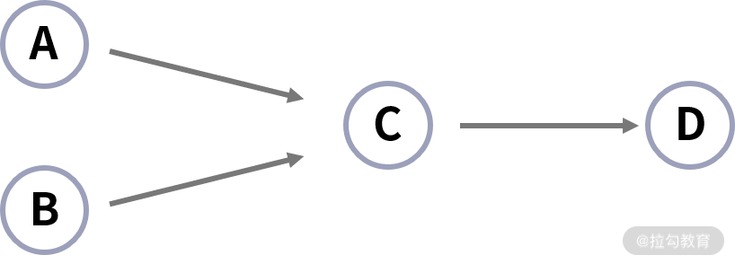

10 链路分析：除了观测链路，还能做什么？
=====================

上节课，我带你了解了如何通过性能剖析的方式解决链路追踪中的短板。这一节，我将带你了解，除了观测链路，通过链路分析还能做哪些有意思的事情。我会从统计指标、拓扑图和数据定制化这三个方面来讲解。

### 指标聚合

我在“ **08 课时** ”有讲到，**链路追踪会跟踪应用中的请求数据。我们可以将这些数据聚合，获取到相关的数据指标。**这便是链路分析除了观测链路之外的第一个功能。通过分析链路，部分指标无须再通过手动埋点的方式进行统计，比手动埋点获取更具优势，这个优势体现在如下 3 点。

1.**更精准 **：链路追踪中的数据，会比手动在各个业务代码中编写的计算时间更加精准，因为它面向的是框架内部，相比在业务代码中编写，这样的方式覆盖面更广，也更精准。
2.** 更动态 **：在传统方式中，开发人员需要对每个开发的功能都进行埋点。随着功能迭代，开发人员在编写时肯定会有遗漏。分析链路不再需要开发人员手动埋点，程序可以自动解析链路中的数据信息，实现动态化。
3.** 更通用**：链路追踪的概念是统一的，所有需要分析的链路都可以根据一套数据内容处理，生成多种相同的指标信息。这样的分析方式更加通用，无论你的代码在哪个层面，用的是哪个框架、哪个语言，都不会再被这些烦琐的内容局限。

在指标中，我们一般将数据分为 3 个维度。

* **服务 **：指** 具有一段相同代码，相同行为的服务**。通常我们是将一个项目认定为一个服务的，但多个服务之间可能存在组合的数据关系。
* **实例 **：指** 服务在进行多进程、多机器部署时的运行实例**。现在是微服务的时代，为了提高服务的吞吐率和服务在灰度上线时的稳定性，一般服务都不会单独部署，而是采用集群的形式。因此，一个服务往往对应两个或者更多的实例。
* **端点 **：是** 与实例平级的一个概念，一个服务下会有多个端点**。这里的端点可以理解为我们在 span 中定义的操作名称，每个操作的操作名称就是一个端点，大多时候端点都是入口操作。

当然，通过链路来分析统计指标会有一些局限性。**由于这些指标来源于链路数据，所以这个方法只能观测到通用的数据信息，而不能对指标进行定制化的统计 **，定制化的指标还是需要开发人员去代码层通过埋点统计。** 链路分析可以使你获取到通用的数据信息，代码埋点则可以帮助你收集定制化的指标数据**，合理地使用这两种方式可以让你可观测的维度最大化，可以丰富你在分析数据、查看问题时的内容参考。

那我们在链路分析中可以获取到哪些数据呢？一共有 8 个，分别是 QPS、SLA、耗时、Apdex、Percentile、Histogram、延迟和 topN，虽然我在前面的课程中已经对它们做过讲解，但这里我会介绍它们在链路追踪里是如何使用的。

1.**QPS **：在链路分析中最为常用，可以清楚地记录每个服务、实例、端点之间的请求量。我们还可以通过某个服务或者端点中实例之间的请求量，来查看负载情况是否均匀。
2.** SLA **：根据 QPS 和具体端点的错误次数，同样可以统计出服务、实例或者接口的 SLA 情况。通过这样方式计算，可以统计到某个组件具体到服务的 SLA 执行情况。SLA 还会提供来源的情况，所以在评估问题影响时，这一指标会起到关键的作用。
3.** 耗时 **：Span 中的数据是包含开始时间和结束时间的，因此我们可以算出来耗时情况。同样，我们可以针对某个接口，统计出这个接口中每个 Span 在整体接口中的耗时占比，从而让性能优化聚焦在相对耗时较高的 Span 中。
4.** Apdex **：有耗时情况，自然也有对应的 Apdex 值。通常，我们会在分析之前预定义不同类型服务的耗时基准时间单位，然后采用统一的标准设定。
5.** Percentile **：基于耗时信息，同样可以计算出相应的百分位值。我们一般会依据长尾效应，根据 P95 或者 P99 中的耗时情况来针对性地优化。
6.** Histogram **：通过直方图，我们可以根据耗时信息来指定多个耗时区间，辅助我们查看具体的分布范围。
7.** 延迟 **：Span 有出口和入口的理念，我们可以了解到相关的网络通信情况。比如 Dubbo 调用时，消费者发起请求的时间是 A，提供者接收到请求到的时间是 B，那么通过 A-B 就可以获取到相应的延迟时间。通过延迟时间我们可以来判定是否是存在网络通信问题，如果网络延迟相对较大，则可能会影响整体的服务效率。当然，也有可能是机器之间时钟不同步导致的，但是一般服务器中的时间差别都相对较少，部分的数据可以忽略掉。
8.** topN**：我们也可以根据上面提到的几部分数据，分别来绘制出相对缓慢的服务、实例或者端点。通过这样的数据，我们可以优先优化相对缓慢的数据，从而提高我们整体的效率。

### 绘制拓扑图**除了追踪链路，链路分析的第二个功能，就是根据从链路中分析出的数据关系绘制拓扑图 **。我在“** 08 课时 **”中对拓扑图进行了简单的介绍，它可以让我们了解服务之间的关系、走向究竟是什么样子的。这里我会更详细讲解一下拓扑图。通过链路分析绘制出的拓扑图，具有** 可视化 **、** 数据化 **、** 动态性**这 3 个优点，我们依次来看

1.**可视化 **：通过可视化的形式，** 你可以以一个全局的视角来审视你的系统，能帮助我们更好地分析数据之间的依赖关系和数据走向 **。哪些点是可以优化的，系统的瓶颈可能在哪里，等等，这都是可以通过拓扑图了解到的。
2.** 数据化 **：** 将拓扑图中的数据和统计指标相互结合，可以将两者的数据放在同一个位置去展示 **。比如通过 QPS 就可以看出哪些服务可能产生的请求更多，这些请求又是来自哪里；当出现问题时，我们还可以通过 SLA 看出来受影响服务的范围有多大。** 通过服务、实例、端点之间的相互引用，我们可以快速分析出相应的依赖占比 **。通过一个接口中的依赖占比，快速分析出哪些是强依赖，哪些是弱依赖，从而更好地进行熔断降级。
3.** 动态性 **：** 在功能迭代时，拓扑图会通过链路数据进行动态分析，所以无须担心它是否是最新的**。拓扑图的这一特性也允许我们通过时间维度来查看演进的过程。

与指标一样，我们也会将拓扑图中的数据分为３个维度，分别是服务、实例和操作。每个维度的数据显示的内容不同，作用也相对不同。

* **服务 **：你可以通过服务关系拓扑图** 了解整个系统的架构、服务和服务之间的依赖 **，还可以通过全局的数据内容** 提供“下钻点” **，从大范围的一个点切入，直到发现问题的根源。通过拓扑图，我们还能以全局的视角来** 优先优化相对依赖度高，耗时更高，也更为重要的服务**。
* **实例**：当两个服务之间存在依赖关系时，我们可以再往下跟踪，查看具体的进程和进程之前的依赖关系。再在实例之间加上统计指标数据，我们还可以看到两者在相互通信时的关系是怎么样的。通过实例之间的拓扑图，你可以确认你的实例是否都有在正常的工作，出现问题时，也可以根据这张图快速定位到是哪一个实例可能存在异常。比如我们在 Dubbo 请求调用时，可以通过依赖和指标数据，查看负载均衡器是否正常工作。
* **操作**：操作和端点是一样的，它与实例是一个级别。通过拓扑图，你可以了解到操作之间的业务逻辑依赖，并且可以根据统计指标了解到延迟和依赖的程度。通过这部分数据，你能够看到具体的某个接口在业务逻辑上依赖了多少个下游操作，如果依赖数据越多，程序出现错误的概率也会越大。

### 定制链路与数据**链路追踪的最后一个功能，就是链路与数据的定制化**。链路与我们的程序代码息息相关，那我们是不是可以让链路得知一些业务中的数据，从而更好地辅助我们理解链路呢？答案是肯定的

我在**08 课时**中有讲到，链路中最基本的数据单位是 span。一个 span 中记录的可能是接收到的某个请求，也可能是与其他第三方组件的一次通信，比如 Tomcat、Dubbo。但这个时候可能会遇到了一个问题，就是这个 span 只知道你的操作名称，而不知道例如来源 IP 地址、访问 UA 信息这样的信息。这个时候我们就可以考虑给这个 span 增加自定义的数据，像上面提到的 IP 地址、UA 信息，来丰富链路数据。其中可以添加的数据内容可以分为 3 类。

1.**通信数据 **：通过框架中的相关数据内容，我们可以了解到业务在进行通信时的数据有哪些，如 MySQL 中可以存储相关的 SQL 语句，Redis 处理时可以记录与处理相关的命令。通过这部分数据，你可以了解到与组件进行交互时发送了哪些请求。比如在出现“慢查询”时，我们可以通过这部分通信数据获取到请求的 SQL，然后对“慢查询”进行优化。
2.** 业务数据 **：我们可以将自己业务中的数据保存到链路中，比如操作时的用户 ID、操作目的等。添加这部分数据让你更好地了解这个链路中的数据的内容，你可以根据这个内容模拟出相对应的真实场景，从而更好地定位问题产生的原因。
3.** 日志+异常信息**：因为链路会在真实的代码中执行，所以我们可以将当时的日志框架与链路数据相结合。这种组合可以让你看到当时的执行日志有哪些，如果有出现异常信息，也可以在链路中快速地结合异常堆栈信息来定位问题。以拉勾教育为例，当获取课程信息出现了接口访问错误，比如查询 MySQL 数据库超时。此时，我会观察出错时的具体链路数据，结合链路中出现错误的 Span 的堆栈信息，快速得知错误的原因。

通过增加这些数据内容，我们可以更容易地了解到代码的真实执行情况，包括其中的参数数据。当链路收集到这部分数据后，我们可以通过 2 个方式进行处理。

1.**数据展示 **：** 在链路信息展示时，展示定制化的数据 **。这样在进行定位问题时，也会更加得心应手。
2.** 数据检索 **：** 通过业务数据和通信数据检索链路信息**。比如最常见的，通过用户 ID 检索，查询出用户请求的链路。当有客服反馈问题时，你可以通过这样的方式，根据用户 ID，快速检索出具体业务和通信数据中的，指定信息的数据链路。

### 结语

我相信通过这篇文章的讲解，你应该已经对链路分析具体的功能有了一个完整的认识。你在链路中，分析过什么有意思的数据呢？欢迎你在留言区分享你的见解。

下一节，我将带你黑/白盒监控。为什么说黑/白盒监控是系统功能与结构稳定的根基？
