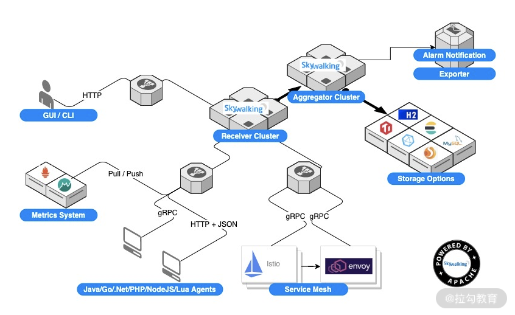
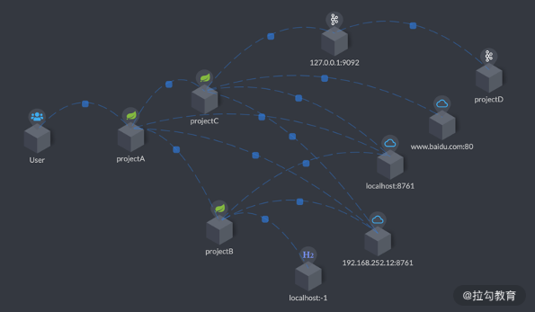

18 观测分析：SkyWalking 如何把观测和分析结合起来？
================================

上一节，我带你了解了链路追踪系统的原理以及 Zipkin 的架构。在这一节，我将带你细化链路追踪的关键点，链路分析。

我在“ **10 | 链路分析：除了观测链路，还能做什么？** ”中，讲到我们可以依据链路数据进行更细维度的数据分析，其中包含指标聚合和拓扑图这两个主要内容。SkyWalking 就是这样的链路分析系统，它提供链路追踪、链路分析、性能剖析、告警等一系列功能，帮助你定位问题。

### 系统定位

上一节中我讲的 Zipkin 就是一个链路追踪系统，它提供链路数据的基本查询和展示功能。Zipkin 项目的定位主要在于链路追踪，我们通过官网提供的支持列表可以看出来，它还提供很多第三方组件内部的链路追踪，比如 HBase、Kafka。你甚至可以把它理解为是一个带全局链路 ID 的日志系统。从它的消息传递协议中可以看出来，它并没有传递过多的数据信息。

SkyWalking 则是一个完整的 APM（Application Performance Management）系统，链路追踪只是其中的一部分。

SkyWalking 和 Zipkin 的定位不同，决定了它们不是相同类型的产品。 **SkyWalking 中提供的组件更加偏向业务应用层面** ，并没有涉及过多的组件级别的观测； **Zipkin 提供了更多组件级别的链路观测** ，但并没有提供太多的链路分析能力。你可以根据两者的侧重点来选择合适的产品。

### 系统架构

下面是官网提供的 SkyWalking 的系统架构图，我们先通过这张图来了解它：



从中间往上看，**首先是 Receiver Cluster，它代表接收器集群，是整个后端服务的接入入口，专门用来收集各个指标，链路信息，相当于我在上一节所讲的链路收集器。 **** 再往后面走是 Aggregator Cluster，代表聚合服务器，它会汇总接收器集群收集到的所有数据，并且最终存储至数据库，并进行对应的告警通知**。右侧标明了它支持的多种不同的存储方式，比如常见的 ElasticSearch、MySQL，我们可以根据需要来选择。

图的左上方表示，我们可以使用 CLI 和 GUI，通过 HTTP 的形式向集群服务器发送请求来读取数据。

图的下方，是数据接收的来源，分为 3 种：

1. Metrics System：统计系统。目前支持从 Prometheus 中拉取数据到 SkyWalking，也支持程序通过 micrometer 推送数据。
2. Agents： 业务探针。指在各个业务系统中集成探针服务来进行链路追踪，也就是链路追踪中的链路采集部分。SkyWalking 支持 Java、Go、.Net、PHP、NodeJS、Python、Nginx LUA 语言的探针，是目前市面上支持探针语言比较全的系统。同时，它还支持通过 gRPC 或者 HTTP 的方式来传递数据。
3. Service Mesh：SkyWalking 还支持目前比较新的 Service Mesh 监控技术，通过观测这部分数据同样可以实现链路数据的观测。

### 链路分析实践与原理

接下来，我会介绍统计指标和拓扑图在 SkyWalking 中是如何使用的。

#### 统计指标**SkyWalking 定义了一套观测解析语言，叫作 OAL（Observability Analysis Language），它通过这套语言来实现统计指标的定义和统计。**我们从一个例子来理解怎么样通过 OAL 语言定义一个统计指标

```
service_resp_time = from(Service.latency).longAvg();

```

我们先来看右侧的部分，**from 代表数据从哪里来 **。在这个示例中，数据来自 Service.latency，代表服务的响应耗时。** longAvg 函数会对服务中的所有响应时长求平均值，最后赋值给左侧的 servce\_resp\_time 字段**，这个字段也就是我们最终生成的统计名称。

通过这样简单的方式我们就可以定义一个统计指标，在系统运行时，就会根据定义生成数据。

通过范例了解之后，我们来看统计指标是如何在 SkyWalking 中运用的。

我们先来看一下有哪些数据源。

在“**10 课时 **”中，我介绍过在** 每一个 Trace 数据中，都有 3 个维度的实体，分别是服务、实例、端点 **。** 我们在进行链路分析时，不仅可以通过这 3 个实体计算得出数据 **，比如基于响应时间来计算平均响应耗时、基于调用次数计算 QPS；** 还可以依据三者之间的依赖，统计数据与数据之间的关系**，比如基于端点和端点之间的调用次数，统计两者的调用频次。

计算得出数据之后，我们可以对同一个实体中的数据进行聚合，聚合之后由 SkyWalking 按照实体将数据分组。

以上文中的平均响应耗时为例，SkyWalking 把每一次链路中该服务的响应时间，按照服务的名称分组。为了分担每一台机器的压力，就需要用到 SkyWalking 中的聚合服务器集群的概念。

此时，可以按照服务名称做路由，把相同的服务名称路由到相同的聚合服务器中，进行数据统计。通过这样的方式可以充分地利用集群的优势来进行数据计算，讲数据计算完成后便会将其存储到数据库中。

在上述过程中，由于实时计算涉及数据存储的问题，如果每计算一次就存储一次，会耗费大量的存储系统的资源。因此，SkyWalking 中采用的是时间窗口的模型，将一段时间内的数据统一放置在内存中进行汇总和计算。通过定时器的形式，将数据批量地查询与写入，从而减少对数据库的读取和写入压力。

最后，基于 OAL 语言，我们自定义了统计指标。我们可以将其运用在自定义的 UI 展示和告警中，将动态统计指标的优势最大化，从而来实现一套高度可定制化的观测平台。

#### 拓扑图

除了统计指标之外，链路分析中的另外一个关键点就是拓扑。拓扑图可以展示服务、端点、实例之间的引用关系，将引用关系与统计指标相结合后，我们能更快地了解到系统整体的运行情况，以及流量主要分布在哪里。下图就展示了在 SkyWalking 中，是怎样展现服务之间的拓扑的。



在这张图中，从左到右代表服务从接入流量到服务处理中的完整拓扑信息。用户发起访问，首先经由 ProjectA 服务，然后引入 ProjectB、ProjectC 和其他的云服务，ProjectB、ProjectC 又分别调用了其余的组件和服务。服务依赖之间使用线进行连接，可以清楚地描绘出彼此的关系。

传统的拓扑检测，通常是利用时间窗口来推断服务之间的依赖关系。比如 RPC 中消费者发送请求给提供者，提供者会先完成请求，再将链路数据发送到链路收集器端。此时，由于收集器端并不清楚是谁调用了提供者，所以会将数据保留一段到内存中。消费者完成请求处理后，将链路信息再发送到链路收集器中，此时再进行数据匹配，才能得知提供者的消费者是哪一个。得知消费者之后，保存在内存中的数据就会被删掉。

在分布式系统中，RPC 的请求数量可能非常巨大，如果使用传统的拓扑检测，虽然也能完成，但是会导致高延迟和高内存使用。同时由于是基于时间窗口模式，如果提供者的数据上报事件超过了时间窗口规定的时间，就会出现无法匹配的问题。

SkyWalking 为了解决上面提到的延迟和内存问题，引入了一个新的分析方式来进行拓扑检测，这种方式叫作 STAM（Streaming Topology Analysis Method）。**STAM 通过在消息传递的内容中注入更多的链路上下文信息，解决了传统拓扑检测中高延迟和高内存的问题。 **Zipkin 和 SkyWalking 在 OkHttp 框架的消息传递时，都会将链路信息放置在请求头中。** 无论它们的采集器是如何实现的，在进行消息传递时，都会通过某种方式将链路信息设置到请求中**。如下图所示：


我们可以看到其中有三个“sw8”开头的 header 内容，“sw8”也是 SkyWalking 在进行链路上下文传递中的关键信息。这里进行了转码处理，我们可以通过阅读官方对跨线程消息透传协议的 [介绍](https://github.com/apache/skywalking/blob/6fe2041b470113e626cb3f41e3789261d31f2548/docs/en/protocols/Skywalking-Cross-Process-Propagation-Headers-Protocol-v3.md.html)，了解到它进行了信息的传递。我列出一些其中比较关键的部分。

1. Trace Id：用于记录全局的链路 Id。
2. Parent segment Id：记录上一个服务消费者中的链路数据 Id。每个线程在链路记录时，会使用 Segment 来区分不同的线程。
3. Parent span Id：记录消费者在发送请求时产生的 Span id。
4. Parent service：消费者的服务名称。
5. Parent service instance：消费者的实例名称。
6. Parent endpoint：消费者中 Span 所指定的端点名称。
7. Peer network address：指定消费者在进行数据发送时，发送到的目标地址，这里指的就是提供者的网络地址，由 IP 加端口组成。

这些内容中，我们可以看到除了全局的链路信息以外，还有很多数据内容，比如消费者的服务名称、实例名称。通过这些数据信息，我们可以很快定位到当前服务的上游信息，而无须再等待上游请求完成后，通过匹配的方式完成拓扑图的记录。

利用 Peer network address 构建下游服务和实例的别名，我们可以快速定位到相关的实例和服务信息，SkyWalking 也可以在很低的延迟下，分析出对应的拓扑信息。由于不再依赖消费者的链路数据信息，也不会有过多的内存消耗。虽然存在一定的传输损耗，但整体的链路请求过程中占用的空间会比较小。

更多拓扑图的实现细节，欢迎大家去[原文](https://wu-sheng.github.io/STAM/README-cn)中了解。

### 总结

在本节中，我带你了解了 SkyWalking 的整体系统架构，以及链路分析中比较关键的两部分内容，统计指标和拓扑图，在 SkyWalking 中的应用实现。在链路分析中，有哪些指标数据是你最为关心的呢？欢迎你在留言区分享你的想法。
