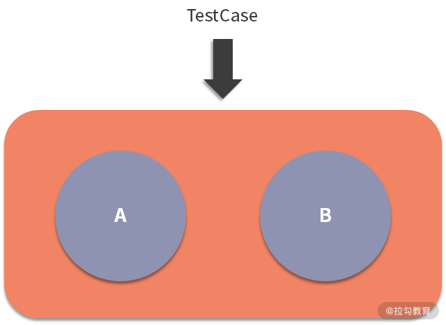
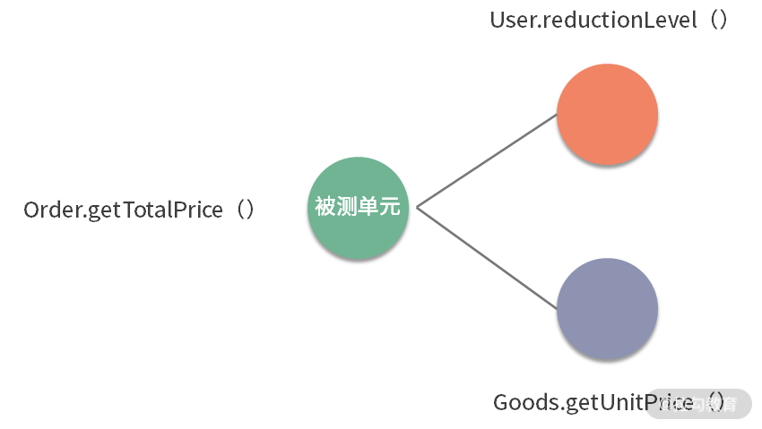
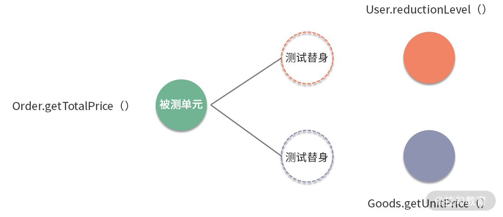
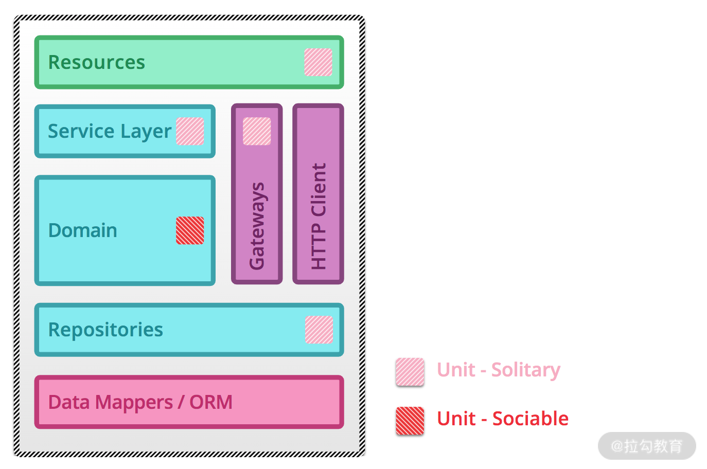
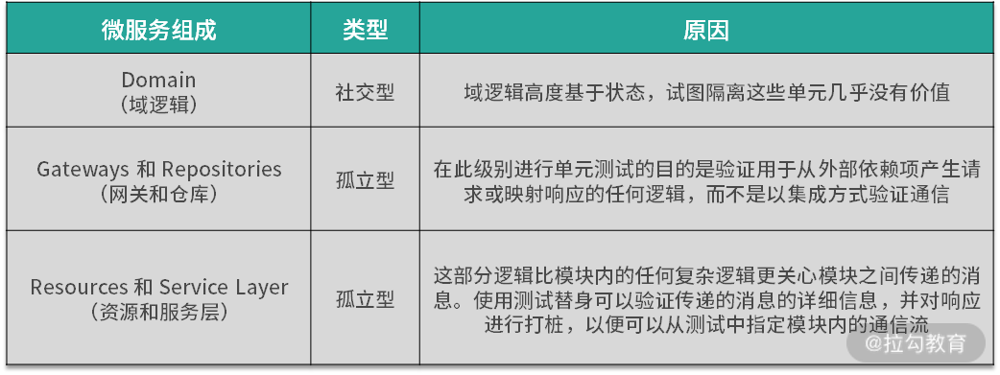

# 04 单元测试：怎样提升最小可测试单元的质量？

上一篇文章，我讲到了微服务架构下的测试策略和质量保障体系，今天我来讲讲测试策略中的最底层测试——单元测试。

### 单元测试的价值

单元测试是一种白盒测试技术，通常由开发人员在编码阶段完成，目的是验证软件代码中的每个单元（方法或类等）是否符合预期，即 **尽早** 在**尽量小的范围内**暴露问题。

我们都知道，问题发现得越早，修复的代价越小。毫无疑问，在开发阶段进行正确的单元测试可以极大地节省时间和金钱。如果跳过单元测试，会导致在后续更高级别的测试阶段产生更高的缺陷修复成本。

如图，假如有一个只包含两个单元 A 和 B 的程序，且只执行端到端测试，如果在测试过程中发现了缺陷，则可能有如下多种原因：

- 该缺陷由单元 A 中的缺陷引起；
- 该缺陷由单元 B 中的缺陷引起；
- 该缺陷由单元 A 和单元 B 中的缺陷共同引起；
- 该缺陷由单元 A 和单元 B 之间接口的缺陷引起；
- 该缺陷是测试方法或测试用例的错误导致的。

由此可见，忽略单元测试会导致后续发现缺陷时，要花费较高的成本来确认缺陷原因。

单元测试除了能够在较早阶段识别软件中的错误，它还有如下价值。

- 反馈速度快：单元测试通常以自动化形式运行，执行速度非常快，可以快速反馈结果，跟持续集成结合起来，形成有效的反馈环。
- 重构的有力保障：系统需要大规模重构时，单测可以确保对已有逻辑的兼容，如果单元测试都通过，基本上可以保证重构没有破坏原来代码逻辑的正确性。
- 使更熟悉代码：写单元测试的过程本身就是一个审视代码的过程，可以发现一些设计上的问题（代码设计的不可测试）、代码编写方面的问题（边界条件的处理不当）等。

既然单元测试由开发人员来设计和执行，那作为测试人员是不是就不需要学习这门技术了？不知道你是怎样看待这个想法的，我的观点是：

- 单元测试只是通常情况下由开发人员完成，并不是绝对的，在一些公司或项目里也存在测试人员完成的情况；
- 在你负责的模块或服务里，第一级别的测试不是你来完成的，那么你更有必要去了解它的设计思路和执行情况，这能帮助你发现单元测试可能存在的问题点，也有利于你设计和执行后续高级别的测试类型；
- 开发人员总是不太擅长做测试类的工作，当你掌握了单元测试的技能，你便更有机会去帮助和影响到开发人员，赢得他对你的尊重，也有利于你们更好地合作；
- 这种想法是测试人员的常见想法，所以掌握单元测试技能在测试人员群体中也会是稀缺技能，因此，掌握它将会获得额外的锻炼机会和个人影响力，要知道，机会总是留给有准备的人。

### 微服务下的单元测试类型

就像之前课程所说：**微服务中最大的复杂性不在于服务本身，而在于微服务之间的交互方式，服务与服务之间常常互相调用以实现更多更复杂的功能。**举个例子，我们需要测试的是订单类（Order）中的获取总价方法（getTotalPrice()），而在该方法中除了自有的一些代码逻辑外，通常需要去调用其他类的方法。比如这里调用的是用户类（User）的优惠等级方法（reductionLevel ()）和商品类（Goods）中的商品价格方法（getUnitPrice()）。很显然，优惠等级方法或商品价格方法，只要一方有错误，就会导致订单类获取总价方法的测试失败。基于这种情况，可以有两种单元测试类型。

#### 1. 社交型单元测试（Sociable Unit Testing）

如图，测试订单类的获取总价方法（Order.getTotalPrice()）时会真实调用用户类的优惠等级方法（User.reductionLevel()）和商品类的商品单价方法（Goods.getUnitPrice()）。将被测试单元视为黑盒子，直接对其进行测试，这种单元测试称之为**社交型单元测试（Sociable Unit Testing）**。

#### 2. 孤立型单元测试（Solitary Unit Testing）

如图，如果测试订单类的获取总价方法（Order.getTotalPrice()）时，使用测试替身**（test doubles） **技术来替代用户类的优惠等级方法（User.reductionLevel()）和商品类的商品单价方法（Goods.getUnitPrice()）的效果。对象及其依赖项之间的交互和协作被** 测试替身 **代替，这种单元测试称之为** 孤立型单元测试（Solitary Unit Testing）**。

另外，上述提到的测试替身是一种在测试中使用对象代替实际对象的技术，常用的技术如下。

- **桩代码（Stubs）**：当在对象上调用特定方法时，会对其进行硬编码（临时代码）的方式来代替真实代码提供固定响应。比如，某函数 X 的实现中调用了一个函数 Y，而 Y 不能调用，为了对函数 X 进行测试，就需要模拟一个函数 Y，那么函数 Y 的实现就是所谓的桩代码。
- **模拟代码（Mocks）**：模拟代码跟桩代码类似，它除了代替真实代码的能力之外，更强调是否使用了特定的参数调用了特定方法，因此，这种对象成为我们测试结果的基础。

根据被测单元是否与其交互者隔离，会产生以上两种单元测试类型，这两种类型的单元测试在微服务测试中都起着重要作用，它们用来解决不同的测试问题。

**由上图可知，在微服务架构中，不同组成使用的单元测试类型不同：**

特别注意：当微服务的（网关+仓库+资源+服务层）与（域逻辑）之比相对较大时，单元测试可能收益不大。常见的情况有小型服务或某些几乎只包含了网关+仓库+资源+服务层等内容的服务，例如适配服务等。

### 如何开展单元测试？

在实际项目过程当中，应该怎样开展单元测试呢？通常来说，可以通过如下四个步骤来进行。

#### 1. 确定使用单元测试的代码范围

虽然单元测试很重要，但并不是所有代码都需要进行单元测试，可以重点关注核心模块代码或底层代码，如重要的业务逻辑代码或通用组件类等。

#### 2. 确定技术选型（以 Java 语言为例）

单元测试中的技术框架通常包括单元测试框架、Mock 代码框架、断言等。

- 单元测试框架：和开发语言直接相关，最常用的单元测试框架是 Junit 和 TestNG，总体来说，Junit 比较轻量级，它天生是做单测的，而 TestNG 则提供了更丰富的测试功能，测试人员对它并不陌生，这里不多做介绍。
- Mock 代码框架：常见的有 EasyMock、Mockito、Jmockit、Powermock 等。
- 断言：Junit 和 TestNG 自身都支持断言，除此还有专门用于断言的 Hamcrest 和 assertJ。

关于它们的优劣网络上已有非常多的文章，这里不再赘述。综合来看，个人比较推荐使用Junit+Mockito+assertJ，我建议你根据自己的需求选型。

#### 3. 引入衡量单测覆盖情况的代码覆盖率工具

只单纯地看单元测试的执行通过率还比较单一，为了更全面地看到测试的覆盖情况，可以借助代码覆盖率工具和技术。在 Java 语言里，常用覆盖率工具有 Jacoco、Emma 和 Cobertura，个人推荐使用 Jacoco。

#### 4. 接入持续集成工具

接入持续集成工具是为了形成工具链，将单元测试、代码覆盖率统计集成在一起，使得代码有提交时便自动触发单元测试用例的执行，并伴随有代码覆盖率的统计，最后可以看到单元测试报告的数据（用例通过情况和代码层面各个维度的覆盖数据）。接着可以判断是否需要修改代码，这便形成了一个代码质量的反馈环，如下图所示。

后续的文章还会讲解到代码覆盖率工具和持续集成工具。

### 单元测试最佳实践

了解了如何开展单元测试，那么如何做到最好呢？我们都知道，代码产生错误无非是对一个业务逻辑或代码逻辑没有实现、实现不充分、实现错误或过分实现，所以无论是拆解业务逻辑还是拆解逻辑控制时都要做到 **MECE 原则**（全称 Mutually Exclusive Collectively Exhaustive，中文意思是“相互独立，完全穷尽”，即日常沟通中常说的“不重不漏”）。

“不重不漏”说起来容易做起来难，为了努力做到它，写出好的单元测试，可以遵循如下具体的实践规范。

1.**好的单元测试要符合 AIR 特点 **：Automatic（自动化）、Independent（独立性）、Repeatable（可重复）。为了凑够一个单词 AIR 的效果，所以有了如上顺序，但我觉得从实际的落地顺序上看，应该是 A->R->I。优先保障单元测试能够自动化执行，释放手工介入，再使单元测试可以重复执行，这样可以使得简单的用例先高效地执行起来，再逐渐追求用例的相互独立性。
2.** 常见的规范或标准做法有（以 Java 为例）**

- **代码目录规范**：单元测试代码必须放在“src/test/java”目录下，Maven 采用“约定优于配置”的原则，并对工程的目录布局做了约定——测试代码存放 src/test/java 目录，单元测试相关的配置资源文件存放 src/test/resources 目录。源码构建时会跳过此目录，而单元测试框架默认是扫描此目录。
- **测试类命名规范**：同一个工程里测试类只用一种命名风格，推荐采用\[类名\]Test.java 或 Test\[类名\].java 的风格，比如源类名为 AccountServiceImpl.java，那么测试类名为 AccountServiceImplTest.java 或者 TestAccountServiceImpl.java。
- **测试方法命名规范**：同一个工程里测试方法只用一种命名风格，推荐采用 test\[源方法名\]\_\[后缀\]的风格。比如源方法名为 login()，则测试方法可以命名为 testLogin_XxxSuccess()、testLogin_XxxNotExist()、testLogin_XxxFail()。
- **测试数据要求**：尽量使用生产环境的测试数据以保障有效性和多样性。
- **颗粒度要求**：要保证测试粒度足够小，有助于精确定位问题。单测粒度一般是方法级别，最好不要超过类级别。只有测试粒度小才能在出错时尽快定位到出错位置，一个待测试方法建议关联一个测试方法，如果待测试方法逻辑复杂分支较多，建议拆分为多个测试方法。
- **验证结果必须要符合预期**：简单来说就是单元测试必须执行通过，执行失败时要及时查明原因并修正问题。
- **代码要遵守 BCDE 原则**，以保证被测试模块的交付质量。
  - B：Border，边界值测试，包括循环边界、特殊取值、特殊时间点、数据顺序等。
  - C：Correct，正确的输入，并得到预期的结果。
  - D：Design，与设计文档相结合，来编写单元测试。
  - E：Error，强制错误信息输入（如：非法数据、异常流程、非业务允许输入等），并得到预期的结果。
- **实践风格**：需加注释、遵守命名规范、公共方法抽象等保证可读性。编写测试代码时，有两种实践风格（至少要有相应的注释来区分）。
  - 准备-执行-断言（Arrange-Act-Assert）：先准备用于测试的对象，然后触发执行，最后对输出和行为进行断言。
  - 给定-当-那么（Given-When-Then）：给定某个上下文，当发生某些事情，那么期望某些结果。
- **执行速度要尽量快**：单个 CASE 的运行时间推荐不超过 5 秒 ，这样才能在持续集成中尽快暴露问题。
- **必须能自动验证**：单测要能报错，不能只有调用，不准使用 System.out 等来进行人工验证，必须使用 Assert 来验证。
- **必须要有逻辑验证能力和强度**：不允许使用恒真断言（如：Assert. _assertTrue_ (true) ; ）不允许使用弱测试断言（如测试方法返回数据，只验证其中某个单字段值就当作通过）。
- **必须有很强的针对性**：可以有多个 Assert 断言，但每个测试方法只测试一种情况（如一个方法涉及 3 种异常需要去覆盖测试，就写三个不同的测试方法）。
- **必须独立稳定，可重复执行**：单元测试通常会被放到持续集成中，如果单测对外部环境(发布环境、网络、服务、中间件等)有依赖，容易导致持续集成机制的不可用。对于测试需要的任何条件，都应该让它们成为测试自身的一个自动化组成部分。
- **同一个工程里只用一种代码框架**；同一个工程里在能够满足需求的情况下只用一种单测框架、只用一种 Mock 框架、只用一种内存数据库等。
- **单元测试遵守基本质量卡点要求**：增量及全量卡点必须有，但覆盖率具体卡点要求可以根据业务差异化、分阶段地要求，如起步推广阶段，提升覆盖率阶段，最终覆盖率目标。但一般来说，行覆盖率大于等于 60%（经验值），分支覆盖率大于等于 80%（经验值），所有单测通过率 100%。核心业务、核心应用、核心模块的增量代码确保单元测试增量覆盖率达到要求，并且全量单测 CASE 通过。

上述规范和实践经验比较多，可能会因为落地难度和成本而使开发人员望而却步，事实上可以采取“小步快跑”的方式，逐次提升不同方面的要求，拉长落地的战线。

### 总结

本节课内容讲解了单元测试的定义：它是一种软件测试方法，目的是验证软件代码中的每个单元（方法或类等）是否符合预期，即**尽早 **在** 尽量小的范围内**暴露错误。

接着讲解了微服务架构下常见的交互场景，测试方式和对象的不同会出现**社交型单元测试 **和** 孤立型单元测试**两种单元测试类型。

然后讲解了实际如何开展单元测试，先确定要测试的代码范围，再引入单测框架、mock 框架、断言类型、代码覆盖率工具和持续集成工具，使代码提交过程形成一个有效的单元测试质量反馈环。紧接着我又给出了一系列的最佳实践或规范，包括类和方法的命名规范、目录规范、数据要求、验证结果要求、运行速度、质量卡点等，相信这些内容可以帮助你更好地设计和实现单元测试。

你所负责的项目或服务，是否运行过单元测试呢？如果有，欢迎在留言区评论，说说单元测试的落地情况是怎样的。同时欢迎你能把这篇文章分享给你的同学、朋友和同事，大家一起交流。

> **相关链接 **[https://www.martinfowler.com/articles/microservice-testing/#testing-unit-introduction](https://www.martinfowler.com/articles/microservice-testing/#testing-unit-introduction)** 单元测试框架 **TestNG官网： [https://testng.org/doc/](https://testng.org/doc/) TestNG教程： [https://www.yiibai.com/testng/](https://www.yiibai.com/testng/) Junit官网： [https://junit.org/junit5/](https://junit.org/junit5/)** Mock代码框架 **Mockito： [https://site.mockito.org/](https://site.mockito.org/) jMock： [http://jmock.org/](http://jmock.org/) Easymock： [http://www.easymock.org/](http://www.easymock.org/) Powermock： [https://github.com/powermock/powermock](https://github.com/powermock/powermock) Mock框架对比： [https://stackoverflow.com/questions/22697/whats-the-best-mock-framework-for-java](https://stackoverflow.com/questions/22697/whats-the-best-mock-framework-for-java)** 断言 **Hamcrest： [http://hamcrest.org/JavaHamcrest/](http://hamcrest.org/JavaHamcrest/) assertJ： [https://joel-costigliola.github.io/assertj/assertj-core.html](https://joel-costigliola.github.io/assertj/assertj-core.html)** 覆盖率工具** Jacoco： [https://www.jacoco.org/jacoco/trunk/index.html](https://www.jacoco.org/jacoco/trunk/index.html) Emma： [http://emma.sourceforge.net/](http://emma.sourceforge.net/) Cobertura： [https://cobertura.github.io/cobertura/](https://cobertura.github.io/cobertura/)
