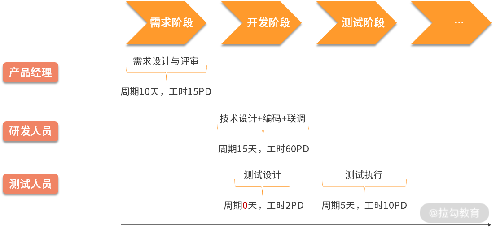
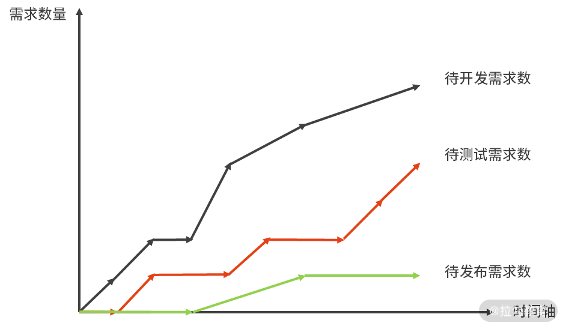
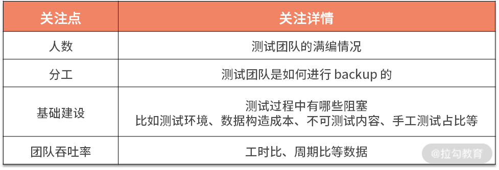
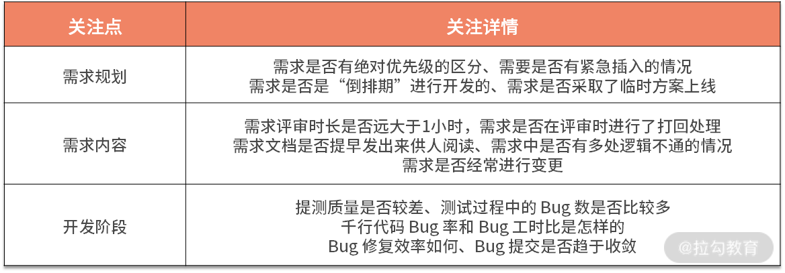
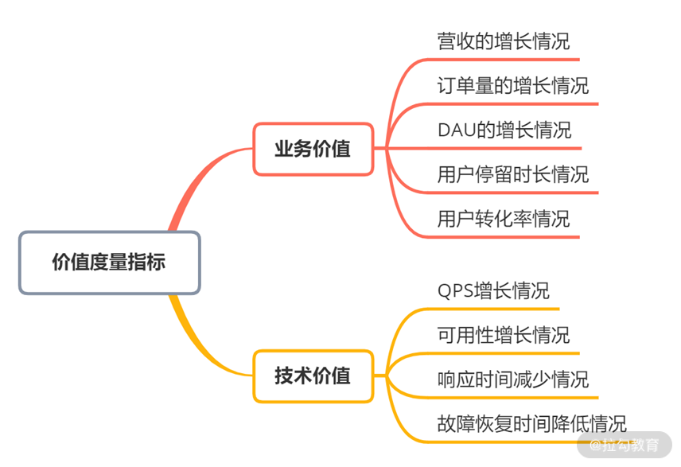

# 17 度量与运营篇：如何度量与运营效率和价值？

上一课时我讲解了产品交付过程中质量的度量与运营。无论运营什么内容，其思路、流程都是适用的。那如何度量与运营效率和价值呢？这就是本课时的重点，今天我主要讲解效率的度量、效率痛点分析、价值的度量和价值闭环运营等内容。

### 效率度量与运营

效率，通俗地说，是指单位时间完成的工作量。在软件业务领域，效率高，通常意味着业务流程顺畅、体验好、用户等待时间短。比如，京东的“多 **快** 好省”，美团的“美团外卖，送啥都 **快** ”，等等。在软件交付过程中，效率指的是产品的交付效率，而交付效率高意味着产品研发团队能够尽可能地一次就把事情做对，这可以极大地缩短产品交付周期。

要想看清楚交付效率的现状，有针对性地提高交付效率，就需要对交付效率进行度量与运营。与质量不同的是，效率比较难以度量，它不像质量一样有多维度的指标和相对确定的目标。另外，效率是一个相对概念，不能只看某团队是不是达到了某个标准值，而是要与其他团队协同配合，实现整体的效率提升，减少并优化团队的效率瓶颈。

#### 效率度量指标

因为交付效率有非常强的相对属性，所以，去度量某一个团队或阶段的效率似乎没有太大意义，投入产出比很低，不如采用相对的方式查看不同团队或阶段的相对效率。因此，可以通过如下维度进行度量。

##### 1. 交付周期比、工时比

交付周期指一个需求从想法提出到发布到线上的周期跨度，这其中，按阶段又可以分为需求阶段、开发阶段、测试阶段，等等，它们属于交付周期的子集。通常使用周期比、工时比两个指标来衡量效率。其中，周期比是指交付周期中日期的实际跨度（排除节假日），工时比是指实际投入的工时，一般以 PD（Person Day 即人日）为单位。

如上图，需求阶段从想法提出、产出需求文档到完成需求评审共跨越了 10 天，因此周期为 10 天。而在这 10 天时间里，共投入了 15 PD。随后，研发人员开始进行技术设计和评审、编码、联调、自测等环节，共跨越 15 天，总投入 60 PD。与此同时，测试人员开始进行测试设计，投入 2 PD。研发人员提交测试后，测试人员开始测试执行，跨越了 5 天，投入 10 PD人力。需要特别注意的是，测试设计阶段的周期是 0 天，这是因为测试设计阶段的周期在开发阶段的周期内，从交付视角看，测试设计并没有占用额外的周期。

所以，对于这个需求来说，三个阶段的总周期是 10+15+5=30 天，工时投入是 15+60+2+10=87 PD。从周期上看，需求阶段、开发阶段、测试阶段的周期比为 10:15:5，从工时比维度看，需求阶段、开发阶段、测试阶段的人日比为 15:60:12。

通过上面的数据还可以知道，如果每个阶段只有 1 个人力投入到项目中，那么该阶段的周期数应等于工时数。周期数大于工时数时，意味着在项目交付过程中有挂起或等待的时候。工时数大于周期数，意味着利用周期内的节假日进行了赶工（也就是加班）。无论是等待还是加班，都属于非正常情况，需要深入分析，使项目交付过程正常化。同样，每个阶段有多人投入的情况也是如此，只不过涉及多人时，需要弄清楚在每个阶段，多个人是如何参与和协同的，分析复杂度也将有所提高。

上面是单个需求的效率基础数据，可以按上述逻辑记录和收集其他需求的数据，然后聚合分析，可以得出来整体的效率现状。通常来说，研发团队和测试团队更关注开发阶段和测试阶段的周期比和工时比。对于测试团队来说，一般会以此来定测试效率指标，先盘点清楚当前的开发测试工时比（比如为 3.5:1），再在该基础上提高一点要求（比如为 4:1 或 4.5:1）。

如果想查看大量需求的效率数据，用累积流量图更为直观。它按天统计出各个需求的状态，并绘制出来，形成累积流量图（横轴：日期，纵轴：需求数量）。

> 累积流量图由精益思想的创始人 Don Reinertsen 和 David Anderson 引入。它是一个综合的价值流度量方法，通过它可以得到不同维度的信息，反应 WIP 的状态、项目的步调、并且快速识别出交付时间存在的风险以及瓶颈。它是追踪和预测敏捷项目的重要工具。它从不同方面描述工作：总范围、进行中和已完成的。

如上图，黑线代表不同时间点，需求评审完成进入开发阶段的需求个数；红线代表不同时间点，开发人员提交给测试人员进行测试的需求个数；绿线代表测试人员完成测试，等待发布到生产环境的需求个数。同一时刻，黑线和红线的差值表示待开发任务的“堆积”，红线和绿线的差值表示待测试任务的“堆积”，反映了交付过程中的开发和测试效率瓶颈。

##### 2. 吞吐率

吞吐率是单个阶段的效率衡量，它表示单位时间内，团队能够交付多少产出。产出这个词听起来比较“虚”，软件产品交付不是计件工作制，因此很难完全标准化。比如，同一个人，一天时间编写了 500 行代码，第二天编写了 300 行代码，那么它哪一天的效率更高？两个人，一天的时间分别编写了 500 行代码和 300 行代码，哪个人的效率更高？很难判断。

因此，建议从多维度来进行度量参考，比如对于开发人员来说，可以同时使用代码行数、实现功能点数、需求数等多个指标来度量。**因为产品交付过程是以需求为单位进行价值传递，所以各个阶段可以以需求个数来作为度量单位，并且需要拉长周期来统计吞吐率，比如一个月或一个季度等。**#### 效率痛点分析

虽然交付效率是多个部门协同提高的，但在产品交付过程中，测试团队是最容易被吐槽存在效率问题的，常见的说辞有“测试效率不高”“测试人力不足”“测试资源阻塞”等。

为什么总是测试人员被吐槽效率存在问题呢？主要有两点，一是测试是交付前的最后一环，原因常常就近找，因此更容易被吐槽；二是测试人力不足或效率不高的确是存在的，但很可能不是根本原因。

我来举个例子：很多人迟到的时候你问他为什么迟到，他很容易说是因为今天堵车、打车不好打、天气不好等，这太容易回答了，因为这只是表面答案。而事实上的原因不应该是今天出门晚、今天起得晚、昨天睡得晚等吗？另外，在进行根本原因分析时需要 5 Why，我个人比较好奇“测试团队的资源不足”这个结论是第几个 Why 得出来的？如果是第一个 why 就得出来的，那么后面四个 why 得出了哪些结论？所以，当出现类似的反馈时，**需要看结论是哪些人共识的，共识的逻辑是什么。**

> 5 why 分析法，又称“5 问法”，也就是对一个问题点连续以 5 个“为什么”来自问，以追究其根本原因。虽为 5 个为什么，但使用时不限定只做“5 次为什么的探讨”，主要是必须找到根本原因为止，有时可能只要 3 次，有时也许要 10 次，如古话所言：打破砂锅问到底。
>
> 5 why 法的关键所在：鼓励解决问题的人要努力避开主观或自负的假设和逻辑陷阱，从结果着手，沿着因果关系链条，顺藤摸瓜，直至找出原有问题的根本原因。
>
> 经典案例： 丰田汽车公司前副社长大野耐一曾举了一个例子来找出停机的真正原因 问题一：为什么机器停了？ 答案一：因为机器超载，保险丝烧断了。 问题二：为什么机器会超载？ 答案二：因为轴承的润滑不足。 问题三：为什么轴承会润滑不足？ 答案三：因为润滑泵失灵了。 问题四：为什么润滑泵会失灵？ 答案四：因为它的轮轴耗损了。 问题五：为什么润滑泵的轮轴会耗损？ 答案五：因为杂质跑到里面去了。
>
> 经过连续五次不停地问“为什么”，才找到问题的真正原因和解决的方法，在润滑泵上加装滤网。如果没有以这种追根究底的精神来发掘问题，他们很可能只是换根保险丝草草了事，真正的问题还是没有解决。

基于测试资源不足、测试效率不高这样的反馈，我给出如下的分析框架。

##### 1. 人数比例概况了解

效率是个平均值，看起来无关人数，其实不然。因为测试团队的人数通常比产品团队和研发团队的人数少很多，比如有很多公司的开发团队和测试团队的人数比为 8:1 甚至是 10:1。当测试人员数量极少时，效率很难提升上去，因为一个人需要兼顾的东西太多，很难面面俱到，切换成本非常高。所以，测试团队的人数以及与其他团队的人数比例可以作为一个参考数据，它们也将影响到测试团队如何开展工作。

##### 2. 测试团队自身效率分析

测试团队自身的效率分析，可以从团队和个人两个视角来分析。

- 测试团队视角

测试团队视角主要查看团队人数、团队内分工、测试技术建设和测试团队的需求吞吐率等信息。

- 测试人员视角

测试人员视角主要查看测试人员本身的问题。

##### 3. 项目组视角

分析了测试人员的效率瓶颈外，还可以扩大关注圈到产品交付过程视角，针对每个阶段进行区别分析。因为测试阶段之前的阶段出现问题，会导致测试团队花更多的力气去调整和适应，且更容易在过程中出现各种各样的非预期问题，遗患无穷。

这里说一下我自己的经历，我分析过比较多的反馈测试人员资源不足类的实例，最后发现根本问题有两个：一是测试人员的效率的确可以再提升，二是由于项目规划导致，项目规划时没有把测试人员当作是一种必备资源进行整体考虑和预排期，而是直接按顺序排时间，等到了测试人员排期时才发现不符合预期，于是想当然地产生了“测试人员人再多一些就好了”“测试人员效率再高一些就好了”的诉求。当然，每个项目和团队的问题总是千差万别，建立起分析框架，遇到问题时多维度分析，以不变应万变。

### 价值度量与运营

无论是保障质量还是提升交付效率，都是在“如何正确地进行产品交付”这个维度上，那么如何确保产品本身是正确的呢？即，产品本身传递了正确的价值，这就需要对价值进行度量。

#### 价值度量指标

无论产品形态是怎样的，产品价值不外乎是业务层面的价值体现和技术方面的价值体现，如图所示：

产品价值度量指标

这些指标不难理解，这里不再赘述具体含义。

#### 价值闭环运营

需求评审时通常会表述这个需求的背景、要实现怎样的效果，但如果没有对价值进行度量，需求文档中的这部分内容很容易一带而过。说不清楚预期结果是什么，没有衡量指标，上线后也就难以复盘，最后变成一盘糊涂账，最后只通过一版一版的需求迭代传递着“说不清楚”的价值。有了价值度量指标，应该如何把价值度量闭环运营起来呢？说起来也简单，只需要**在需求评审的准入条件中加入价值衡量这个环节，需求发布后跟进复盘需求的价值达成情况。**

价值衡量包括如下几部分内容。

- 预期目标：需要说清楚当前需求实现了怎样的价值，业务价值和技术价值的指标都有哪些，预期产生怎样的变化。
- 衡量周期：需要说清楚当前需求上线后，需要多久的时间才能进行价值的衡量，比如半个月或一个月；一般来说，如果衡量周期超过一个月，还需要说明衡量周期久的原因是什么。
- 收益获取方式：价值衡量的数据获取方式，如果是新功能，通常还需要有专门的埋点需求；如果是已有功能，应提前调研好需求收集的可行性，避免出现因为无法获取到数据而导致无法评估需求价值的情况。

需求上线后，根据预先设定的衡量周期进行项目复盘，记录该需求的价值衡量结果，一般分为高于预期、低于预期和符合预期，并记录具体的结果。低于预期时，还需要进一步分析原因，制定改进计划。整个复盘结果要沉淀下来，与该需求进行关联，作为以后需求设计时的重要参考。

### 结语

产品交付过程是一个 **脑力密集型** 的过程。为了能保质、提效、使产品传递价值，以满足业务的发展诉求，需要不断搭建基础技术建设、开发或引入各类工具、迭代产品交付流程，等等。但这些事项，都只是做好“产品交付”这件事情的必要条件，绝非充分条件。

- 从成本视角看：一个问题发现的越晚，修复的成本呈几何倍数增长，必须用 **精益质量** 的思想（好质量应该“设计”出来，不是“测试”出来）指导产品交付过程。
- 从责任分配视角看：需求、开发、测试三个阶段和角色具有一定的独立性，无论质量、效率还是价值，各自重点为其 **所在阶段的交付成果** 负责。
- 从最终交付视角看：共同努力的成果会作为整体最终交付给用户，必须以 **整体思维** 来看待产品研发组织和产品研发过程，需要彼此监督和补位。

由此可见，搭建一个协作紧密的产品交付组织，构建一个良好的质量文化至关重要。你对质量文化有怎样的认识和理解，请写在留言区。

> 相关链接： 《精益软件度量》 张松 著 质量运营在美团点评智能支付业务测试中的初步实践：<https://zhuanlan.zhihu.com/p/36714420>
