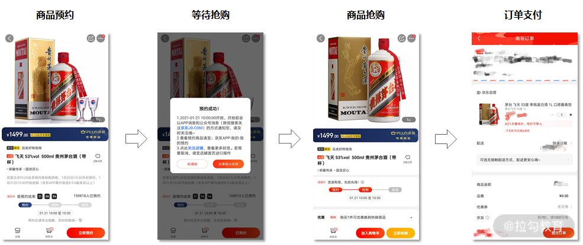
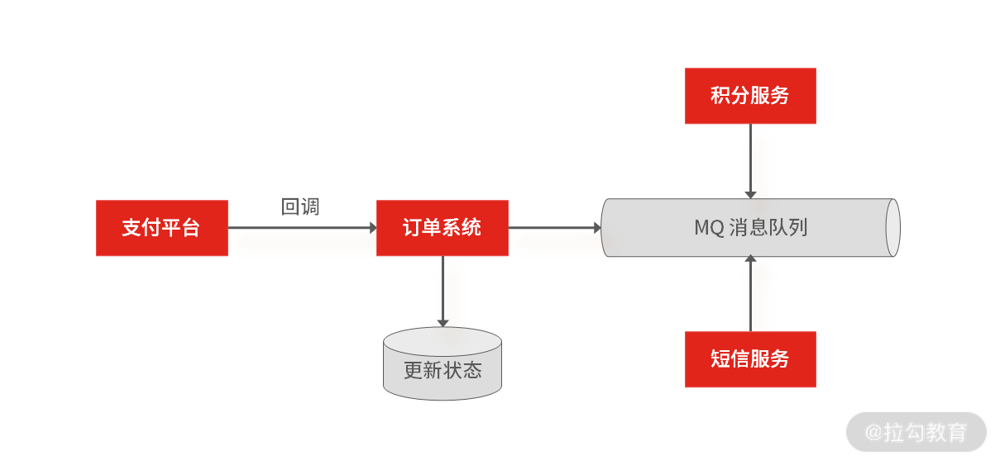
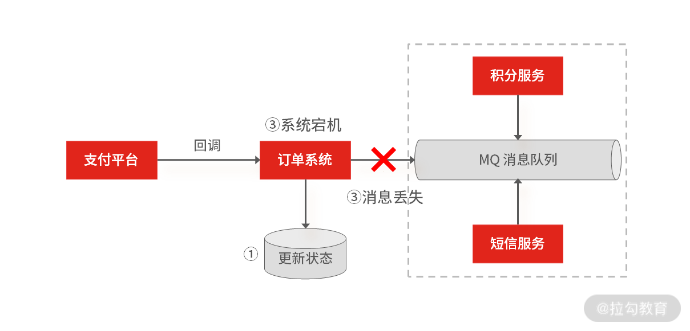
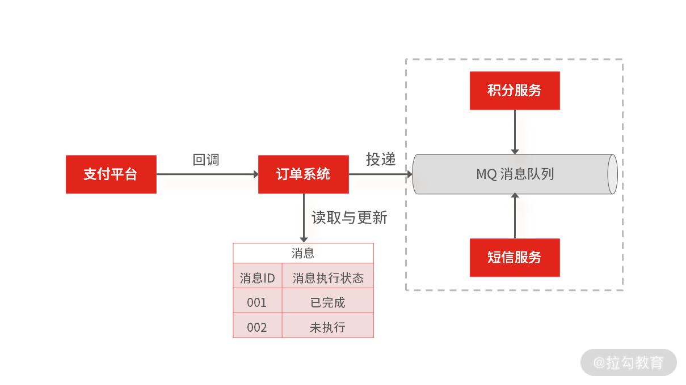

08 案例串联 如何让系统抗住双十一的预约抢购活动？
==========================

到目前为止，我们讨论了很多的面试思路，比如 02 讲中关于架构设计的“四步回答法”，不过大部分内容都是比较独立的知识点（比如分布式事务、分布式锁……）为了让你更深入掌握前几讲内容，把相对独立的知识串联起来，我们今天就来回顾、梳理近期学习的内容，通过“电商预约抢购”的场景，用前几讲内容，做一道完整的架构设计题。

### 案例背景

在大促活动期间，“预约抢购”已经是各大电商平台的主要促销手段，京东自然也会和一些大的供应商合作，推出一些低价的爆款产品，比如 2019 年的 “1499 元抢购飞天茅台”活动，就让很多人每天准时准点拿着手机拼人品。

那这类电商领域的大促抢购场景涉及专栏的哪些内容呢？它们是怎么通过架构设计的方式组合在一起，实现一个完整的需求流程呢？这就是今天要讨论的话题。

我们先把需求梳理一下，总的来说，实现一个抢购系统大概可以分为四个阶段。



* **商品预约**：用户进入商品详情页面，获取购买资格，并等待商品抢购倒计时。
* **等待抢购**：等待商品抢购倒计时，直到商品开放抢购。
* **商品抢购**：商品抢购倒计时结束，用户提交抢购订单，排队等待抢购结果，抢购成功后，扣减系统库存，生成抢购订单。
* **订单支付**：等待用户支付成功后，系统更新订单状态，通知用户购买成功。

接下来，我们就针对各阶段容易出现的问题，来分析其中的技术考点和解决方案。

### 商品预约阶段

这几年，很多电商平台为了方便流量运营，改造了传统秒杀场景，通过先预约再抢购的方式预热商品，并根据预约量调整运营策略。而且在预约抢购的活动中，为了增加商品售卖量，会允许抢购前，预约资格超过实际的库存数量。

那么问题来了：如何在高并发量的情况下，让每个用户都能得到抢购资格呢？**这是预约抢购场景第一个技术考察点。** 那你可以基于“06 | 分布式系统中，如何回答锁的实现原理？”来控制抢购资格的发放。

我们基于 Redis 实现分布式锁（这是最常用的方式），在加锁的过程中，实际上是给 Key 键设置一个值，为避免死锁，还要给 Key 键设置一个过期时间。

```
SET lock_key unique_value NX PX 10000
```

* lock\_key 就是 key 键；
* unique\_value 是客户端生成的唯一的标识；
* NX 代表只在 lock\_key 不存在时，才对 lock\_key 进行设置操作；
* PX 10000 表示设置 lock\_key 的过期时间为 10s，这是为了避免客户端发生异常而无法释放锁。

而解锁的过程就是将 lock\_key 键删除，但不能乱删，要保证执行操作的客户端就是加锁的客户端。而这个时候， unique\_value 的作用就体现出来，你可以通过 Lua 脚本判断 unique\_value 是否为加锁客户端。

选用 Lua 脚本是为了保证解锁操作的原子性。因为 Redis 在执行 Lua 脚本时，可以以原子性的方式执行，保证了锁释放操作的原子性。

```
// 释放锁时，先比较 unique_value 是否相等，避免锁的误释放
if redis.call("get",KEYS[1]) == ARGV[1] then
    return redis.call("del",KEYS[1])
else
    return 0
end
```

这样一来，就通过使用 SET 命令和 Lua 脚本在 Redis 单节点上完成了分布式锁的加锁和解锁。但你要注意，此方案是基于单节点的 Redis 实例实现的，如果此时 Redis 实例发生故障宕机，那么锁变量就没有了，客户端也就无法进行锁操作，就会影响到业务的正常执行。 所以，基于 Redis 实现分布式锁时，你还要掌握如何保证锁的可靠性，也就是怎么基于多个 Redis 节点实现分布式锁（这部分也可以参考 06 讲中的内容）。

### 等待抢购阶段

用户预约成功之后，在商品详情页面中，会存在一个抢购倒计时，这个倒计时的初始时间是从服务端获取的，用户点击购买按钮时，系统还会去服务端验证是否已经到了抢购时间。

在等待抢购阶段，流量突增，因为在抢购商品之前（尤其是临近开始抢购之前的一分钟内），大部分用户会频繁刷新商品详情页，**商品详情页面的读请求量剧增，** 如果商品详情页面没有做好流量控制，就容易成为整个预约抢购系统中的性能瓶颈点。

那么问题来了：如何解决等待抢购时间内的流量突增问题呢？有两个解决思路。

* **页面静态化**：提前对抢购商品的详情页面做静态化，生成一个静态页面，再把页面放到距离用户最近的 CDN 节点中，这样一来，当浏览器访问页面时，就会自动缓存该页面的静态资源文件（对于静态化技术，很多页面端的模板引擎都支持这样的功能，我就不展开讲了）。
* **服务端限流**：对商品详情页中的动态请求接口设置最大并发访问数量（具体的数量根据上线前的性能压测为准），防止超出预期的请求集中访问系统，造成系统压力过载。操作上，你可以在商品详情页的后端系统入口层（如网关系统）中进行接口限流，如果使用 Nginx 来做反向代理，可以直接基于 Nginx 配置限流算法，比如 Nginx 的 ngx\_http\_limit\_req\_module（限制单位时间内所有 IP 的请求数量）和 ngx\_stream\_limit\_conn\_module（限制单位时间内单个 IP 的请求数量）两个模块就提供了限流控制的功能，所以你还要提前掌握限流策略的原理，如令牌桶算法的原理。

### 商品抢购阶段

在商品抢购阶段，用户会点击提交订单，这时，抢购系统会先校验库存，当库存足够时，系统会先扣减库存，然后再生成订单。在这个过程中，短时间之内提交订单的写流量非常高，所以为了做流量削峰，会将提单请求暂存在消息队列中，并提示用户“抢购排队中……”然后再由后端服务异步处理用户的请求。

而你可以基于数据库和缓存两种方式，来实现校验库存和扣减库存的操作。

但因为抢购场景的瞬时流量极高，一般不会直接基于数据库来实现（因为每次操作数据库，即使通过消息队列做了流量削峰，对数据库来说压力也很大，会产生性能瓶颈）。如果非要基于数据库的话，你要通过分布式锁来优化扣减库存的并发操作，但此阶段的分布式锁对可靠性的要求会极高（因为在大促抢购阶段，小的可用性故障，都可能造成大的线上事故），所以基于单节点 Redis 实现的分布式锁不合适，你要选择多节点 Redis 实现分布式锁，或者选型 ZooKeeper。

为了避免上述问题，我们一般基于缓存来存储库存，实现扣减库存的操作。这样在提交订单时，库存的查询和锁定就不会给数据库带来性能瓶颈。不过你仍要注意，基于缓存（如 Redis）的库存扣减操作，仍要考虑缓存系统的单点问题，就算是多节点存储库存，也要引入锁的策略，保证 Redis 实现库存的一致性。

实现了校验库存和扣减库存之后，最后一步是生成抢购订单。由于数据库表会承载订单数据，一旦出现瞬时流量，磁盘 I/O、数据库请求连接数等资源都会出现性能瓶颈，你可以考虑对订单表分库分表，通过对用户 ID 字段进行 Hash 取模，实现分库分表，提高系统的并发能力。

从“商品抢购阶段的架构设计”中我们可以总结出三个技术考点：**流量削峰、扣减库存、分库分表。**

* **“流量削峰”的面试考点**

流量削峰是由于正式抢购场景下，短时间内的提单请求非常高，所以引入消息队列做异步化，然后在抢购系统的后端服务中，启动若干个队列处理消息队列中的提单请求，再执行校验库存、下单等逻辑。

那么如何快速处理消息队列中的提单请求，避免出现大量的消息积压，就是本阶段的考点之一了，方案可以参考“08 | MQ：如何回答消息队列的丢失、重复与积压问题？”

* **“扣减库存”的面试考点**

我刚刚提到，当基于 Redis 实现库存的扣减时，要考虑怎么解决 Redis 的单点问题。而如果基于 Redis 集群来实现扣减库存，还要解决 Redis 在哨兵模式部署的情况下，因为主从切换带来的数据不一致的问题。这就涉及“06 | 分布式系统中，如何回答锁的实现原理？”中的内容。

* **“分库分表”的面试考点**

生成订单后如何实现分库分表？你可以参考“04 | 亿级商品存储下，如何深度回答分布式系统的原理性问题？”中的解决方案。

当然还有一个容易忽略的问题：带宽的影响。由于抢购入口的请求量会非常大，可能会占用大量带宽，为了不影响提交订单的请求，有时会从网络工程的角度解决，通过单独的子域名绑定独立的网络服务器，这里就会涉及 DNS 的设计与优化手段。

### 订单支付阶段

在用户支付订单完成之后，一般会由支付平台回调系统接口，更新订单状态。在支付回调成功之后，抢购系统还会通过异步通知的方式，实现订单更新之外的非核心业务处理，比如积分累计、短信通知等，此阶段可以基于 MQ 实现业务的异步操作。



订单支付后操作

不过针对服务的异常（如宕机），会存在请求数据丢失的可能，比如当支付回调系统后，修改订单状态成功了，但是在异步通知积分系统，更新用户累计积分时，订单系统挂掉了，此时 MQ 还没有收到这条消息，那么这条消息数据就无法还原了。



订单支付后操作（异常）

所以你还要考虑“05 | 海量并发场景下，如何回答分布式事务一致性问题？”中，可靠消息投递机制：先做消息的本地存储，再通过异步重试机制，来实现消息的补偿。比如当支付平台回调订单系统，然后在更新状态的同时，插入一个消息，之后再返回第三方支付操作成功的结果。最后，通过数据库中的这条消息，再异步推送其他系统，完成后续的工作。



订单支付后操作（新方案）

### 总结

今天，我们用前几讲的内容实现了一个完整的预约抢购的系统设计，为了加深你的理解，我总结了每个阶段的注意点。

* **商品预约阶段**：要掌握如何在高并发的场景下通过锁的方式，让每一个用户都获取到抢购资格，结合业务场景对于并发控制的需求诉求和成本的考虑，在商品预约阶段，你可以基于 Redis 来实现分布式锁。
* **等待抢购阶段**：此阶段对页面的查询请求会很高，尤其是临近抢购倒计时的流量突增，解决方案是做页面静态化和服务端限流。
* **商品抢购阶段**：商品抢购是整个流程中涉及技术点最多的阶段，瞬时流量会带来极大的压力，所以通过 MQ 做了同步转异步，实现对流量的削峰，从而让请求排队等待，然后有序且有限地进入到后端服务，而你必须掌握消息队列的丢失、重复和积压问题的解决方案；另外在扣减库存的时候，为了解决扣减存储不超售的问题，同样还需要引入锁的机制。
* **订单支付阶段**：在用户支付完成后，系统通常还需要处理一些非核心操作，你可以通过 MQ 通知的方式来实现系统间的解耦和异步通信，但依旧要保证消息的可靠性（当然也可以通过 RPC 同步调用的方式来实现），所以你也要掌握 RPC 和 MQ 的相关知识点。

总的来说，互联网中大数据里的存储设计（如商品与订单数据的存储设计），你可以参考 04 讲；关于秒杀或抢购场景下的库存扣减设计，你可以参考 06 讲；分布式系统之间的事务一致性的架构设计，你可以参考 05 讲；关于架构设计中的服务强依赖的设计，一般会通过 RPC 远程同步调用的方式实现，你可以参考07讲；系统解耦，流量削峰的设计问题，你可以参考 08讲。
