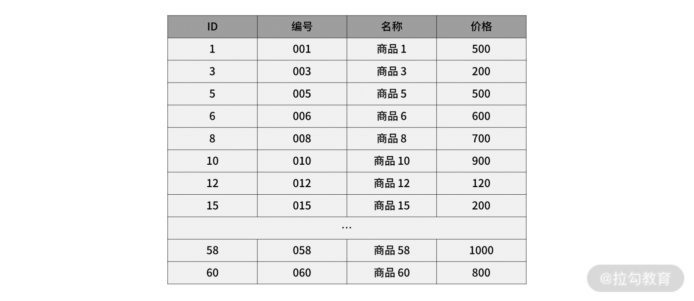
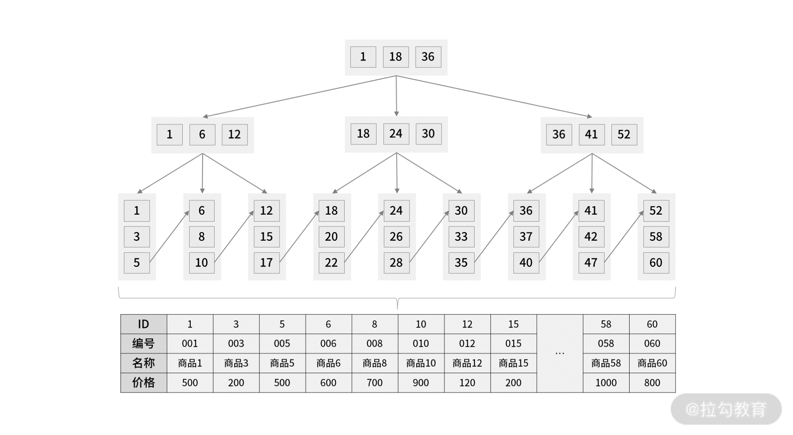
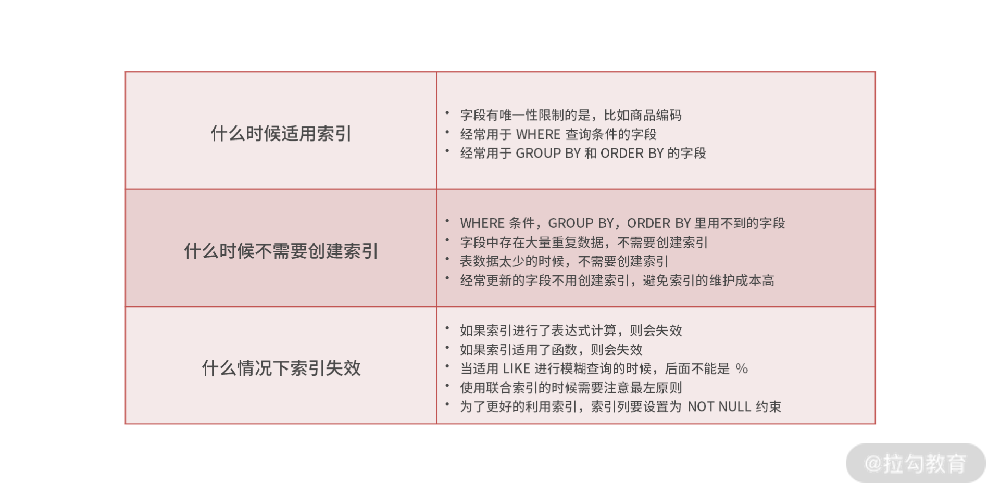

# 09 如何回答 MySQL 的索引原理与优化问题？

在互联网技术面试中，面试官除了会考察分布式、中间件等技术以外，还会考察数据库知识。无论你是程序员，还是架构师，都要掌握关系型数据库 MySQL 的原理与设计问题，从今天起，我就用 4 讲的时间带你打卡 MySQL 的面试内容。

今天这一讲，我们就先来看一看怎么回答 MySQL 的索引原理与优化问题。

### 案例背景

很多面试官考察候选人对“数据库知识”的掌握程度，会以“数据库的索引原理和优化方法”作为切入点。

**假设面试官问你： **在电商平台的订单中心系统中，通常要根据商品类型、订单状态筛选出需要的订单，并按照订单创建的时间进行排序，** 那针对下面这条 SQL，你怎么通过索引来提高查询效率呢？**

```
select * from order where status = 1 order by create_time asc
```

有的同学会认为，单独给 status 建立一个索引就可以了。

但是更优的方式是建立一个 status 和 create_time 组合索引，这是为了避免 MySQL 数据库发生文件排序。因为在查询时，你只能用到 status 的索引，但如果要对 create_time 排序，就要用文件排序 filesort，也就是在 SQL 执行计划中，Extra 列会出现 Using filesort。

所以你要利用索引的有序性，在 status 和 create_time 列建立联合索引，这样根据 status 筛选后的数据就是按照 create_time 排好序的，避免在文件排序。

### 案例分析

通过这个案例，你可以发现“索引知识”的重要性，所以我一般也会拿索引知识来考察候选人，并扩展出 MySQL 索引原理与优化策略的一系列问题，比如：

- 数据库索引底层使用的是什么数据结构和算法呢？
- 为什么 MySQL InnoDB 选择 B+Tree 当默认的索引数据结构？
- 如何通过执行计划查看索引使用详情？
- 有哪些情况会导致索引失效？
- 平时有哪些常见的优化索引的方法？
- ……

总结起来就是如下几点：

- 理解 MySQL InnoDB 的索引原理；
- 掌握 B+Tree 相比于其他索引数据结构（如 B-Tree、二叉树，以及 Hash 表）的优势；
- 掌握 MySQL 执行计划的方法；
- 掌握导致索引失效的常见情况；
- 掌握实际工作中常用的建立高效索引的技巧（如前缀索引、建立覆盖索引等）。

如果你曾经被问到其中某一个问题，那你就有必要认真夯实 MySQL 索引及优化的内容了。

### 案例解答

#### MySQL InnoDB 的索引原理

\*\*从数据结构的角度来看，\*\*MySQL 常见索引有 B+Tree 索引、HASH 索引、Full-Text 索引。我在表中总结了 MySQL 常见的存储引擎 InnoDB、MyISAM 和 Memory 分别支持的索引类型。（后两个存储引擎在实际工作和面试中很少提及，所以本讲我只讲 InnoDB） 。


索引类型

在实际应用中，InnoDB 是 MySQL 建表时默认的存储引擎，B+Tree 索引类型也是 MySQL 存储引擎采用最多的索引类型。

在创建表时，InnoDB 存储引擎默认使用表的主键作为主键索引，该主键索引就是聚簇索引（Clustered Index），如果表没有定义主键，InnoDB 就自己产生一个隐藏的 6 个字节的主键 ID 值作为主键索引，而创建的主键索引默认使用的是 B+Tree 索引。

接下来我们通过一个简单的例子，说明一下 B+Tree 索引在存储数据中的具体实现，**为的是让你理解通过 B+Tree 做索引的原理。**

首先，我们创建一张商品表：

```
CREATE TABLE `product`  (
  `id` int(11) NOT NULL,
  `product_no` varchar(20)  DEFAULT NULL,
  `name` varchar(255) DEFAULT NULL,
  `price` decimal(10, 2) DEFAULT NULL,
  PRIMARY KEY (`id`) USING BTREE
) CHARACTER SET = utf8 COLLATE = utf8_general_ci ROW_FORMAT = Dynamic;
```

然后新增几行数据： 

商品数据表

- **通过主键查询（主键索引）商品数据的过程**

此时当我们使用主键索引查询商品 15 的时候，那么按照 B+Tree 索引原理，是如何找到对应数据的呢？

```
select * from product where id = 15
```

我们可以通过数据手动构建一个 B+Tree，它的每个节点包含 3 个子节点（B+Tree 每个节点允许有 M 个子节点，且 M>2），根节点中的数据值 1、18、36 分别是子节点（1，6，12），（18，24，30）和（36，41，52）中的最小值。

每一层父节点的数据值都会出现在下层子节点的数据值中，因此在叶子节点中，包括了所有的数据值信息，并且每一个叶子节点都指向下一个叶子节点，形成一个链表。如图所示：



主键索引查询过程

我们举例讲解一下 B+Tree 的查询流程，比如想要查找数据值 15，B+Tree 会自顶向下逐层进行查找：

- 将 15 与根节点的数据 (1，18，36) 比较，15 在 1 和 18 之间，所以根据 B+Tree的搜索逻辑，找到第二层的数据块 (1，6，12)；
- 在第二层的数据块 (1，6，12) 中进行查找，因为 15 大于 12，所以找到第三层的数据块 (12，15，17)；
- 在叶子节点的数据块 (12，15，17) 中进行查找，然后我们找到了数据值 15；
- 最终根据数据值 15 找到叶子节点中存储的数据。

**整个过程一共进行了 3 次 I/O 操作，所以 B+Tree 相比于 B 树和二叉树来说，最大的优势在于查询效率。**

那么问题来了，如果你当前查询数据时候，不是通过主键 ID，而是用商品编码查询商品，那么查询过程又是怎样的呢？

- **通过非主键（辅助索引）查询商品数据的过程 **如果你用商品编码查询商品（即使用辅助索引进行查询），会先检索辅助索引中的 B+Tree 的 商品编码，找到对应的叶子节点，获取主键值，然后再通过主键索引中的 B+Tree 树查询到对应的叶子节点，然后获取整行数据。** 这个过程叫回表。 \*\*\*\* 以上就是索引的实现原理。** 掌握索引的原理是了解 MySQL 数据库的查询效率的基础，是每一个研发工程师都需要精通的知识点。

在面试时，面试官一般不会让你直接描述查询索引的过程，但是会通过考察你对索引优化方法的理解，来评估你对索引原理的掌握程度，比如为什么 MySQL InnoDB 选择 B+Tree 作为默认的索引数据结构？MySQL 常见的优化索引的方法有哪些？

所以接下来，我们就详细了解一下在面试中如何回答索引优化的问题。

#### B+Tree 索引的优势

如果你被问到“为什么 MySQL 会选择 B+Tree 当索引数据结构？”其实在考察你两个方面： B+Tree 的索引原理； B+Tree 索引相比于其他索引类型的优势。

我们刚刚已经讲了 B+Tree 的索引原理，现在就来回答一下 B+Tree 相比于其他常见索引结构，如 B 树、二叉树或 Hash 索引结构的优势在哪儿？

- **B+Tree 相对于 B 树 索引结构的优势**

B+Tree 只在叶子节点存储数据，而 B 树 的非叶子节点也要存储数据，所以 B+Tree 的单个节点的数据量更小，在相同的磁盘 I/O 次数下，就能查询更多的节点。

另外，B+Tree 叶子节点采用的是双链表连接，适合 MySQL 中常见的基于范围的顺序查找，而 B 树无法做到这一点。

- **B+Tree 相对于二叉树索引结构的优势**

对于有 N 个叶子节点的 B+Tree，其搜索复杂度为O(logdN)，其中 d 表示节点允许的最大子节点个数为 d 个。在实际的应用当中， d 值是大于100的，这样就保证了，即使数据达到千万级别时，B+Tree 的高度依然维持在 3~4 层左右，也就是说一次数据查询操作只需要做 3~4 次的磁盘 I/O 操作就能查询到目标数据（这里的查询参考上面 B+Tree 的聚簇索引的查询过程）。

而二叉树的每个父节点的儿子节点个数只能是 2 个，意味着其搜索复杂度为 O(logN)，这已经比 B+Tree 高出不少，因此二叉树检索到目标数据所经历的磁盘 I/O 次数要更多。

- **B+Tree 相对于 Hash 表存储结构的优势**我们知道范围查询是 MySQL 中常见的场景，但是 Hash 表不适合做范围查询，它更适合做等值的查询，这也是 B+Tree 索引要比 Hash 表索引有着更广泛的适用场景的原因。

至此，你就知道“为什么 MySQL 会选择 B+Tree 来做索引”了。在回答时，你要着眼于 B+Tree 的优势，然后再引入索引原理的查询过程（掌握这些知识点，这个问题其实比较容易回答）。

接下来，我们进入下一个问题：在实际工作中如何查看索引的执行计划。

#### 通过执行计划查看索引使用详情

我这里有一张存储商品信息的演示表 product：

```
CREATE TABLE `product`  (
  `id` int(11) NOT NULL,
  `product_no` varchar(20)  DEFAULT NULL,
  `name` varchar(255) DEFAULT NULL,
  `price` decimal(10, 2) DEFAULT NULL,
  PRIMARY KEY (`id`) USING BTREE,
  KEY 'index_name' ('name').
  KEY 'index_id_name' ('id', 'name')
) CHARACTER SET = utf8 COLLATE = utf8_general_ci
```

表中包含了主键索引、name 字段上的普通索引，以及 id 和 name 两个字段的联合索引。现在我们来看一条简单查询语句的执行计划：


执行计划

对于执行计划，参数有 possible_keys 字段表示可能用到的索引，key 字段表示实际用的索引，key_len 表示索引的长度，rows 表示扫描的数据行数。**这其中需要你重点关注 type 字段，** 表示数据扫描类型，也就是描述了找到所需数据时使用的扫描方式是什么，常见扫描类型的执行效率从低到高的顺序为（考虑到查询效率问题，全表扫描和全索引扫描要尽量避免）：

- ALL（全表扫描）；
- index（全索引扫描）；
- range（索引范围扫描）；
- ref（非唯一索引扫描）；
- eq_ref（唯一索引扫描）；
- const（结果只有一条的主键或唯一索引扫描）。

总的来说，执行计划是研发工程师分析索引详情必会的技能（很多大厂公司招聘 JD 上写着“SQL 语句调优” ），所以你在面试时也要知道执行计划核心参数的含义，如 type。在回答时，也要以重点参数为切入点，再扩展到其他参数，然后再说自己是怎么做 SQL 优化工作的。

#### 索引失效的常见情况

在工作中，我们经常会碰到 SQL 语句不适用已有索引的情况，来看一个索引失效的例子：


这条带有 like 查询的 SQL 语句，没有用到 product 表中的 index_name 索引。

**我们结合普通索引的 B+Tree 结构看一下索引失效的原因：** 当 MySQL 优化器根据 name like ‘%路由器’ 这个条件，到索引 index_name 的 B+Tree 结构上进行查询评估时，发现当前节点的左右子节点上的值都有可能符合 '%路由器' 这个条件，于是优化器判定当前索引需要扫描整个索引，并且还要回表查询，不如直接全表扫描。

当然，还有其他类似的索引失效的情况：

- 索引列上做了计算、函数、类型转换操作，这些情况下索引失效是因为查询过程需要扫描整个索引并回表，代价高于直接全表扫描；
- like 匹配使用了前缀匹配符 '%abc'；
- 字符串不加引号导致类型转换；

**我给你的建议是，** 如果 MySQL 查询优化器预估走索引的代价比全表扫描的代价还要大，则不走对应的索引，直接全表扫描，如果走索引比全表扫描代价小，则使用索引。

#### 常见优化索引的方法

- **前缀索引优化**

前缀索引就是用某个字段中，字符串的前几个字符建立索引，比如我们可以在订单表上对商品名称字段的前 5 个字符建立索引。使用前缀索引是为了减小索引字段大小，可以增加一个索引页中存储的索引值，有效提高索引的查询速度。在一些大字符串的字段作为索引时，使用前缀索引可以帮助我们减小索引项的大小。

但是，前缀索引有一定的局限性，例如 order by 就无法使用前缀索引，无法把前缀索引用作覆盖索引。

- **覆盖索引优化**

覆盖索引是指 SQL 中 query 的所有字段，在索引 B+tree 的叶子节点上都能找得到的那些索引，从辅助索引中查询得到记录，而不需要通过聚簇索引查询获得。假设我们只需要查询商品的名称、价格，有什么方式可以避免回表呢？

我们可以建立一个组合索引，即商品ID、名称、价格作为一个组合索引。如果索引中存在这些数据，查询将不会再次检索主键索引，从而避免回表。所以，使用覆盖索引的好处很明显，即不需要查询出包含整行记录的所有信息，也就减少了大量的 I/O 操作。

- **联合索引 **联合索引时，存在** 最左匹配原则**，也就是按照最左优先的方式进行索引的匹配。比如联合索引 (userpin, username)，如果查询条件是 WHERE userpin=1 AND username=2，就可以匹配上联合索引；或者查询条件是 WHERE userpin=1，也能匹配上联合索引，但是如果查询条件是 WHERE username=2，就无法匹配上联合索引。

另外，建立联合索引时的字段顺序，对索引效率也有很大影响。越靠前的字段被用于索引过滤的概率越高，实际开发工作中建立联合索引时，要把区分度大的字段排在前面，这样区分度大的字段越有可能被更多的 SQL 使用到。


区分度就是某个字段 column 不同值的个数除以表的总行数，比如性别的区分度就很小，不适合建立索引或不适合排在联合索引列的靠前的位置，而 uuid 这类字段就比较适合做索引或排在联合索引列的靠前的位置。

### 总结

今天，我们讲了 MySQL 的索引原理，介绍了 InnoDB 为什么会采用 B+Tree 结构。因为 B+Tree 能够减少单次查询的磁盘访问次数，做到查询效率最大化。另外，我们还讲了如何查看 SQL 的执行计划，从而找到索引失效的问题，并有针对性的做索引优化。

最后，我总结一些你容易在面试中被问到的，索引的使用原则：



另外，你在了解索引优势的同时，也要了解索引存在的问题：索引会带来数据的写入延迟，引入额外的空间消耗；在海量数据下，想要通过索引提升查询效率也是有限的。
