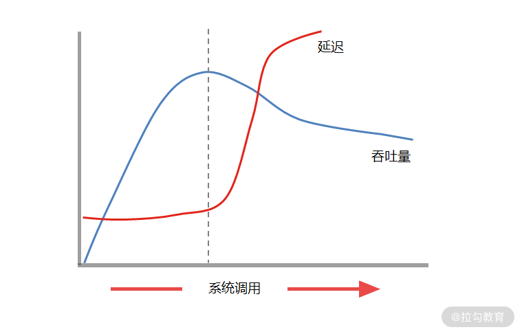
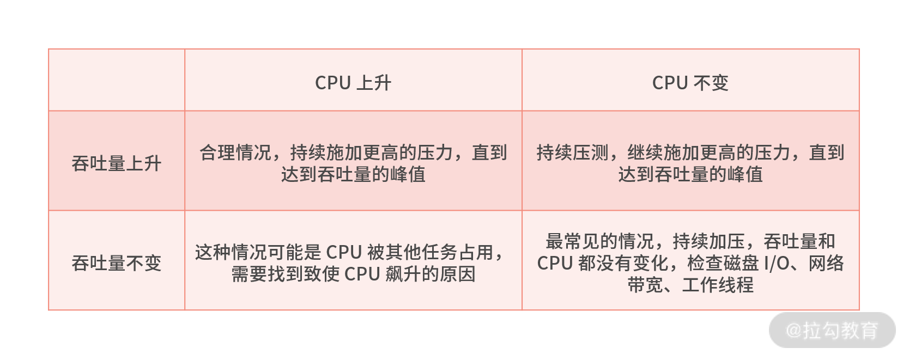

# 17 如何向面试官证明你做的系统是高性能的？

前两讲，我带你了解了“高可用的衡量标准”以及“如何设计高可用的架构”，接下来我们会用两讲的时间来聊一聊“高性能”的话题，今天咱们先来探讨怎么向面试官证明你做的系统是高性能的？（其中会涉及性能优化的指标和关注点，以及怎样分析系统的性能瓶颈）。

### 案例背景

我曾经面试过很多研发工程师和架构师，他们在介绍系统性能时，一般会说：“我们的架构最高支持 200 万的并发流量”。

如果不考虑实际业务需求，这样的回答没有任何意义，因为高性能与业务是强相关的：

- 如果一台网络游戏服务器，可以支撑 2 百名玩家同时在线开黑，可能就算高性能；
- 如果一台网络直播服务器，可以支撑 2 千名用户同时在线观看，可能就算高性能；
- 如果一台电商平台服务器，可以支撑 2 万名用户同时在线下单，可能就算高性能；

这些数据也许有出入，但逻辑没问题，并且在实际的业务场景中，你要关注很多业务相关性指标，比如游戏需要关注稳定性；视频需要关注延时；电商需要关注一致性……

在明确了业务场景之后，你还要关注系统的性能指标主要有吞吐量、延迟以及 TP。

### 案例分析

我们在拿到产品经理的 PRD 文档时，心里就会清楚要关心哪些系统性能指标，因为需求文档中会描述同时支持多少人在线访问，你也可以借此估算出系统的并发用户数。一般来讲，系统建立的会话数量就是用户同时访问系统的数量。你也可以通过公式，估算出系统的吞吐量（throughput）和延迟（latency）。


延迟和吞吐量，是衡量软件系统最常见的两个指标。

- **吞吐量**（系统处理请求的速率）：反映单位时间内处理请求的能力（单位一般是TPS或QPS）。
- **延迟**（响应时间）：从客户端发送请求到接收响应的时间（单位一般是ms、s）。

一般来说，**延迟和吞吐量既互斥，又不绝对的互斥**，你可以通过性能压测分别绘制吞吐量和延迟的曲线图：



延迟总是非递减的曲线，开始时表现比较平稳，到了某一个特定值后，会迅速增大。而吞吐量曲线在开始时迅速增加，到达峰值后逐渐减小。

总体来看，随着压力增大，单位时间内系统被访问的次数增加。结合延迟和吞吐量观察的话，吞吐量曲线的最高点，往往是延迟曲线最低偏后的一个时间点，这意味着延迟已经开始增大一段时间了。那么**对一些延迟要求比较高的系统来说，系统优化性能指标是要找到延迟趋向最低和吞吐量趋向最高的点**。

从图中你也可以看出，如果不做流量控制，在系统压力不断增大后，系统便什么也做不成。这也是一些不够健壮的系统，在压力较大的特殊业务场景下（比如一元秒杀、抢购、瞬时流量非常大的系统），直接崩溃，对所有用户拒绝服务的原因。**除了吞吐量和延迟，TP（Top Percentile）也经常被提到。** 以 TP 99 为例，它是指请求中 99% 的请求能达到的性能，TP 是一个时间值，比如 TP 99 = 10ms，含义就是 99%的请求，在 10ms 之内可以得到响应。

关于 TP 指标，你要掌握两个考点。

- **计算 TP 指标：** 比如 TP 99，把一段时间内所有请求的响应时间，从小到大进行排序，然后取 99% 对应的请求的响应时间，即为 TP99 的值。
- \*\*TP指标相比于性能均值的意义：\*\*为什么要用 TP 99 这样的比例方式，而不直接用平均数来定义性能呢？这是为了更符合实际系统的情况。

举个例子，比如在一个系统的 100 个请求中，99 个都在 1 s 左右返回，剩下 1 个 100s 还不返回，如果计算平均时间，就是，无法反映系统的真实情况。因为耗时 100 s 的请求也许是异常请求，正常请求的平均时间仍是 1 秒，而 TP99 就比较能反映真实情况，因为 TP99 就可以达到 1 秒。

对初中级研发工程师来说，回答“吞吐率、延迟、TP 99（TP 99 比较有代表性）”这三个指标就够了，但如果你应聘高级研发工程师，还要站在系统全链路的角度上思考问题，从端到端的角度思考系统的性能指标（也就是从架构师的视角分析系统）。

### 案例解答

#### 用架构师的视角分析系统性能指标

架构师视角说白了就是系统的全链路视角，我们从前端请求流程开始，来讲解一次请求链路会涉及哪些前后端性能指标。


一次请求链路**步骤一：DNS解析 **用户在浏览器输入 URL 按回车，请求会进行 DNS 查找，浏览器通过 DNS 解析查到域名映射的IP 地址，查找成功后，浏览器会和该 IP 地址建立连接。对应的性能指标为：** DNS解析时间**。

那你怎么提升域名DNS解析性能呢？

答案是通过 DNS缓存或 DNS 预解析，适当增大域名的TTL 值来增大 DNS 服务器缓存域名的时间，进而提升了缓存的命中率。也可以用 dns-prefetch 标签实现域名的预解析，让浏览器在后台把要用的 DNS请求提前解析，当用户访问的网页中包含了预解析的域名时，再次解析 DNS 就不会有延迟了，比如京东针对静态资源域名的预解析如下：

```
<link rel="dns-prefetch" href="//static.360buyimg.com">
```** 步骤二：建立TCP连接 **由于 HTTP 是应用层协议，TCP 是传输层协议，所以 HTTP 是基于 TCP 协议基础上进行数据传输的。所以你要建立 TCP 请求连接，这里你也可以用 TCP的连接时间来衡量浏览器与 Web 服务器建立的请求连接时间。** 步骤三：服务器响应**

这部分就是我们开篇讲到的最重要的性能指标了，即服务器端的延迟和吞吐能力。针对影响服务端性能的指标，还可以细分为基础设施性能指标、数据库性能指标，以及系统应用性能指标。

*   基础设施性能指标主要针对 CPU 利用率、磁盘 I/O，网络带宽、内存利用率等。

举个例子，如果 CPU 占用率超过80%，很可能是系统出了问题。如果内存利用率 100%，可能是因为内存中存放了缓存，因此还要衡量 SWAP 交换空间的利用率。另外，还要考虑容器的 JVM 的Full GC 情况、磁盘 I/O 是否可以优化、网络带宽是否存在瓶颈等问题都会影响系统的最终性能。

*   数据库的性能指标主要有 SQL 查询时间、并发数、连接数、缓存命中率等。
*   系统应用性能指标和系统业务有关，因为业务场景影响架构设计，比如To C 的系统一般会设计成同步 RPC 调用，因为要实时反馈 C 端用户的请求，而 To B 的系统则可以设计成事件驱动模式，通过异步通知的方式，推送或拉取数据，两种架构对比，显然异步事件驱动的吞吐量会更高。

**步骤四：白屏时间 **当浏览器与 Web 服务器建立连接后，就可以进行数据通信了。Web 服务器接收请求后，开始处理请求，浏览器这时会等待Web 服务器的处理响应。

由于浏览器自上而下显示 HTML，同时渲染顺序也是自上而下的，所以当用户在浏览器地址栏输入 URL 按回车，到他看到网页的第一个视觉标志为止，这段白屏时间可以作为一个性能的衡量指标（白屏时间越长，用户体验越差）。

优化手段为减少首次文件的加载体积，比如用 gzip 算法压缩资源文件，调整用户界面的浏览行为（现在主流的Feed流也是一种减少白屏时间的方案）。** 步骤五：首屏时间**

用户端浏览界面的渲染，首屏时间也是一个重要的衡量指标，首屏时间是指：用户在浏览器地址输入 URL 按回车，然后看到当前窗口的区域显示完整页面的时间。一般情况下，一个页面总的白屏时间在 2 秒以内，用户会认为系统响应快，2 ~ 5 秒，用户会觉得响应慢，超过 5 秒很可能造成用户流失。

#### 如何分析系统的性能瓶颈？

通常情况下，系统性能不达标一般会反映在TP 99 的延迟上面，但这只是表层的现象，怎么找到系统真正的性能瓶颈呢？ 你可以遵循这几个步骤。

*   **设计阶段，定义系统性能目标**

你要在项目初期定义好系统大致的性能目标，比如希望单台服务器能够负载多少 TPS 的请求，因为不同的性能会影响到系统的架构设计，也会带来不同的成本，一旦过了设计阶段，再因为性能问题调整系统架构，成本极高。比如，当前单机性能是 80 TPS，要想优化到100 TPS，可以做一些小的性能优化，但要提升到 1000 TPS，就要进行架构改造了，代价非常大。

*   **开发阶段，走查代码和业务流程**

也就是评审代码，代码包括应用程序源代码、环境参数配置、程序整个调用流程和处理逻辑。比如，用户在 App 中触发了“立即下单”按钮，服务端的应用程序从线程池里取得了线程来处理请求，然后查询了几次缓存和数据库，都读取和写入了什么数据，再把最终的响应返回给 App，响应的数据报文格式是什么，有哪些状态码和异常值……

*   **测试阶段，压测发现系统性能峰值 **一般来说，你要在系统上线前，对系统进行全方位的压力测试，绘制出系统吞吐量和延迟曲线，然后找到最佳性能点，并在超过最佳性能点时做限流，如果达不到最佳性能点（比如多数系统的吞吐量，随着压力增大，吞吐量上不去）就需要考虑出现延迟和吞吐量的这几种情况。** 1.定位延迟问题 **你要本着端到端的策略，大到整体流程，小到系统模块调用，逐一排查时间消耗在哪里。

你可以使用 kill -3 PID， jstack 等命令打印系统当前的线程执行的堆栈；还可以用一些性能分析工具，如 JProfiler 来监控系统的内存使用情况、垃圾回收、线程运行状况，比如你发现了运行的 100 个线程里面，有 80 个卡在某一个锁的释放上面，这时极有可能这把锁造成的延迟问题。** 2\. 对于吞吐量问题的定位**

对于吞吐量指标要和 CPU使用率一起来看，在请求速率逐步增大时，经常会出现四种情况：



### 总结

对于怎么评估系统高性能，你可以从系统的吞吐量、延迟以及 TP 99，这三个指标出发回答面试官提出的问题。而对于高级研发工程师，不仅仅要了解后端的性能指标，还有对全链路的性能指标有所了解。

另外，在实际生产环境，还会涉及 CDN 加速、ISP 路由策略、边缘计算等一系列网络工程层面的性能优化指标，这里展开的内容相对较多，你可以自己课下学习。总的来说，你要在大脑里先建立起整个请求的链路蓝图，熟悉每个环节的性能损耗。
```
