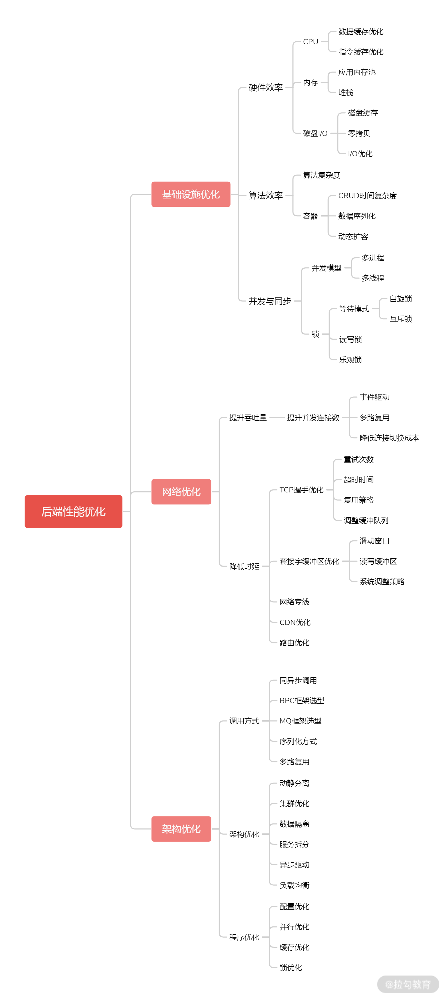

18 如何从架构师角度回答怎么应对千万级流量的问题？
==========================

上一讲，我带你学习了“如何评估系统的性能指标”以及“如何分析系统的性能瓶颈”，今天我们继续上一讲的话题，来解答“如何设计高性能的架构”。

我会从两方面出发，带你看一看在面试中遇到高性能架构设计问题时，初中级研发工程师和高级研发工程师不同的回答思路。

### 高性能设计中的“术”

学完上一讲后，你应该知道自己要从系统全链路的视角，从前端请求到后端服务评估各环节的性能指标，那么对于系统性能的优化，你依然要从全链路的视角上进行高性能的设计。

#### 前端优化

前端的优化主要有三个环节： **减少请求次数** 、**页面静态化 **、** 边缘计算**。

减少请求次数：减少前端脚本与后端服务的请求次数，有三种方案。

* **增加缓存控制**：前端研发同学经常会设置 HTML 的缓存控制头部（Cache-Control 头），这样浏览器在请求同一个文件时，只访问本地保存的资源副本，从而加速文件的访问速度。
* **减少图像的请求次数**：你可能经常会发现，大部分网站会将所有用到的多张图片拼成一张，这样多张图片只需要下载一次，然后再通过 CSS 中的 background-image 和 background-position 来定位目标位置选择显示哪一张图片。
* **减少脚本的请求次数**：通用的做法就是 CSS 压缩和 JavaScript 压缩，将多个文件压缩成一个，目的是减少传输文件的大小，而更重要的是减少请求数。

而页面静态化就是缓存的一种方式，相当于把整个页面元素缓存起来，那么缓存在哪里呢？

通常是将页面文件事先存储在 CDN 节点中，比如将商品详情页做静态化，就是将商品详情页的页面元素存储在 CDN 节点，然后所有请求就可以直接以由 CDN 来提供服务，就不会到达后端服务了，就减少了对后端服务的压力。

边缘计算，被很多人提及，原因是大数据处理的实时性越来越高，由集中式的服务系统提供实时性的计算能力捉襟见肘，所以很多大厂开始将计算能力放到距离用户最近的 CDN 节点中，这就要求原有的 CDN 节点不只作为静态资源文件的缓存，而是要提供可以定制化的计算能力。

这部分内容会涉及一些新的概念，比如无服务架构 Serverless、BaaS、FaaS，在面试中不要求候选人必须掌握，但它会是你的加分项。

#### 后端优化

后端环节的性能问题，可以从**基础设施层面、网络层面、架构层面**三个角度进行考量，为了帮助你记忆，我总结了一张脑图给你参考。

比如，网络层面可以考虑网络专线、CDN 优化；架构层面可以考虑动静分离、集群优化、数据隔离、服务拆分、异步驱动、负载均衡等方案。

以上就是高性能架构设计中的技术点，初中级研发工程师要能知道系统的性能瓶颈在哪儿，以及如何优化，但高级研发工程师，不能只停留掌握技术点上，而是要有自己对技术的理解（例如下面的例子）。接下来，我就通过讲解自己对高性能的认知，帮你了解并培养自己对于技术的思考。

### 高性能设计中的“道”

你在设计高性能系统架构时，首先是清楚认知系统的硬性性能指标，举个例子。

* **指标需求**：我们要保证系统的 TP 99 为 2s；
* **表面意思**：系统要保证 99% 的请求的响应时间都在 2s 内；
* **深层意思**：对有经验的架构师来说，这样的需求其实是不明确的，任何系统都有自己的承载能力范围，换句话说就是在并发用户数限定范围之内，一定要保证系统的 TP 99 = 2s，例如“我们要保证系统并发数在 100 万用户内的时候，TP 99 为 2s”，对于系统设计者而言，要清楚系统有所能，有所不能。

所以，对一个架构师来说，要设计一个高性能的架构，至少要有以下四个系统设计的思考步骤。

* **明确指标：** 比如当系统小于 100 万并发用户时，要保证系统的 TP 99 = 2s 。
* **保护系统：** 当系统的并发用户数量超过 100 万，要做到保证有 100 万用户的 TP 99 = 2s ，然后保护系统，并拒绝其他用户的连接请求。
* **用户体验：** 为了用户体验，要给系统承载容量外的用户提供优雅的体验，比如服务器排队机制，并附加具体、明确的信息提示。
* **快速扩容：** 这一步很容易被一些同学忽略，如今系统的性能指标还有一点就是贵在快速反应，比如能承诺出现流量压力时，可以在 3 分钟内完成扩容，并保证扩容后能承载的并发用户数量的 TP 99 = 2s。

在明确了性能指标之后，高性能架构的落地工作，可以分为以下三个关键技术点。

* **做好系统限流：** 通过流量控制来保证系统的稳定性。当实际并发压力超过系统性能设计指标的时候，就拒绝新的请求的连接，让用户进行排队。
* **做好快速扩容：** 对于扩容能力，一般要储备额外的计算资源，用于不时之需，也就是事先通过预估流出一部分资源池。

有的同学可能会疑惑，既然有多余的资源为什么不提前扩容呢？这是出于对 IT 成本的考虑，作为系统设计者也要把成本作为系统的设计原则之一。

另一个关键因素是系统的扩容速度。这是在当今互联网软件中非常重要的系统能力之一了，就算架构设计的不够优雅，但如果响应够快，也是能解决问题。

* **做好系统优化：**就是我在上面讲的前后端优化的技术点，我要再补充一点，对系统设计者来说，性能设计要贯穿于系统建设的始终。以一个系统的研发管理过程为例，内容大致包括需求阶段、设计阶段、研发阶段、测试阶段、上线阶段、运行阶段

对于性能设计（不仅仅是性能设计，所有非功能性的设计）要在项目的各阶段都进行考虑，以便根据项目过程的推进随时进行调整和优化。

### 总结**技术行业发展到今天，很多技术上的问题都不存在挑战了，所谓的高性能架构设计，也仅仅变成了一种标准化的应对流程**

你要做的就是将业务问题，抽象成一个技术问题，比如具体到数据库设计、缓存设计、队列设计、线程设计等技术细节，然后不管你通过什么渠道，Google 也好，问同事也好，或者购买付费知识也好，都能找到技术的应对方案。

而对于面试，你的答题思路应该是这样的：

* 先落实到技术上，比如结合业务场景，识别系统最关键的服务，然后针对性地为关键服务进行性能设计与测试，确保关键服务没有问题，然后为非关键服务提供降级和熔断处理方案。
* 再深化自己对于技术的理解，你要记住，任何复杂问题都可以按时间（系统建设周期）和空间（系统设计分层）拆解为简单的问题，然后逐一攻克，这样你才能有的放矢，这其中体现出来的思维能力才是每一个技术人的安身立命之本。
