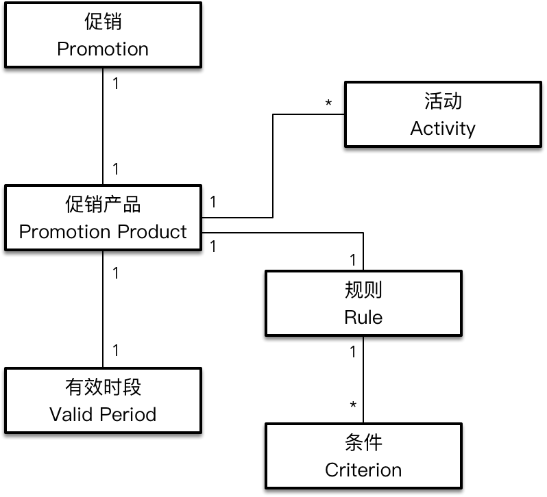
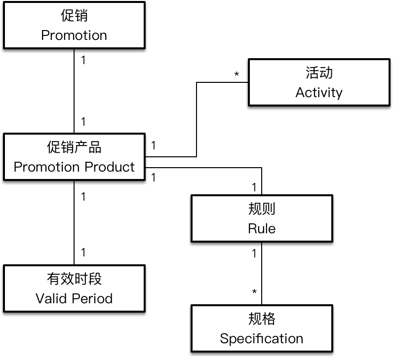
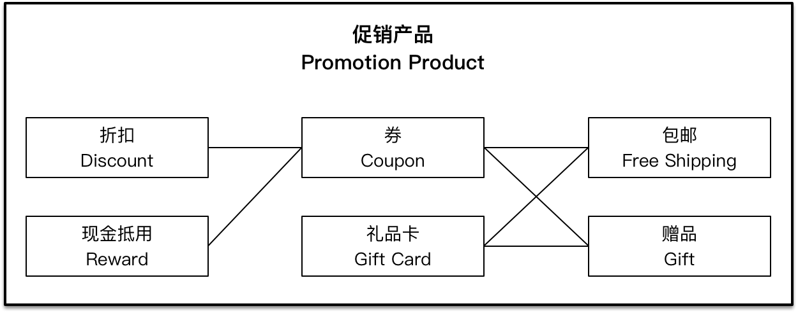
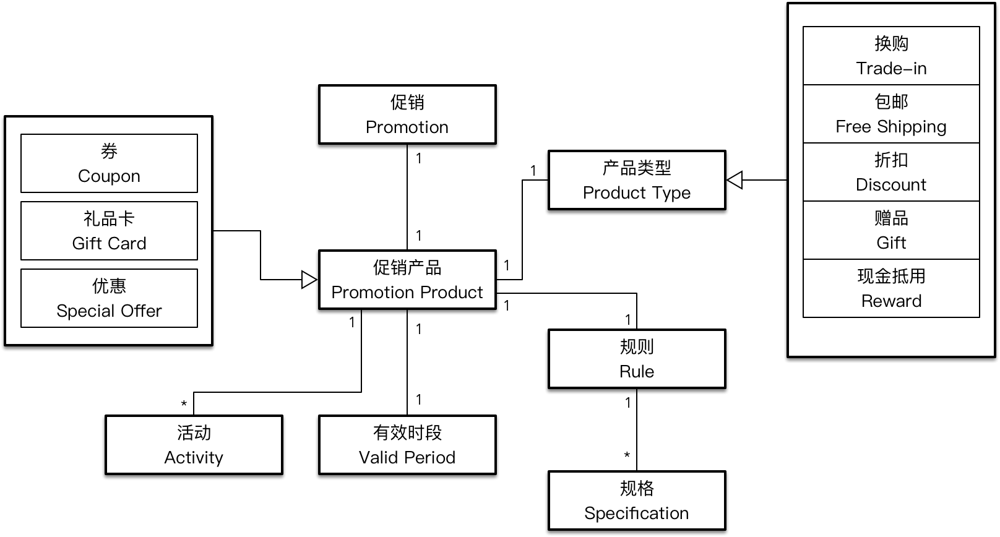
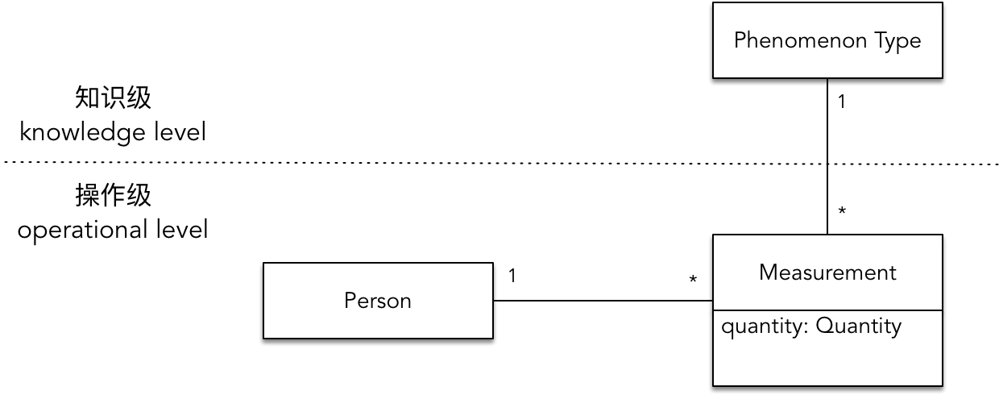
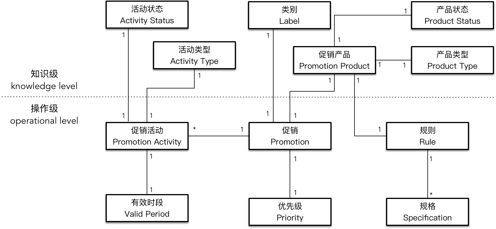
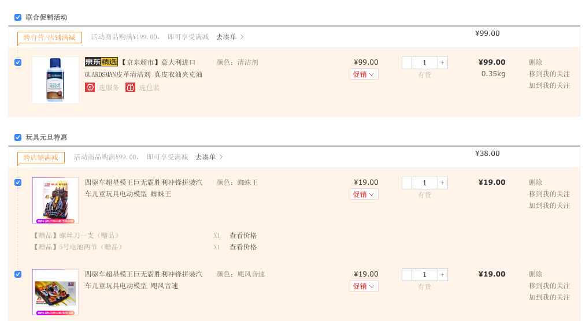
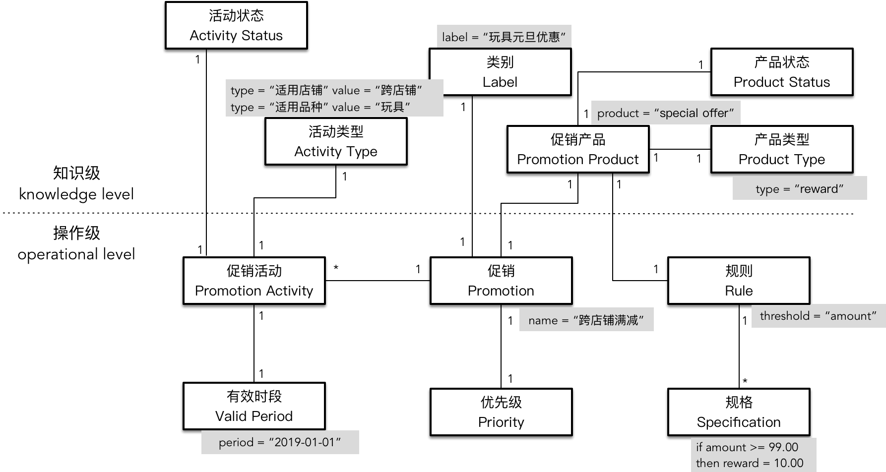
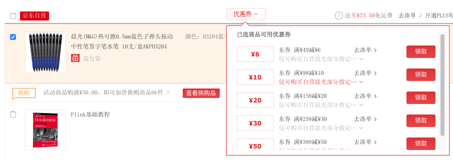

057 精炼领域分析模型
============

通过统一语言与“名词动词法”可以迫使团队研究问题域的词汇表，简单而快速地帮助我们获得初步的分析模型。但是这种方法获得的模型品质，受限于语言描述的写作技巧，统一语言的描述更多体现在是对现实世界的模型描述，缺乏深入精准的分析与统一的抽象，使得我们很难发现一些隐含在统一语言背后的重要概念。一言以蔽之，由此获得的领域分析模型还需要进一步精炼。

### 分析模式

对相同或相近的领域进行建模分析时，一定有章法和规律可循。例如同样都是电商系统，它们的领域模型定有相似之处；如果都为财务系统，自然也得遵循普适性的会计准则。这并非运用行业术语这么简单，而是结合领域专家的知识，将这些相同或相似的模型抽象出来，形成可以参考和重用的概念模型，这就是 Martin Fowler 提出的 **分析模式** 。Fowler 认为：“分析模式是一组概念，这些概念反映了业务建模中的通用结构。它可以只与某个特定的领域相关，也可以跨越多个领域。”由于分析模式是独立于软件技术的，就使得领域专家可以理解这些模式，这是分析建模过程中关键的一点。

在建立领域分析模型时，我们可以参考别人已经总结好的分析模式。例如，Martin Fowler《分析模式》中介绍的模式覆盖的领域就包括组织结构、单位数量、财务模型、库存与账务、计划以及合同（期权、期货、产品以及交易）等领域。Peter Coad 等人在《彩色 UML 建模》一书中也针对制造和采购、销售、人力资源管理、项目管理、会计管理等领域给出了领域模型，亦可以视为分析模式的一种体现，至少可以作为我们建立领域分析模型的参考。

我们也可以建立自己的分析模式。每个行业都可以定义自己的分析模式。要获得这样的分析模式，需要专精的领域专家与软件设计师共同来完成。只可惜沟通与知识的壁垒让这样一个重要的分析工作变得举步维艰。软件业的普遍现象是我们重视了软件开发技术，却忽视了领域专家给开发团队带来领域知识的重要性。在领域分析建模活动中，扮演重要作用的不是开发团队，而是领域专家。Martin Fowler 在《分析模式》一书中就这样写道：

> 我相信有效的模型只有那些真正在问题域中工作的人才能建造出来，而不是软件开发人员，不管他们曾经在这个问题域工作了多久。

如果能够认识到分析模式是企业软件系统中的一份重要资产，或许我们能够说服领域专家将更多的时间用到寻找和总结分析模式的工作上来。总结出一种模式并不容易，需要高度的抽象能力和总结能力。无论如何，为系统的核心领域引入一些相对固化的模式，总是值得的。Eric Evans 就认为利用这些分析模式，“可以避免一些代价高昂的尝试和失败过程，而直接从一个已经具有良好表达力和易实现的模型开始工作，并解决了一些可能难于学习的微妙的问题。我们可以从这样一个起点来重构和实验。”

分析模式可以作为领域分析建模的起点。Martin Fowler 在《分析模式》书中写到：

> 对于你自己的工作，看看是否有和模式相近的，如果有，用模式试试看。即使你相信自己的解决方案更好，也要使用模式并找出你的方案为什么更适合的原因。我发现这样可以更好地理解问题。对于其他人的工作也同样如此。如果你找到一个相近的模式，把它当作一个起点来向你正在回顾的工作发问：它和模式相比强在哪里?模式是否包含该工作中没有的东西？如果有，重要吗?

当然，分析模式并非万能的灵药。即使已经为该领域建立了成熟的分析模式，也需要随着需求的变化不断地维护这个核心模式。注意， **模式并非模型** ，它的抽象层次要高于模型，故而具有一定通用性。正因为此，它无法真实传递完整的领域知识。分析模式是领域分析模式的参考，利用一些模式与建模原则，可以帮助我们进一步精炼领域分析模型，使得该模型能够变得稳定而又具有足够的扩展能力。

接下来，我将尝试运用分析模式中提到的建模原则与建模实践针对电商网站的促销领域进行分析建模。通过分析促销领域的业务背景，逐步地对促销领域分析模型进行精炼。这个精炼的过程运用了如下建模原则：

* 建模原则：将模型清晰地分解成操作级和知识级。
* 建模原则：如果某个类型拥有多种相似的关联，可以为这些关联对象定义一个新的类型，并建立一个知识级类型来区分它们。
* 建模原则：保证分析模型中的概念遵循单一抽象层次原则。

除最后一个建模原则来自我个人的定义之外，其余建模原则均来自 Martin Fowler 的《分析模式》。该书通过大量的案例总结了领域分析建模的原则与模式，值得每一位建模人员认真阅读。

### 促销领域的分析模式

促销（Promotion）是一种运营手段，目的是通过这种手段去刺激消费的各种信息，把信息传递到一个或更多的目标对象，以影响其态度和行为，提高转化率。为了拉动消费，无论是线上还是线下，商家总是会绞尽脑汁提供各种促销手段，这就带来了促销策略的复杂性；然而从消费心理角度考虑，要刺激消费，简单有效的方式就是让消费者认为花了更少的钱却买了更多的商品，这就带来了促销策略的相似性。

#### 促销领域的业务背景

在电商系统中，对促销的管理主要牵涉到对促销活动与促销规则的管理。同时，促销还会影响到订单、库存、物流以及支付。倘若我们将促销视为核心领域，则为它建立领域分析模型时，应以促销领域为主。

**促销活动**

促销活动实际上是针对促销进行基本属性管理，负责提供活动方式和商品内容，主要包括：

* 商品选择：参加促销的商品，分为活动商品和赠品两种；也可以选定商品的品种参与促销，例如针对图书类开展促销。
* 投放时间选择：即该促销的有效时段。
* 投放区域选择：针对全平台还是部分平台（自营或指定店铺），或者仅针对 App 平台。
* 用户类型：针对新注册用户、VIP 用户等。

**促销规则**

促销规则是促销管理的核心。一个促销系统的好坏取决于促销规则设计是否合理。设计时既要考虑到商品的促销，又要考虑到店铺的盈利，还要考虑滞销品和畅销品的差别，因此促销规则的制订是非常灵活的，范围和促销力度也各有不同。大体来看，我们可以从平台、商品种数、促销方式这三个维度来分别理解促销规则的制订：

* 平台维度：促销规则可以分为自营促销和 POP 平台促销。
* 商品总数维度：站在商品角度看促销，则促销可以分为单品促销、集合促销和店铺促销：
  * 单品促销：以单个商品为维度进行的促销叫单品促销，如限时抢。
  * 集合促销：通过商品集合来满足促销规则进行的促销叫集合促销，如满额减。
  * 店铺级促销：以商家店铺为维度进行的促销叫店铺级促销，如店铺级满额折。
* 促销方式维度：
  * 直减类：限时抢、直减、多买多折、VIP 专享价、手机专享价等
  * 赠品：满赠
  * 换购类：加价购，凑单
  * 满额类：满额减、满额折等
  * 返券类：满额返券
  * 组合优惠类：套餐
  * 预订类：团购

在配置促销规则时，还需要考虑规则的优先级，它会直接影响促销活动的 **共享与互斥** 。例如，我们可以按照一定的优先级完成用户的优惠享用，如享用了单品促销，就不能参加集合促销，满减优先级大于代金券；这是互斥的情况。促销活动也可以共享，例如满额减可以与满额包邮共同使用。

#### 对促销领域的分析建模

在为促销领域进行分析建模时，首先需要甄别出该领域的核心概念，然后分析这些概念在该领域中蕴含的业务意义。基于前面介绍的业务背景，我们知道促销领域的核心概念包括促销活动与促销规则。在管理促销活动时，需要指定促销规则，这就产生了 **二者之间的关联关系** 。表面看，是通过促销活动去配置促销规则，前者为主，后者为辅；但对于促销而言，其实是活动与规则合二为一组合形成一种 **促销产品（Promotion Product）** 。这种促销产品可以是“券（Coupon）”形式，也可以是“礼品卡（Gift Card）”形式，又或者是提供“打折（Discount）”或者“包邮（Free Shipping）”。

模型概念“促销产品”的获得实际上是分析建模过程中 **对关系建模** 的一种体现。分析模式的建模原则提到： **如果某个类型拥有多种相似的关联，可以为这些关联对象定义一个新的类型，并建立一个知识级类型来区分它们** 。在现实世界中，各种概念之间总会存在各种错综复杂的关系。例如在学校，有教师与学生之间的师生关系，有院长与教师之间的上下级关系，有教授与研究生之间的科研关系。一旦关系变得越来越多，越来越复杂，仅仅靠体现对象之间的委派关系来体现这种组合就会显得缺乏表现力，这个时候就可以将“关系”提炼为模型中一个显式的概念。

前面所述的促销活动与促销规则在业务上存在一定的重复。例如平台维度的促销规则，其实对应的是促销活动中对投放平台或区域的选择。商品总数维度的促销规则，又与促销活动中适用商品（品种）选择的配置重叠了。这是因为我们扩大了所谓“规则”的外延。规则（Rule）不是计划，也不是策略，而应该是一条条具体的可判断是否满足条件的约束规则。

例如在电商领域中，我们常常会这样来描述一个促销规则：

> 购指定图书满 100 元减 20 元，满 200 元减 40 元，在 2018 年 12 月 12 日当天有效。

或许市场人员在现实中就是这样来谈论促销规则，但领域分析模型并不一定就是现实世界模型的概念映射。在领域分析建模时，我们需要精确的概念。

事实上，这一描述并非 **促销规则** ，而是一次完整的 **促销** ！分析描述中的字词：“指定图书”属于促销活动中对适用商品（品种）的配置，“2018 年 12 月 12 日当天有效”是该促销的有效时段属性。唯有描述“满 100 元减 20 元，满 200 元减 40 元”，才是所谓的 **规则** 。该规则又包含了两条金额阈值的条件（Criterion）。描述中的促销活动与促销规则组成了促销产品，类别为“券（Coupon）”，券的类型为现金券（若描述中为满额折扣，就是折扣券）。诸多概念合起来，最终形成了一次促销。这个促销模型如下所示：

#### 引入规格模式

促销规则包含了多个条件，只有商品满足了该条件才能确定它是否适用于该促销。这让我想起了 Martin Fowler 与 Eric Evans 共同提出的“[规格模式（Specification Pattern）](https://www.martinfowler.com/apsupp/spec.pdf)”。他们对规格模式的描述如下：

**问题**

* 选择（Selection）：需要基于某些条件（Criterion）选择对象的一个子集，且需要多次刷新其选择
* 验证（Validation）：需要根据确定的目标获得满足条件的合适对象
* 按需构造（Construction-to-order）：需要描述对象应该做什么而无需解释对象执行的细节，这样就可以构造一个候选对象来满足需求

**解决方案 **创建一个规格（Specification）对象，它能够辨别候选对象是否满足某些条件。规格对象定义了方法 isSatisfiedBy(anObject)，如果 anObject 的所有条件均满足，则返回值 true。** 结果**

* 解除需求设计、实现与验证之间的耦合
* 提供清晰的声明式的系统定义

规格对象可以是单一的，也可以是合成的。于是，通过引入规格模式，我将原来定义的“条件（Criterion）”领域概念更名为“规格（Specification）”。一个促销规则可以包含多个规格，而对于规格而言，根据不同的促销场景又可以分为：

* 金额（Amount）阈值的规格：例如满 200 元减 40 元，或满 200 元 9 折
* 数量（Count）阈值的规格：例如满 2 件 9 折，又或者限量购

于是，前面获得的促销模型就调整为：

#### 避免领域概念的混淆

在分析促销模型时，我发现模型中的促销产品概念并未处于同一个抽象层次，多种促销产品之间甚至存在混合关联。例如，作为“促销产品”的折扣（Discount）或现金抵用（Reward）可以单独针对一次促销提供，也可以和同为“促销产品”的券（Coupon）进行捆绑；同时，作为“促销产品”的礼品卡（Gift Card）和券均可以提供同为“促销产品”的赠品或者包邮。

既然出现如此混乱的关系，就说明打折、现金抵用、赠品和包邮等概念并非一种促销产品，它们其实应该是 **促销产品的一种属性** 。我将这种属性称之为“促销产品类型”。例如，券的促销产品类型若为折扣，就是折扣券，若为现金抵用，就是现金券。它们都是券，差异在于促销产品的类型不同，而非促销产品不同。

在电商系统的促销策略中，诸如折扣、现金抵用之类的促销手段未必需要通过券或者礼品卡的形式呈现，它们其实可以直接作为促销产品而被单独使用。但在领域分析建模过程中，我们不允许概念层次的混乱，且必须避免领域概念的二义性。例如对于折扣（Discount），到底是促销产品，还是促销产品类型，必须分辨清楚。

在之前识别的促销产品概念中，到底哪些属于促销产品，哪些属于促销产品类型呢？既然后者是前者的一种属性，我们就可以将促销产品视为促销产品类型的载体。因此，只要分辨出这些概念的主次关系，就可以做出正确的划分。在前面给出的混合关系模型中，显然，券和礼品卡才是主要概念，折扣、现金抵用、包邮与赠品都是次要概念。

促销产品和促销产品类型不是随意搭配的，例如“包邮”，就既不属于券产品，又不属于礼品卡产品。如此一来，还需要针对这些概念建立一层抽象，这个抽象概念与券、礼品卡处于同一个抽象层次。这个抽象的促销产品概念就是“优惠（Special Offer）”。由此得到的模型为：

优惠概念的获得，遵循了建模原则——保证分析模型中的概念遵循单一抽象层次原则（Single Layer Abstraction Principle）。单一抽象层次原则本是 Kent Beck 在 Smalltalk Best Practice Patterns 一书中提到的。他认为一个方法应该执行一个确定的任务，方法由多个处于 **相同抽象层次** 的操作组成，形成“组合方法（Composed Method）”模式。方法如此，领域模型亦当如此，因为它们都是针对任务进行逐级分解的过程。正如苹果、西瓜可以和土豆处于同一个抽象层次，水果和蔬菜的抽象层次则在它们之上。如果将苹果与蔬菜放在同一层，自然会造成概念的失衡状态，正如让“包邮”和“折扣”与“券”放在同一层，是失衡的。

#### 知识级和操作级

当模型变得渐趋复杂时，《分析模式》引入了操作级（Operational Level）和知识级（Knowledge Level）两个层次来组织模型中的概念。操作级模型记录该领域每天发生的事件；知识级模型则定义了操作级对象的合法配置，以及控制着结构的各种通用规则。知识级和操作级之间并没有非常清晰的鸿沟，但 Martin Fowler 认为“将两者（知识级和操作级）分开有助于理清建模思路”。为此，我们需要明确这二者之间的差别。

在《分析模式》一书中，Martin Fowler 引入了英国国民医疗服务制度的 Cosmos 项目作为分析模式的案例，这个模型的推导过程清晰地展现了引入这两个层级是怎么让模型变得更加清晰的。

Cosmos 作为一个医疗保健系统，需要对医药行业的测量和观察需求建立模型。简单说来，每个患者的测量结果可以建模为“测量（Meassurement）”。然而针对整家医院，即使是一个患者也可能存在成千上万种可能的测量。如果为每种测量定义一个相应的属性，就意味着一个患者存在着成千上万种可能的测量操作——测量的接口就会变得格外复杂。分析模型的解决方案是将所有可以被测量的不同事物（身高、体重、血糖水平……）都作为测量对象，并将其抽象为“现象类型（Phenomenon Type）”。这里，测量属于操作级，现象类型属于知识级：

在为测量引入现象类型后，患者可以有许多测量，但是针对某一种现象类型而言，患者就只有一个测量。例如 John Smith 身高 1 米 75，在上述模型中，该描述信息整个代表一个测量，其中，患者是 John Smith，现象类型是身高，数量是 1 米 75。

为什么现象类型属于知识级，测量属于操作级呢？

首先，测量是医药行业每天都会发生的事件，而现象类型则是测量的多种配置，这符合前面对 **操作级与知识级的定义** 。

其次，《分析模式》的建模原则提到：“操作级中的对象会经常发生变化，它们的配置由很少发生变化的知识级来约束。”这是 **从变化的角度** 来区分的。操作级中的“测量”可以被定义成多种多样的测量，但知识级的“现象类型”却是可以穷举的。因此，这里提到的“变化”表达的并非类型的变化，而是对象值的变化。

最后，领域概念中存在一些定性的描述，例如医疗观察模型中的血型 A 现象、汽车分类观察模型中的汽车油量不足现象，它们都是在系统中确确实实存在的客观事实，不会因为观察是否建立而消亡，像这样的定性描述放到知识级中，可以按照规则来使用它们。这是 **从领域概念的性质** 来区分的。

回到电商系统的促销策略模型。促销可以被定义为多种多样，但促销产品与促销类型在促销领域中却是可以穷举的，因此促销应该被定义在操作级，而促销产品与促销类型则属于知识级。从领域概念的性质看，促销产品为券类型是一种定性描述，促销产品类型为折扣（Discount）也是一种定性描述，这也可以得出它们同为知识级对象的结论。促销规则与规格与之相同，它们还是对促销的配置，因此也应该划归知识级对象的范围。

每个促销都有属于自己的类别（Label），这个类别是促销的一种定性描述，属于知识级对象。在计算促销优惠时，不同类别的商品会分别计算，同一类别可以兼容，这相当于分类汇总。对于促销而言，如果我们将一个具体的促销实例视为一个实体，在计算促销优惠时，同一实体的促销是互斥的，不同实体的促销可以叠加组合，也可以按照优先级（Priority）。这个优先级属于促销的属性。优先级可以在配置促销策略时事先配置，也可以由买家指定，例如买家在购买商品时，出现了多种促销叠加的情况，买家就可以根据具体的购买情况选择最适合自己的促销，这时用户指定的优先级要高于事先配置的优先级。

一个促销对应一个促销产品。除了促销产品具有不同的产品类型外，促销自身也有自己的类型。这个类型确定了促销的适用范围，准确地说，是确定了“促销活动（Promotion Activity）”的适用范围。促销活动属于操作级，因为它类似医疗案例中的测量概念。作为一个活动概念，显然具有时间属性和状态，这就引入了“有效时段”与“状态”概念。有效时段限制了促销活动的适用时间范围，而促销活动的状态又与有效时段有关，可标记为“有效”和“无效”，代表了该促销活动是否在有效时段内。状态是一种可以穷举的定性描述，放在知识级；有效时段则不同，它并非定性描述，而是促销活动的固有属性，因此应该和促销活动一起放在操作级。

一个促销并不会对应某一个具体的买家。促销面向商品和店铺，通过类别来说明它的使用范围。提供给买家的其实是促销产品。例如，一个买家获得了一张现金券或者礼品卡。为了避免买家无限次地享受促销福利，促销产品也需要标记其状态，包括未使用、已使用和过期状态。其中，已使用和过期状态都表现了该促销产品的无效状态，说明该促销产品对应的促销策略已经失效。为了区分促销活动与促销产品的状态，需要用限定修饰符说明，分别为“活动状态”和“产品状态”。

**促销活动概念的引入对于促销而言具有重大意义**，某种程度上，它根据变化频率的不同，将与促销相关的概念分成了完全独立的两部分。例如，一旦促销确定了优先级和类别，就不会轻易进行调整；而有效时段与促销状态则经常发生变化，如果作为促销的属性，就会受到时间和状态的限制，让促销无法被重用。促销活动与促销之间的分离，使得促销更加稳定，在保证重用的同时，还能避免促销被无限使用带来的潜在风险。

通过引入分析模式的建模原则与模式，我们对最初的模型进行了精炼，最终获得了如下的领域分析模型：

#### 对分析模型的验证

我们可以结合实际的业务场景验证获得的促销分析模型。以京东商城为例，如下图所示：

上图给出了两种**促销类别（Label）**：联合促销活动与玩具元旦特惠。以玩具元旦优惠类别为例，\*\*促销（Promotion） **为“跨店铺满减”。该促销的** 活动类型（Activity Type）\*\*包括适用店铺（值为“跨店铺”）、适用品种（值为“玩具”）。\*\*促销产品（Promotion Product）\*\*为优惠（Special Offer），\*\*促销产品类型（Product Type）\*\*为满减（Reward），\*\*规则（Rule）\*\*为金额阈值规则，\*\*规格（Specification）\*\*为满99.00元减。\*\*促销活动（Promotion Activity） **的** 有效时段（Valid Period）\*\*为 2019 年 1 月 1 日。图中的两种玩具都属于同一个促销类别，因此在计算满减时，这两个商品是可以叠加的。对应的分析模型为：

我们再来看另外一个促销场景：

上图展现的促销场景包含了多种促销，它们的促销类别（Lebel）皆为京东自营，因此在进行优惠计算时，这些商品是可以叠加的。这里包含的促销实体有：

* 促销实体：促销产品为券（Coupon），促销产品类型为满减（Reward），优惠规则为金额阈值，规格分别为满 49 减 6、满 158 减 20、满 258 减 30、满 388 减 50 等。促销活动的活动类型（Activity Type）为适用店铺，值为京东自营，活动状态为“有效”。一旦领取了券，则产品状态为“未使用”。
* 促销实体：促销产品为券（Coupon），促销产品类型为满减（Reward），优惠规则为金额阈值，规格为满 98 减 10。促销活动的其中一种活动类型（Activity Type）为适用店铺，值为京东自营；另一种活动类型为适用商品，值为自营晨光指定商品，活动状态为“有效”。一旦领取了券，则产品状态为“未使用”。
* 促销实体：促销产品为优惠（Special Offer），促销产品类型为包邮（Free Shipping），优惠规则为金额阈值，规格为满 99。促销活动的活动类型（Activity Type）为适用店铺，值为京东自营，活动状态为“有效”。
* 促销实体：促销产品为优惠（Special Offer），促销产品类型为换购（Trade-in），优惠规则为金额阈值，规格为满 30。促销活动的活动类型（Activity Type）为适用店铺，值为京东自营，活动状态为“有效”。

在促销模型中，这些促销实体就是一个个促销。实现时，体现为多个促销实例，这些促销实例可以通过促销活动的“适用商品”活动类型，作用到同一件商品，形成这种促销优惠的叠加。

目前给出的促销模型考虑还不全面。一方面这取决于它适用于哪种电商应用场景，例如淘宝与京东的促销策略就不相同。如果电商销售的仅为虚拟商品，促销领域逻辑更是有所不同。另一方面，该模型未考虑如何与计算订单金额、支付以及退换货这些业务相结合。总之业务越复杂，模型也会变得更复杂，这时就更需要利用抽象将模型化繁为简，又或者考虑在模型中使用不同的视图来表达不同的概念，尽量让模型变得精简而直观，同时又不会缺少关键的领域概念。
