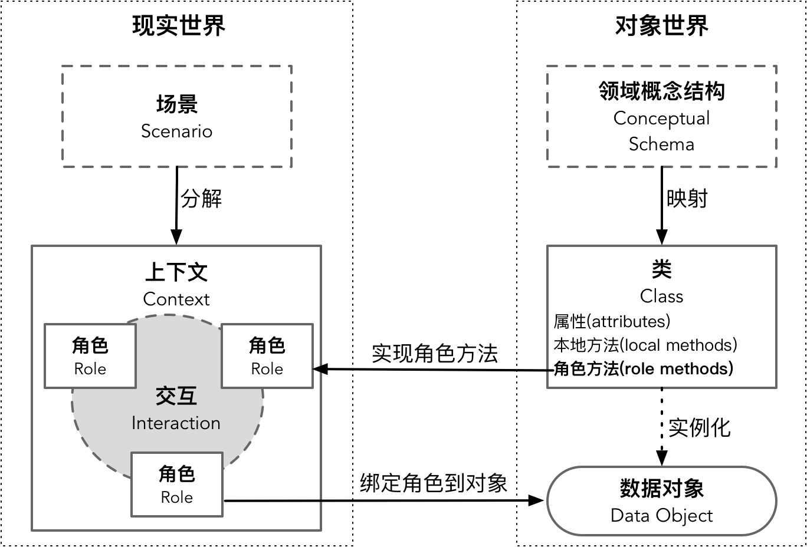

079 场景驱动设计与 DCI 模式
==================

### 思维模式与设计方法

对象是强调行为协作的，但对象自身却是对概念的描述。一旦我们将现实世界映射为对象，由于行为需要正确地分配给各个对象，于是行为就被打散了，缺少了领域场景的连续性。场景驱动设计引入“分解任务”的方法，一方面通过分而治之的思想降低了领域逻辑的复杂度，另一方面也建立了一系列连续的行为去表现领域场景，使得整个领域场景被分解的同时还能保证完整性。时序图体现了领域场景下行为的动态协作过程，并反向驱动出角色构造型来承担各自的职责，就能使得对象的设计变得更加合理。

分解任务之所以能够承担此重任，一个关键原因在于它匹配了软件开发人员的思维模式。在将业务需求转换为软件设计的过程中，要找到一种既具有业务视角又具有设计视角的思维模式，并非易事。任务分解采用面向过程的思维模式，以业务视角对领域场景进行观察和剖析；然后再采用面向对象的思维模式，以设计视角结合职责与角色构造型，形成对职责的角色分配。这两种视角的切换是自然的，它同时降低了需求理解和设计建模的难度。

软件设计终究是由人做出的决策，在提出一种设计方法时，若能从人的思维模式着手，就容易找到现实世界与模型世界的结合点。如果我们将领域场景视为电影或剧本中的场景，它反映了我们需要解决的代表问题域的现实世界。卡尔维诺在《看不见的城市》一书中描绘了这样的场景：

> 梅拉尼亚的人口生生不息：对话者一个个相继死去，而接替他们对话的人又一个个出生，分别扮演对话中的角色。当有人转换角色，或者永远离开或者初次进入广场时，就会引起连锁式变化，直至所有角色都重新分配妥当为止。

这个场景描述了一座奇幻的城市，这种城市的居民会聚集在广场中发生一场一场的对话，对话持续不断地继续下去，但是参与对话的角色却如幻影一般发生变化。这一幕小说情节很好地阐释了 DCI 模式，它开启了另外一种投影现实世界到对象世界的思维模式。

### DCI 模式

DCI 模式认为，在现实世界到对象世界的映射中，构成元素只有三个：数据（Data）、上下文（Context）和交互（Interaction）。在梅拉尼亚这座城市，城市的广场是上下文，城市的居民是数据，他们扮演了不同的角色进行不同的对话，这种对话就是交互。

和场景驱动设计相同，DCI 模式需要从业务需求表现的现实世界中截取一幕场景作为设计的上下文。上下文将参与交互的数据“框定”起来，根据场景要达成的业务目标确定对象要扮演的角色，以及角色之间的交互行为。每个数据对象在扮演各自角色时，只能做出符合自己角色身份的行为，这些行为在 DCI 模式中被称之为“角色方法（Role Method）”，它们反映了数据的目的；数据对象自身还拥有一些固定的行为，称之为“本地方法（Local Method）”，它们反映了数据的特征。数据对象通过角色方法参与到上下文的交互，通过本地方法访问和操作自身拥有的数据，然后采用某种形式将角色绑定到对象之上：



现实世界有很多这样的例子。一个人在上下文中会扮演一种特定的角色，他与别的角色展开不同的交互行为。这时，人作为数据对象，具备 talk()、walk()、write() 等本地行为，这些本地行为与角色无关，属于人的固有行为。当一个人处于课堂学习上下文时，若扮演了教师角色，就会拥有角色行为 teach()，与之交互的角色为学生，角色行为是 learn()。teach() 与 learn() 这样的角色方法由 talk()、write() 等本地方法实现，本地方法不会随着上下文的变化而变化，因此属于数据对象最为稳定的领域逻辑。

一个数据对象可以同时承担多个角色，例如一个人既可以是教师，也可以是学生，回到家，面对不同的角色，他也在不断变换着角色：父亲、儿子、丈夫……显然，角色代表了一种身份或者一种能力，更像是一种接口行为。正如上图所示，当一个数据对象参与到上下文的交互中时，就需要将角色绑定到对象上，使得对象拥有角色行为。

### 转账业务的DCI实现

以银行的转账业务为例，它的上下文就是 TransferingContext，储蓄账户 SavingAccount 作为体现了领域概念的数据对象参与到转账上下文中。按照 DCI 的思维模式，我们需要对上下文中的数据提出两个问题：

* 它是什么？数据代表了上下文的领域概念；
* 它做了什么？角色代表了数据在上下文中的身份。

虽然转账上下文牵涉到两个不同的储蓄账户对象，但各自扮演的角色却不相同。一个账户扮演了转出方 TransferSource，另一个账户扮演了转入方 TransferTarget，对应的角色方法就是 transferOut() 与 transferIn()。储蓄账户拥有余额数据，增加和减少余额值都是储蓄账户这个数据对象的固有特征，相当于针对余额数据进行的数学运算，对应的本地方法为 decrease() 与 increase()。

很明显，通过本地方法，数据回答了“它是什么”这个问题，体现了数据的本质特征，这样的行为通常不会发生变化；角色方法回答了“它做了什么”这一问题，操作了数据的业务规则，因此可能会频繁发生改变。一个稳定不变，一个频繁变化，自然就需要隔离它们，这就是角色的价值。最后，由上下文来指定角色，并管理角色之间的交互行为。采用 DCI 模式实现银行转账的代码如下所示：

```scala
// Data

case class SavingAccount(val string owner, var balance: Double) {

    // 几乎不掺杂业务逻辑，提供最纯粹的数据操作行为

    def increase(amount: Double): Unit = this.balance += amount

    def decrease(amount: Double): Unit = this.balance -= amount

}
// Role

trait TransferSource {

    this:SavingAccount =>  //表示当前 trait 只能应用到 SavingAccount 上，并且混入它的对象，完成了角色和对象的绑定
    // 具有业务行为的角色方法

    def transferOut(amount: Double): Unit =  {

        if (this.balance < amount) throw new NotEnoughBalanceException()

        this.decrease(amount)

    }

}
// Role

trait TransferTarget {

    this:SavingAccount =>
    def transferIn(amount: Double): Unit = this.increase(amount)

}
// Context

class TransferContext(notification: NotificationService) {

    def transfer(source: TransferSource, target: TransferTarget, amount: Double) {

        src.transferOut(amount)

        target.transferIn(amount)
        notification.sendMessage()  

    }

}
```

我之所以选择 Scala 语言来表达 DCI 模式的实现，是因为 Scala 提供的 trait 与 Self Type 语法可以自然无缝地绑定数据对象与角色。如上代码中的 `this:SavingAccount =>` 就是 Self Type 的实现形式，完成了 SavingAccount 对象向 trait 的混入（mixin）。在混入了数据对象后，在代表角色的 trait 实现中，就可以通过 this 来访问混入的对象，完成角色方法对本地方法的调用。

创建 SavingAccount 对象时，需要通过如下代码完成角色与对象的绑定：

```scala
val source = SavingAccount(accountName, balance) with TransferSource

val target = SavingAccount(accountName, balance) with TransferTarget
```

Java 8 虽然为接口引入了默认方法，但它缺乏 Scala 语言 Self Type 这样的语法，不能混入数据对象，因而无法在角色方法中访问数据对象，必须通过参数传入。例如转出方的角色接口：

```java
public interface TransferSource {

    // SavingAccount 通过参数传入

    default void transferOut(SavingAccount srcAccount, Amount amount) {

        if (srcAccount.getBalance().lessThan(amount)) {

            throw new NotEnoughBalanceException();

        }

        srcAccount.decrease(amount);

    }

}
```

同时，数据类 SavingAccount 还必须显式实现这两个接口：

```java
public class SavingAccount implements TransferSource, TransferTarget {}
```

上下文类的实现与 Scala 基本相同：

```java
public class TransferContext {

    private NotificationService notification;
    public void transfer(TransferSource source, TranserTarget, Amount amount) {

        source.transferOut(amount);

        target.transferIn(amount);
        notification.sendMessage();        

    }

}
```

不管是 Scala 的 trait，还是 Java 中的默认方法，都为参与交互的角色提供了默认实现。但这种默认实现也限制了担任角色的数据类型。例如，trait 通过 Self Type 限制了混入的类型只能是 SavingAccount 或它的子类；Java 默认方法的参数也限制了传入的对象只能是 SavingAccount 类型或它的子类。这样做的好处是有利于角色方法的重用，但同时却失去了数据类的灵活性。

一个数据对象可以同时承担多个角色，反过来，一个角色也可能被多个不同的数据对象扮演。还是以转账业务为例，可能不仅是 SavingAccount 才能参与转账，例如通过银行的储蓄账户将钱转入到支付宝，就是由 AlipayAccount 担任转入方角色。如果 AlipayAccount 与 SavingAccount 之间没有任何关系，根据前面的实现，就无法将其传递给 TransferTarget 角色接口；同理，将支付宝的钱转入到储蓄账户，也受到了数据类型的限制。

如果将角色方法的实现留给数据类来实现，角色接口仅提供抽象的定义，就可以为各种不同的数据类戴上“角色”这顶帽子。站在上下文的角度看，它仅关心参与交互的角色方法，而不在意数据对象到底是什么。例如，在课堂学习上下文中，可以是一个人担任教师的角色，以 teach() 角色行为与学生交互，但也可以是一个 AI 机器人担任教师角色，只要它的授课能够满足学生的需要即可。显然，上下文从抽象角度看待参与交互的角色，这就将角色分成了抽象和实现两个层次。这两个层次在DCI模式中分别称为 Methodful Role 与 Methodless Role。Methodful Role 组成了数据类，数据类对象则通过 Methodless Role 对外提供服务，参与到上下文中。仍以转账上下文为例，Methodless Role 的定义如下：

```java
public interface TransferSource {

    void transferOut(Amount amount);

}
public interface TransferTarget {

    void transferIn(Amount amount);

}
```

这样的角色接口没有任何实现，仅仅规定了角色参与上下文交互的契约。数据类由本地方法和角色方法共同组成，其中它实现的角色方法代表了它是 Methodful Role：

```java
public class SavingAccount implements TransferSource, TransferTarget {

    private Amount balance;
    // Methodful Role 的角色方法

    @Override

    public void transferOut(Amount amount) {

        if (balance.lessThan(amount)) {

            throw new NotEnoughBalanceException();

        }

        decrease(amount);

    }
    // Methodful Role 的角色方法

    @Override

    public void transferIn(Amount amount) {

        increase(amount);

    }
    // 本地方法

    private void decrease(Amount amount) {

        balance.substract(amount);

    }

    private void increase(Amount amount) {

        balance.add(amount);

    }

}
public class AlipayAccount implements TransferSource, TransferTarget {}
```

Methodful Role 与 Methodless Role 的分离不会影响角色的定义，因为上下文的交互是面向角色的，与数据类无关，不受数据类类型变化的任何影响，故而 TransferContext 的实现与前面的代码完全一样。

注意，无论采用 trait 的混入、实现接口的默认方法，还是 Methodless Role 与 Methodful Role 的分离，最终都是由数据类型的对象来实现的。我认为，DCI 模式将角色的承担者命名为数据类是一种糟糕的命名，因为数据这一说法极容易误导设计者，以为该类仅仅为上下文提供交互行为所需的数据。若产生这种误解，就有可能将数据类定义为贫血对象，设计出贫血模型。实际上，数据类更像是实体，在定义了数据属性之外，还需要定义属于自己的方法，即本地方法。这些方法同样表达了领域逻辑，只是该领域逻辑是与数据类强内聚的行为，如 SavingAccount 的 increase() 与 decrease() 方法。

#### DCI 模式与场景驱动设计

毫无疑问，DCI 模式通过数据类、数据对象、角色、角色交互和上下文等设计元素共同实现了现实世界到对象世界的映射。这种思维模式的起点仍然是领域场景，上下文相当于是搭建领域场景的舞台。在这个舞台上，进行的并非冷静而细化的过程分解，而是从角色出发，推断和指导参与领域场景的各个演员之间的互动。因此，我们也可以将 DCI 模式结合到场景驱动设计中。

对比场景驱动设计的角色构造型，DCI 模式的上下文相当于领域服务，数据类相当于聚合。在定义上下文时，DCI 模式通过观察不同角色之间的交互来满足领域场景的业务需求。角色方法的定义体现了面向对象“接口隔离原则”与“面向接口设计”的设计思想，而角色之间的交互模式又体现了对象之间良好的行为协作，这在一定程度上保证了领域设计模型的质量，满足可重用性与可扩展性。在上下文之上，是体现了业务价值的领域场景，仍然由应用服务来实现对外业务接口的包装，在内部的实现中，则糅合诸如事务、认证授权、系统日志等横切关注点。至于数据对象的获得，仍然交给资源库。不同之处在于资源库的注入由应用服务来完成，这是因为作为领域服务的上下文协调的是角色之间的交互，即领域服务依赖于角色，而非数据对象的 ID。

结合 DCI 模式的场景驱动设计过程为：

* 识别领域场景，并由对应的应用服务承担
* 领域场景对应的业务行为由上下文领域服务执行
* 为了完成该领域场景，明确有哪些角色参与了行为的交互
* 为这些角色定义角色接口，角色方法实现为默认方法，或者分为抽象与实现
* 确定承担这些角色的数据对象，定义数据类以及数据类的本地方法

即使不遵循 DCI 模式，我们也应尽量遵循“角色接口”的设计思想。角色、职责、协作本身就是场景驱动设计分配职责过程的三要素。区别在于二者对角色的定义不同。场景驱动设计的角色构造型属于设计角度的角色定义，它来自于职责驱动设计对角色的分类，也参考了领域驱动设计的设计模式。不同的角色构造型承担不同的职责，但并不包含任何业务含义。DCI 模式的角色是直接参与领域场景的对象，如 Martin Fowler 对角色接口的阐述，他认为是从供应者与消费者之间协作的角度来定义的接口，代表了业务场景中与其他类型协作的角色。

在场景驱动设计过程中，当我们将职责分配给聚合时，可以借鉴 DCI 模式，从领域服务的角度去思考抽象的角色交互，引入的角色接口可以在重用性和扩展性方面改进领域设计模型。当然，这在一定程度上要考究面向对象的设计能力，没有足够的抽象与概括能力，可能难以识别出正确的角色。例如，在薪资管理系统的支付薪资场景中，该为计算薪资上下文引入什么样的角色呢？与转账上下文不同，计算薪资上下文并没有两个不同的角色参与交互，这时的角色就应该体现为 **数据类在上下文中的能力** ，故而可以获得 PayrollCalculable 角色。数据类 Employee 只有实现了该角色接口，才有“能力”被上下文计算薪资。
