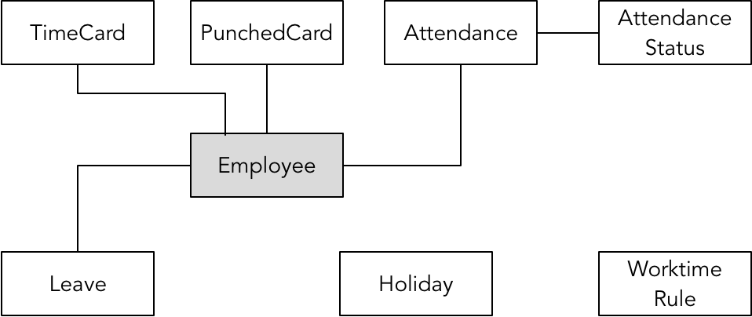
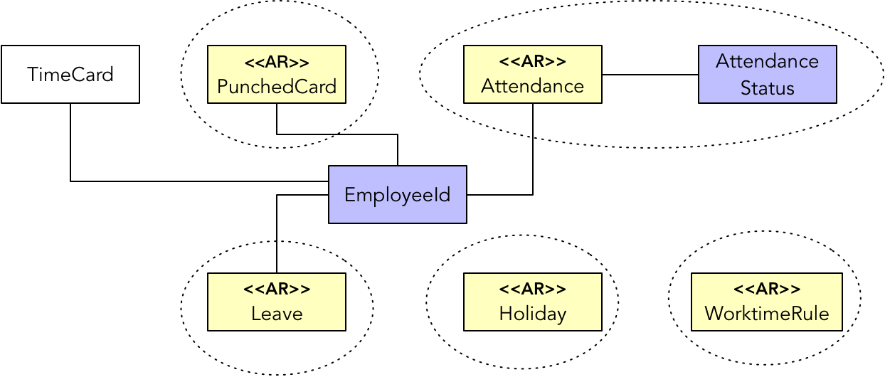

# 102 实践 考勤上下文的领域建模

### 考勤上下文的领域建模

#### **业务需求**考勤上下文主要包括员工考勤管理、请假和假期管理等功能

员工上下班时，需要打卡进行考勤。员工打卡的操作通过考勤机完成，因此，该用例实际上并不在 EAS 系统范围之内。EAS 系统会定期访问考勤机的接口导入打卡记录，导入成功后，员工可以查询自己的打卡记录和出勤记录。注意打卡记录和出勤记录之间的差异。打卡记录是考勤机每天留存的信息，出勤记录则是根据集团的考勤制度并结合员工的请假信息和打卡记录生成的记录内容。因此，出勤记录会根据考勤制度确定员工的出勤状态。

员工通过系统提交请假申请，包括请假的日期、天数和请假类型。只有在该员工主管审批通过请假申请后，请假才会生效。请假与考勤息息相关，在确定员工的出勤情况时，需要根据请假情况进行判断。

中国的国家法定节假日设定没有固定的规律，不管是传统节日还是元旦、国庆或五一之类的假期，每年都在发生变化，需要遵循国家假日办每年给出的节假日安排进行设定。同时，工作日的工作时间规则也支持可配置。上班时间与下班时间直接影响员工的出勤状态。目前，公司并未实行弹性工作制。

#### **领域分析模型**

考勤上下文的领域逻辑并不复杂，通过名词动词法即可从业务需求的描述中发现主要的领域概念。在确定领域分析模型时，需要确定统一语言，例如在需求分析中，已经阐述了打卡记录与出勤记录之间的差异，前者为 TimeCard，后者为 Attendance。员工每打一次卡，就会产生一条打卡记录，正常情况下，每位员工一天会形成两条打卡记录，分别记载了上班时间和下班时间，并由此确定员工的出勤状态。为了区分原始的打卡记录与处理后的打卡记录，经过咨询领域专家，为其确定了各自的统一语言。前者命名为 PunchedCard，如此可以更好地形容打卡的动作；后者命名为 TimeCard，用以记录员工的工作时间。

员工请假时，从业务需求描述看来是一个请假申请，但事实上就是一个 Leave 领域概念，审批请假申请意味着修改它的状态（ApprovedStatus）。请假时，员工应指定请假的类型（LeaveType）。

由于法定节假日可能出现因为周末与节日的重叠而导致的调休情况，为了简化领域模型，可以将全年的每一天分为假日（Holiday）和工作日（Workday）。在设置节假日时，只需设置具体的假日即可，故而只需定义 Holiday 领域类，它指定了节假日（包括周末）的期限。同理，工作时间规则（WorktimeRule）也可由管理人员进行配置。由此，可以得出如下领域分析模型：



这个领域分析模型虽然简单，却具有一定的代表性。主要体现在：

- Holiday 与 Worktime 是两个完全独立的领域对象，与别的领域对象没有任何关联。在确定领域分析模型时，不要因为出现了这样“孤单”的领域对象，就认为出现了建模错误，非要给它寻找一个关联对象。
- 寻找精准简洁的统一语言表达领域概念，例如 Holiday 体现了节假日的设置，没有必要将其命名为 HolidaySetting；Attendance 是一次出勤记录，在定义类名时，也不必为其加上后缀 Record。这样的修饰纯属画蛇添足，影响了领域概念的清晰表达，最终还会影响领域实现模型。
- TimeCard、PunchedCard 与 Attendance 都依赖了员工上下文的 Employee。由于领域模型需要界定限界上下文，在分析模型中可以先用不同颜色表示它属于另外一个限界上下文，到领域设计建模时，就可以提醒设计者考虑直接引用 EmployeeId，还是引入对应的 Employee 领域类。

#### **领域设计模型**

领域分析模型已经清晰地展现了领域对象之间的关系，因此在设计建模时，只需确定实体和值对象，界定聚合的边界就能水到渠成。但是，这里需要考虑 TimeCard 的生命周期，它究竟是在处理打卡记录 PunchedCard 之后生成的瞬时对象，还是需要进行持久化，以便于系统对其进行生命周期的管理？由于出勤记录 Attendance 已经记录了员工上下班时间和出勤状态，弱化了 TimeCard 的上下班时间的管理功能，无需考虑它的生命周期，故而定义为瞬时对象（图中可标记为白色）。

Holiday 与 WorktimeRule 的设计亦较特殊。本质上，它们应属于值对象，可通过值进行判等。例如，Holiday 对象通过 year、date 与 holidayType 的值即可确定 Holiday 的唯一性。然而，按照领域驱动设计的设计纪律，资源库只能管理聚合的生命周期，而聚合的根又只能是一个实体，因此需要将它们从值对象升级为实体。至于 PunchedCard、Attendance 等聚合根实体与 Employee 之间的关系只能通过 EmployeeId 进行关联，由此可以得到如下领域设计模型：



同样采用场景驱动设计识别领域场景，并获得该场景对应的时序图。以“生成出勤记录”领域场景为例，分解的任务如下所示：

- 生成出勤记录
  - 获取员工信息
  - 生成员工出勤记录
    - 获取员工工作时间
      - 根据日期获取员工的打卡记录
      - 生成员工工作时间
    - 获取工作时间规则
    - 确定是否节假日
    - 获取员工请假信息
    - 确定出勤状态
  - 保存出勤记录

将领域场景分配给 AttendanceAppService，组合任务“生成出勤记录”分配给领域服务 AttendancesGenerator，然后将访问数据库的原子任务分配给相应聚合的资源库，然后将获得的信息作为方法参数传给聚合 Attendance，由其确定出勤状态。在为每位员工创建了具有正确出勤状态的 Attendance 对象后，由该聚合的资源库 AttendanceRepository 实现所有出勤记录的持久化。整个协作过程如下图所示：


该时序图脚本如下所示：

```
AttendanceAppService.generate(day) {
    AttendancesGenerator.generate(day) {
        List<String> eployeeIds = EmployeeClient.allEmployeeIds();
        for (String empId : employeeIds) {
            AttendanceGenerator.generate(empId, day) {
                TimeCardGenerator.generate(empId, day) {
                    PunchedCardRepository.punchedCardsOf(empId, day);
                    TimeCard.createFrom(List<PunchedCard>);
                }    
                WorktimeRule worktimeRule = WorktimeRuleRepository.worktimeRule();
                boolean isHoliday = HolidayRepository.isHoliday(day);
                Leave leave = LeaveRepository.leaveOf(empId, day);
                Attendance.assureStatus(timeCard, worktimeRule, leave, isHoliday);
            }
        }
        AttendanceRepository.addAll(attendances);
    }
}
```

AttendanceGenerator 领域服务承担了大量的协作工作，该领域场景的主要领域逻辑则封装在 Attendance 聚合根实体，由它接受工作时间记录、工作时间规则、请假信息与假期信息，确定该员工的出勤状况。显然，该时序图可以作为领域设计模型的一部分，更好地为领域实现模型提供指导。

#### **领域实现模型**

针对“生成出勤记录”领域场景，与领域相关的内部原子任务为“确定出勤状态”，它持有该领域场景的核心领域逻辑。为其编写测试用例，包括：

- 日期为假期，员工无考勤记录或为无效考勤记录，出勤状态为 Holiday
- 日期为假期，员工有有效考勤记录，出勤状态为 Overtime
- 日期为工作日，员工有考勤记录，上下班打卡时间满足工作时间规则定义，出勤状态为 Normal
- 日期为工作日，员工有考勤记录，上班打卡事件晚于上班时间定义范围，出勤状态为 Late
- 日期为工作日，员工有考勤记录，下班打卡事件早于上班时间定义范围，出勤状态为 LeaveEarly
- 日期为工作日，员工有考勤记录，上班打卡事件晚于上班时间定义范围，下班打卡事件早于上班时间定义范围，出勤状态为 LateAndLeaveEarly
- 日期为工作日，员工无考勤记录，无请假记录，出勤状态为 Absence
- 日期为工作日，员工无考勤记录，有请假记录，出勤状态为请假类型

针对这些测试用例，一一编写测试方法，最后得到的测试类如下代码所示：

```java
public class AttendanceTest {    
    @Test
    public void should_be_HOLIDAY_on_holiday_without_time_card() {
        // given
        Attendance attendance = new Attendance(employeeId, workDay);
        // when
        attendance.assureStatus(beHoliday, null, null);
        // then
        assertThat(attendance.status()).isEqualTo(AttendanceStatus.Holiday);
    }
    @Test
    public void should_be_HOLIDAY_on_holiday_with_invalid_time_card() {
        // given
        LocalTime punchedStartWork = LocalTime.of(9, 00);
        LocalTime punchedEndWork = LocalTime.of(12, 59);
        TimeCard timeCard = TimeCard.of(workDay, punchedStartWork, punchedEndWork, workTimeRule);
        Attendance attendance = new Attendance(employeeId, workDay);
        // when
        attendance.assureStatus(beHoliday, timeCard, null);
        // then
        assertThat(attendance.status()).isEqualTo(AttendanceStatus.Holiday);
    }
    @Test
    public void should_be_OVERTIME_on_holiday_with_valid_time_card() {
        // given
        TimeCard timeCard = TimeCard.of(workDay, startWork, endWork, workTimeRule);
        Attendance attendance = new Attendance(employeeId, workDay);
        // when
        attendance.assureStatus(beHoliday, timeCard, null);
        // then
        assertThat(attendance.status()).isEqualTo(AttendanceStatus.Overtime);
    }
    @Test
    public void should_be_NORMAL_on_workday_with_time_card() {
        // given
        TimeCard timeCard = TimeCard.of(workDay, startWork, endWork, workTimeRule);
        Attendance attendance = new Attendance(employeeId, workDay);
        // when
        attendance.assureStatus(notHoliday, timeCard, null);
        // then
        assertThat(attendance.status()).isEqualTo(AttendanceStatus.Normal);
    }
    @Test
    public void should_be_LATE_on_workday_with_time_card_and_be_late_to_start_work() {
        // given
        LocalTime punchedStartWork = LocalTime.of(9, 16);
        TimeCard timeCard = TimeCard.of(workDay, punchedStartWork, endWork, workTimeRule);
        Attendance attendance = new Attendance(employeeId, workDay);
        // when
        attendance.assureStatus(notHoliday, timeCard, null);
        // then
        assertThat(attendance.status()).isEqualTo(AttendanceStatus.Late);
    }
    @Test
    public void should_be_LEAVE_EARLY_on_workday_with_time_card_and_be_earlier_than_end_work() {
        // given
        LocalTime punchedEndWork = LocalTime.of(5, 44);
        TimeCard timeCard = TimeCard.of(workDay, startWork, punchedEndWork, workTimeRule);
        Attendance attendance = new Attendance(employeeId, workDay);
        // when
        attendance.assureStatus(notHoliday, timeCard, null);
        // then
        assertThat(attendance.status()).isEqualTo(AttendanceStatus.LeaveEarly);
    }
    @Test
    public void should_be_LATE_AND_LEAVE_EARLY_on_workday_with_time_card_and_be_late_to_start_work_and_earlier_than_end_work() {
        // given
        LocalTime punchedStartWork = LocalTime.of(9, 16);
        LocalTime punchedEndWork = LocalTime.of(5, 44);
        TimeCard timeCard = TimeCard.of(workDay, punchedStartWork, punchedEndWork, workTimeRule);
        Attendance attendance = new Attendance(employeeId, workDay);
        // when
        attendance.assureStatus(notHoliday, timeCard, null);
        // then
        assertThat(attendance.status()).isEqualTo(AttendanceStatus.LateAndLeaveEarly);
    }
    @Test
    public void should_be_LEAVE_on_workday_without_time_card_and_with_leave() {
        // given
        LocalDate askLeaveDay = LocalDate.of(2019, 12, 22);
        Leave leave = Leave.of(employeeId, askLeaveDay, LeaveType.Sick);
        Attendance attendance = new Attendance(employeeId, workDay);
        // when
        attendance.assureStatus(notHoliday, null, leave);
        // then
        assertThat(attendance.status()).isEqualTo(AttendanceStatus.SickLeave);
    }
    @Test
    public void should_be_ABSENCE_on_workday_without_time_card_and_leave() {
        // given
        Attendance attendance = new Attendance(employeeId, workDay);
        // when
        attendance.assureStatus(notHoliday, null, null);
        // then
        assertThat(attendance.status()).isEqualTo(AttendanceStatus.Absence);
    }
}
```

遵循测试驱动开发的过程，并严格按照简单设计原则获得的产品代码如下所示：

```java
package xyz.zhangyi.ddd.eas.attendancecontext.domain;
public class Attendance {
    private AttendanceStatus status;
    private String employeeId;
    private LocalDate workDay;
    public Attendance(String employeeId, LocalDate workDay) {
        this.employeeId = employeeId;
        this.workDay = workDay;
    }
    public void assureStatus(boolean isHoliday, TimeCard timeCard, Leave leave) {
        status = withCondition(isHoliday, timeCard, leave).toStatus();
    }
    private Condition withCondition(boolean isHoliday, TimeCard timeCard, Leave leave) {
        if (timeCard != null && !timeCard.sameWorkDay(workDay)) {
            throw new InvalidAttendanceException("different work day for attendance, time card and leave");
        }
        if (leave != null && !leave.sameDay(workDay)) {
            throw new InvalidAttendanceException("different work day for attendance, time card and leave");
        }
        return new Condition(isHoliday, timeCard, leave);
    }
    public AttendanceStatus status() {
        return status;
    }
}
```

代码中的 Condition 类是通过重构提取的参数对象（Parameter Object），它封装了具体的条件判断逻辑。Attendance 类的现有实现是通过测试驱动和重构一步一步改进获得的，具体的测试驱动开发过程与重构过程可以通过 GitHub 获取 [EAS Repository](https://github.com/agiledon/eas-ddd) 的提交历史一窥究竟。

对比领域实现模型的产品代码与领域设计模型的时序图脚本，或许能发现一些细微的差异。最初通过场景驱动设计分解任务时，在为 Attendance 确定出勤状态时，需要传入 WorkTimeRule 对象，以便于获知公司规定的上下班时间。但在实现时，我发现该信息交由 TimeCard 持有会更加合理，可由其确定员工是否迟到、早退，因而调整了实现：

```java
public class TimeCard {
    private LocalDate workDay;
    private LocalTime startWork;
    private LocalTime endWork;
    private WorkTimeRule workTimeRule;
    private TimeCard(LocalDate workDay,
                     LocalTime startWork,
                     LocalTime endWork,
                     WorkTimeRule workTimeRule) {
        this.workDay = workDay;
        this.startWork = startWork;
        this.endWork = endWork;
        this.workTimeRule = workTimeRule;
    }
    public static TimeCard of(LocalDate workDay,
                              LocalTime startWork,
                              LocalTime endWork,
                              WorkTimeRule workTimeRule) {
        return new TimeCard(workDay, startWork, endWork, workTimeRule);
    }
    public boolean isLate() {
        return workTimeRule.isLate(startWork);
    }
    public boolean isLeaveEarly() {
        return workTimeRule.isLeaveEarly(endWork);
    }
}
```

在实现这些领域类的领域行为时，需要时刻把握正确的对象协作方式，并遵循“信息专家”模式来分配职责。如此一来，就能保证每个对象都能各司其职，让职责的分配更合理，也能避免贫血模型，定义不必要的 getter 与 setter 访问器。当然，我们也要随时注意领域模型在不同阶段存在的差异，必须做好模型的同步。
