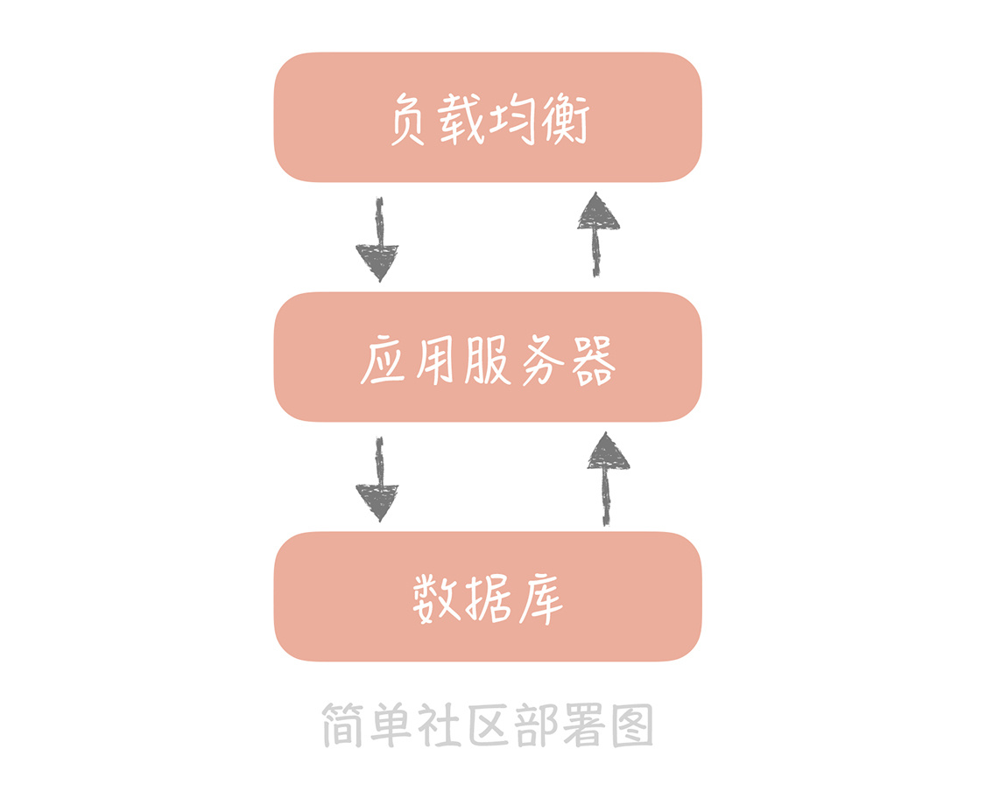
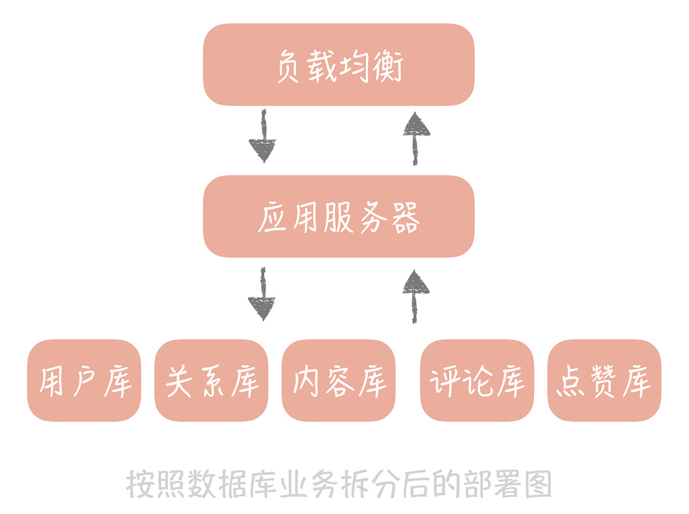
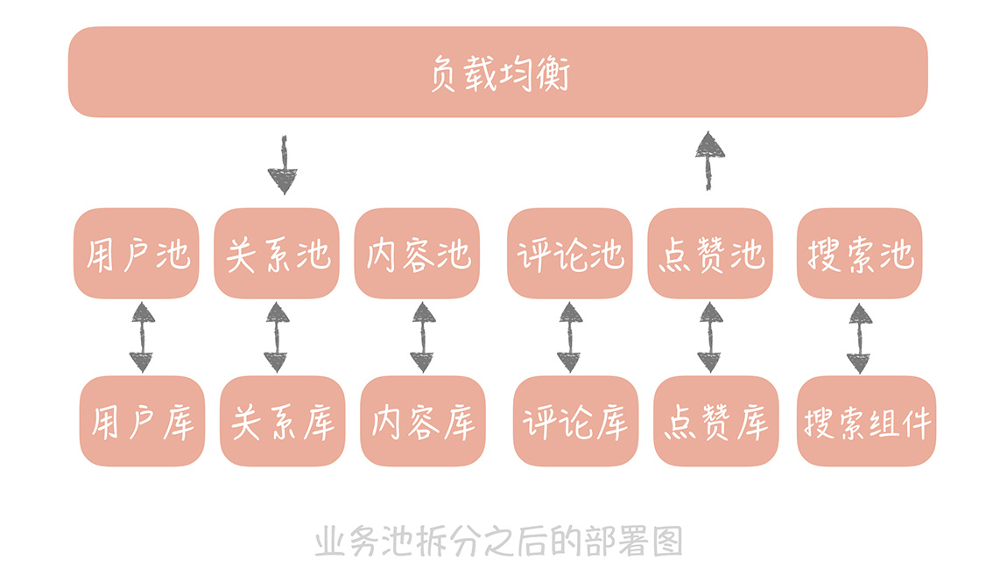
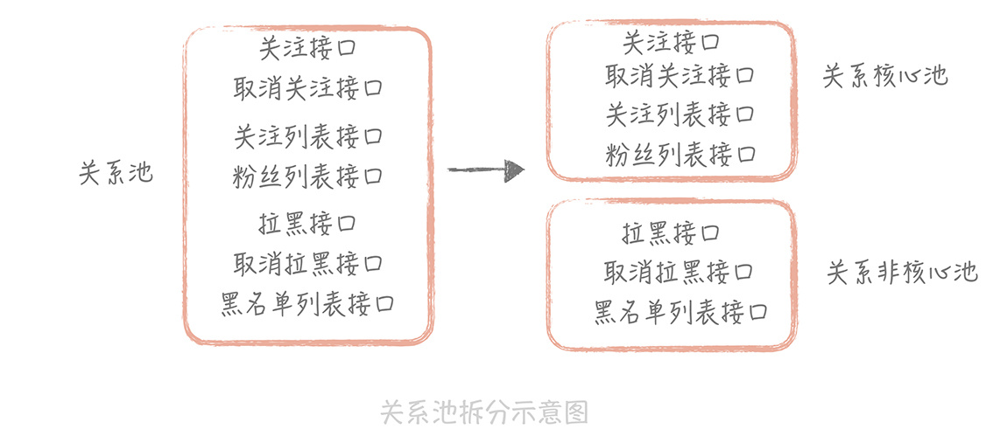

# 05 系统设计目标（三）：如何让系统易于扩展？

从架构设计上来说，高可扩展性是一个设计的指标，它表示可以通过增加机器的方式来线性提高系统的处理能力，从而承担更高的流量和并发。

你可能会问：“在架构设计之初，为什么不预先考虑好使用多少台机器，支持现有的并发呢？”这个问题我在“\[03 | 系统设计目标（一）：如何提升系统性能？\]”一课中提到过，答案是峰值的流量不可控。

一般来说，基于成本考虑，在业务平稳期，我们会预留 30%～50% 的冗余以应对运营活动或者推广可能带来的峰值流量，但是当有一个突发事件发生时，流量可能瞬间提升到 2～3 倍甚至更高，我们还是以微博为例。

鹿晗和关晓彤互圈公布恋情，大家会到两个人的微博下面，或围观，或互动，微博的流量短时间内增长迅速，微博信息流也短暂出现无法刷出新的消息的情况。

那我们要如何应对突发的流量呢？架构的改造已经来不及了，最快的方式就是堆机器。不过我们需要保证，扩容了三倍的机器之后，相应的我们的系统也能支撑三倍的流量。有的人可能会产生疑问：“这不是显而易见的吗？很简单啊。”真的是这样吗？我们来看看做这件事儿难在哪儿。

## 为什么提升扩展性会很复杂

在上一讲中，我提到可以在单机系统中通过增加处理核心的方式，来增加系统的并行处理能力，但这个方式并不总生效。因为当并行的任务数较多时，系统会因为争抢资源而达到性能上的拐点，系统处理能力不升反降。

而对于由多台机器组成的集群系统来说也是如此。集群系统中，不同的系统分层上可能存在一些“瓶颈点”，这些瓶颈点制约着系统的横线扩展能力。这句话比较抽象，我举个例子你就明白了。

比方说，你系统的流量是每秒 1000 次请求，对数据库的请求量也是每秒 1000 次。如果流量增加 10 倍，虽然系统可以通过扩容正常服务，数据库却成了瓶颈。再比方说，单机网络带宽是 50Mbps，那么如果扩容到 30 台机器，前端负载均衡的带宽就超过了千兆带宽的限制，也会成为瓶颈点。那么，我们的系统中存在哪些服务会成为制约系统扩展的重要因素呢？

其实，无状态的服务和组件更易于扩展，而像 MySQL 这种存储服务是有状态的，就比较难以扩展。因为向存储集群中增加或者减少机器时，会涉及大量数据的迁移，而一般传统的关系型数据库都不支持。这就是为什么提升系统扩展性会很复杂的主要原因。

除此之外，从例子中你可以看到，我们需要站在整体架构的角度，而不仅仅是业务服务器的角度来考虑系统的扩展性 。 **所以说，数据库、缓存、依赖的第三方、负载均衡、交换机带宽等等** 都是系统扩展时需要考虑的因素。我们要知道系统并发到了某一个量级之后，哪一个因素会成为我们的瓶颈点，从而针对性地进行扩展。

针对这些复杂的扩展性问题，我提炼了一些系统设计思路，供你了解。

## 高可扩展性的设计思路

**拆分 **是提升系统扩展性最重要的一个思路，它会把庞杂的系统拆分成独立的，有单一职责的模块。相对于大系统来说，考虑一个一个小模块的扩展性当然会简单一些。** 将复杂的问题简单化，这就是我们的思路。**

但对于不同类型的模块，我们在拆分上遵循的原则是不一样的。我给你举一个简单的例子，假如你要设计一个社区，那么社区会有几个模块呢？可能有 5 个模块。

- 用户：负责维护社区用户信息，注册，登陆等；
- 关系：用户之间关注、好友、拉黑等关系的维护；
- 内容：社区发的内容，就像朋友圈或者微博的内容；
- 评论、赞：用户可能会有的两种常规互动操作；
- 搜索：用户的搜索，内容的搜索。

而部署方式遵照最简单的三层部署架构，负载均衡负责请求的分发，应用服务器负责业务逻辑的处理，数据库负责数据的存储落地。这时，所有模块的业务代码都混合在一起了，数据也都存储在一个库里。

#### 1. 存储层的扩展性

无论是存储的数据量，还是并发访问量，不同的业务模块之间的量级相差很大，比如说成熟社区中，关系的数据量是远远大于用户数据量的，但是用户数据的访问量却远比关系数据要大。所以假如存储目前的瓶颈点是容量，那么我们只需要针对关系模块的数据做拆分就好了，而不需要拆分用户模块的数据。\*\*所以存储拆分首先考虑的维度是业务维度。\*\*拆分之后，这个简单的社区系统就有了用户库、内容库、评论库、点赞库和关系库。这么做还能隔离故障，某一个库“挂了”不会影响到其它的数据库。

按照业务拆分，在一定程度上提升了系统的扩展性，但系统运行时间长了之后，单一的业务数据库在容量和并发请求量上仍然会超过单机的限制。**这时，我们就需要针对数据库做第二次拆分。**

这次拆分是按照数据特征做水平的拆分，比如说我们可以给用户库增加两个节点，然后按照某些算法将用户的数据拆分到这三个库里面，具体的算法我会在后面讲述数据库分库分表时和你细说。

水平拆分之后，我们就可以让数据库突破单机的限制了。但这里要注意，我们不能随意地增加节点，因为一旦增加节点就需要手动地迁移数据，成本还是很高的。所以基于长远的考虑，我们最好一次性增加足够的节点以避免频繁地扩容。

当数据库按照业务和数据维度拆分之后，我们尽量不要使用事务。因为当一个事务中同时更新不同的数据库时，需要使用二阶段提交，来协调所有数据库要么全部更新成功，要么全部更新失败。这个协调的成本会随着资源的扩展不断升高，最终达到无法承受的程度。

说完了存储层的扩展性，我们来看看业务层是如何做到易于扩展的。

#### 2. 业务层的扩展性

我们一般会从三个维度考虑业务层的拆分方案，它们分别是：业务纬度，重要性纬度和请求来源纬度。

首先，我们需要把相同业务的服务拆分成单独的业务池，比方说上面的社区系统中，我们可以按照业务的维度拆分成用户池、内容池、关系池、评论池、点赞池和搜索池。

每个业务依赖独自的数据库资源，不会依赖其它业务的数据库资源。这样当某一个业务的接口成为瓶颈时，我们只需要扩展业务的池子，以及确认上下游的依赖方就可以了，这样就大大减少了扩容的复杂度。

除此之外，我们还可以根据业务接口的重要程度，把业务分为核心池和非核心池。打个比方，就关系池而言，关注、取消关注接口相对重要一些，可以放在核心池里面；拉黑和取消拉黑的操作就相对不那么重要，可以放在非核心池里面。这样，我们可以优先保证核心池的性能，当整体流量上升时优先扩容核心池，降级部分非核心池的接口，从而保证整体系统的稳定性。

最后，你还可以根据接入客户端类型的不同做业务池的拆分。比如说，服务于客户端接口的业务可以定义为外网池，服务于小程序或者 HTML5 页面的业务可以定义为 H5 池，服务于内部其它部门的业务可以定义为内网池，等等。

## 课程小结

本节课我带你了解了提升系统扩展性的复杂度以及系统拆分的思路。拆分看起来比较简单，可是什么时候做拆分，如何做拆分还是有很多细节考虑的。

未做拆分的系统虽然可扩展性不强，但是却足够简单，无论是系统开发还是运行维护都不需要投入很大的精力。拆分之后，需求开发需要横跨多个系统多个小团队，排查问题也需要涉及多个系统，运行维护上，可能每个子系统都需要有专人来负责，对于团队是一个比较大的考验。这个考验是我们必须要经历的一个大坎，需要我们做好准备。
