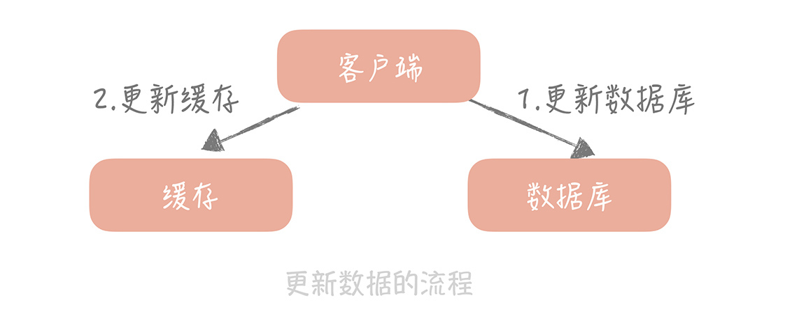
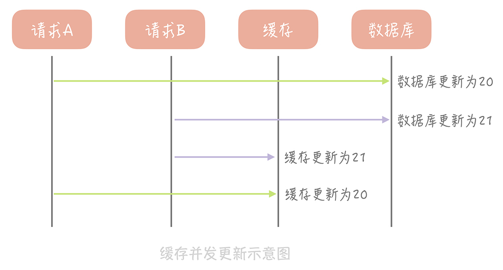
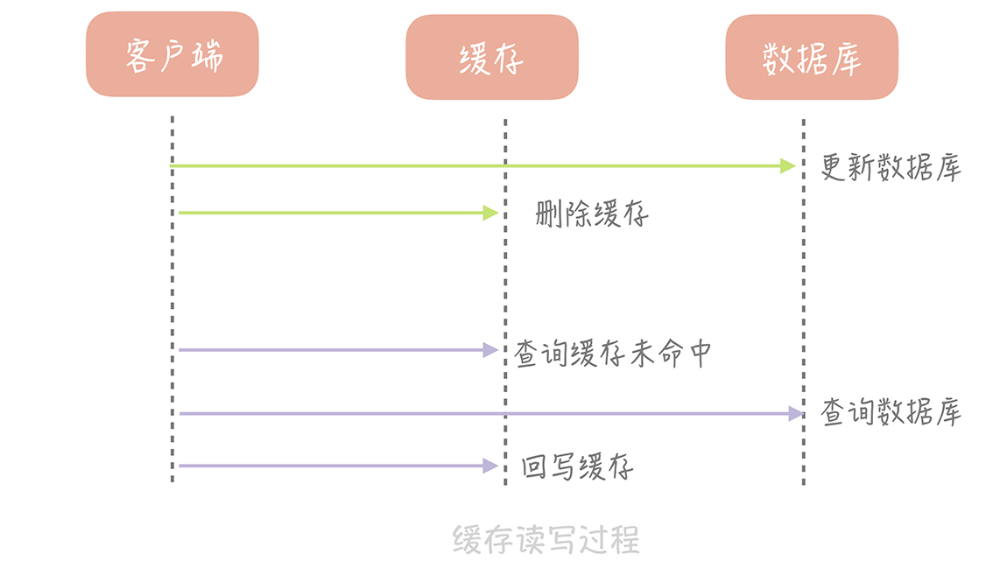
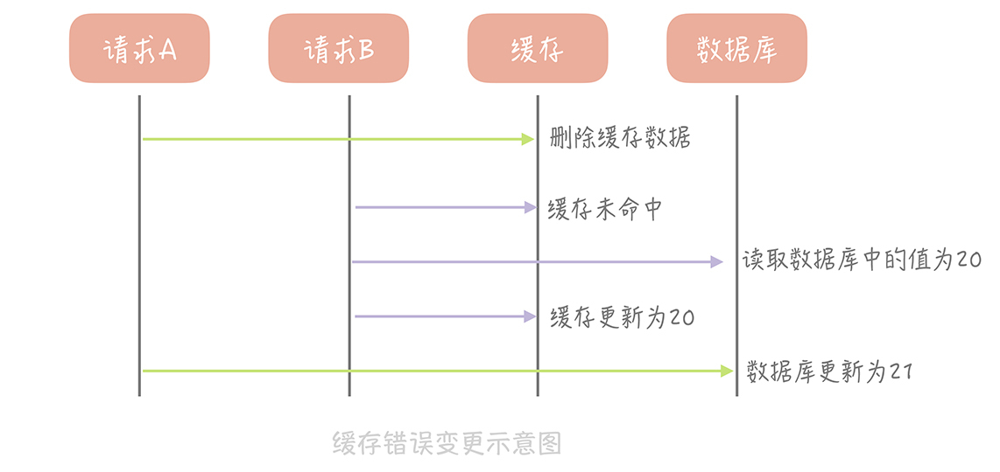
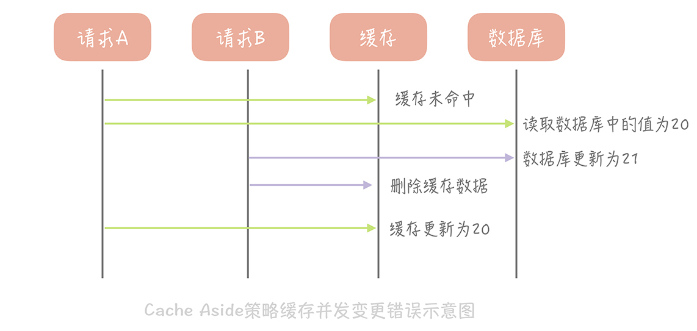
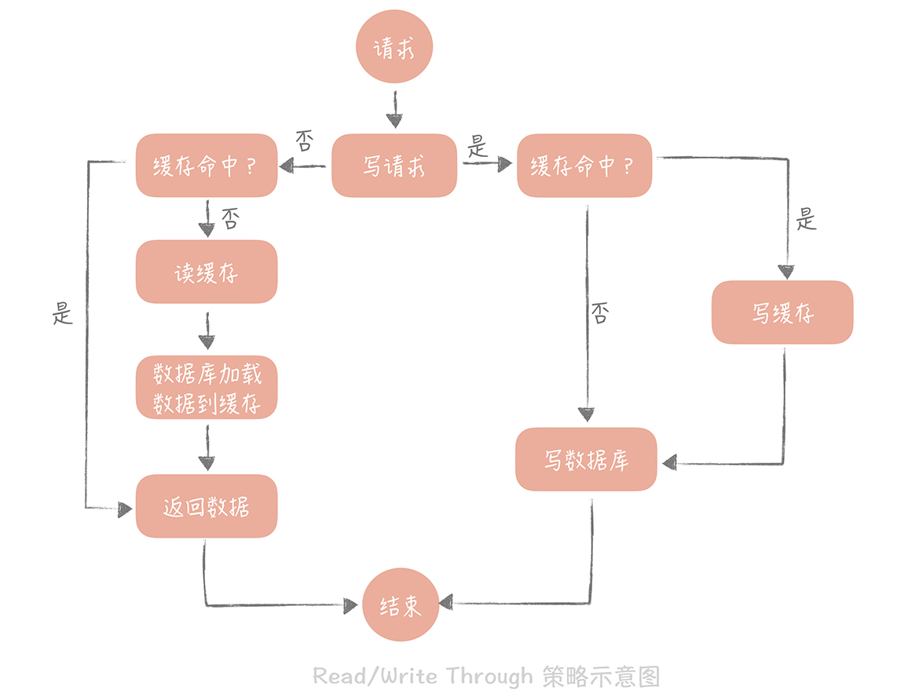
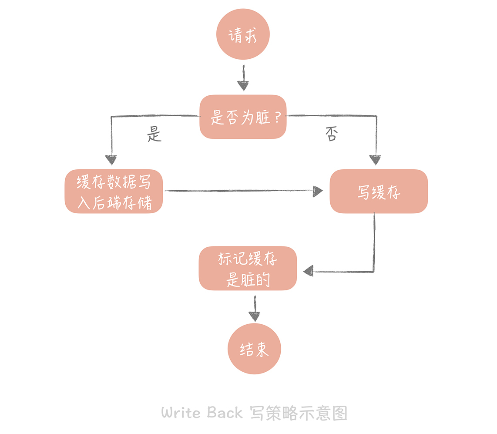
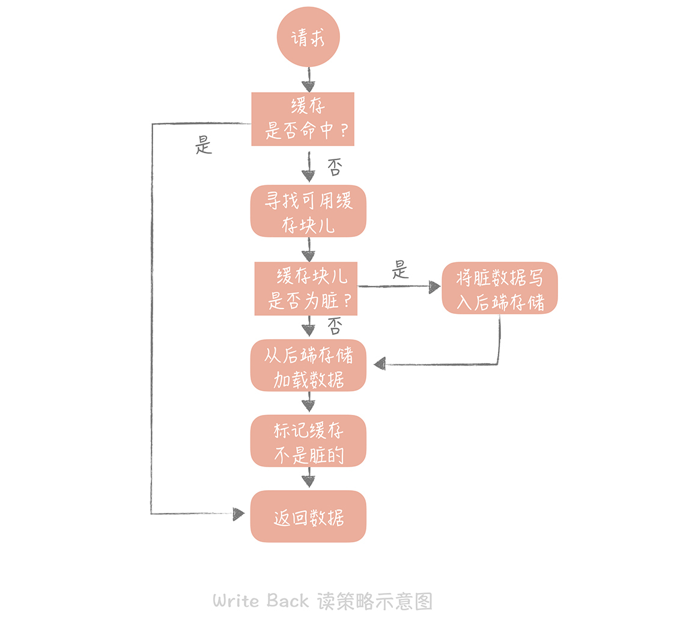

13 缓存的使用姿势（一）：如何选择缓存的读写策略？
==========================

上节课，我带你了解了缓存的定义、分类以及不足，你现在应该对缓存有了初步的认知。从今天开始，我将带你了解一下使用缓存的正确姿势，比如缓存的读写策略是什么样的，如何做到缓存的高可用以及如何应对缓存穿透。通过了解这些内容，你会对缓存的使用有深刻的认识，这样在实际工作中就可以在缓存使用上游刃有余了。

今天，我们先讲讲缓存的读写策略。你可能觉得缓存的读写很简单，只需要优先读缓存，缓存不命中就从数据库查询，查询到了就回种缓存。实际上，针对不同的业务场景，缓存的读写策略也是不同的。

而我们在选择策略时也需要考虑诸多的因素，比如说，缓存中是否有可能被写入脏数据，策略的读写性能如何，是否存在缓存命中率下降的情况等等。接下来，我就以标准的“缓存 + 数据库”的场景为例，带你剖析经典的缓存读写策略以及它们适用的场景。这样一来，你就可以在日常的工作中根据不同的场景选择不同的读写策略。

Cache Aside（旁路缓存）策略
-------------------

我们来考虑一种最简单的业务场景，比方说在你的电商系统中有一个用户表，表中只有 ID 和年龄两个字段，缓存中我们以 ID 为 Key 存储用户的年龄信息。那么当我们要把 ID 为 1 的用户的年龄从 19 变更为 20，要如何做呢？

\*\*你可能会产生这样的思路：\*\*先更新数据库中 ID 为 1 的记录，再更新缓存中 Key 为 1 的数据。

\*\*这个思路会造成缓存和数据库中的数据不一致。\*\*比如，A 请求将数据库中 ID 为 1 的用户年龄从 19 变更为 20，与此同时，请求 B 也开始更新 ID 为 1 的用户数据，它把数据库中记录的年龄变更为 21，然后变更缓存中的用户年龄为 21。紧接着，A 请求开始更新缓存数据，它会把缓存中的年龄变更为 20。此时，数据库中用户年龄是 21，而缓存中的用户年龄却是 20。

\*\*为什么产生这个问题呢？\*\*因为变更数据库和变更缓存是两个独立的操作，而我们并没有对操作做任何的并发控制。那么当两个线程并发更新它们的时候，就会因为写入顺序的不同造成数据的不一致。

另外，直接更新缓存还存在另外一个问题就是丢失更新。还是以我们的电商系统为例，假如电商系统中的账户表有三个字段：ID、户名和金额，这个时候缓存中存储的就不只是金额信息，而是完整的账户信息了。当更新缓存中账户金额时，你需要从缓存中查询完整的账户数据，把金额变更后再写入到缓存中。

这个过程中也会有并发的问题，比如说原有金额是 20，A 请求从缓存中读到数据，并且把金额加 1，变更成 21，在未写入缓存之前又有请求 B 也读到缓存的数据后把金额也加 1，也变更成 21，两个请求同时把金额写回缓存，这时缓存里面的金额是 21，但是我们实际上预期是金额数加 2，这也是一个比较大的问题。

\*\*那我们要如何解决这个问题呢？\*\*其实，我们可以在更新数据时不更新缓存，而是删除缓存中的数据，在读取数据时，发现缓存中没了数据之后，再从数据库中读取数据，更新到缓存中。

这个策略就是我们使用缓存最常见的策略，Cache Aside 策略（也叫旁路缓存策略），这个策略数据以数据库中的数据为准，缓存中的数据是按需加载的。它可以分为读策略和写策略，**其中读策略的步骤是：**

* 从缓存中读取数据；
* 如果缓存命中，则直接返回数据；
* 如果缓存不命中，则从数据库中查询数据；
* 查询到数据后，将数据写入到缓存中，并且返回给用户。

**写策略的步骤是：**

* 更新数据库中的记录；
* 删除缓存记录。

你也许会问了，在写策略中，能否先删除缓存，后更新数据库呢？\*\*答案是不行的，\*\*因为这样也有可能出现缓存数据不一致的问题，我以用户表的场景为例解释一下。

假设某个用户的年龄是 20，请求 A 要更新用户年龄为 21，所以它会删除缓存中的内容。这时，另一个请求 B 要读取这个用户的年龄，它查询缓存发现未命中后，会从数据库中读取到年龄为 20，并且写入到缓存中，然后请求 A 继续更改数据库，将用户的年龄更新为 21，这就造成了缓存和数据库的不一致。

那么像 Cache Aside 策略这样先更新数据库，后删除缓存就没有问题了吗？其实在理论上还是有缺陷的。假如某个用户数据在缓存中不存在，请求 A 读取数据时从数据库中查询到年龄为 20，在未写入缓存中时另一个请求 B 更新数据。它更新数据库中的年龄为 21，并且清空缓存。这时请求 A 把从数据库中读到的年龄为 20 的数据写入到缓存中，造成缓存和数据库数据不一致。

不过这种问题出现的几率并不高，原因是缓存的写入通常远远快于数据库的写入，所以在实际中很难出现请求 B 已经更新了数据库并且清空了缓存，请求 A 才更新完缓存的情况。而一旦请求 A 早于请求 B 清空缓存之前更新了缓存，那么接下来的请求就会因为缓存为空而从数据库中重新加载数据，所以不会出现这种不一致的情况。

\*\*Cache Aside 策略是我们日常开发中最经常使用的缓存策略，不过我们在使用时也要学会依情况而变。\*\*比如说当新注册一个用户，按照这个更新策略，你要写数据库，然后清理缓存（当然缓存中没有数据给你清理）。可当我注册用户后立即读取用户信息，并且数据库主从分离时，会出现因为主从延迟所以读不到用户信息的情况。

**而解决这个问题的办法**恰恰是在插入新数据到数据库之后写入缓存，这样后续的读请求就会从缓存中读到数据了。并且因为是新注册的用户，所以不会出现并发更新用户信息的情况。

Cache Aside 存在的最大的问题是当写入比较频繁时，缓存中的数据会被频繁地清理，这样会对缓存的命中率有一些影响。**如果你的业务对缓存命中率有严格的要求，那么可以考虑两种解决方案：**

\\1. 一种做法是在更新数据时也更新缓存，只是在更新缓存前先加一个分布式锁，因为这样在同一时间只允许一个线程更新缓存，就不会产生并发问题了。当然这么做对于写入的性能会有一些影响；

\\2. 另一种做法同样也是在更新数据时更新缓存，只是给缓存加一个较短的过期时间，这样即使出现缓存不一致的情况，缓存的数据也会很快地过期，对业务的影响也是可以接受。

当然了，除了这个策略，在计算机领域还有其他几种经典的缓存策略，它们也有各自适用的使用场景。

Read/Write Through（读穿 / 写穿）策略
-----------------------------

这个策略的核心原则是用户只与缓存打交道，由缓存和数据库通信，写入或者读取数据。这就好比你在汇报工作的时候只对你的直接上级汇报，再由你的直接上级汇报给他的上级，你是不能越级汇报的。

Write Through 的策略是这样的：先查询要写入的数据在缓存中是否已经存在，如果已经存在，则更新缓存中的数据，并且由缓存组件同步更新到数据库中，如果缓存中数据不存在，我们把这种情况叫做“Write Miss（写失效）”。

一般来说，我们可以选择两种“Write Miss”方式：一个是“Write Allocate（按写分配）”，做法是写入缓存相应位置，再由缓存组件同步更新到数据库中；另一个是“No-write allocate（不按写分配）”，做法是不写入缓存中，而是直接更新到数据库中。

在 Write Through 策略中，我们一般选择“No-write allocate”方式，原因是无论采用哪种“Write Miss”方式，我们都需要同步将数据更新到数据库中，而“No-write allocate”方式相比“Write Allocate”还减少了一次缓存的写入，能够提升写入的性能。

Read Through 策略就简单一些，它的步骤是这样的：先查询缓存中数据是否存在，如果存在则直接返回，如果不存在，则由缓存组件负责从数据库中同步加载数据。

下面是 Read Through/Write Through 策略的示意图：

Read Through/Write Through 策略的特点是由缓存节点而非用户来和数据库打交道，在我们开发过程中相比 Cache Aside 策略要少见一些，原因是我们经常使用的分布式缓存组件，无论是 Memcached 还是 Redis 都不提供写入数据库，或者自动加载数据库中的数据的功能。而我们在使用本地缓存的时候可以考虑使用这种策略，比如说在上一节中提到的本地缓存 Guava Cache 中的 Loading Cache 就有 Read Through 策略的影子。

我们看到 Write Through 策略中写数据库是同步的，这对于性能来说会有比较大的影响，因为相比于写缓存，同步写数据库的延迟就要高很多了。那么我们可否异步地更新数据库？这就是我们接下来要提到的“Write Back”策略。

Write Back（写回）策略
----------------

这个策略的核心思想是在写入数据时只写入缓存，并且把缓存块儿标记为“脏”的。而脏块儿只有被再次使用时才会将其中的数据写入到后端存储中。

\*\*需要注意的是，\*\*在“Write Miss”的情况下，我们采用的是“Write Allocate”的方式，也就是在写入后端存储的同时要写入缓存，这样我们在之后的写请求中都只需要更新缓存即可，而无需更新后端存储了，我将 Write back 策略的示意图放在了下面：

\*\*如果使用 Write Back 策略的话，读的策略也有一些变化了。\*\*我们在读取缓存时如果发现缓存命中则直接返回缓存数据。如果缓存不命中则寻找一个可用的缓存块儿，如果这个缓存块儿是“脏”的，就把缓存块儿中之前的数据写入到后端存储中，并且从后端存储加载数据到缓存块儿，如果不是脏的，则由缓存组件将后端存储中的数据加载到缓存中，最后我们将缓存设置为不是脏的，返回数据就好了。

\*\*发现了吗？\*\*其实这种策略不能被应用到我们常用的数据库和缓存的场景中，它是计算机体系结构中的设计，比如我们在向磁盘中写数据时采用的就是这种策略。无论是操作系统层面的 Page Cache，还是日志的异步刷盘，亦或是消息队列中消息的异步写入磁盘，大多采用了这种策略。因为这个策略在性能上的优势毋庸置疑，它避免了直接写磁盘造成的随机写问题，毕竟写内存和写磁盘的随机 I/O 的延迟相差了几个数量级呢。

但因为缓存一般使用内存，而内存是非持久化的，所以一旦缓存机器掉电，就会造成原本缓存中的脏块儿数据丢失。所以你会发现系统在掉电之后，之前写入的文件会有部分丢失，就是因为 Page Cache 还没有来得及刷盘造成的。

\*\*当然，你依然可以在一些场景下使用这个策略，在使用时，我想给你的落地建议是：\*\*你在向低速设备写入数据的时候，可以在内存里先暂存一段时间的数据，甚至做一些统计汇总，然后定时地刷新到低速设备上。比如说，你在统计你的接口响应时间的时候，需要将每次请求的响应时间打印到日志中，然后监控系统收集日志后再做统计。但是如果每次请求都打印日志无疑会增加磁盘 I/O，那么不如把一段时间的响应时间暂存起来，经过简单的统计平均耗时，每个耗时区间的请求数量等等，然后定时地，批量地打印到日志中。

课程小结
----

本节课，我主要带你了解了缓存使用的几种策略，以及每种策略适用的使用场景是怎样的。我想让你掌握的重点是：

1.Cache Aside 是我们在使用分布式缓存时最常用的策略，你可以在实际工作中直接拿来使用。

2.Read/Write Through 和 Write Back 策略需要缓存组件的支持，所以比较适合你在实现本地缓存组件的时候使用；

3.Write Back 策略是计算机体系结构中的策略，不过写入策略中的只写缓存，异步写入后端存储的策略倒是有很多的应用场景。

而且，你还需要了解，我们今天提到的策略都是标准的使用姿势，在实际开发过程中需要结合实际的业务特点灵活使用甚至加以改造。这些业务特点包括但不仅限于：整体的数据量级情况，访问的读写比例的情况，对于数据的不一致时间的容忍度，对于缓存命中率的要求等等。理论结合实践，具体情况具体分析，你才能得到更好的解决方案。
