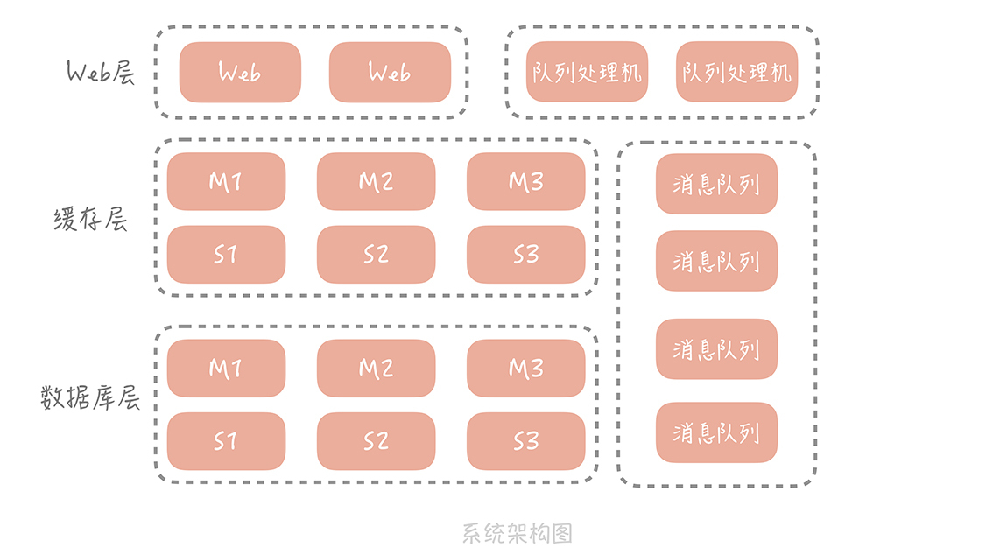
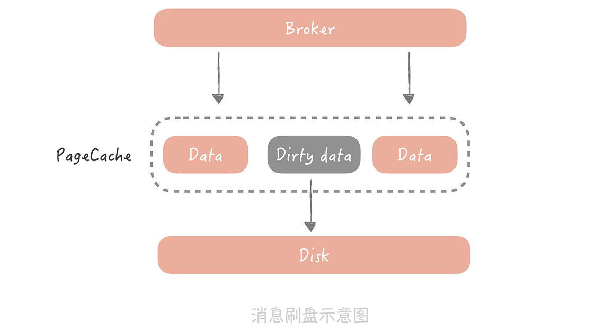
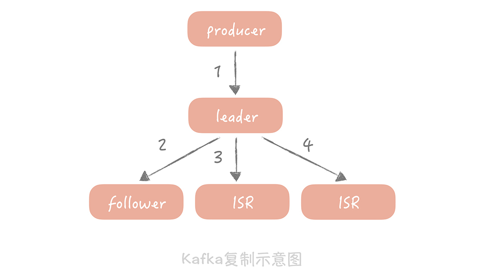
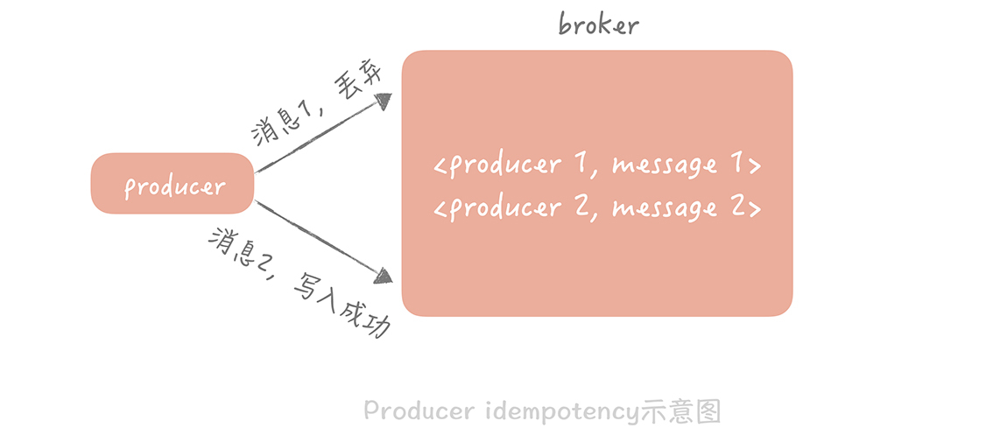

# 18 消息投递：如何保证消息仅仅被消费一次？

你好，我是唐扬。

经过上一节课，我们在电商系统中增加了消息队列，用它来对峰值写流量做削峰填谷，对次要的业务逻辑做异步处理，对不同的系统模块做解耦合。因为业务逻辑从同步代码中移除了，所以，我们也要有相应的队列处理程序来处理消息、执行业务逻辑， **这时，你的系统架构变成了下面的样子：**



这是一个简化版的架构图，实际上，随着业务逻辑越来越复杂，会引入更多的外部系统和服务来解决业务上的问题。比如说，我们会引入 Elasticsearch 来解决商品和店铺搜索的问题，也会引入审核系统，来对售卖的商品、用户的评论做自动的和人工的审核，你会越来越多地使用消息队列与外部系统解耦合，以及提升系统性能。

比如说，你的电商系统需要上一个新的红包功能：用户在购买一定数量的商品之后，由你的系统给用户发一个现金的红包，鼓励用户消费。由于发放红包的过程不应该在购买商品的主流程之内，所以你考虑使用消息队列来异步处理。 **这时，你发现了一个问题：** 如果消息在投递的过程中发生丢失，那么用户就会因为没有得到红包而投诉。相反，如果消息在投递的过程中出现了重复，那么你的系统就会因为发送两个红包而损失。

那么我们如何保证，产生的消息一定会被消费到，并且只被消费一次呢？这个问题虽然听起来很浅显，很好理解，但是实际上却藏着很多玄机，本节课我就带你深入探讨。

## 消息为什么会丢失

如果要保证消息只被消费一次，首先就要保证消息不会丢失。那么消息从被写入到消息队列，到被消费者消费完成，这个链路上会有哪些地方存在丢失消息的可能呢？其实，主要存在三个场景：

消息从生产者写入到消息队列的过程。

消息在消息队列中的存储场景。

消息被消费者消费的过程。


接下来，我就针对每一个场景，详细地剖析一下，这样你可以针对不同的场景选择合适的，减少消息丢失的解决方案。

#### 1. 在消息生产的过程中丢失消息

在这个环节中主要有两种情况。

首先，消息的生产者一般是我们的业务服务器，消息队列是独立部署在单独的服务器上的。两者之间的网络虽然是内网，但是也会存在抖动的可能，而一旦发生抖动，消息就有可能因为网络的错误而丢失。

**针对这种情况，我建议你采用的方案是消息重传：** 也就是当你发现发送超时后你就将消息重新发一次，但是你也不能无限制地重传消息。一般来说，如果不是消息队列发生故障，或者是到消息队列的网络断开了，重试 2～3 次就可以了。

不过，这种方案可能会造成消息的重复，从而导致在消费的时候会重复消费同样的消息。比方说，消息生产时由于消息队列处理慢或者网络的抖动，导致虽然最终写入消息队列成功，但在生产端却超时了，生产者重传这条消息就会形成重复的消息，那么针对上面的例子，直观显示在你面前的就会是你收到了两个现金红包。

那么消息发送到了消息队列之后是否就万无一失了呢？当然不是， **在消息队列中消息仍然有丢失的风险。** #### 2. 在消息队列中丢失消息

拿 Kafka 举例，消息在 Kafka 中是存储在本地磁盘上的，而为了减少消息存储时对磁盘的随机 I/O，我们一般会将消息先写入到操作系统的 Page Cache 中，然后再找合适的时机刷新到磁盘上。

比如，Kafka 可以配置当达到某一时间间隔，或者累积一定的消息数量的时候再刷盘， **也就是所说的异步刷盘。** 来看一个形象的比喻：假如你经营一个图书馆，读者每还一本书你都要去把图书归位，不仅工作量大而且效率低下，但是如果你可以选择每隔 3 小时，或者图书达到一定数量的时候再把图书归位，这样可以把同一类型的书一起归位，节省了查找图书位置的时间，这样就可以提高效率了。

不过，如果发生机器掉电或者机器异常重启，那么 Page Cache 中还没有来得及刷盘的消息就会丢失了。 **那么怎么解决呢？** 你可能会把刷盘的间隔设置很短，或者设置累积一条消息就就刷盘，但这样频繁刷盘会对性能有比较大的影响，而且从经验来看，出现机器宕机或者掉电的几率也不高， **所以我不建议你这样做。** 

如果你的电商系统对消息丢失的容忍度很低， **那么你可以考虑以集群方式部署 Kafka 服务，通过部署多个副本备份数据，保证消息尽量不丢失。** 那么它是怎么实现的呢？

Kafka 集群中有一个 Leader 负责消息的写入和消费，可以有多个 Follower 负责数据的备份。Follower 中有一个特殊的集合叫做 ISR（in-sync replicas），当 Leader 故障时，新选举出来的 Leader 会从 ISR 中选择，默认 Leader 的数据会异步地复制给 Follower，这样在 Leader 发生掉电或者宕机时，Kafka 会从 Follower 中消费消息，减少消息丢失的可能。

由于默认消息是异步地从 Leader 复制到 Follower 的，所以一旦 Leader 宕机，那些还没有来得及复制到 Follower 的消息还是会丢失。为了解决这个问题，Kafka 为生产者提供一个选项叫做“acks”，当这个选项被设置为“all”时，生产者发送的每一条消息除了发给 Leader 外还会发给所有的 ISR，并且必须得到 Leader 和所有 ISR 的确认后才被认为发送成功。这样，只有 Leader 和所有的 ISR 都挂了，消息才会丢失。



从上面这张图来看，当设置“acks=all”时，需要同步执行 1，3，4 三个步骤，对于消息生产的性能来说也是有比较大的影响的，所以你在实际应用中需要仔细地权衡考量。 **我给你的建议是：**

\\1. 如果你需要确保消息一条都不能丢失，那么建议不要开启消息队列的同步刷盘，而是需要使用集群的方式来解决，可以配置当所有 ISR Follower 都接收到消息才返回成功。

\\2. 如果对消息的丢失有一定的容忍度，那么建议不部署集群，即使以集群方式部署，也建议配置只发送给一个 Follower 就可以返回成功了。

\\3. 我们的业务系统一般对于消息的丢失有一定的容忍度，比如说以上面的红包系统为例，如果红包消息丢失了，我们只要后续给没有发送红包的用户补发红包就好了。

#### 3. 在消费的过程中存在消息丢失的可能

我还是以 Kafka 为例来说明。一个消费者消费消息的进度是记录在消息队列集群中的，而消费的过程分为三步：接收消息、处理消息、更新消费进度。

这里面接收消息和处理消息的过程都可能会发生异常或者失败，比如说，消息接收时网络发生抖动，导致消息并没有被正确的接收到；处理消息时可能发生一些业务的异常导致处理流程未执行完成，这时如果更新消费进度，那么这条失败的消息就永远不会被处理了，也可以认为是丢失了。

**所以，在这里你需要注意的是，** 一定要等到消息接收和处理完成后才能更新消费进度，但是这也会造成消息重复的问题，比方说某一条消息在处理之后，消费者恰好宕机了，那么因为没有更新消费进度，所以当这个消费者重启之后，还会重复地消费这条消息。

## 如何保证消息只被消费一次

从上面的分析中，你能发现，为了避免消息丢失，我们需要付出两方面的代价：一方面是性能的损耗；一方面可能造成消息重复消费。

性能的损耗我们还可以接受，因为一般业务系统只有在写请求时才会有发送消息队列的操作，而一般系统的写请求的量级并不高，但是消息一旦被重复消费，就会造成业务逻辑处理的错误。那么我们要如何避免消息的重复呢？

想要完全的避免消息重复的发生是很难做到的，因为网络的抖动、机器的宕机和处理的异常都是比较难以避免的，在工业上并没有成熟的方法，因此我们会把要求放宽，只要保证即使消费到了重复的消息，从消费的最终结果来看和只消费一次是等同的就好了，也就是保证在消息的生产和消费的过程是“幂等”的。

#### 1. 什么是幂等

幂等是一个数学上的概念，它的含义是多次执行同一个操作和执行一次操作，最终得到的结果是相同的，说起来可能有些抽象，我给你举个例子：

比如，男生和女生吵架，女生抓住一个点不放，传递“你不在乎我了吗？”（生产消息）的信息。那么当多次埋怨“你不在乎我了吗？”的时候（多次生产相同消息），她不知道的是，男生的耳朵（消息处理）会自动把 N 多次的信息屏蔽，就像只听到一次一样，这就是幂等性。

如果我们消费一条消息的时候，要给现有的库存数量减 1，那么如果消费两条相同的消息就会给库存数量减 2，这就不是幂等的。而如果消费一条消息后，处理逻辑是将库存的数量设置为 0，或者是如果当前库存数量是 10 时则减 1，这样在消费多条消息时，所得到的结果就是相同的， **这就是幂等的。**  **说白了，你可以这么理解“幂等”：** 一件事儿无论做多少次都和做一次产生的结果是一样的，那么这件事儿就具有幂等性。

#### 2. 在生产、消费过程中增加消息幂等性的保证

消息在生产和消费的过程中都可能会产生重复，所以你要做的是，在生产过程和消费过程中增加消息幂等性的保证，这样就可以认为从“最终结果上来看”，消息实际上是只被消费了一次的。

**在消息生产过程中，** 在 Kafka0.11 版本和 Pulsar 中都支持“producer idempotency”的特性，翻译过来就是生产过程的幂等性，这种特性保证消息虽然可能在生产端产生重复，但是最终在消息队列存储时只会存储一份。

它的做法是给每一个生产者一个唯一的 ID，并且为生产的每一条消息赋予一个唯一 ID，消息队列的服务端会存储 \< 生产者 ID，最后一条消息 ID> 的映射。当某一个生产者产生新的消息时，消息队列服务端会比对消息 ID 是否与存储的最后一条 ID 一致，如果一致，就认为是重复的消息，服务端会自动丢弃。



**而在消费端，**  **幂等性的保证会稍微复杂一些，你可以从**  **通用层和业务层** 两个层面来考虑。

在通用层面，你可以在消息被生产的时候，使用发号器给它生成一个全局唯一的消息 ID，消息被处理之后，把这个 ID 存储在数据库中，在处理下一条消息之前，先从数据库里面查询这个全局 ID 是否被消费过，如果被消费过就放弃消费。

你可以看到，无论是生产端的幂等性保证方式，还是消费端通用的幂等性保证方式，它们的共同特点都是为每一个消息生成一个唯一的 ID，然后在使用这个消息的时候，先比对这个 ID 是否已经存在，如果存在，则认为消息已经被使用过。所以这种方式是一种标准的实现幂等的方式， **你在项目之中可以拿来直接使用，** 它在逻辑上的伪代码就像下面这样：

```
boolean isIDExisted = selectByID(ID); // 判断 ID 是否存在
if(isIDExisted) {
  return; // 存在则直接返回
} else {
  process(message); // 不存在，则处理消息
  saveID(ID);   // 存储 ID
}
```

**不过这样会有一个问题：** 如果消息在处理之后，还没有来得及写入数据库，消费者宕机了重启之后发现数据库中并没有这条消息，还是会重复执行两次消费逻辑，这时你就需要引入事务机制，保证消息处理和写入数据库必须同时成功或者同时失败，但是这样消息处理的成本就更高了，所以，如果对于消息重复没有特别严格的要求，可以直接使用这种通用的方案，而不考虑引入事务。

**在业务层面怎么处理呢？** 这里有很多种处理方式，其中有一种是增加乐观锁的方式。比如，你的消息处理程序需要给一个人的账号加钱，那么你可以通过乐观锁的方式来解决。

**具体的操作方式是这样的：** 你给每个人的账号数据中增加一个版本号的字段，在生产消息时先查询这个账户的版本号，并且将版本号连同消息一起发送给消息队列。消费端在拿到消息和版本号后，在执行更新账户金额 SQL 的时候带上版本号，类似于执行：

```
update user set amount = amount + 20, version=version+1 where userId=1 and version=1;
```

你看，我们在更新数据时给数据加了乐观锁，这样在消费第一条消息时，version 值为 1，SQL 可以执行成功，并且同时把 version 值改为了 2；在执行第二条相同的消息时，由于 version 值不再是 1，所以这条 SQL 不能执行成功，也就保证了消息的幂等性。

## 课程小结

本节课，我主要带你了解了在消息队列中，消息可能会发生丢失的场景，和我们的应对方法，以及在消息重复的场景下，你要如何保证，尽量不影响消息最终的处理结果。我想强调的重点是：

消息的丢失可以通过生产端的重试、消息队列配置集群模式，以及消费端合理处理消费进度三个方式来解决。

为了解决消息的丢失通常会造成性能上的问题以及消息的重复问题。

通过保证消息处理的幂等性可以解决消息的重复问题。

虽然我讲了很多应对消息丢失的方法，但并不是说消息丢失一定不能被接受，毕竟你可以看到，在允许消息丢失的情况下，消息队列的性能更好，方案实现的复杂度也最低。比如像是日志处理的场景，日志存在的意义在于排查系统的问题，而系统出现问题的几率不高，偶发的丢失几条日志是可以接受的。

**所以方案设计看场景，这是一切设计的原则，** 你不能把所有的消息队列都配置成防止消息丢失的方式，也不能要求所有的业务处理逻辑都要支持幂等性，这样会给开发和运维带来额外的负担。
