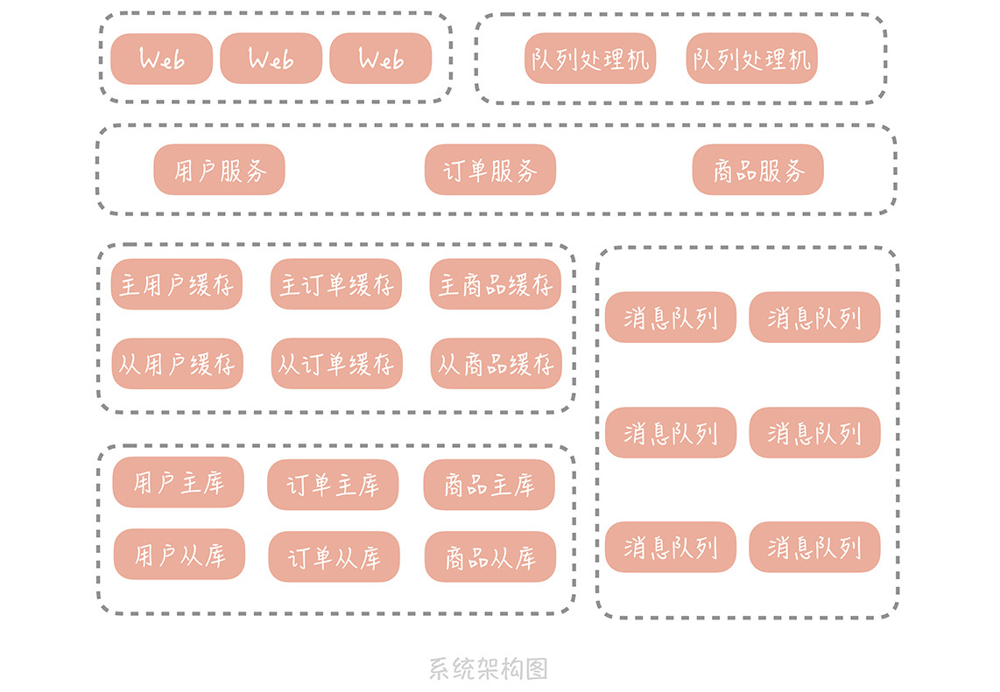

# 22 微服务架构：微服务化后，系统架构要如何改造？

你好，我是唐扬。

上一节课，我带你了解了，单体架构向微服务化架构演进的原因，你应该了解到，当系统依赖资源的扩展性出现问题，或者是一体化架构带来的研发成本、部署成本变得难以接受时，我们会考虑对整体系统，做微服务化拆分。

**微服务化之后，**垂直电商系统的架构会将变成下面这样：

在这个架构中，我们将用户、订单和商品相关的逻辑，抽取成服务独立的部署，原本的 Web 工程和队列处理程序，将不再直接依赖缓存和数据库，而是通过调用服务接口，查询存储中的信息。

有了构思和期望之后，为了将服务化拆分尽快落地，你们决定抽调主力研发同学，共同制定拆分计划。但是细致讨论后发现，虽然对服务拆分有了大致的方向，可还是有很多疑问，比如：

服务拆分时要遵循哪些原则？

服务的边界如何确定？服务的粒度是怎样呢？

在服务化之后，会遇到哪些问题呢？我们又将如何来解决？

当然，你也许想知道，微服务拆分的具体操作过程和步骤是怎样的，但是这部分内容涉及的知识点比较多，不太可能在一次课程中，把全部内容涵盖到。而且《DDD 实战课》中，已经侧重讲解了微服务化拆分的具体过程，你可以借鉴。

上面这三点内容，会影响服务化拆分的效果，但在实际的项目中，经常被大部分人忽略，所以是我们本节课的重点内容。而我希望你能把本节课的内容和自身的业务结合起来体会，思考业务服务化拆分的方式和方法。

## 微服务拆分的原则

之前，你维护的一体化架构，就像是一个大的蜘蛛网，不同功能模块，错综复杂地交织在一起，方法之间调用关系非常的复杂，导致你修复了一个 Bug，可能会引起另外多个 Bug，整体的维护成本非常高。同时，数据库较弱的扩展性，也限制了服务的扩展能力

**出于上述考虑，**你要对架构做拆分。但拆分并不像听上去那么简单，这其实就是将整体工程，重构甚至重写的过程。你需要将代码，拆分到若干个子工程里面，再将这些子工程，通过一些通信方式组装起来，这对架构是很大的调整，需要跨多个团队协调完成。

所以在开始拆分之前，你需要明确几个拆分的原则，否则就会事倍功半，甚至对整体项目产生不利的影响。

**原则一，**做到单一服务内部功能的高内聚，和低耦合。也就是说，每个服务只完成自己职责之内的任务，对于不是自己职责的功能，交给其它服务来完成。说起来你可能觉得理所当然，对这一点不屑一顾，但很多人在实际开发中，经常会出现一些问题。

**比如，我之前的项目中，** 有用户服务和内容服务，用户信息中有“是否为认证用户”字段。组内有个同学在内容服务里有这么一段逻辑：如果用户认证字段等于 1，代表是认证用户，那么就把内容权重提升。问题是，判断用户是否为认证用户的逻辑，应该内聚在用户服务内部，而不应该由内容服务判断，否则认证的逻辑一旦变更，内容服务也需要一同跟着变更，这就不满足高内聚、低耦合的要求了。所幸，我们在 Review 代码时，及时发现了这个问题，并在服务上线之前修复了它。

**原则二，**你需要关注服务拆分的粒度，先粗略拆分，再逐渐细化。在服务拆分的初期，你其实很难确定，服务究竟要拆分成什么样。但是，从“微服务”这几个字来看，服务的粒度貌似应该足够小，甚至有“一方法一服务”的说法。不过，服务多了也会带来问题，像是服务个数的增加会增加运维的成本。再比如，原本一次请求只需要调用进程内的多个方法，现在则需要跨网络调用多个 RPC 服务，在性能上肯定会有所下降。

**所以我推荐的做法是：**拆分初期可以把服务粒度拆的粗一些，后面随着团队对于业务和微服务理解的加深，再考虑把服务粒度细化。**比如说，**对于一个社区系统来说，你可以先把和用户关系相关的业务逻辑，都拆分到用户关系服务中，之后，再把比如黑名单的逻辑独立成黑名单服务。

**原则三，**拆分的过程，要尽量避免影响产品的日常功能迭代，也就是说，要一边做产品功能迭代，一边完成服务化拆分。

**还是拿我之前维护的一个项目举例。**我曾经在竞品对手快速发展的时期做了服务的拆分，拆分的方式是停掉所有业务开发，全盘推翻重构，结果错失了产品发展的最佳机会，最终败给了竞争对手。因此，我们的拆分只能在现有一体化系统的基础上，不断剥离业务独立部署，**剥离的顺序，你可以参考以下几点：**

\\1. 优先剥离比较独立的边界服务（比如短信服务、地理位置服务），从非核心的服务出发，减少拆分对现有业务的影响，也给团队一个练习、试错的机会；

\\2. 当两个服务存在依赖关系时，优先拆分被依赖的服务。比方说，内容服务依赖于用户服务获取用户的基本信息，那么如果先把内容服务拆分出来，内容服务就会依赖于一体化架构中的用户模块，这样还是无法保证内容服务的快速部署能力。

**所以正确的做法是，**你要理清服务之间的调用关系，比如说，内容服务会依赖用户服务获取用户信息，互动服务会依赖内容服务，所以要按照先用户服务，再内容服务，最后互动服务的顺序来进行拆分。

**原则四，**服务接口的定义要具备可扩展性。服务拆分之后，由于服务是以独立进程的方式部署，所以服务之间通信，就不再是进程内部的方法调用，而是跨进程的网络通信了。在这种通信模型下需要注意，服务接口的定义要具备可扩展性，否则在服务变更时，会造成意想不到的错误。

**在之前的项目中，**某一个微服务的接口有三个参数，在一次业务需求开发中，组内的一个同学将这个接口的参数调整为了四个，接口被调用的地方也做了修改，结果上线这个服务后，却不断报错，无奈只能回滚。

想必你明白了，这是因为这个接口先上线后，参数变更成了四个，但是调用方还未变更，还是在调用三个参数的接口，那就肯定会报错了。所以，服务接口的参数类型最好是封装类，这样如果增加参数，就不必变更接口的签名，而只需要在类中添加字段即就可以了。

## 微服务化带来的问题和解决思路

那么，依据这些原则，将系统做微服务拆分之后，是不是就可以一劳永逸，解决所有问题了呢？当然不是。

微服务化只是一种架构手段，有效拆分后，可以帮助实现服务的敏捷开发和部署。但是，由于将原本一体化架构的应用，拆分成了，多个通过网络通信的分布式服务，为了在分布式环境下，协调多个服务正常运行，就必然引入一定的复杂度，这些复杂度主要体现在以下几个方面：

\\1. 服务接口的调用，不再是同一进程内的方法调用，而是跨进程的网络调用，这会增加接口响应时间的增加。此时，我们就要选择高效的服务调用框架，同时，接口调用方需要知道服务部署在哪些机器的哪个端口上，这些信息需要存储在一个分布式一致性的存储中，**于是就需要引入服务注册中心，**这一点，是我在 24 讲会提到的内容。**不过在这里我想强调的是，**注册中心管理的是服务完整的生命周期，包括对于服务存活状态的检测。

\\2. 多个服务之间有着错综复杂的依赖关系。一个服务会依赖多个其它服务，也会被多个服务所依赖，那么一旦被依赖的服务的性能出现问题，产生大量的慢请求，就会导致依赖服务的工作线程池中的线程被占满，那么依赖的服务也会出现性能问题。接下来，问题就会沿着依赖网，逐步向上蔓延，直到整个系统出现故障为止。

为了避免这种情况的发生，**我们需要引入服务治理体系，**针对出问题的服务，采用熔断、降级、限流、超时控制的方法，使得问题被限制在单一服务中，保护服务网络中的其它服务不受影响。

\\3. 服务拆分到多个进程后，一条请求的调用链路上，涉及多个服务，那么一旦这个请求的响应时间增长，或者是出现错误，我们就很难知道，是哪一个服务出现的问题。另外，整体系统一旦出现故障，很可能外在的表现是所有服务在同一时间都出现了问题，你在问题定位时，很难确认哪一个服务是源头，这就需要**引入分布式追踪工具，以及更细致的服务端监控报表。**

我在 25 讲和 30 讲会详细的剖析这个内容，**在这里我想强调的是，**监控报表关注的是，依赖服务和资源的宏观性能表现；分布式追踪关注的是，单一慢请求中的性能瓶颈分析，两者需要结合起来帮助你来排查问题。

以上这些微服务化后，在开发方面引入的问题，就是接下来，“分布式服务篇”和“维护篇”的主要讨论内容。

总的来说，微服务化是一个很大的话题，在微服务开发和维护时，你也许会在很短时间就把微服务拆分完成，但是你可能会花相当长的时间来完善服务治理体系。接下来的内容，会涉及一些常用微服务中间件的原理，和使用方式，你可以使用以下的方式更好地理解后面的内容：

快速完成中间件的部署运行，建立对它感性的认识；

阅读它的文档中，基本原理和架构设计部分；

必要时，阅读它的源码，加深对它的理解，这样可以帮助你在维护你的微服务时，排查中间件引起的故障和解决性能问题。

## 课程小结

本节课，为了能够指导你更好地进行服务化的拆分，我带你了解了，微服务化拆分的原则，内容比较清晰。在这里，我想延伸一些内容：

1.“康威定律”提到，设计系统的组织，其产生的设计等同于组织间的沟通结构。通俗一点说，就是你的团队组织结构是什么样的，你的架构就会长成什么样。

如果你的团队分为服务端开发团队，DBA 团队，运维团队，测试团队，那么你的架构就是一体化的，所有的团队共同为一个大系统负责，团队内成员众多，沟通成本就会很高；而如果你想实现微服务化的架构，**那么你的团队也要按照业务边界拆分，**每一个模块由一个自治的小团队负责，这个小团队里面有开发、测试、运维和 DBA，这样沟通就只发生在这个小团队内部，沟通的成本就会明显降低。

\\2. 微服务化的一个目标是减少研发的成本，其中也包括沟通的成本，所以小团队内部成员不宜过多。

按照亚马逊 CEO，贝佐斯的“两个披萨”的理论，如果两个披萨不够你的团队吃，那么你的团队就太大了，需要拆分，所以一个小团队包括开发、运维、测试以 6～8 个人为最佳；

\\3. 如果你的团队人数不多，还没有做好微服务化的准备，而你又感觉到研发和部署的成本确实比较高，那么一个折中的方案是，**你可以优先做工程的拆分。**

比如说，如果你使用的是 Java 语言，你可以依据业务的边界，将代码拆分到不同的子工程中，然后子工程之间以 jar 包的方式依赖，这样每个子工程代码量减少，可以减少打包时间；并且子工程代码内部，可以做到高内聚低耦合，一定程度上减少研发的成本，也不失为一个不错的保守策略。
