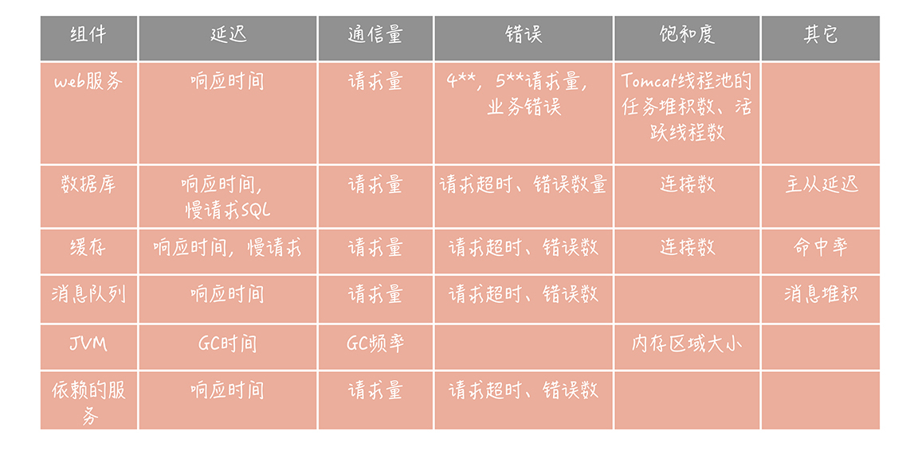

# 30 给系统加上眼睛：服务端监控要怎么做？

你好，我是唐扬。

在一个项目的生命周期里，运行维护占据着很大的比重，在重要性上，它几乎与项目研发并驾齐驱。而在系统运维过程中，能够及时地发现问题并解决问题，是每一个团队的本职工作。所以，你的垂直电商系统在搭建之初，运维团队肯定完成了对于机器 CPU、内存、磁盘、网络等基础监控，期望能在出现问题时，及时地发现并且处理。你本以为万事大吉，却没想到系统在运行过程中，频频得到用户的投诉，原因是：

使用的数据库主从延迟变长，导致业务功能上出现了问题；

接口的响应时间变长，用户反馈商品页面出现空白页；

系统中出现大量错误，影响了用户的正常使用。

这些问题，你本应该及时发现并处理的。但现实是，你只能被动地在问题被用户反馈后，手忙脚乱地修复。这时，你的团队才意识到，要想快速地发现和定位业务系统中出现的问题，必须搭建一套完善的服务端监控体系。正所谓“道路千万条，监控第一条，监控不到位，领导两行泪”。不过，在搭建的过程中，你的团队又陷入了困境：

首先，监控的指标要如何选择呢？

采集这些指标可以有哪些方法和途径呢？

指标采集到之后又要如何处理和展示呢？

这些问题，一环扣一环，关乎着系统的稳定性和可用性，而本节课，我就带你解决这些问题，搭建一套服务端监控体系。

## 监控指标如何选择

你在搭建监控系统时，所面临的第一个问题就是，选择什么样的监控指标，也就是监控什么。有些同学在给一个新的系统，设定监控指标的时候，会比较迷茫，不知道从哪方面入手。其实，有一些成熟的理论和套路，你可以直接拿来使用。比如，谷歌针对分布式系统监控的经验总结，四个黄金信号（Four Golden Signals）。它指的是，在服务层面一般需要监控四个指标，**分别是延迟，通信量、错误和饱和度。**延迟指的是请求的响应时间。比如，接口的响应时间、访问数据库和缓存的响应时间。

通信量可以理解为吞吐量，也就是单位时间内，请求量的大小。比如，访问第三方服务的请求量，访问消息队列的请求量。

错误表示当前系统发生的错误数量。**这里需要注意的是，** 我们需要监控的错误既有显示的，比如在监控 Web 服务时，出现 4 ** 和 5 ** 的响应码；也有隐示的，比如，Web 服务虽然返回的响应码是 200，但是却发生了一些和业务相关的错误（出现了数组越界的异常或者空指针异常等），这些都是错误的范畴。

饱和度指的是服务或者资源到达上限的程度（也可以说是服务或者资源的利用率），比如说 CPU 的使用率，内存使用率，磁盘使用率，缓存数据库的连接数等等。

这四个黄金信号提供了通用的监控指标，**除此之外，你还可以借鉴 RED 指标体系。**这个体系，是四个黄金信号中衍生出来的，其中，R 代表请求量（Request rate），E 代表错误（Error），D 代表响应时间（Duration），少了饱和度的指标。你可以把它当作一种简化版的通用监控指标体系。

当然，一些组件或者服务还有独特的指标，这些指标也是需要你特殊关注的。比如，课程中提到的数据库主从延迟数据、消息队列的堆积情况、缓存的命中率等等。我把高并发系统中常见组件的监控指标，整理成了一张表格，其中没有包含诸如 CPU、内存、网络、磁盘等基础监控指标，只是业务上监控指标，主要方便你在实际工作中参考使用。



选择好了监控指标之后，你接下来要考虑的，是如何从组件或者服务中，采集到这些指标，也就是指标数据采集的问题。

## 如何采集数据指标

说到监控指标的采集，我们一般会依据采集数据源的不同，选用不同的采集方式，**总结起来，大概有以下几种类型：**

**首先，**Agent 是一种比较常见的，采集数据指标的方式。

我们通过在数据源的服务器上，部署自研或者开源的 Agent，来收集收据，发送给监控系统，实现数据的采集。在采集数据源上的信息时，Agent 会依据数据源上，提供的一些接口获取数据，**我给你举两个典型的例子。 **比如，你要从 Memcached 服务器上，获取它的性能数据，那么，你就可以在 Agent 中，连接这个 Memcached 服务器，并且发送一个 stats 命令，获取服务器的统计信息。然后，你就可以从返回的信息中，挑选重要的监控指标，发送给监控服务器，形成 Memcached 服务的监控报表。你也可以从这些统计信息中，看出当前 Memcached 服务器，是否存在潜在的问题。下面是我推荐的，一些重要的状态项，** 你可以参考使用。**```
STAT cmd_get 201809037423    // 计算查询的 QPS

```
STAT cmd_set 16174920166     // 计算写入的 QPS
STAT get_hits 175226700643   // 用来计算命中率，命中率 = get_hits/cmd_get
STAT curr_connections 1416   // 当前连接数
STAT bytes 3738857307        // 当前内存占用量
STAT evictions 11008640149   // 当前被 memcached 服务器剔除的 item 数
```

量，如果这个数量过大 (比如例子中的这个数值），那么代表当前 Memcached 容量不足或者 Memcached Slab Class 分配有问题

```
另外，如果你是 Java 的开发者，那么一般使用 Java 语言开发的中间件，或者组件，都可以通过 JMX 获取统计或者监控信息。比如，在19 讲中，我提到可以使用 JMX，监控 Kafka 队列的堆积数，再比如，你也可以通过 JMX 监控 JVM 内存信息和 GC 相关的信息。
另一种很重要的数据获取方式，** 是在代码中埋点。 **这个方式与 Agent 的不同之处在于，Agent 主要收集的是组件服务端的信息，而埋点则是从客户端的角度，来描述所使用的组件，和服务的性能和可用性。** 那么埋点的方式怎么选择呢？**
你可以使用25 讲分布式 Trace 组件中，提到的面向切面编程的方式；也可以在资源客户端中，直接计算调用资源或者服务的耗时、调用量、慢请求数，并且发送给监控服务器。
**这里你需要注意一点，**由于调用缓存、数据库的请求量会比较高，一般会单机也会达到每秒万次，如果不经过任何优化，把每次请求耗时都发送给监控服务器，那么，监控服务器会不堪重负。所以，我们一般会在埋点时，先做一些汇总。比如，每隔 10 秒汇总这 10 秒内，对同一个资源的请求量总和、响应时间分位值、错误数等，然后发送给监控服务器。这样，就可以大大减少发往监控服务器的请求量了。
**最后，**日志也是你监控数据的重要来源之一。
你所熟知的 Tomcat 和 Nginx 的访问日志，都是重要的监控日志。你可以通过开源的日志采集工具，将这些日志中的数据发送给监控服务器。目前，常用的日志采集工具有很多，比如，Apache Flume、Fluentd和Filebeat，你可以选择一种熟悉的使用。比如在我的项目中，我会倾向于使用 Filebeat 来收集监控日志数据。
监控数据的处理和存储
----------
在采集到监控数据之后，你就可以对它们进行处理和存储了，在此之前，我们一般会先用消息队列来承接数据，主要的作用是削峰填谷，防止写入过多的监控数据，让监控服务产生影响。
与此同时，我们一般会部署两个队列处理程序，来消费消息队列中的数据。
一个处理程序接收到数据后，把数据写入到 Elasticsearch，然后通过 Kibana 展示数据，这份数据主要是用来做原始数据的查询；
另一个处理程序是一些流式处理的中间件，比如，Spark、Storm。它们从消息队列里，接收数据后会做一些处理，这些处理包括：
**- 解析数据格式，尤其是日志格式。**从里面提取诸如请求量、响应时间、请求 URL 等数据；
**\- 对数据做一些聚合运算。** 比如，针对 Tomcat 访问日志，可以计算同一个 URL 一段时间之内的请求量、响应时间分位值、非 200 请求量的大小等等。
**- 将数据存储在时间序列数据库中。**这类数据库的特点是，可以对带有时间标签的数据，做更有效的存储，而我们的监控数据恰恰带有时间标签，并且按照时间递增，非常适合存储在时间序列数据库中。目前业界比较常用的时序数据库有 InfluxDB、OpenTSDB、Graphite，各大厂的选择均有不同，你可以选择一种熟悉的来使用。
**\- 最后，** 你就可以通过 Grafana 来连接时序数据库，将监控数据绘制成报表，呈现给开发和运维的同学了。

至此，你和你的团队，也就完成了垂直电商系统，服务端监控系统搭建的全过程。这里我想再多说一点，我们从不同的数据源中采集了很多的指标，最终在监控系统中一般会形成以下几个报表，你在实际的工作中可以参考借鉴：
**1. 访问趋势报表。**这类报表接入的是 Web 服务器，和应用服务器的访问日志，展示了服务整体的访问量、响应时间情况、错误数量、带宽等信息。它主要反映的是，服务的整体运行情况，帮助你来发现问题。
**2\. 性能报表。 **这类报表对接的是资源和依赖服务的埋点数据，展示了被埋点资源的访问量和响应时间情况。它反映了资源的整体运行情况，当你从访问趋势报表发现问题后，可以先从性能报表中，找到究竟是哪一个资源或者服务出现了问题。** 3\. 资源报表。** 这类报表主要对接的是，使用 Agent 采集的，资源的运行情况数据。当你从性能报表中，发现某一个资源出现了问题，那么就可以进一步从这个报表中，发现资源究竟出现了什么问题，是连接数异常增高，还是缓存命中率下降。这样可以进一步帮你分析问题的根源，找到解决问题的方案。
课程小结
----
本节课，我带你了解了，服务端监控搭建的过程，在这里，你需要了解以下几个重点：
耗时、请求量和错误数是三种最通用的监控指标，不同的组件还有一些特殊的监控指标，你在搭建自己的监控系统的时候可以直接使用；
Agent、埋点和日志是三种最常见的数据采集方式；
访问趋势报表用来展示服务的整体运行情况，性能报表用来分析资源或者依赖的服务是否出现问题，资源报表用来追查资源问题的根本原因。这三个报表共同构成了你的服务端监控体系。
总之，监控系统是你发现问题，排查问题的重要工具，你应该重视它，并且投入足够的精力来不断地完善它。只有这样，才能不断地提高对系统运维的掌控力，降低故障发生的风险。
```
