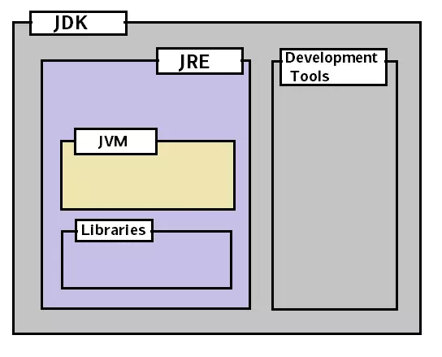
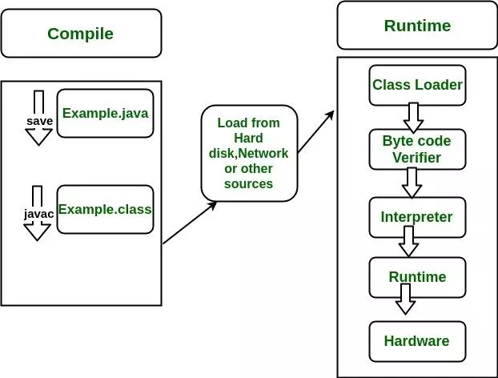
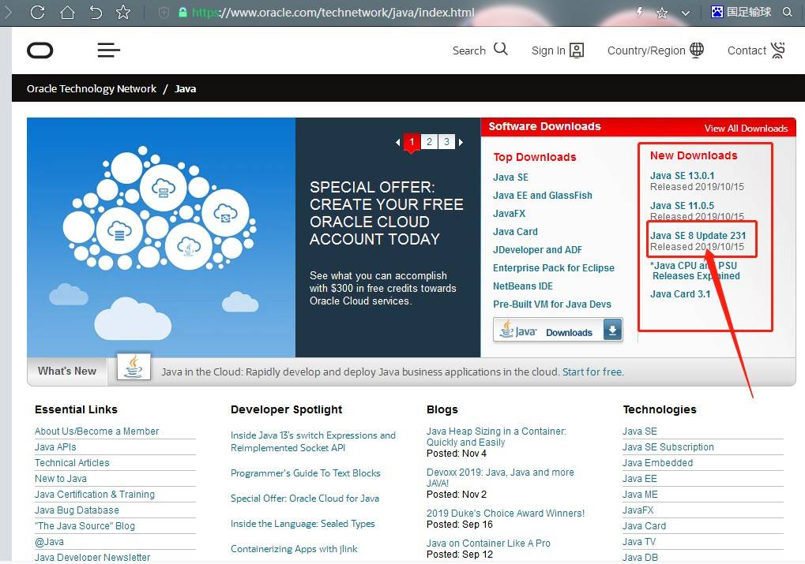
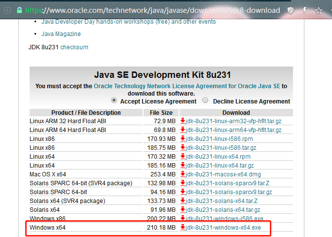
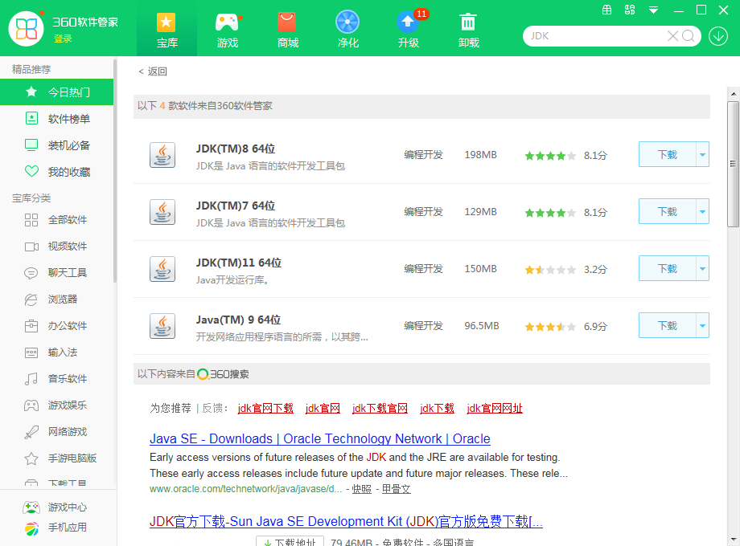

# 02 环境准备：千里之行，始于足下

Java 语言编写代码非常简单，也很容易入门，非常适合开发各种企业级应用和业务系统。一个众所周知的事实是： 用起来越简单的系统， 其背后的原理和实现就越复杂。道理很容易理解， 系统的内部实现考虑了各种极端的情况，对用户屏蔽了各种复杂性。作为支撑庞大的 Java 生态系统的基石， JVM 内部实现是非常复杂的。据统计，OpenJDK 的实现代码已经超过 1000 万行。

JVM 难不难? 自然是 “难者不会，会者不难”。万丈高楼平地起， 没有掌握一定的基础知识， 学过的各种原理，了解相关技巧，也就会出现转眼即忘，书到用时方恨少的情况。

掌握好基础知识，学而时习之，经常使用各种工具并熟练运用，自然就能深入掌握一门技能。理论结合实践，掌握 JVM 相关知识，熟练各种工具的使用，是 Java 工程师职业进阶中不可或缺的。学就要学会理论，掌握实现原理。 理解了 Java 标准平台的 JVM，举一反三，稍微变通一下，碰到 Android 的 ART， Go 的虚拟机，以及各种语言的垃圾收集实现，都会很容易理解。

### 1.1 JDK、JRE、JVM 的关系

**JDK** JDK（Java Development Kit） 是用于开发 Java 应用程序的软件开发工具集合，包括了 Java 运行时的环境（JRE）、解释器（Java）、编译器（javac）、Java 归档（jar）、文档生成器（Javadoc）等工具。简单的说我们要开发 Java 程序，就需要安装某个版本的 JDK 工具包。 **JRE** JRE（Java Runtime Enviroment ）提供 Java 应用程序执行时所需的环境，由 Java 虚拟机（JVM）、核心类、支持文件等组成。简单的说，我们要是想在某个机器上运行 Java 程序，可以安装 JDK，也可以只安装 JRE，后者体积比较小。 **JVM**

Java Virtual Machine（Java 虚拟机）有三层含义，分别是：

- JVM规范要求；
- 满足 JVM 规范要求的一种具体实现（一种计算机程序）；
- 一个 JVM 运行实例，在命令提示符下编写 Java 命令以运行 Java 类时，都会创建一个 JVM 实例，我们下面如果只记到 JVM 则指的是这个含义；如果我们带上了某种 JVM 的名称，比如说是 Zing JVM，则表示上面第二种含义。

**JDK 与 JRE、JVM 之间的关系**

就范围来说，JDK > JRE > JVM：

- JDK = JRE + 开发工具
- JRE = JVM + 类库



三者在开发运行 Java 程序时的交互关系：

简单的说，就是通过 JDK 开发的程序，编译以后，可以打包分发给其他装有 JRE 的机器上去运行。而运行的程序，则是通过 Java 命令启动的一个 JVM 实例，代码逻辑的执行都运行在这个 JVM 实例上。



Java 程序的开发运行过程为：

我们利用 JDK （调用 Java API）开发 Java 程序，编译成字节码或者打包程序。然后可以用 JRE 则启动一个 JVM 实例，加载、验证、执行 Java 字节码以及依赖库，运行 Java 程序。而 JVM 将程序和依赖库的 Java 字节码解析并变成本地代码执行，产生结果。

### 1.2 JDK 的发展过程与版本变迁

说了这么多 JDK 相关的概念，我们再来看一下 JDK 的发展过程。 **JDK 版本列表** JDK版本

发布时间

代号

备注

1

1996年1月23日

Oak(橡树)

初代版本，伟大的一个里程碑，但是是纯解释运行，使用JIT，性能比较差，速度慢

1.1

1997年2月19日

Sparkler(宝石)

JDBC、支持内部类、RMI、反射等等

1.2

1998年12月8日

Playground(操场)

集合框架、JIT等等

1.3

2000年5月8日

Kestrel(红隼)

对Java的各个方面都做了大量优化和增强

1.4

2004年2月6日

Merlin(隼)

XML处理、支持IPV6、正则表达式，引入nio和CMS垃圾回收器

5

2004年9月30日

Tiger(老虎)

泛型、增强for语句、自动拆装箱、可变参数、静态导入、注解

6

2006年12月11日

Mustang(野马)

支持脚本语言、JDBC4.0

7

2011年7月28日

Dolphin(海豚)

switch支持String类型、泛型推断、nio 2.0开发包、数值类型可以用二进制字符串表示

8

2014年3月18日

Spider(蜘蛛)

Lambda 表达式、接口默认方法、Stream API、新的日期API、Nashorn引擎 jjs，引入G1垃圾回收器

9

2017年9月22日

Modularity (模块化)

模块系统、HTTP 2 客户端、多版本兼容 JAR 包、私有接口方法、改进Stream API、响应式流（Reactive Streams) API

10

2018年3月21日

引入关键字 var 局部变量类型推断、统一的垃圾回收接口

11

2018年9月25日

HTTP客户端(标准)、无操作垃圾收集器，支持ZGC垃圾回收器，首个LTS版本

12

2019年3月19日

新增一个名为 Shenandoah 的垃圾回收器、扩展switch语句的功能、改进 G1 垃圾回收器

13

2019年9月17日

改进了CDS内存共享，ZGC归还系统内存，SocketAPI和switch语句以及文本块表示

14

开发中

继续对ZGC、G1改进，标记 ParallelScavenge + SerialOld组合为过时的 ，移除CMS垃圾回收器 **Java 大事记**

1. 1995 年 5 月 23 日，Java 语言诞生
1. 1996 年 1 月，第一个 JDK-JDK1.0 诞生
1. 1997 年 2 月 18 日，JDK1.1 发布
1. 1997 年 4 月 2 日，JavaOne 会议召开，参与者逾一万人，创当时全球同类会议规模之纪录
1. 1997 年 9 月，Java 开发者社区成员超过十万
1. 1998 年 2 月，JDK1.1 被下载超过 200 万次
1. 1998 年 12 月 8 日，JAVA2 企业平台 J2EE 发布
1. 1999 年 6 月，Sun 公司发布 Java 的三个版本：标准版、企业版和微型版（J2SE、J2EE、J2ME）
1. 2000 年 5 月 8 日，JDK1.3 发布
1. 2000 年 5 月 29 日，JDK1.4 发布
1. 2002 年 2 月 26 日，J2SE1.4 发布，自此 Java 的计算能力有了大幅提升
1. 2004 年 9 月 30 日，J2SE1.5 发布，是 Java 语言的发展史上的又一里程碑事件，Java 并发包 JUC 也是这个版本引入的。为了表示这个版本的重要性，J2SE1.5 更名为 J2SE5.0
1. 2005 年 6 月，发布 Java SE 6，这也是一个比较长期使用的版本
1. 2006 年 11 月 13 日，Sun 公司宣布 Java 全线采纳 GNU General Public License Version 2，从而公开了 Java 的源代码
1. 2009 年 04 月 20 日，Oracle 公司 74 亿美元收购 Sun。取得 Java 的版权
1. 2011 年 7 月 28 日，Oracle 公司发布 Java SE7.0 的正式版
1. 2014 年 3 月 18 日，Oracle 公司发布 Java SE 8，这个版本是目前最广泛使用的版本
1. 2017 年 9 月 22 日，JDK9 发布，API 有了较大的调整，添加了对 WebSocket 和 HTTP/2 的支持，此后每半年发布一个大版本
1. 2018 年 3 月 21 日，JDK10 发布，最大的变化就是引入了 var，如果你熟悉 C# 或 JavaScript/NodeJS 就会知道它的作用
1. 2018 年 9 月 25 日，JDK11 发布，引入 ZGC，这个也是第一个公布的长期维护版本 LTS
1. 2019 年 3 月 19 日，JDK12 发布，引入毫秒级停顿的 Shenandoah GC
1. 2019 年 9 月 17 日，JDK13 发布，改进了 CDS 内存共享，ZGC 归还系统内

我们可以看到 JDK 发展的越来越多，越来越复杂，特别是被 Oracle 收购以后，近 2 年以来版本号快速膨胀，GC 算法也有了更快速的发展。目前最新的 JDK 是 JDK13，同时 JDK14 正在开发中，预计 2020 年 3 月份发布。很多朋友直呼，“不要再升级了，还在用 JDK8，已经学不过来了”。但是正是由于 Java 不断的发展和改进，才会持续具有生命力。

> 常规的 JDK，一般指 OpenJDK 或者 Oracle JDK，当然 Oracle 还有一个新的 JVM 叫 GraalVM，也非常有意思。除了 Sun/Oracle 的 JDK 以外，原 BEA 公司（已被 Oracle 收购）的 JRockit，IBM 公司的 J9，Azul 公司的 Zing JVM，阿里巴巴公司的分支版本 DragonWell 等等。

### 1.3 安装 JDK

JDK 通常是从 [Oracle 官网](https://www.oracle.com/)下载， 打开页面翻到底部，找 `Java for Developers` 或者 `Developers`, 进入 [Java 相应的页面](https://www.oracle.com/technetwork/java/index.html) 或者 [Java SE 相应的页面](https://www.oracle.com/technetwork/java/javase/overview/index.html), 查找 Download, 接受许可协议，下载对应的 x64 版本即可。 

建议安装比较新的 JDK8 版本， 如 [JDK8u231](https://www.oracle.com/technetwork/java/javase/downloads/jdk8-downloads-2133151.html)。 

> 注意：从 Oracle 官方安装 JDK 需要注册和登录 Oracle 账号。现在流行将下载链接放到页面底部，很多工具都这样。当前推荐下载 JDK8。 今后 JDK11 可能成为主流版本，因为 Java11 是 LTS 长期支持版本，但可能还需要一些时间才会普及，而且 JDK11 的文件目录结构与之前不同, 很多工具可能不兼容其 JDK 文件的目录结构。

有的操作系统提供了自动安装工具，直接使用也可以，比如 yum, brew, apt 等等。例如在 MacBook 上，执行：

> brew cask install java8

而使用如下命令，会默认安装最新的 JDK13：

> brew cask install java

如果电脑上有 360 软件管家或者腾讯软件管家，也可以直接搜索和下载安装 JDK（版本不是最新的，但不用注册登录 Oracle 账号）： 

如果网络不好，可以从我的百度网盘共享获取：

> [https://pan.baidu.com/s/16WmRDZSiBD7a2PMjhSiGJw](https://pan.baidu.com/s/16WmRDZSiBD7a2PMjhSiGJw)
>
> 提取码: e77s

### 1.4 设置环境变量

如果找不到命令，需要设置环境变量： `JAVA_HOME` 和 `PATH` 。

> `JAVA_HOME` 环境变量表示 JDK 的安装目录，通过修改 `JAVA_HOME` ，可以快速切换 JDK 版本 。很多工具依赖此环境变量。
>
> 另外, 建议不要设置 `CLASS_PATH` 环境变量，新手没必要设置，容易造成一些困扰。

Windows 系统, 系统属性 - 高级 - 设置系统环境变量。 如果没权限也可以只设置用户环境变量。

Linux 和 MacOSX 系统, 需要配置脚本。 例如:

> $ `cat ~/.bash_profile`

```shell
# JAVA ENV
export JAVA_HOME=/Library/Java/JavaVirtualMachines/jdk1.8.0_162.jdk/Contents/Home
export PATH=$PATH:$JAVA_HOME/bin
```

让环境配置立即生效:

> $ `source ~/.bash_profile`

查看环境变量:

```shell
echo $PATH
echo $JAVA_HOME
```

一般来说，`.bash_profile` 之类的脚本只用于设置环境变量。 不设置随机器自启动的程序。

如果不知道自动安装/别人安装的 JDK 在哪个目录怎么办?

> 最简单/最麻烦的查询方式是询问相关人员。

查找的方式很多，比如，可以使用 `which`， `whereis`， `ls -l` 跟踪软连接, 或者 `find` 命令全局查找(可能需要 sudo 权限), 例如:

```shell
jps -v
whereis javac
ls -l /usr/bin/javac
find / -name javac
```

找到满足 `$JAVA_HOME/bin/javac` 的路径即可。

Windows 系统，安装在哪就是哪，默认在`C:\Program Files (x86)\Java`下。通过任务管理器也可以查看某个程序的路径，注意 `JAVA_HOME` 不可能是 `C:\Windows\System32` 目录。

然后我们就可以在 JDK 安装路径下看到很多 JVM 工具，例如在 Mac 上：

 在后面的章节里，我们会详细解决其中一些工具的用法，以及怎么用它们来分析 JVM 情况。

### 1.4 验证 JDK 安装完成

安装完成后，Java 环境一般来说就可以使用了。 验证的脚本命令为:

```shell
java -version
```

可以看到输出类似于以下内容，既证明成功完成安装：

> java version "1.8.0_65" Java(TM) SE Runtime Environment (build 1.8.0_65-b17) Java HotSpot(TM) 64-Bit Server VM (build 25.65-b01, mixed mode)

然后我们就可以写个最简单的 Java 程序了，新建一个文本文件，输入以下内容：

```
public class Hello {
    public static void main(String[] args){
        System.out.println("Hello, JVM!");
    }
}
```

然后把文件名改成`Hello.java`，在命令行下执行：

> $ javac Hello.java

然后使用如下命令运行它：

> $ java Hello Hello, JVM!

即证明运行成功，我们的 JDK 环境可以用来开发了。

### 参考材料

1. <https://www.jianshu.com/p/7b99bd132470>
1. <https://blog.csdn.net/Phoenix%5C_smf/article/details/79709592>
1. <https://www.iteye.com/blog/dasheng-727156>
1. <https://blog.csdn.net/lc11535/article/details/99776597>
1. <https://blog.csdn.net/damin112/article/details/84634041>
1. <https://blog.csdn.net/KamRoseLee/article/details/79440425>
1. <https://blog.csdn.net/j3T9Z7H/article/details/94592958>
1. <http://openjdk.java.net/projects/jdk/>
1. <http://openjdk.java.net/projects/jdk/13/>
