# 13 常见的 GC 算法（GC 的背景与原理）

GC 是英文词汇 Garbage Collection 的缩写，中文一般直译为“垃圾收集”。当然有时候为了让文字更流畅，也会说“垃圾回收”。一般认为“垃圾回收”和“垃圾收集”是同样的意思。此外，GC 也有“垃圾收集器”的意思，英文表述为 Garbage Collector。本节我们就来详细讲解常用的 GC 算法。

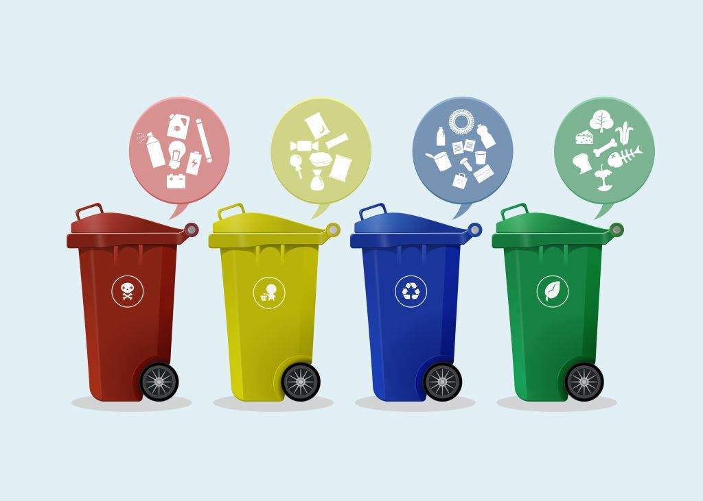

### 闲话 GC

假如我们做生意，需要仓库来存放物资。如果所有仓库都需要公司自建，那成本就太高了，一般人玩不转，而且效率也不高，成本控制不好就很难赚到钱。所以现代社会就有了一种共享精神和租赁意识，大幅度提高了整个社会的资源利用率。

比如说一条供应链，A 公司转给 B 公司，B 公司转给 C 公司，那么每个公司自己的加工车间和私有仓库，就类似于线程空间，工厂内部会有相应的流水线。因为每个公司/业务员的精力有限，这个私有空间不可能无限大。

公共的仓库，就类似于堆内存，相比私有空间要大很多，而且很方便别的公司来存取物资，或者可以直接存取，或者加锁需要钥匙才能存取。 很明显，这个体系需要进行有效的管理，整个仓储系统才能良好运转。不再使用的仓库需要去打个招呼说我们不用了，要不然公司需要一直付费，实际上是浪费的公司的钱，也在浪费社会的资源。这就类似于内存释放。

> 也可以使用创客空间的共享工位做类比，工位（内存）是有限的且固定的。大家都可以来租赁（申请内存），拿到所有权以后就可以使用工位（内存）。使用结束后归还给管理方（系统），然后其他人就可以来租赁和使用。

本节课程先简要介绍 GC 相关的基础知识，然后再介绍常见的三种垃圾收集器实现（Parallel/CMS/G1）。

#### **手动内存管理** 有之前 C/C++ 编程经验、或者了解计算机原理的同学，会很容易理解“内存分配”和“内存释放”这两个概念

计算机程序在执行过程中，需要有地方来存放输入参数、中间变量，以及运算结果。通过前面的课程学习，我们知道这些参数都会存放到栈内存之中。

但如果系统业务处理代码中现在就需要使用内存，例如场景：

> 比如说，我一个销售员，负责跟其他公司谈业务，合同签订之后还得盯着，决定什么时候去把仓库退了。在使用 C/C++ 编程时就是这种情况，我们称之为”手动内存管理”。
>
> 公司规模很小，业务简单时，这种方式很灵活，业务员的权力很大。但如果公司业务规模扩大，业务变得复杂之后，这种方式的弊端就会显露出来。因为业务员也很难决定什么时候去退仓库，不退呢可能会浪费资源，退了呢可能下游的某个公司还要用呢，那样容易被投诉。
>
> 所以 C++ 程序员很爽，就像上帝之手，一切尽在掌握之中。但是使用 C++ 开发业务的公司，其他部门就不一定很爽了。

这种方式在计算机中称为“手动内存管理”。

弊端就是：经手处理过仓库的人多了，很可能就不记得是不是这个仓库需要归还还是已经归还过了，就会导致仓库的管理混乱，使用仓库的多方抢仓库而发生冲突。

#### **引用计数法**

然后老板们合计了一下，咱还是成立一个部门专门来管理仓库吧。谁要用就向仓库部门申请，至于后续什么时候释放就由仓库自己进行管理，业务员就不用操心了。

GC 垃圾收集器就像这个仓库部门，负责分配内存，负责追踪这些内存的使用情况，并在适当的时候进行释放。

于是仓库部门就建立起来，专门管理这些仓库。怎么管理呢？

先是想了一个办法，叫做“引用计数法”。有人办业务需要来申请仓库，就找个计数器记下次数 1，后续哪个业务用到呢都需要登记一下，继续加 1，每个业务办完计数器就减一。如果一个仓库（对象使用的内存）的计数到降了 0，就说明可以人使用这个仓库了，我们就可以随时在方便的时候去归还/释放这个仓库。（需要注意：一般不是一个仓库到 0 了就立即释放，出于效率考虑，系统总是会等一批仓库一起处理，这样更加高效。）

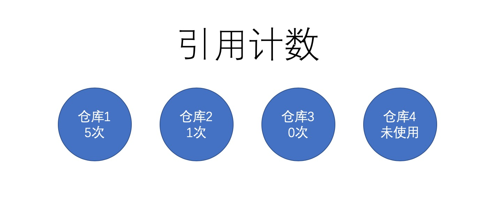

但是呢，如果业务变得更复杂。仓库之间需要协同工作，有了依赖关系之后。

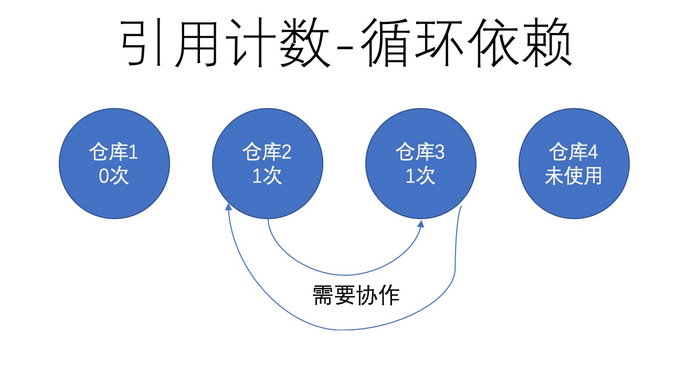

这时候单纯的引用计数就会出问题，循环依赖的仓库/对象没办法回收，就像数据库的死锁一样让人讨厌，你没法让它自己变成 0。

这种情况在计算机中叫做“内存泄漏”，该释放的没释放，该回收的没回收。

如果依赖关系更复杂，计算机的内存资源很可能用满，或者说不够用，内存不够用则称为“内存溢出”。

这样我们知道了引用计数法有一些缺陷，有没有办法解决呢？俗话说办法总比困难多，我找个人专门来排查循环计数行了吧，一个不够就两个……但如果仓库成千上万，或者上亿呢？还是能解决的，最多不就是慢点嘛。

像 Perl、Python 和 PHP 等平台/语言使用的就是引用计数法（当然也都做了一定的优化，一般使用不用太担心，而且每个语言有自己的适用场景，专门干好自己的事就是好语言）。

- 第一代自动垃圾收集算法，使用的是引用计数（reference counting）。针对每个对象，只需要记住被引用的次数，当引用计数变为 0 时，这个对象就可以被安全地回收（reclaimed）了。著名的示例是 C++ 的共享指针（shared pointers）；
- 第二代的垃圾收集算法，被称为“引用追踪（reference tracing）”，JVM 使用的各种垃圾收集算法都是基于引用追踪方式的算法。

下面我们一起来看看 JVM 中使用的垃圾收集方法。

### 标记清除算法（Mark and Sweep）

前面我们讲解了引用计数里需要查找所有的对象计数和对象之间的引用关系。那么如何来查找所有对象，怎么来做标记呢？本节主要讲解这个过程。

为了遍历所有对象，JVM 明确定义了什么是对象的可达性（reachability）。

有一类很明确很具体的对象，称为 **垃圾收集根元素** （Garbage Collection Roots），包括：

- 局部变量（Local variables）
- 活动线程（Active threads）
- 静态域（Static fields）
- JNI 引用（JNI references）
- 其他对象（稍后介绍）

JVM 使用 **标记—清除算法** （Mark and Sweep algorithm），来跟踪所有的可达对象（即存活对象），确保所有不可达对象（non-reachable objects）占用的内存都能被重用。其中包含两步：

- **Marking** （标记）：遍历所有的可达对象，并在本地内存（native）中分门别类记下。
- **Sweeping** （清除）：这一步保证了，不可达对象所占用的内存，在之后进行内存分配时可以重用。

JVM 中包含了多种 GC 算法，如 Parallel Scavenge（并行清除），Parallel Mark+Copy（并行标记 + 复制）以及 CMS，他们在实现上略有不同，但理论上都采用了以上两个步骤。

标记清除算法最重要的优势，就是不再因为循环引用而导致内存泄露： **标记—清除** （Mark and Sweep）是最经典的垃圾收集算法。将理论用于生产实践时，会有很多需要优化调整的地方，以适应具体环境。后面我们会通过一个简单的例子，看看如何才能保证 JVM 能安全持续地分配对象。

而这种处理方式不好的地方在于：垃圾收集过程中，需要暂停应用程序的所有线程。假如不暂停，则对象间的引用关系会一直不停地发生变化，那样就没法进行统计了。这种情况叫做 **STW 停顿** （ **Stop The World pause** ，全线暂停），让应用程序暂时停止，让 JVM 进行内存清理工作。如果把 JVM 里的环境看做一个世界，就好像我们经常在电影里看到的全世界时间静止了一样。有很多原因会触发 STW 停顿，其中垃圾收集是最主要的原因。

### 碎片整理

每次执行清除（Sweeping），JVM 都必须保证不可达对象占用的内存能被回收重用。这时候，就像是摆满棋子的围棋盘上，一部分位置上棋子被拿掉而产生了一些零散的空位置。但这（最终）有可能会产生内存碎片（类似于磁盘碎片），进而引发两个问题：

- 写入操作越来越耗时，因为寻找一块足够大的空闲内存会变得困难（棋盘上没有一整片的空地方）；
- 在创建新对象时，JVM 在连续的块中分配内存。如果碎片问题很严重，直至没有空闲片段能存放下新创建的对象，就会发生内存分配错误（allocation error）。

要避免这类问题，JVM 必须确保碎片问题不失控。因此在垃圾收集过程中，不仅仅是标记和清除，还需要执行“内存碎片整理”过程。这个过程让所有可达对象（reachable objects）依次排列，以消除（或减少）碎片。就像是我们把棋盘上剩余的棋子都聚集到一起，留出来足够大的空余区域。示意图如下所示：

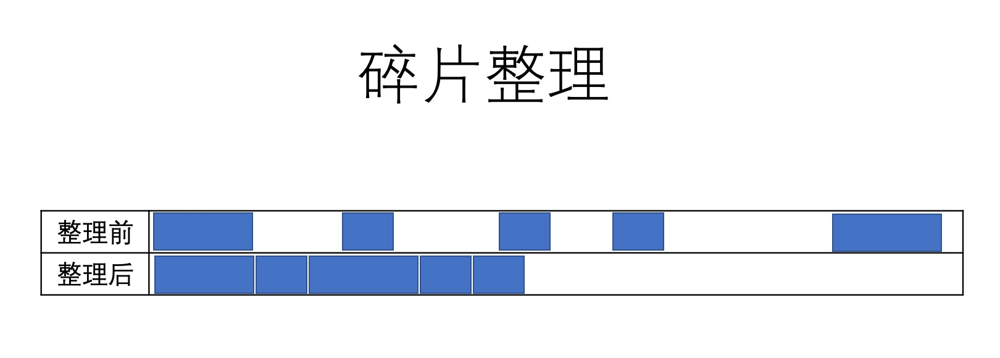

**说明** ：

JVM 中的引用是一个抽象的概念，如果 GC 移动某个对象，就会修改（栈和堆中）所有指向该对象的引用。

移动/拷贝/提升/压缩一般来说是一个 STW 的过程，所以修改对象引用是一个安全的行为。但要更新所有的引用，可能会影响应用程序的性能。

### 分代假设

我们前面提到过，执行垃圾收集需要停止整个应用。很明显，对象越多则收集所有垃圾消耗的时间就越长。但可不可以只处理一个较小的内存区域呢？为了探究这种可能性，研究人员发现，程序中的大多数可回收的内存可归为两类：

- 大部分对象很快就不再使用，生命周期较短；
- 还有一部分不会立即无用，但也不会持续太长时间。

这些观测形成了 **弱代假设** （Weak Generational Hypothesis），即我们可以根据对象的不同特点，把对象进行分类。基于这一假设，VM 中的内存被分为 **年轻代** （Young Generation）和 **老年代** （Old Generation）。老年代有时候也称为 **年老区** （Tenured）。

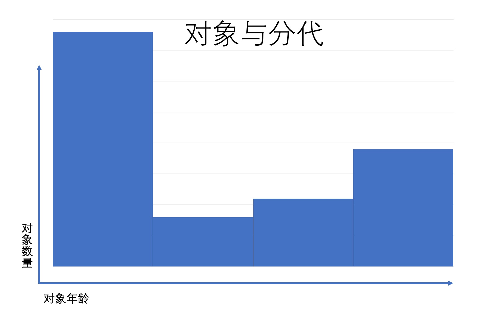

拆分为这样两个可清理的单独区域，我们就可以根据对象的不同特点，允许采用不同的算法来大幅提高 GC 的性能。

天下没有免费的午餐，所以这种方法也不是没有任何问题。例如，在不同分代中的对象可能会互相引用，在收集某一个分代时就会成为“事实上的”GC root。

当然，要着重强调的是，分代假设并不适用于所有程序。因为分代 GC 算法专门针对“要么死得快”、“否则活得长”这类特征的对象来进行优化，此时 JVM 管理那种存活时间半长不长的对象就显得非常尴尬了。

### 内存池划分

堆内存中的内存池划分也是类似的，不太容易理解的地方在于各个内存池中的垃圾收集是如何运行的。请注意：不同的 GC 算法在实现细节上可能会有所不同，但和本章所介绍的相关概念都是一致的。

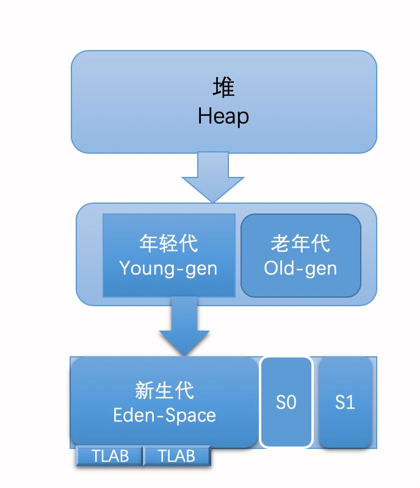

#### **新生代（Eden Space）** Eden Space，也叫伊甸区，是内存中的一个区域，用来分配新创建的对象。通常会有多个线程同时创建多个对象，所以 Eden 区被划分为多个 **线程本地分配缓冲区** （Thread Local Allocation Buffer，简称 TLAB）。通过这种缓冲区划分，大部分对象直接由 JVM 在对应线程的 TLAB 中分配，避免与其他线程的同步操作

如果 TLAB 中没有足够的内存空间，就会在共享 Eden 区（shared Eden space）之中分配。如果共享 Eden 区也没有足够的空间，就会触发一次 年轻代 GC 来释放内存空间。如果 GC 之后 Eden 区依然没有足够的空闲内存区域，则对象就会被分配到老年代空间（Old Generation）。

当 Eden 区进行垃圾收集时，GC 将所有从 root 可达的对象过一遍，并标记为存活对象。

我们曾指出，对象间可能会有跨代的引用，所以需要一种方法来标记从其他分代中指向 Eden 的所有引用。这样做又会遭遇各个分代之间一遍又一遍的引用。JVM 在实现时采用了一些绝招：卡片标记（card-marking）。从本质上讲，JVM 只需要记住 Eden 区中“脏”对象的粗略位置，可能有老年代的对象引用指向这部分区间。更多细节请参考：[Nitsan 的博客](https://psy-lob-saw.blogspot.com/2014/10/the-jvm-write-barrier-card-marking.html)。

标记阶段完成后，Eden 区中所有存活的对象都会被复制到存活区（Survivor spaces）里面。整个 Eden 区就可以被认为是空的，然后就能用来分配新对象。这种方法称为“ **标记—复制** ”（Mark and Copy）：存活的对象被标记，然后复制到一个存活区（注意，是复制，而不是移动）。

> 读者可以考虑，为什么是复制不是移动？

#### **存活区（Survivor Spaces）** Eden 区的旁边是两个 **存活区** （Survivor Spaces），称为 from 空间和 to 空间。需要着重强调的的是，任意时刻总有一个存活区是空的（empty）

空的那个存活区用于在下一次年轻代 GC 时存放收集的对象。年轻代中所有的存活对象（包括 Eden 区和非空的那个“from”存活区）都会被复制到 ”to“ 存活区。GC 过程完成后，“to”区有对象，而“from”区里没有对象。两者的角色进行正好切换，from 变成 to，to 变成 from。

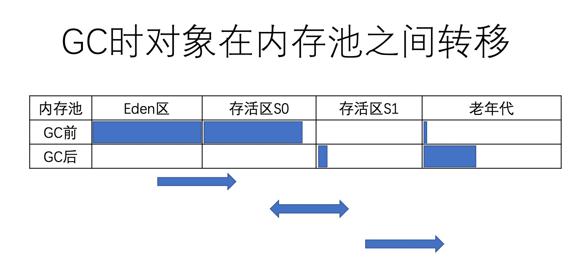

存活的对象会在两个存活区之间复制多次，直到某些对象的存活 时间达到一定的阀值。分代理论假设，存活超过一定时间的对象很可能会继续存活更长时间。

这类“年老”的对象因此被 **提升** （promoted）到老年代。提升的时候，存活区的对象不再是复制到另一个存活区，而是迁移到老年代，并在老年代一直驻留，直到变为不可达对象。

为了确定一个对象是否“足够老”，可以被提升（Promotion）到老年代，GC 模块跟踪记录每个存活区对象存活的次数。每次分代 GC 完成后，存活对象的年龄就会增长。当年龄超过 **提升阈值** （tenuring threshold），就会被提升到老年代区域。

具体的提升阈值由 JVM 动态调整，但也可以用参数 `-XX:+MaxTenuringThreshold` 来指定上限。如果设置 `-XX:+MaxTenuringThreshold=0` ，则 GC 时存活对象不在存活区之间复制，直接提升到老年代。现代 JVM 中这个阈值默认设置为 **15** 个 GC 周期。这也是 HotSpot JVM 中允许的最大值。

如果存活区空间不够存放年轻代中的存活对象，提升（Promotion）也可能更早地进行。

#### **老年代（Old Gen）**

老年代的 GC 实现要复杂得多。老年代内存空间通常会更大，里面的对象是垃圾的概率也更小。

老年代 GC 发生的频率比年轻代小很多。同时，因为预期老年代中的对象大部分是存活的，所以不再使用标记和复制（Mark and Copy）算法。而是采用移动对象的方式来实现最小化内存碎片。老年代空间的清理算法通常是建立在不同的基础上的。原则上，会执行以下这些步骤：

- 通过标志位（marked bit），标记所有通过 GC roots 可达的对象；
- 删除所有不可达对象；
- 整理老年代空间中的内容，方法是将所有的存活对象复制，从老年代空间开始的地方依次存放。

通过上面的描述可知，老年代 GC 必须明确地进行整理，以避免内存碎片过多。

#### **永久代（Perm Gen）** 在 Java 8 之前有一个特殊的空间，称为“永久代”（Permanent Generation）。这是存储元数据（metadata）的地方，比如 class 信息等。此外，这个区域中也保存有其他的数据和信息，包括内部化的字符串（internalized strings）等等

实际上这给 Java 开发者造成了很多麻烦，因为很难去计算这块区域到底需要占用多少内存空间。预测失败导致的结果就是产生 `java.lang.OutOfMemoryError: Permgen space` 这种形式的错误。除非 OutOfMemoryError 确实是内存泄漏导致的，否则就只能增加 permgen 的大小，例如下面的示例，就是设置 perm gen 最大空间为 256 MB：

```
-XX:MaxPermSize=256m
```

#### **元数据区（Metaspace）**

既然估算元数据所需空间那么复杂，Java 8 直接删除了永久代（Permanent Generation），改用 Metaspace。从此以后，Java 中很多杂七杂八的东西都放置到普通的堆内存里。

当然，像类定义（class definitions）之类的信息会被加载到 Metaspace 中。元数据区位于本地内存（native memory），不再影响到普通的 Java 对象。默认情况下，Metaspace 的大小只受限于 Java 进程可用的本地内存。这样程序就不再因为多加载了几个类/JAR 包就导致 `java.lang.OutOfMemoryError: Permgen space.`。注意，这种不受限制的空间也不是没有代价的 —— 如果 Metaspace 失控，则可能会导致严重影响程序性能的内存交换（swapping），或者导致本地内存分配失败。

如果需要避免这种最坏情况，那么可以通过下面这样的方式来限制 Metaspace 的大小，如 256 MB：

```
-XX:MaxMetaspaceSize=256m
```

### 垃圾收集

各种垃圾收集器的实现细节虽然并不相同，但总体而言，垃圾收集器都专注于两件事情：

- 查找所有存活对象
- 抛弃其他的部分，即死对象，不再使用的对象。

第一步，记录（census）所有的存活对象，在垃圾收集中有一个叫做 **标记（Marking）** 的过程专门干这件事。

#### **标记可达对象（Marking Reachable Objects）** 现代 JVM 中所有的 GC 算法，第一步都是找出所有存活的对象。下面的示意图对此做了最好的诠释

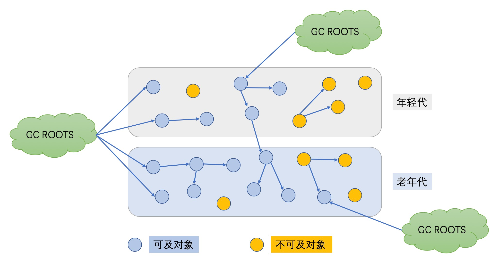

首先，有一些特定的对象被指定为 **Garbage Collection Roots** （GC 根元素）。包括：

- 当前正在执行的方法里的局部变量和输入参数
- 活动线程（Active threads）
- 内存中所有类的静态字段（static field）
- JNI 引用

其次，GC 遍历（traverses）内存中整体的对象关系图（object graph），从 GC 根元素开始扫描，到直接引用，以及其他对象（通过对象的属性域）。所有 GC 访问到的对象都被 **标记（marked）** 为存活对象。

存活对象在上图中用蓝色表示。标记阶段完成后，所有存活对象都被标记了。而其他对象（上图中灰色的数据结构）就是从 GC 根元素不可达的，也就是说程序不能再使用这些不可达的对象（unreachable object）。这样的对象被认为是垃圾，GC 会在接下来的阶段中清除他们。

在标记阶段有几个需要注意的地方：在标记阶段，需要暂停所有应用线程，以遍历所有对象的引用关系。因为不暂停就没法跟踪一直在变化的引用关系图。这种情景叫做 **Stop The World pause** （ **全线停顿** ），而可以安全地暂停线程的点叫做安全点（safe point），然后，JVM 就可以专心执行清理工作。安全点可能有多种因素触发，当前，GC 是触发安全点最常见的原因。

此阶段暂停的时间，与堆内存大小，对象的总数没有直接关系，而是由 **存活对象** （alive objects）的数量来决定。所以增加堆内存的大小并不会直接影响标记阶段占用的时间。 **标记** 阶段完成后，GC 进行下一步操作，删除不可达对象。

#### **删除不可达对象（Removing Unused Objects）** 各种 GC 算法在删除不可达对象时略有不同，但总体可分为三类：清除（sweeping）、整理（compacting）和复制（copying）。\[下一小节\] 将详细讲解这些算法

#### **清除（Sweeping）**  **Mark and Sweep（标记—清除）** 算法的概念非常简单：直接忽略所有的垃圾。也就是说在标记阶段完成后，所有不可达对象占用的内存空间，都被认为是空闲的，因此可以用来分配新对象。

这种算法需要使用 **空闲表（free-list）** ，来记录所有的空闲区域，以及每个区域的大小。维护空闲表增加了对象分配时的开销。此外还存在另一个弱点 —— 明明还有很多空闲内存，却可能没有一个区域的大小能够存放需要分配的对象，从而导致分配失败（在 Java 中就是 [OutOfMemoryError](https://plumbr.eu/outofmemoryerror)）。

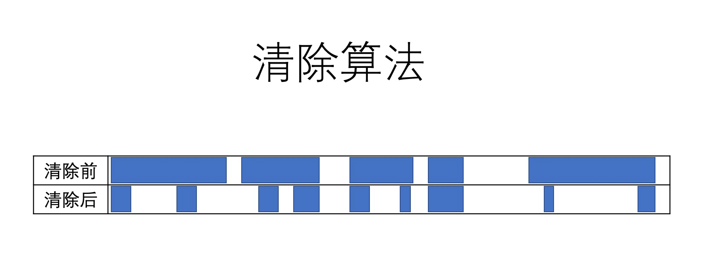

#### **整理（Compacting）**  **标记—清除—整理算法（Mark-Sweep-Compact）** ，将所有被标记的对象（存活对象），迁移到内存空间的起始处，消除了“标记—清除算法”的缺点

相应的缺点就是 GC 暂停时间会增加，因为需要将所有对象复制到另一个地方，然后修改指向这些对象的引用。

此算法的优势也很明显，碎片整理之后，分配新对象就很简单，只需要通过指针碰撞（pointer bumping）即可。使用这种算法，内存空间剩余的容量一直是清楚的，不会再导致内存碎片问题。

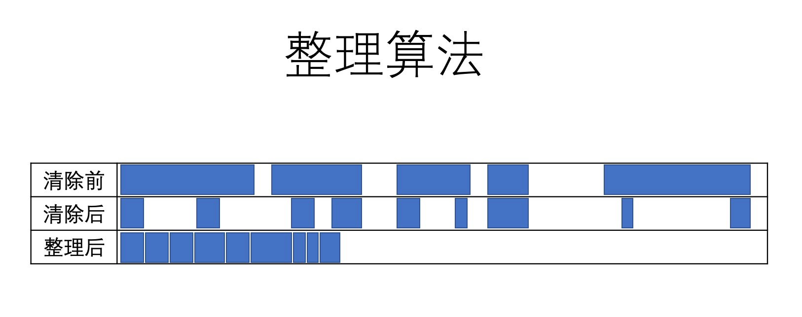

#### **复制（Copying）**  **标记—复制算法（Mark and Copy）** 和“标记—整理算法”（Mark and Compact）十分相似：两者都会移动所有存活的对象。区别在于，“标记—复制算法”是将内存移动到另外一个空间：存活区。“标记—复制方法”的优点在于：标记和复制可以同时进行。缺点则是需要一个额外的内存区间，来存放所有的存活对象。

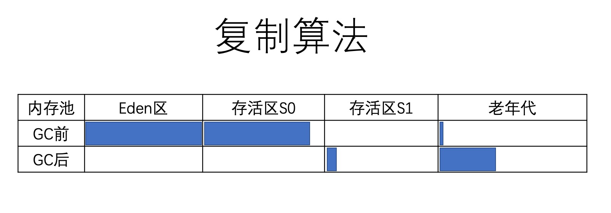

下一小节，我们将介绍 JVM 中具体的 GC 算法和实现。
