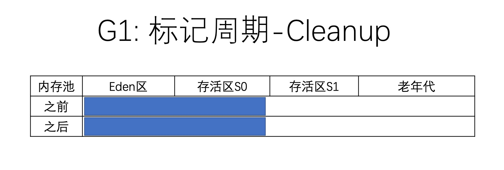
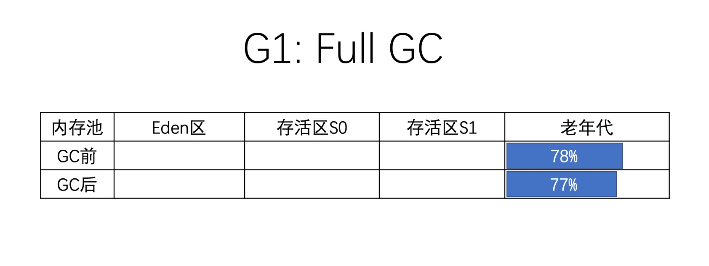
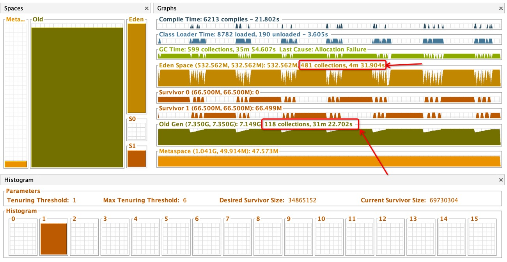

# 20 GC 日志解读与分析（实例分析下篇）

复习一下：G1 的全称是 Garbage-First，意为垃圾优先，哪一块的垃圾最多就优先清理它。

G1 相关的调优参数，可以参考：

> [https://www.oracle.com/technical-resources/articles/java/g1gc.html](https://www.oracle.com/technical-resources/articles/java/g1gc.html)

G1 使用示例：

```shell
# 请注意命令行启动时没有换行
java -XX:+UseG1GC
-Xms512m
-Xmx512m
-Xloggc:gc.demo.log
-XX:+PrintGCDetails
-XX:+PrintGCDateStamps
demo.jvm0204.GCLogAnalysis
```

运行之后，我们看看 G1 的日志长什么样：

```shell
Java HotSpot(TM) 64-Bit Server VM (25.162-b12) ......
Memory: 4k page，physical 16777216k(709304k free)
CommandLine flags: -XX:InitialHeapSize=536870912
  -XX:MaxHeapSize=536870912
  -XX:+PrintGC -XX:+PrintGCDateStamps
  -XX:+PrintGCDetails -XX:+PrintGCTimeStamps
  -XX:+UseCompressedClassPointers -XX:+UseCompressedOops
  -XX:+UseG1GC
2019-12-23T01:45:40.605-0800: 0.181:
 [GC pause (G1 Evacuation Pause) (young)，0.0038577 secs]
   [Parallel Time: 3.1 ms，GC Workers: 8]
   ...... 此处省略多行
   [Code Root Fixup: 0.0 ms]
   [Code Root Purge: 0.0 ms]
   [Clear CT: 0.2 ms]
   [Other: 0.6 ms]
     ...... 此处省略多行
   [Eden: 25.0M(25.0M)->0.0B(25.0M)
    Survivors: 0.0B->4096.0K Heap: 28.2M(512.0M)->9162.7K(512.0M)]
 [Times: user=0.01 sys=0.01，real=0.00 secs]
2019-12-23T01:45:40.881-0800: 0.456:
 [GC pause (G1 Evacuation Pause) (young) (to-space exhausted)，0.0147955 secs]
   [Parallel Time: 12.3 ms，GC Workers: 8]
   ...... 此处省略多行
   [Eden: 298.0M(298.0M)->0.0B(63.0M)
    Survivors: 9216.0K->26.0M
    Heap: 434.1M(512.0M)->344.2M(512.0M)]
 [Times: user=0.02 sys=0.05，real=0.02 secs]
2019-12-23T01:45:41.563-0800: 1.139:
 [GC pause (G1 Evacuation Pause) (mixed)，0.0042371 secs]
   [Parallel Time: 3.7 ms，GC Workers: 8]
   ...... 此处省略多行
   [Eden: 20.0M(20.0M)->0.0B(34.0M) Survivors: 5120.0K->4096.0K Heap: 393.7M(512.0M)->358.5M(512.0M)]
 [Times: user=0.02 sys=0.00，real=0.00 secs]
2019-12-23T01:45:41.568-0800: 1.144: [GC pause (G1 Humongous Allocation) (young) (initial-mark)，0.0012116 secs]
   [Parallel Time: 0.7 ms，GC Workers: 8]
      ...... 此处省略多行
   [Other: 0.4 ms]
      [Humongous Register: 0.1 ms]
      [Humongous Reclaim: 0.0 ms]
   [Eden: 2048.0K(34.0M)->0.0B(33.0M)
    Survivors: 4096.0K->1024.0K
    Heap: 359.5M(512.0M)->359.0M(512.0M)]
 [Times: user=0.01 sys=0.00，real=0.00 secs]
2019-12-23T01:45:41.569-0800: 1.145: [GC concurrent-root-region-scan-start]
2019-12-23T01:45:41.569-0800: 1.145: [GC concurrent-root-region-scan-end，0.0000360 secs]
2019-12-23T01:45:41.569-0800: 1.145: [GC concurrent-mark-start]
2019-12-23T01:45:41.571-0800: 1.146: [GC concurrent-mark-end，0.0015209 secs]
2019-12-23T01:45:41.571-0800: 1.146: [GC remark
  2019-12-23T01:45:41.571-0800: 1.147: [Finalize Marking，0.0002456 secs]
  2019-12-23T01:45:41.571-0800: 1.147: [GC ref-proc，0.0000504 secs]
  2019-12-23T01:45:41.571-0800: 1.147: [Unloading，0.0007297 secs]，
 0.0021658 secs]
 [Times: user=0.01 sys=0.00，real=0.00 secs]
2019-12-23T01:45:41.573-0800: 1.149: [GC cleanup 366M->366M(512M)，0.0006795 secs]
 [Times: user=0.00 sys=0.00，real=0.00 secs]
Heap
 garbage-first heap total 524288K，used 381470K [......
  region size 1024K，12 young (12288K)，1 survivors (1024K)
 Metaspace used 3331K，capacity 4494K，committed 4864K，reserved 1056768K
  class space used 364K，capacity 386K，committed 512K，reserved 1048576K
```

以上是摘录的一部分 GC 日志信息。实际运行我们的示例程序1秒钟，可能会生成上千行的 GC 日志。

### Evacuation Pause：young（纯年轻代模式转移暂停）

当年轻代空间用满后，应用线程会被暂停，年轻代内存块中的存活对象被拷贝到存活区。如果还没有存活区，则任意选择一部分空闲的内存块作为存活区。

拷贝的过程称为转移（Evacuation），这和前面介绍的其他年轻代收集器是一样的工作原理。

转移暂停的日志信息很长，为简单起见，我们去除了一些不重要的信息。在并发阶段之后我们会进行详细的讲解。此外，由于日志记录很多，所以并行阶段和“其他”阶段的日志将拆分为多个部分来进行讲解。

我们从 GC 日志中抽取部分关键信息：

```shell
2019-12-23T01:45:40.605-0800: 0.181:
 [GC pause (G1 Evacuation Pause) (young)，0.0038577 secs]
   [Parallel Time: 3.1 ms，GC Workers: 8]
      ...... worker 线程的详情，下面单独讲解
   [Code Root Fixup: 0.0 ms]
   [Code Root Purge: 0.0 ms]
   [Clear CT: 0.2 ms]
   [Other: 0.6 ms]
      ...... 其他琐碎任务，下面单独讲解
   [Eden: 25.0M(25.0M)->0.0B(25.0M)
    Survivors: 0.0B->4096.0K Heap: 28.2M(512.0M)->9162.7K(512.0M)]
 [Times: user=0.01 sys=0.01，real=0.00 secs]
```

大家一起来分析：

1. `[GC pause (G1 Evacuation Pause) (young)，0.0038577 secs]`：G1 转移暂停，纯年轻代模式；只清理年轻代空间。这次暂停在 JVM 启动之后 181ms 开始，持续的系统时间为 0.0038577 秒，也就是 3.8ms。
1. `[Parallel Time: 3.1 ms，GC Workers: 8]`：表明后面的活动由 8 个 Worker 线程并行执行，消耗时间为 3.1 毫秒（real time）；`worker` 是一种模式，类似于一个老板指挥多个工人干活。
1. `…...`：为阅读方便，省略了部分内容，可以参考前面的日志，下面紧接着也会讲解。
1. `[Code Root Fixup: 0.0 ms]`：释放用于管理并行活动的内部数据，一般都接近于零。这个过程是串行执行的。
1. `[Code Root Purge: 0.0 ms]`：清理其他部分数据，也是非常快的，如非必要基本上等于零。也是串行执行的过程。
1. `[Other: 0.6 ms]`：其他活动消耗的时间，其中大部分是并行执行的。
1. `…`：请参考后文。
1. `[Eden: 25.0M(25.0M)->0.0B(25.0M)`：暂停之前和暂停之后，Eden 区的使用量/总容量。
1. `Survivors: 0.0B->4096.0K`：GC 暂停前后，存活区的使用量。`Heap: 28.2M(512.0M)->9162.7K(512.0M)]`：暂停前后，整个堆内存的使用量与总容量。
1. `[Times: user=0.01 sys=0.01，real=0.00 secs]`：GC 事件的持续时间。

说明：系统时间（wall clock time/elapsed time），是指一段程序从运行到终止，系统时钟走过的时间。一般系统时间都要比 CPU 时间略微长一点。

最繁重的 GC 任务由多个专用的 worker 线程来执行，下面的日志描述了它们的行为：

```shell
[Parallel Time: 3.1 ms，GC Workers: 8]
 [GC Worker Start (ms): Min: 180.6，Avg: 180.6，Max: 180.7，Diff: 0.1]
 [Ext Root Scanning (ms): Min: 0.1，Avg: 0.3，Max: 0.6，Diff: 0.4，Sum: 2.1]
 [Update RS (ms): Min: 0.0，Avg: 0.0，Max: 0.0，Diff: 0.0，Sum: 0.0]
   [Processed Buffers: Min: 0，Avg: 0.0，Max: 0，Diff: 0，Sum: 0]
 [Scan RS (ms): Min: 0.0，Avg: 0.0，Max: 0.0，Diff: 0.0，Sum: 0.0]
 [Code Root Scanning (ms): Min: 0.0，Avg: 0.0，Max: 0.1，Diff: 0.1，Sum: 0.1]
 [Object Copy (ms): Min: 2.2，Avg: 2.5，Max: 2.7，Diff: 0.4，Sum: 19.8]
 [Termination (ms): Min: 0.0，Avg: 0.2，Max: 0.4，Diff: 0.4，Sum: 1.5]
   [Termination Attempts: Min: 1，Avg: 1.0，Max: 1，Diff: 0，Sum: 8]
 [GC Worker Other (ms): Min: 0.0，Avg: 0.0，Max: 0.0，Diff: 0.0，Sum: 0.1]
 [GC Worker Total (ms): Min: 2.9，Avg: 3.0，Max: 3.0，Diff: 0.1，Sum: 23.7]
 [GC Worker End (ms): Min: 183.6，Avg: 183.6，Max: 183.6，Diff: 0.0]
```

Worker 线程的日志信息解读：

1. `[Parallel Time: 3.1 ms，GC Workers: 8]`：前面介绍过，这表明下列活动由 8 个线程并行执行，消耗的时间为 3.1 毫秒（real time）。
1. `GC Worker Start (ms)`：GC 的 worker 线程开始启动时，相对于 pause 开始时间的毫秒间隔。如果 Min 和 Max 差别很大，则表明本机其他进程所使用的线程数量过多，挤占了 GC 的可用 CPU 时间。
1. `Ext Root Scanning (ms)`：用了多长时间来扫描堆外内存（non-heap）的 GC ROOT，如 classloaders、JNI 引用、JVM 系统 ROOT 等。后面显示了运行时间，“Sum”指的是 CPU 时间。
1. `Update RS`、`Processed Buffers`、`Scan RS` 这三部分也是类似的，`RS` 是 `Remembered Set` 的缩写，可以参考前面章节。
1. `Code Root Scanning (ms)`：扫描实际代码中的 root 用了多长时间：例如线程栈中的局部变量。
1. `Object Copy (ms)`：用了多长时间来拷贝回收集中的存活对象。
1. `Termination (ms)`：GC 的 worker 线程用了多长时间来确保自身可以安全地停止，在这段时间内什么也不做，完成后 GC 线程就终止运行了，所以叫终止等待时间。
1. `Termination Attempts`：GC 的 worker 线程尝试多少次 try 和 teminate。如果 worker 发现还有一些任务没处理完，则这一次尝试就是失败的，暂时还不能终止。
1. `GC Worker Other (ms)`：其他的小任务， 因为时间很短，在 GC 日志将他们归结在一起。
1. `GC Worker Total (ms)`：GC 的 worker 线程工作时间总计。
1. `[GC Worker End (ms)`：GC 的 worker 线程完成作业时刻，相对于此次 GC 暂停开始时间的毫秒数。通常来说这部分数字应该大致相等，否则就说明有太多的线程被挂起，很可能是因为“\[坏邻居效应（noisy neighbor）\](<https://github.com/cncounter/translation/blob/master/tiemao%5C_2016/45%5C_noisy%5C_neighbors/noisy%5C_neighbor%5C_cloud> \_performance.md)”所导致的。

此外，在转移暂停期间，还有一些琐碎的小任务。

```shell
[Other: 0.6 ms]
  [Choose CSet: 0.0 ms]
  [Ref Proc: 0.3 ms]
  [Ref Enq: 0.0 ms]
  [Redirty Cards: 0.1 ms]
  [Humongous Register: 0.0 ms]
  [Humongous Reclaim: 0.0 ms]
  [Free CSet: 0.0 ms]
```

其他琐碎任务，这里只介绍其中的一部分：

1. `[Other: 0.6 ms]`：其他活动消耗的时间，其中很多是并行执行的。
1. `Choose CSet`：选择 CSet 消耗的时间，CSet 是 Collection Set 的缩写。
1. `[Ref Proc: 0.3 ms]`：处理非强引用（non-strong）的时间，进行清理或者决定是否需要清理。
1. `[Ref Enq: 0.0 ms]`：用来将剩下的 non-strong 引用排列到合适的 ReferenceQueue 中。
1. `Humongous Register`、`Humongous Reclaim` 大对象相关的部分，后面进行介绍。
1. `[Free CSet: 0.0 ms]`：将回收集中被释放的小堆归还所消耗的时间，以便他们能用来分配新的对象。

此次 Young GC 对应的示意图如下所示：


### Concurrent Marking（并发标记）

当堆内存的总体使用比例达到一定数值时，就会触发并发标记。这个默认比例是 45%，但也可以通过 JVM 参数 **InitiatingHeapOccupancyPercent**来设置。和 CMS 一样，G1 的并发标记也是由多个阶段组成，其中一些阶段是完全并发的，还有一些阶段则会暂停应用线程。

#### \*\*阶段 1：Initial Mark（初始标记）\*\*可以在 Evacuation Pause 日志中的第一行看到（initial-mark）暂停，类似这样

```shell
2019-12-23T01:45:41.568-0800: 1.144:
  [GC pause (G1 Humongous Allocation) (young) (initial-mark)，
  0.0012116 secs]
```

当然，这里引发 GC 的原因是大对象分配，也可能是其他原因，例如：to-space exhausted，或者默认 GC 原因等等。

#### \*\*阶段 2：Root Region Scan（Root 区扫描）\*\*此阶段标记所有从“根区域”可达的存活对象

根区域包括：非空的区域，以及在标记过程中不得不收集的区域。

对应的日志：

```shell
2019-12-23T01:45:41.569-0800: 1.145:
  [GC concurrent-root-region-scan-start]
2019-12-23T01:45:41.569-0800: 1.145:
  [GC concurrent-root-region-scan-end，0.0000360 secs]
```

#### \*\*阶段 3：Concurrent Mark（并发标记）\*\*对应的日志

```shell
2019-12-23T01:45:41.569-0800: 1.145:
  [GC concurrent-mark-start]
2019-12-23T01:45:41.571-0800: 1.146:
  [GC concurrent-mark-end，0.0015209 secs]
```

#### \*\*阶段 4：Remark（再次标记）\*\*对应的日志

```shell
2019-12-23T01:45:41.571-0800: 1.146:
  [GC remark
    2019-12-23T01:45:41.571-0800: 1.147:
      [Finalize Marking，0.0002456 secs]
    2019-12-23T01:45:41.571-0800: 1.147:
      [GC ref-proc，0.0000504 secs]
    2019-12-23T01:45:41.571-0800: 1.147:
      [Unloading，0.0007297 secs]，0.0021658 secs]
 [Times: user=0.01 sys=0.00，real=0.00 secs]
```

#### **阶段 5：Cleanup（清理）**

最后这个清理阶段为即将到来的转移阶段做准备，统计小堆块中所有存活的对象，并将小堆块进行排序，以提升 GC 的效率。此阶段也为下一次标记执行必需的所有整理工作（house-keeping activities）——维护并发标记的内部状态。

要提醒的是，所有不包含存活对象的小堆块在此阶段都被回收了。有一部分任务是并发的：例如空堆区的回收，还有大部分的存活率计算，此阶段也需要一个短暂的 STW 暂停，才能不受应用线程的影响并完成作业。

这种 STW 停顿的对应的日志如下：

```shell
2019-12-23T01:45:41.573-0800: 1.149:
 [GC cleanup 366M->366M(512M)，0.0006795 secs]
 [Times: user=0.00 sys=0.00，real=0.00 secs]
```

如果发现某些小堆块中只包含垃圾，则日志格式可能会有点不同，如：

```shell
2019-12-23T21:26:42.411-0800: 0.689:
 [GC cleanup 247M->242M(512M)，0.0005349 secs]
 [Times: user=0.00 sys=0.00，real=0.00 secs]
2019-12-23T21:26:42.412-0800: 0.689:
 [GC concurrent-cleanup-start]
2019-12-23T21:26:42.412-0800: 0.689:
 [GC concurrent-cleanup-end，0.0000134 secs]
```

如果你在执行示例程序之后没有看到对应的 GC 日志，可以多跑几遍试试。毕竟 GC 和内存分配属于运行时动态的，每次运行都可能有些不同。

> 我们在示例程序中生成的数组大小和缓存哪个对象都是用的随机数，每次运行结果都不一样。
>
> 请思考一下我们学过的 Java 随机数 API，有什么办法让每次生成的随机数结果都一致呢？
>
> 如有不了解的同学，请搜索：随机数种子。

标记周期一般只在碰到 region 中一个存活对象都没有的时候，才会顺手处理一把，大多数情况下都不释放内存。

示意图如下所示：



### Evacuation Pause（mixed）（转移暂停：混合模式）

并发标记完成之后，G1 将执行一次混合收集（mixed collection），不只清理年轻代，还将一部分老年代区域也加入到 collection set 中。

混合模式的转移暂停（Evacuation Pause）不一定紧跟并发标记阶段。

在并发标记与混合转移暂停之间，很可能会存在多次 Young 模式的转移暂停。

> “混合模式”就是指这次 GC 事件混合着处理年轻代和老年代的 region。这也是 G1 等增量垃圾收集器的特色。
>
> 而 ZGC 等最新的垃圾收集器则不使用分代算法。当然，以后可能还是会实现分代的，毕竟分代之后性能还会有提升。

混合模式下的日志，和纯年轻代模式相比，可以发现一些有趣的地方：

```shell
2019-12-23T21:26:42.383-0800: 0.661:
 [GC pause (G1 Evacuation Pause) (mixed)，0.0029192 secs]
   [Parallel Time: 2.2 ms，GC Workers: 8]
      ......
      [Update RS (ms): Min: 0.1，Avg: 0.2，Max: 0.3，Diff: 0.2，Sum: 1.4]
         [Processed Buffers: Min: 0，Avg: 1.8，Max: 3，Diff: 3，Sum: 14]
      [Scan RS (ms): Min: 0.0，Avg: 0.0，Max: 0.0，Diff: 0.0，Sum: 0.1]
      ......
   [Clear CT: 0.4 ms]
   [Other: 0.4 ms]
      [Choose CSet: 0.0 ms]
      [Ref Proc: 0.1 ms]
      [Ref Enq: 0.0 ms]
      [Redirty Cards: 0.1 ms]
      [Free CSet: 0.1 ms]
   [Eden: 21.0M(21.0M)->0.0B(21.0M)
    Survivors: 4096.0K->4096.0K
    Heap: 337.7M(512.0M)->274.3M(512.0M)]
 [Times: user=0.01 sys=0.00，real=0.00 secs]
```

简单解读（部分概念和名称，可以参考 G1 章节）：

1. `[Update RS (ms)`：因为 Remembered Sets 是并发处理的，必须确保在实际的垃圾收集之前，缓冲区中的 card 得到处理。如果 card 数量很多，则 GC 并发线程的负载可能就会很高。可能的原因是修改的字段过多，或者 CPU 资源受限。
1. `Processed Buffers`：各个 worker 线程处理了多少个本地缓冲区（local buffer）。
1. `Scan RS (ms)`：用了多长时间扫描来自 RSet 的引用。
1. `[Clear CT: 0.4 ms]`：清理 card table 中 cards 的时间。清理工作只是简单地删除“脏”状态，此状态用来标识一个字段是否被更新的，供 Remembered Sets 使用。
1. `[Redirty Cards: 0.1 ms]`：将 card table 中适当的位置标记为 dirty 所花费的时间。“适当的位置”是由 GC 本身执行的堆内存改变所决定的，例如引用排队等。

### Full GC（Allocation Failure）

G1 是一款自适应的增量垃圾收集器。一般来说，只有在内存严重不足的情况下才会发生 Full GC。比如堆空间不足或者 to-space 空间不足。

在前面的示例程序基础上，增加缓存对象的数量，即可模拟 Full GC。

示例日志如下：

```shell
2020-03-02T18:44:17.814-0800: 2.826:
 [Full GC (Allocation Failure) 403M->401M(512M)，0.0046647 secs]
   [Eden: 0.0B(25.0M)->0.0B(25.0M)
    Survivors: 0.0B->0.0B
    Heap: 403.6M(512.0M)->401.5M(512.0M)]，
 [Metaspace: 2789K->2789K(1056768K)]
 [Times: user=0.00 sys=0.00，real=0.00 secs]
```

因为我们的堆内存空间很小，存活对象的数量也不多，所以这里看到的 Full GC 暂停时间很短。

此次 Full GC 的示意图如下所示：



在堆内存较大的情况下（8G+），如果 G1 发生了 Full GC，暂停时间可能会退化，达到几十秒甚至更多。如下面这张图片所示：



从其中的 OldGen 部分可以看到，118 次 Full GC 消耗了 31 分钟，平均每次达到 20 秒，按图像比例可粗略得知，吞吐率不足 30%。

这张图片所表示的场景是在压测 Flink 按时间窗口进行聚合计算时发生的，主要原因是对象太多，堆内存空间不足而导致的，修改对象类型为原生数据类型之后问题得到缓解，加大堆内存空间，满足批处理/流计算的需求之后 GC 问题不再复现。

发生持续时间很长的 Full GC 暂停时，就需要我们进行排查和分析，确定是否需要修改 GC 配置，或者增加内存，还是需要修改程序的业务逻辑。关于 G1 的调优，我们在后面的调优部分再进行介绍。

关于 G1 的日志分析，到此就告一段落了，后面我们看看番外篇，怎么用可视化的工具来查看和分析 GC 日志。
