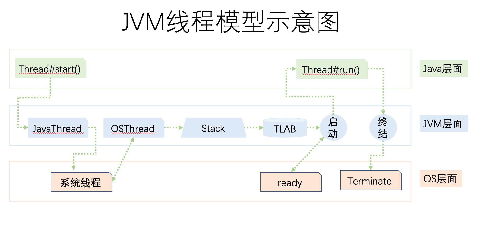
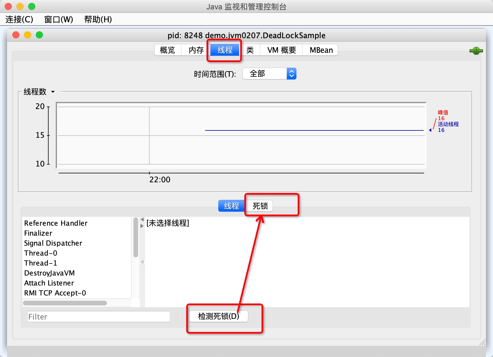
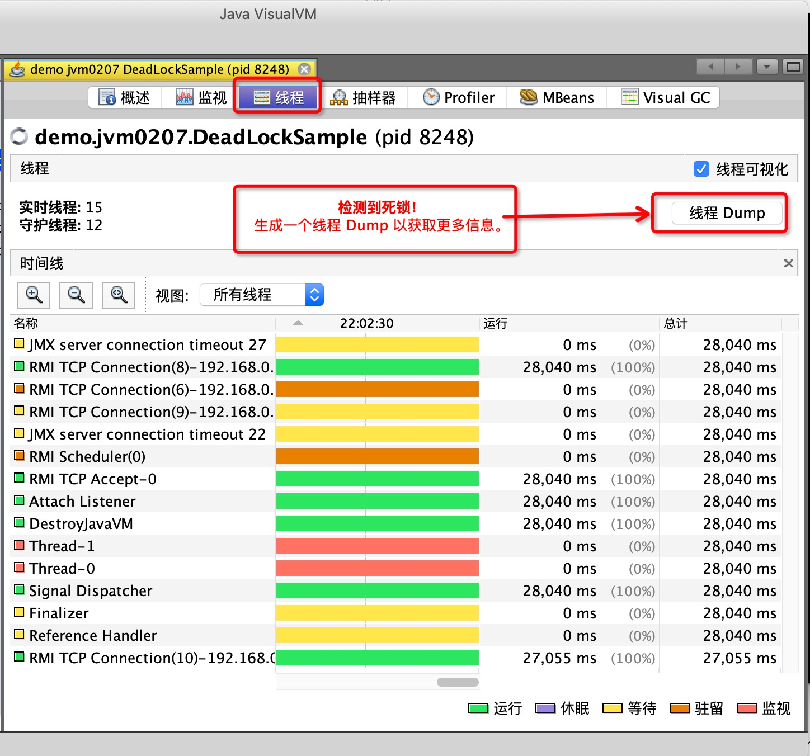

# 22 JVM 的线程堆栈等数据分析：操千曲而后晓声、观千剑而后识器

### Java 线程简介与示例

多线程的使用和调优也是 Java 应用程序性能的一个重要组成部分，本节我们主要来讨论这一部分内容。

线程（Thread）是系统内核级的重要资源，并不能无限制地创建和使用。创建线程的开销很大，由于线程管理较为复杂，在编写多线程代码时，如果有哪里未设置正确，可能会产生一些莫名其妙的 Bug。

开发中一般会使用资源池模式，也就是“线程池”（Thread Pool）。通过把线程的调度管理委托给线程池，应用程序可以实现用少量的线程，来执行大量的任务。

线程池的思路和原理大概如下：与其为每个任务创建一个线程，执行完就销毁；倒不如统一创建少量的线程，然后将执行的逻辑作为一个个待处理的任务包装起来，提交给线程池来调度执行。有任务需要调度的时候，线程池找一个空闲的线程，并通知它干活。任务执行完成后，再将这个线程放回池子里，等待下一次调度。这样就避免了每次大量的创建和销毁线程的开销，也隔离开了任务处理和线程池管理这两个不同的代码部分，让开发者可以关注与任务处理的逻辑。同时通过管理和调度，控制实际线程的数量，也避免了一下子创建了（远超过 CPU 核心数的）太多线程导致并不能并发执行，反而产生了大量线程切换调度，导致性能降低的问题。

Java 语言从一开始就实现了对多线程的支持，但是在早期版本中需要开发者手动地去创建和管理线程。

Java 5.0 版本开始提供标准的线程池 API：Executor 和 ExecutorService 接口，它们定义了线程池以及支持的交互操作。相关的类和接口都位于 java.util.concurrent 包中，在编写简单的并发任务时，可以直接使用。一般来说，我们可以使用 Executors 的静态工厂方法来实例化 ExecutorService。

下面我们通过示例代码来进行讲解。

先创建一个线程工厂：

```java
package demo.jvm0205;

import java.util.concurrent.ThreadFactory;

import java.util.concurrent.atomic.AtomicInteger;

// Demo线程工厂

public class DemoThreadFactory implements ThreadFactory {

    // 线程的名称前缀

    private String threadNamePrefix;

    // 线程 ID 计数器

    private AtomicInteger counter = new AtomicInteger();

    public DemoThreadFactory(String threadNamePrefix) {

        this.threadNamePrefix = threadNamePrefix;

    }

    @Override

    public Thread newThread(Runnable r) {

        // 创建新线程

        Thread t = new Thread(r);

        // 设置一个有意义的名字

        t.setName(threadNamePrefix + "-" + counter.incrementAndGet());

        // 设置为守护线程

        t.setDaemon(Boolean.TRUE);

        // 设置不同的优先级; 比如我们有多个线程池，分别处理普通任务和紧急任务。

        t.setPriority(Thread.MAX_PRIORITY);

        // 设置某个类的或者自定义的的类加载器

        // t.setContextClassLoader();

        // 设置此线程的最外层异常处理器

        // t.setUncaughtExceptionHandler();

        // 不需要启动; 直接返回;

        return t;

    }

}


```

一般来说，在线程工厂中，建议给每个线程指定名称，以方便监控、诊断和调试。

根据需要，还会设置是否是“守护线程”的标志。守护线程就相当于后台线程，如果 JVM 判断所有线程都是守护线程，则会自动退出。

然后我们创建一个“重型”任务类，实现 Runnable 接口：

```java
package demo.jvm0205;

import java.util.Random;

import java.util.concurrent.TimeUnit;

// 模拟重型任务

public class DemoHeavyTask implements Runnable {

    // 线程的名称前缀

    private int taskId;


    public DemoHeavyTask(int taskId) {

        this.taskId = taskId;

    }


    @Override

    public void run() {

        // 执行一些业务逻辑

        try {

            int mod = taskId % 50;

            if (0 == mod) {

                // 模拟死等;

                synchronized (this) {

                    this.wait();

                }

            }

            // 模拟耗时任务

            TimeUnit.MILLISECONDS.sleep(new Random().nextInt(400) + 50);

        } catch (InterruptedException e) {

            e.printStackTrace();

        }

        String threadName = Thread.currentThread().getName();

        System.out.println("JVM核心技术：" + taskId + "; by：" + threadName);

    }

}


```

最后，创建线程池并提交任务来执行：

```java
package demo.jvm0205;

import java.util.concurrent.ExecutorService;

import java.util.concurrent.Executors;

import java.util.concurrent.TimeUnit;

/**

 * 线程池示例;

 */

public class GitChatThreadDemo {

    public static void main(String[] args) throws Exception {

        // 1. 线程工厂

        DemoThreadFactory threadFactory

                = new DemoThreadFactory("JVM.GitChat");

        // 2. 创建 Cached 线程池; FIXME：其实这里有坑...

        ExecutorService executorService =

                Executors.newCachedThreadPool(threadFactory);

        // 3. 提交任务;

        int taskSum = 10000;

        for (int i = 0; i < taskSum; i++) {

            // 执行任务

            executorService.execute(new DemoHeavyTask(i + 1));

            // 提交任务的间隔时间

            TimeUnit.MILLISECONDS.sleep(5);

        }

        // 4. 关闭线程池

        executorService.shutdownNow();

    }

}


```

启动执行之后，输出的内容大致是这样的：

```java
......

JVM核心技术：9898; by：JVM.GitChat-219

JVM核心技术：9923; by：JVM.GitChat-185

JVM核心技术：9918; by：JVM.GitChat-204

JVM核心技术：9922; by：JVM.GitChat-209

JVM核心技术：9903; by：JVM.GitChat-246

JVM核心技术：9886; by：JVM.GitChat-244

......

java.lang.InterruptedException

 at java.lang.Object.wait(Native Method)

 at java.lang.Object.wait(Object.java：502)

 at demo.jvm0205.DemoHeavyTask.run(DemoHeavyTask.java：23)

 at java.util.concurrent.ThreadPoolExecutor.runWorker(ThreadPoolExecutor.java：1149)

 at java.util.concurrent.ThreadPoolExecutor$Worker.run(ThreadPoolExecutor.java：624)

 at java.lang.Thread.run(Thread.java：748)


```

可以看到，这里抛出了 InterruptedException 异常。

这是因为我们的代码中，main 方法提交任务之后，并不等待这些任务执行完成，就调用 shutdownNow 方法强制关闭了线程池。

这是一个需要注意的地方，如果不需要强制关闭，则应该使用 shutdown 方法。

一般来说，线程池的关闭逻辑，会挂载到应用程序的关闭钩子之中，比如注册web应用的监听器，并在 destroy 方法中执行，这样实现的关闭我们有时候也称之为“优雅关闭”（Graceful Shutdown）。

### JVM 线程模型

通过前面的示例，我们看到 Java 中可以并发执行多个线程。

那么 JVM 是怎么实现底层的线程以及调度的呢？

每个线程都有自己的线程栈，当然堆内存是由所有线程共享的。

以 Hotspot 为例，这款 JVM 将 Java 线程（java.lang.Thread）与底层操作系统线程之间进行 1:1 的映射。

很简单吧！但这就是最基础的 JVM 线程模型。

但我们要排查问题，就需要掌握其中的一些细节。

#### **线程创建和销毁**

在语言层面，线程对应的类是 java.lang.Thread，启动方法为 Thread#start()。

在 Java 线程启动时会创建底层线程（native Thread），在任务执行完成后会自动回收。

JVM 中所有线程都交给操作系统来负责调度，以将线程分配到可用的 CPU 上执行。

根据对 Hotspot 线程模型的理解，我们制作了下面这下示意图：



从图中可以看到，调用 Thread 对象的 start() 方法后，JVM 会在内部执行一系列的操作。

因为 Hotspot JVM 是使用 C++ 语言编写的，所以在 JVM 层面会有很多和线程相关的 C++ 对象。

- 在 Java 代码中，表示线程的 java.lang.Thread 对象。
- JVM 内部表示 java.lang.Thread 的 JavaThread 实例，这个实例是 C++ 对象，其中保存了各种额外的信息以支持线程状态跟踪监控。
- OSThread 实例表示一个操作系统线程（有时候我们也叫物理线程），包含跟踪线程状态时所需的系统级信息。当然，OSThread 持有了对应的“句柄”，以标识实际指向的底层线程。

关联的 java.lang.Thread 对象和 JavaThread 实例，互相持有对方的引用（地址值/OOP 指针）。当然，JavaThread 还持有对应的 OSThread 引用。

在启动 java.lang.Thread 时，JVM 会创建对应的 JavaThread 和 OSThread 对象，并最终创建 native 线程。

准备好所有的VM状态（比如 thread-local 存储，对象分配缓冲区，同步对象等等）之后，就启动 native 线程。

native 线程完成初始化后，执行一个启动方法，在其中会调用 java.lang.Thread 对象的 run() 方法。

run() 方法指向完成后，根据返回的结果或者抛出的异常，进行相应的捕获和处理。

接着就终止线程，并通知 VM 线程，让他判断该线程终止后是否需要停止整个虚拟机（判断是否还有前台线程）。

线程结束会释放所有分配给他的资源，并从已知线程集合中删除 JavaThread 实例，调用 OSThread 和 JavaThread 的析构函数，在底层线程对应的钩子方法执行完成后，最终停止。

现在我们知道了，在 Java 代码中，可以调用 java.lang.Thread 对象的 start() 方法来启动线程；除此之外还有没有其他方式可以增加 JVM 中的线程呢？我们还可以在 JNI 代码中，将现有的本地线程并入 JVM 中，之后的过程，JVM 创建的数据结构和普通 Java 线程基本一致。

> Java 线程优先级，与操作系统线程的优先级之间，是比较复杂的关系，在不同的系统之间有所不同，本文不进行详细讲解。

#### **线程状态**

JVM 使用不同的状态来标识每个线程在做什么。这有助于协调线程之间的交互，在出现问题时也能提供有用的调试信息。

线程在执行不同的操作时，其状态会发生转换，这些转换点对应的代码会检查线程在该时间点是否适合执行所请求的操作，具体情况请参阅后面的安全点这一节。

从 JVM 的角度看，线程状态主要包括 4 种：

- `_thread_new`：正在初始化的新线程
- `_thread_in_Java`：正在执行 Java 代码的线程
- `_thread_in_vm`：在 JVM 内部执行的线程
- `_thread_blocked`：由于某种原因被阻塞的线程（例如获取锁、等待条件、休眠、执行阻塞的 I/O 操作等等）

出于调试目的，线程状态中还维护了其他信息。这些信息在 OSThread 中维护，其中一些已被废弃。

在线程转储，调用栈跟踪时，相关的工具会使用这些信息。

在线程转储等报告中会使用到的状态包括：

- `MONITOR_WAIT`：线程正在等待获取竞争的管程锁。
- `CONDVAR_WAIT`：线程正在等待 JVM 使用的内部条件变量（不与任何 Java 级别对象相关联）。
- `OBJECT_WAIT`：线程正在执行 Object.wait() 调用。

其他子系统和库也可能会添加一些自己的状态信息，例如 JVMTI 系统，以及 java.lang.Thread 类自身也暴露了 ThreadState。

通常来说，后面介绍的这些信息与 JVM 内部的线程管理无关，JVM 并不会使用到这些信息。

#### **JVM 内部线程**

我们会发现，即使启动一个简单的“Hello World”示例程序，也会在 Java 进程中创建几十号线程。

这几十个线程主要是 JVM 内部线程，以及 Lib 相关的线程（例如引用处理器、终结者线程等等）。

JVM 内部线程主要分为以下几种：

- VM 线程：单例的 VMThread 对象，负责执行 VM 操作，下文将对此进行讨论；
- 定时任务线程：单例的 WatcherThread 对象，模拟在 VM 中执行定时操作的计时器中断；
- GC 线程：垃圾收集器中，用于支持并行和并发垃圾回收的线程；
- 编译器线程：将字节码编译为本地机器代码；
- 信号分发线程：等待进程指示的信号，并将其分配给 Java 级别的信号处理方法。

JVM 中的所有线程都是 Thread 实例，而所有执行 Java 代码的线程都是（Thread 的子类）JavaThread 的实例。

JVM 在链表 Threads_list 中跟踪所有线程，并使用 Threads_lock 来保护（这是 JVM 内部使用的一个核心同步锁）。

### 线程间协调与通信

大部分情况下，某一个子线程只需要关心自身执行的任务。但有些情况下也需要多个线程来协同完成某个任务，这就涉及到线程间通信（inter-thread communication）的问题了。

线程之间有多种通信方式，例如：

- 线程等待，使用 threadA.join() 方法，可以让当前线程等待另一个线程执行结束后进行“汇合”
- 同步（Synchronization），包括 synchronized 关键字以及 object.wait()、object.notify()
- 使用并发工具类，常见的包括 CountdownLatch 类、CyclicBarrier 类等等
- 可管理的线程池相关接口，比如：FutureTask 类、Callable 接口等等
- Java 还支持其他的同步机制，例如 volatile 域以及 java.util.concurrent 包（有时候简称 juc）中的类

其中最基础也最简单的是同步（Synchronization），JVM可以通过操作系统提供的管程（Monitor）来实现，一般称为对象锁或者管程锁。

#### **synchronized 基础**

广义上讲，我们将“同步（Synchronization）”定义为一种机制，用来防止并发操作中发生不符合预期的污染（通常称为“竞争”）。

HotSpot 为 Java 提供了管程锁（Monitor），线程执行程序代码时可以通过管程来实现互斥。管程有两种状态：锁定、解锁。获得了管程的所有权后，线程才可以进入受管程保护的关键部分（critical section）。在 Java 中，这种关键部分被称为“同步块（synchronized blocks）”，在代码中由 synchronized 语句标识。

每个 Java 对象都默认有一个相关联的管程，线程可以锁定（lock）以及解锁（unlock）持有的管程。一个线程可以多次锁定同一个管程，解锁则是锁定的反操作。

任一时刻，只能有一个线程持有管程锁，其他试图获得该管程的线程都会阻塞（blocked）。也就是说不同线程在管程锁上是互斥的，任一时刻最多允许一个线程访问受保护的代码或数据。

在 Java 中，使用 synchronized 语句块，可以要求线程先获取具体对象上的管程锁。只有获取了相应的管程锁才能继续运行，并执行 synchronized 语句块中的代码。正常执行/异常执行完毕后，会自动解锁一次对应的管程。

调用被标记为 synchronized 的方法也会自动执行锁定操作，同样需要获取对应的锁才能执行该方法。一个类的某个实例方法锁定的是 this 指向的对象锁，静态方法（static）锁定的则是 Class 对象的管程，所有的实例都会受到影响。方法进入/退出时，会自动触发一次相应管程的 lock/unlock 操作。

如果线程尝试锁定某个管程，并且该管程处于未锁定状态，则该线程立即获得该管程的所有权。

假如在锁定管程的情况下，第二个线程尝试获取该管程的所有权，则不允许进入关键部分（即同步块内的代码）；在管程的所有者解锁之后，第二个线程也必须先设法获得（或被授予）这个锁的独占所有权。

以下是一些管程锁相关的术语：

- “进入（enter）”，意味着获得管程锁的唯一所有权，并可以执行关键部分。
- “退出（exit）”，意味着释放管程的所有权并退出关键部分。
- “拥有（owns）”，即锁定管程的线程拥有该管程。
- “无竞争（Uncontended）”，是指仅有一个线程在未被锁定的管程上进行同步操作。

另外说一句，Java 语言不负责死锁的检测，需要由程序员自行处理。

总结一下，同步关键字 synchronized 通过使用管程锁，用于协调多个不同线程对一段代码逻辑的访问，它可以作用在静态方法、方法以及代码块上。

锁定范围：静态方法（作用在 class 上） > 方法（作用在具体实例上） > 代码块（作用在一块代码上）。

#### **等待与通知**每个对象都有一个关联的管程锁，JVM 会维护这个锁上面对应的等待集合（wait set），里面保存的是线程引用

新创建的对象，其等待集合是空的。增加或者减少等待集的过程是原子操作，对应的操作方法是 `Object#wait`、`Object#notify` 和 `Object#notifyAll`。

线程中断也会影响等待集，但 `Thread#sleep` 和 `Thread#join` 并不在此范围内。

#### **Hotspot JVM 对同步的优化**HotSpot JVM 综合运用了“无竞争同步操作”和“有竞争同步操作”两种先进手段，从而大大提高了同步语句的性能

无竞争同步操作，是大多数业务场景下的同步情况，通过恒定时间技术来实现优化。借助于“偏向锁（biased locking）”，在一般情况下，这种同步操作基本上没有性能开销。

这是因为，大多数对象的生命周期中，往往最多只会被一个线程锁定和使用，因此就让这个对象锁“偏向”该线程。

一旦有了偏向，该线程就可以在后续的操作中轻松锁定和解锁，不再需要使用开销巨大的原子指令。

竞争情景下的同步操作，使用高级自适应自旋技术来优化和提高吞吐量，这种优化对于高并发高竞争的锁争用场景也是有效的。

HotSpot JVM 这么一优化之后，Java 自带的同步操作对于大多数系统来说，就不再有之前版本的性能问题。\*\*线程切换的代价：\*\*Linux 时间片默认 0.75~6ms；Win XP 大约 10~15ms 左右；各个系统可能略有差别，但都在毫秒级别。假设 CPU 是 2G HZ，则每个时间片大约对应 2 百万个时钟周期，如果切换一次就有这么大的开销，系统的性能就会很糟糕。

所以 JDK 的信号量实现经过了自旋优化，先进行一定量时间的自旋操作，充分利用了操作系统已经分配给当前线程的时间片，否则这个时间片就被浪费了。

如果在 Java 代码中进行多个线程的 synchronized 和 wait-notify 操作的性能测试，则会发现程序的性能基本上不受时间片周期的影响。

在 HotSpot JVM 中，大多数同步操作是通过所谓的“快速路径”代码处理的。

JVM 有两个即时编译器（JIT）和一个解释器，都会生成快速路径代码。

这两个 JIT 是“C1”（即 `-client` 编译器）和“C2”（即 `-server` 编译器）。C1 和 C2 都直接在同步位置生成快速路径代码。

在没有争用的情况下，同步操作将完全在快速路径中完成。但是，如果我们需要阻塞或唤醒线程（分别在 monitorenter 或 monitorexit 中），则快速路径代码将会调用慢速路径。

慢路径实现是用本地 C++ 代码实现的，而快速路径是由 JIT 生成的。

#### **标记字**

对象锁的同步状态得有个地方来记录，Hotspot将其编码到内存中对象头里面的第一个位置中（即“标记字”）。

标记字被用来标识多种状态，这个位置也可以被复用，可以指向其他同步元数据。

此外，标记字还可以被用来保存GC年龄数据和对象的唯一 hashCode 值。

标记字的状态包括：

- 中立（Neutral）：表示未锁定（Unlocked）。
- 偏向（Biased）：可以表示“锁定/解锁”和“非共享”的状态。
- 栈锁定（Stack-Locked）：锁定+共享，但没有竞争标记指向所有者线程栈上面的移位标记字。
- 膨胀（Inflated）：锁定/解锁 + 共享，竞争线程在 monitorenter 或 wait() 中被阻塞。该标记指向重量级锁对应的“对象管程”结构体。

### 安全点

有几个安全点相关的概念需要辨别一下：

- 方法代码中被植入的安全点检测入口；
- 线程处于安全点状态：线程暂停执行，这个时候线程栈不再发生改变；
- JVM 的安全点状态：所有线程都处于安全点状态。

简而言之，当虚拟机处于安全点时，JVM 中其他的所有线程都会被阻塞；那么在 VMThread 执行操作时，就不会再有业务线程来修改 Java 堆内存，而且所有线程都处于可检查状态，也就是说这个时候它们的线程栈不会发生改变（想想看，为什么？）。

JVM 有一个特殊的内部线程，称为"VMThread"。VMThread 会等待 VMOperationQueue 中出现的操作，然后在虚拟机到达安全点之后执行这些操作。

为什么要将这些操作抽出来单独用一个线程来执行呢?

因为有很多操作要求 JVM 在执行前要到达所谓的“安全点”。刚刚我们提到，在安全点之中，堆内存不再发生变化。

这些操作只能传给 VMThread 来执行，例如：垃圾收集算法中的 STW 阶段，偏向锁撤销，线程栈转储，线程暂停或停止，以及通过 JVMTI 请求的许多检查/修改操作等等。

安全点是使用基于轮询的合作机制来启动的。

简单来说，线程可能经常执行判断：“我应该在安全点处暂停吗？”。

想要高效地检查并不简单。执行安全点检测的地方包括：

- 线程状态转换时。大部分的状态转换都会执行这类操作，但不是全部，例如，线程离开 JVM 进入 native 代码时。
- 其他发出询问的位置，是从编译后的 native 代码方法返回时，或在循环迭代中的某些阶段。

请求安全点后，VMThread 必须等待所有已知的线程都处于安全点状态，才能执行VM操作。

在安全点期间，通过 Threads_lock 来阻塞所有正在运行的线程，在执行完VM操作之后，VMThread 会释放 Threads_lock。

很多 VM 操作是同步的，即请求者在操作完成之前一直被阻塞；但也有些操作是异步或并发的，这意味着请求者可以和 VMThread 并行执行（当然，是在还没有进入安全点状态之前）。

### 线程转储

线程转储（Thread Dump）是 JVM 中所有线程状态的快照。一般是文本格式，可以将其保存到文本文件中，然后可以人工查看和分析，也可以通过程序自动分析。

每个线程的状态都可以通过调用栈来表示。线程转储展示了各个线程的行为，对于诊断和排查问题非常有用。

> 简言之，线程转储就是线程快照，线程状态主要是 那个大家都很熟悉的 StackTrace，即方法调用栈。

JVM 支持多种方式来进行线程转储，包括：

- JDK 工具，包括：jstack 工具、jcmd 工具、jconsole、jvisualvm、Java Mission Control 等；
- Shell 命令或者系统控制台, 比如 Linux 的 `kill -3`、Windows 的 `Ctrl + Break` 等；
- JMX 技术，主要是使用 ThreadMxBean，我们可以在程序中，后者 JMX 客户端调用，返回结果是文本字符串，可以灵活处理。

我们一般使用 JDK 自带的命令行工具来获取 Java 应用程序的线程转储。

#### **jstack 工具**

前面的章节中我们详细介绍过 jstack 工具，这是专门用来执行线程转储的。一般连接本地 JVM：

```
jstack [-F] [-l] [-m] <pid>


```

pid 是指对应的 Java 进程 id，使用时支持如下的选项：

- `-F` 选项强制执行线程转储；有时候 `jstack pid` 会假死，则可以加上 `-F` 标志
- `-l` 选项，会查找堆内存中拥有的同步器以及资源锁
- `-m` 选项，额外打印 native 栈帧（C 和 C++ 的）

使用示例：

```
jstack 8248 > ./threaddump.txt


```

#### **jcmd 工具**前面的章节中我们详细介绍过 jcmd 工具，本质上是向目标 JVM 发送一串命令，示例用法如下

```
jcmd 8248 Thread.print


```

#### **JMX 方式**

JMX 技术支持各种各样的花式操作。我们可以通过 ThreadMxBean 来线程转储。

示例代码如下：

```
package demo.jvm0205;

import java.lang.management.*;

/**

 * 线程转储示例

 */

public class JMXDumpThreadDemo {

    public static void main(String[] args) {

        String threadDump = snapThreadDump();

        System.out.println("=================");

        System.out.println(threadDump);

    }

    public static String snapThreadDump() {

        StringBuffer threadDump = new StringBuffer(System.lineSeparator());

        ThreadMXBean threadMXBean = ManagementFactory.getThreadMXBean();

        for (ThreadInfo threadInfo : threadMXBean.dumpAllThreads(true, true)) {

            threadDump.append(threadInfo.toString());

        }

        return threadDump.toString();

    }

}


```

#### **线程 Dump 结果**

因为都是字符串表示形式，各种方式得到的线程转储结果大同小异。

例如前面的 JMX 线程转储示例程序，以 debug 模式运行后得到以下结果：

```
"JDWP Command Reader" Id=7 RUNNABLE (in native)


"JDWP Event Helper Thread" Id=6 RUNNABLE


"JDWP Transport Listener: dt_socket" Id=5 RUNNABLE


"Signal Dispatcher" Id=4 RUNNABLE


"Finalizer" Id=3 WAITING on [email protected]

 at java.lang.Object.wait(Native Method)

 - waiting on [email protected]

 at java.lang.ref.ReferenceQueue.remove(ReferenceQueue.java:143)

 at java.lang.ref.ReferenceQueue.remove(ReferenceQueue.java:164)

 at java.lang.ref.Finalizer$FinalizerThread.run(Finalizer.java:212)


"Reference Handler" Id=2 WAITING on [email protected]

 at java.lang.Object.wait(Native Method)

 - waiting on [email protected]

 at java.lang.Object.wait(Object.java:502)

 at java.lang.ref.Reference.tryHandlePending(Reference.java:191)

 at java.lang.ref.Reference$ReferenceHandler.run(Reference.java:153)


"main" Id=1 RUNNABLE

 at sun.management.ThreadImpl.dumpThreads0(Native Method)

 at sun.management.ThreadImpl.dumpAllThreads(ThreadImpl.java:454)

 at demo.jvm0205.JMXDumpThreadDemo.snapThreadDump(JMXDumpThreadDemo.java:21)

 at demo.jvm0205.JMXDumpThreadDemo.main(JMXDumpThreadDemo.java:13)


```

简单分析，可以看到最简单的 Java 程序中有这些线程：

- JDWP 相关的线程，请同学们回顾一下前面的课程中介绍的这个调试技术。
- Signal Dispatcher，将操作系统信号（例如 `kill -3` ）分发给不同的处理器进行处理，我们也可以在程序中注册自己的信号处理器，有兴趣的同学可以搜索关键字。
- Finalizer，终结者线程，处理 finalize 方法进行资源释放，现在一般不怎么关注。
- Reference Handler，引用处理器。
- main，这是主线程，属于前台线程，本质上和普通线程没什么区别。

如果程序运行的时间比较长，那么除了业务线程之外，还会有一些 GC 线程之类的，具体情况请参考前文。

建议同学们动手实践各种命令，并尝试简单的分析。

### 死锁示例与分析

关于线程与锁的知识，在网上到处都是，因为本课程主要介绍 JVM，所以在此只进行简单的演示。

#### **模拟线程死锁**下面是一个简单的死锁示例代码

```java
package demo.jvm0207;

import java.util.concurrent.TimeUnit;

public class DeadLockSample {

    private static Object lockA = new Object();

    private static Object lockB = new Object();


    public static void main(String[] args) {

        ThreadTask1 task1 = new ThreadTask1();

        ThreadTask2 task2 = new ThreadTask2();

        //

        new Thread(task1).start();

        new Thread(task2).start();

    }


    private static class ThreadTask1 implements Runnable {

        public void run() {

            synchronized (lockA) {

                System.out.println("lockA by thread:"

                        + Thread.currentThread().getId());

                try {

                    TimeUnit.SECONDS.sleep(2);

                } catch (InterruptedException e) {

                    e.printStackTrace();

                }

                synchronized (lockB) {

                    System.out.println("lockB by thread:"

                            + Thread.currentThread().getId());

                }

            }

        }

    }


    private static class ThreadTask2 implements Runnable {

        public void run() {

            synchronized (lockB) {

                System.out.println("lockB by thread:"

                        + Thread.currentThread().getId());

                try {

                    TimeUnit.SECONDS.sleep(2);

                } catch (InterruptedException e) {

                    e.printStackTrace();

                }

                synchronized (lockA) {

                    System.out.println("lockA by thread:"

                            + Thread.currentThread().getId());

                }

            }

        }

    }

}


```

代码有几十行，但是逻辑很简单：两个锁获取的顺序不同，并且两个线程都在死等对方的锁资源。

#### 线程栈 Dump 发现死锁

程序启动之后，我们可以用上面介绍的各种手段来 Dump 线程栈，比如：

```shell
# 查看进程号

jps -v

# jstack 转储线程

jstack 8248

# jcmd 线程转储

jcmd 8248 Thread.print


```

两种命令行工具得到的内容都差不多：

```shell
Found one Java-level deadlock:

=============================

"Thread-1":

  waiting to lock monitor 0x00007f8d9d030818 (object 0x000000076abef128, a java.lang.Object),

  which is held by "Thread-0"

"Thread-0":

  waiting to lock monitor 0x00007f8d9d032e98 (object 0x000000076abef138, a java.lang.Object),

  which is held by "Thread-1"


Java stack information for the threads listed above:

===================================================

"Thread-1":

 at demo.jvm0207.DeadLockSampleThreadTask2.run(DeadLockSample.java:46)

 - waiting to lock <0x000000076abef128> (a java.lang.Object)

 - locked <0x000000076abef138> (a java.lang.Object)

 at java.lang.Thread.run(Thread.java:748)

"Thread-0":

 at demo.jvm0207.DeadLockSampleThreadTask1.run(DeadLockSample.java:28)

 - waiting to lock <0x000000076abef138> (a java.lang.Object)

 - locked <0x000000076abef128> (a java.lang.Object)

 at java.lang.Thread.run(Thread.java:748)


Found 1 deadlock.


```

可以看到，这些工具会自动发现死锁，并将相关线程的调用栈打印出来。

#### **使用可视化工具发现死锁**

当然我们也可以使用前面介绍过的可视化工具 jconsole，示例如下：



也可以使用 JVisualVM：



各种工具导出的线程转储内容都差不多，参考前面的内容。

有没有自动分析线程的工具呢？请参考后面的章节《fastthread 相关的工具介绍》。

### 参考资料

- [Java 进阶知识——线程间通信](https://renfufei.blog.csdn.net/article/details/88427171)
- [提升 Java 中锁的性能](https://plumbr.io/blog/locked-threads/improving-lock-performance-in-java)
- [ThreadLocals 怎样把你玩死](https://plumbr.io/blog/locked-threads/how-to-shoot-yourself-in-foot-with-threadlocals)
