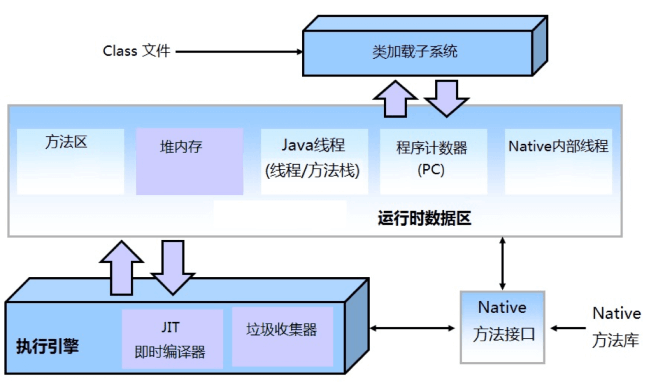

# 27 JVM 问题排查分析上篇（调优经验）

一般来说，只要系统架构设计得比较合理，大部分情况下系统都能正常运行，出现系统崩溃等故障问题是小概率事件。也就是说，业务开发是大部分软件工程中的重头戏，所以有人开玩笑说：“面试造火箭，入职拧螺丝。”

一般来说，我们进行排查分析的目的主要有：

- 解决问题和故障
- 排查系统风险隐患

我们按照问题的复杂程度，可以分为两类：

- 常规问题
- 疑难杂症

常规的问题一般在开发过程中就被发现和解决了，所以线上问题一般会比较复杂，出现在大家都没有考虑到的地方。按照我们的多年解决经验，这些复杂问题的排查方式可以分为两种途径：

- 逻辑严密的系统性排查；
- 以猜测来驱动，凭历史经验进行排查。

如果您倾向于选择后一种方式，那么可能会浪费大量的时间，效果得看运气。更糟糕的是，因为基本靠蒙，所以这个过程是完全不可预测的，如果时间很紧张，就会在团队内部造成压力，甚至升级为甩锅和互相指责。


系统出现性能问题或者故障，究竟是不是 JVM 的问题，得从各个层面依次进行排查。

### 为什么问题排查这么困难？

#### **生产环境中进行故障排查的困难** 在生产环境中针对特定问题进行故障排除时，往往会有诸多限制，从而导致排查的过程变得痛苦。 **1. 影响到客户的时间越短越好** 面对客户的抱怨，解决问题最快的办法可能是：“ **只要重启机器就能让系统恢复正常** ”

用最快的方法来避免对用户产生影响是很自然的需求。

但重启可能会破坏故障现场，那样就很难排查问题的根本原因了。

如果重新启动实例，则无法再采集实际发生的情况，导致我们并没有从这次故障中学习，从而获得收益。

即使重启解决了目前的问题，但问题原因本身仍然存在，一直是一个定时炸弹，还可能会接二连三地发生。 **2. 安全方面的限制**

接下来是安全性相关的限制，这些限制导致生产环境是独立和隔离的，一般来说，开发人员可能没有权限访问生产环境。如果没有权限访问生产环境，那就只能进行远程故障排除，并涉及到所有与之相关的问题：

- 每个要执行的操作都需要多人参与或审核，这不仅增加了执行单个操作所需的时间，而且沟通交流过程中可能会丢失一些信息。

特别是将临时补丁程序发布到生产环境时，“希望它能生效”，但这种试错的情况却可能导致越来越糟糕。

**因为测试和发布流程可能又要消耗几小时甚至几天** ，进一步增加了解决问题实际消耗的时间。

如果还需要分多次上线这种“不一定生效的补丁程序”，则很可能会消耗几个星期才能解决问题。 **3. 工具引发的问题** 还有很重要的一点是需要使用的工具： **安装使用的某些工具在特点场景下可能会使情况变得更糟** 。

例如：

- 对 JVM 进行堆转储（heap dump）可能会使 JVM 暂停几十秒或更长时间。
- 打印更细粒度的日志可能会引入其他的并发问题，IO 开销、磁盘问题等。
- 增加的探测器或者分析器可能会有很大开销，导致本就缓慢的系统彻底卡死。

因此，要想给系统打补丁或者增加新的远程监测程序，可能最终会花费很多天的时间：既然在生产环境中进行故障诊断排查会面临这么多的问题，很自然地，大部分情况下，我们都是在开发或测试环境中进行故障排查。

#### **在测试和开发环境进行诊断需要注意的问题**

如果在开发环境或者测试环境中进行问题诊断和故障排查，则可以避免生产环境中的那些麻烦。

因为开发环境和生产环境配置不同，有些时候可能也会有问题：即很难复现生产环境中产生的 Bug 或性能问题。

例如：

- 测试环境和生产环境使用的数据源不同。这意味着由数据量引发的性能问题可能不会在测试环境中重现。
- 某些问题的使用方式可能不容易复现（我们有时候也称之为“幽灵问题”）。例如只在 2 月 29 日这个特殊时间引起的并发问题，只在多个用户同时访问某个功能时引发，如果事先不知道原因，那也很难排查。
- 两个环境下的应用程序可能还不一样。生产部署的配置可能明显不同。这些差异包括：操作系统、群集、启动参数，以及不同的打包版本。

这些困难会引起“这不可能，我机器上就没事” 这种很尴尬的局面。

可以看出，因为和实际的生产环境不同，所以在对某些问题进行故障排除时，当前系统环境的性质可能会让你遇到的一些莫名其妙的障碍。

除了特定环境的约束之外，还有其他方面的因素也会导致故障排除过程的不可预测性。

### 需要做哪些准备工作

本节提供一些处理经验，但是我们希望他们不会成为你的应急措施（就像医生不希望你来医院）。

最好是在平时就先做好全面的系统监控、有针对性的应急预案，并时常进行演练。

#### **掌握行业领域相关的知识**

能力可以分为外功和内功。内功就是各种基础知识。外功就是各种工具、技能和技巧。

分析排查问题，需要大量的专业背景知识来支撑。否则你猜都不知道怎么猜，没有方向，也就很难验证正确性了。

想要具备排查复杂问题的能力，至少得对领域行业相关的横向知识有一定的了解，最好还能对所面临的具体问题域有竖向的深刻认识和经验，即所谓的“T”字型人才。

JVM 问题排查需要掌握哪些领域相关的知识呢？下面列出了一些基础：

- Java 语言功底
- JVM 基础知识
- 并发领域知识
- 计算机体系结构和组成原理
- TCP/IP 网络体系知识
- HTTP 协议和 Nginx 等服务器知识
- 数据库领域知识
- 搜索引擎使用技巧

以及从这些领域延伸出来的各种技能和技巧。

故障排除是必不可少的过程。只要有人使用的系统，就无法避免地会发生一些故障，因此我们需要很清楚地了解系统的现状和问题。我们无法绕过不同环境带来的困扰，但也不可能“21 天就变成专家”。

在技术开发这个行业，一万小时理论总是成立的。除了累积1万小时的训练时间来成为该领域的专家之外，其实还有更快速的解决方案来减轻故障排除所带来的痛苦。

#### **在开发环境中进行抽样分析** 对代码进行抽样分析并没有错，尤其是在系统正式上线之前

相反，了解应用程序各个部分的热点以及内存消耗，能有效防止某些问题影响到生产环境的用户。

虽然由于数据，使用方式和环境的差异，最终只能模拟生产环境中面临的一部分问题。 但使用这种技术可以预先进行风险排查，如果真的发生问题，可以在追溯问题原因时很快定位。

#### **在测试环境中进行验证** 在质量保证领域投入适当的资源，尤其是自动化的持续集成、持续交付流程能及早暴露出很多问题。如果进行周全和彻底的测试，将进一步减少生产环境的事故。但是，这些工作往往得不到资源，“你看功能不是已经完成了吗，为什么还要去花人力物力继续搞，又没有收益”

实际的工作中，我们很难证明对质量检查的投资是否合理。

一切标有“性能测试”或“验收测试”的产品，最终都将与清晰而可衡量的业务目标（新功能开发）存在竞争。

现在，当开发人员推动“执行某项性能优化”的任务时，如果不能提升优先级，此类任务会积压下来，永远都是待办事项。

为了证明这种投资的合理性，我们需要将投资回报与质量联系起来。如果将生产环境中的P1故障事件减少到80%，可以让我们多产生2倍的收益，在这种情况下，我们就能推动相关人员把这些工作做好。相反地，如果我们不能说明我们改进工作的收益，则我们可能就没有资源去提升质量。

> 曾经有一个特别形象的例子：农村的孩子为什么不读书？
>
> 家长说：因为穷，所以不读书。
>
> 那又为什么而贫穷呢？
>
> 家长说：因为不读书，所以穷。

#### **在生产环境中做好监控**

系统就像是人体一样，只要活着就会在某个时间点生病，所以，我们必须接受的第一件事情就是生产环境一定会出现问题，不管是 Bug 引起的，还是人为操作失误，亦或者天灾导致的。

即使是 NASA/SpaceX 这种高端组织也会不时地炸几艘飞船火箭，因此我们需要为线上发生的问题做好准备。

无论怎么分析和测试，总会有些漏掉的地方，事故就在这些地方产生。

既然无法避免总会需要对生产环境进行故障排除。为了更好地完成手头的工作，就需要监控生产环境中系统的状态。

- 当出现问题时，理想情况下，我们已经拥有了足以解决该问题的相关信息。
- 如果已经拥有了所需的信息，则可以快速跳过问题复现和信息收集的步骤。

不幸的是，监控领域并没有万能的银弹。即使是最新的技术也无法提供不同场景下的所有信息。

典型的 Web 应用系统，至少应该集成下面这些部分：

- 日志监控。汇总各个服务器节点的日志，以便技术团队可以快速搜索相关的信息，日志可视化，并进行异常报警。最常用的解决方案是 ELK 技术栈，将日志保存到 [Elasticsearch](https://www.elastic.co/) 中，通过 [Logstash](https://www.elastic.co/products/logstash) 进行分析，并使用 [Kibana](https://www.elastic.co/products/kibana) 来展示和查询。
- 系统监控。在基础架构中汇总系统指标并进行可视化查询，既简单又有效。关注CPU、内存、网络和磁盘的使用情况，可以发现系统问题并配置监控报警。
- 系统性能监控（APM，Application Performance Monitoring），以及用户体验监控。关注单个用户的交互，能有效展示用户感受到的系统性能和可用性问题。至少，我们可以知道是哪个服务在哪段时间发生了故障。比如集成 Micrometer、Pinpoint、Skywalking、Plumbr 等技术，能快速定位代码中的问题。

确保在系统发布之前已经在开发环境中进行过系统性能分析，并经过测试验收，从而减少生产故障。

了解生产部署环境并做好监控，当故障发生时，我们就能可预料的方式，更快地做出响应。

### 自上而下划分 JVM 问题

前面的小节讲了一般的问题诊断和调优套路：

> 做好监控，定位问题，验证结果，总结归纳。

下面我们看看 JVM 领域有哪些问题.



从上图可以看到，JVM 可以划分为这些部分：

- 执行引擎，包括：GC、JIT 编译器
- 类加载子系统，这部分的问题，一般在开发过程中出现
- JNI 部分，这部分问题一般在 JVM 之外
- 运行时数据区；Java 将内存分为 2 大块：堆内存和栈内存

对这些有了了解，在我们进行知识储备时，就可以按照自顶向下的方式，逐个攻克。

线上环境的JVM问题主要集中在 GC 和内存部分。而栈内存、线程分析等问题，主要是辅助诊断 Java 程序本身的问题。

相关的知识点，如果有不清楚的地方，请各位同学回过头来，再读一读前面的章节。

我认为这些基础的技术和知识，需要阅读和练习 2~3 遍，才会掌握的比较牢固；毕竟理解和掌握了才是自己的。

### 标准 JVM 参数配置

有读者朋友提问：

> 我希望能在课程中总结一下，JVM 的参数设置，应该按照哪些步骤来设置？

截止目前（2020 年 3 月），JVM 可配置参数已经达到 1000 多个，其中 GC 和内存配置相关的 JVM 参数就有 600 多个。从这个参数比例也可以看出，JVM 问题排查和性能调优的重点领域还是 GC 和内存。

参数太多是个大麻烦，让人难以下手，学习和理解起来也很费事。

但在绝大部分业务场景下，常用的 JVM 配置参数也就 10 来个。

我们先给一个示例，读者可根据需要适当增减。

```shell
# 设置堆内存
-Xmx4g -Xms4g 
# 指定 GC 算法
-XX:+UseG1GC -XX:MaxGCPauseMillis=50 
# 指定 GC 并行线程数
-XX:ParallelGCThreads=4 
# 打印 GC 日志
-XX:+PrintGCDetails -XX:+PrintGCDateStamps 
# 指定 GC 日志文件
-Xloggc:gc.log 
# 指定 Meta 区的最大值
-XX:MaxMetaspaceSize=2g 
# 设置单个线程栈的大小
-Xss1m 
# 指定堆内存溢出时自动进行 Dump
-XX:+HeapDumpOnOutOfMemoryError 
-XX:HeapDumpPath=/usr/local/
```

这些参数我们在前面的章节中都介绍过。

此外，还有一些常用的属性配置：

```
# 指定默认的连接超时时间
-Dsun.net.client.defaultConnectTimeout=2000
-Dsun.net.client.defaultReadTimeout=2000
# 指定时区
-Duser.timezone=GMT+08 
# 设置默认的文件编码为 UTF-8
-Dfile.encoding=UTF-8 
# 指定随机数熵源（Entropy Source）
-Djava.security.egd=file:/dev/./urandom 
```

### 一份简单的问题排查手册

#### **一般人的排查方式**

如果使用自己熟悉的工具，并且对于故障排除的规则已经胸有成竹，那么环境限制就不再是什么大问题。

实际上，负责排查和解决问题的工程师通常没有预先规划好的处理流程。

老实说，大家是否有过像下面这样的 shell 操作：

```
# 查看当前路径
pwd
# 查看当前目录下有哪些文件
ls -l
# 查看系统负载
top
# 查看剩余内存
free -h
# 查看剩余磁盘
df -h
# 查看当前目录的使用量
du -sh *
# 系统活动情况报告
sar
-bash: sar: command not found
# Linux安装sysstat
# apt-get install sysstat
# yum -y install sysstat
# 查看帮助手册
man sar
# 查看最近的报告
sar 1
# ???
sar -G 1 3
sar: illegal option -- G
# 查看帮助手册
man sar
# ......
```

如果您觉得上面这个过程很熟悉，别紧张，其实大家都这样干。

大多数工程师在故障排除和诊断调优领域都缺乏经验，因此也就很难使用标准的套路。

这没什么丢人的——除非是 [Brendan Gregg](http://www.brendangregg.com/) or [Peter Lawrey](https://twitter.com/PeterLawrey) 这种专业大牛，否则您很难有 1 万小时的故障排除经历，也就很难成为这个领域的专家。

缺乏经验的话，针对当前问题，往往需要使用不同的工具来收集信息，例如：

- 收集不同的指标（CPU、内存、磁盘 IO、网络等等）
- 分析应用日志
- 分析 GC 日志
- 获取线程转储并分析
- 获取堆转储来进行分析

最容易排查的是系统硬件和操作系统问题，比如：CPU、内存、网络、磁盘 IO。

我们可以使用的工具几乎是无限的。与实际解决问题相比，使用各种不熟悉的工具，可能会浪费更多的时间。

#### **以可量化的方式来进行性能调优**

回顾一下，我们的课程介绍了可量化的 3 个性能指标：

- 系统容量：比如硬件配置、设计容量；
- 吞吐量：最直观的指标是 TPS；
- 响应时间：也就是系统延迟，包括服务端延时和网络延迟。

也可以具体拓展到单机并发，总体并发、数据量；用户数、预算成本等等。

#### **一个简单的流程**

不同的场景、不同的问题，排查方式都不一样，具体怎么来确定问题是没有固定套路的。

可以事先进行的操作包括：

- 培训：提前储备相关领域的知识点和技能、工具使用技巧等等。
- 监控：前面提到过，主要是 3 部分，业务日志、系统性能、APM 指标。
- 预警：在故障发生时，及时进行告警； 在指标超过阈值时进行预警。
- 排查风险点：了解系统架构和部署结构，分析单点故障、扩容瓶颈等等。
- 评估系统性能和服务级别：例如可用性、稳定性、并发能力、扩展性等等。

各家公司可能有自己的事故处理规范，可能会涉及这些因素：

- 相关人员：包括开发、运维、运营、QA、管理人员、客服等等。
- 事故级别，严重程度，影响范围、紧急程度。
- 汇报、沟通、咨询。
- 问题排查，诊断、定位，监控、分析
- 事故总结、分析原因、防止再现。
- 改进和优化、例如使用新技术、优化架构等等。

#### **可以进行排查的点**

\\1. 查询业务日志，可以发现这类问题：请求压力大、波峰、遭遇降级、熔断等等，基础服务、外部 API 依赖。

\\2. 查看系统资源和监控信息：

- 硬件信息、操作系统平台、系统架构
- 排查 CPU 负载
- 内存不足
- 磁盘使用量、硬件故障、磁盘分区用满、IO 等待、IO 密集、丢数据、并发竞争等情况
- 排查网络：流量打满，响应超时，无响应，DNS 问题，网络抖动，防火墙问题，物理故障，网络参数调整、超时、连接数

\\3. 查看性能指标，包括实时监控、历史数据。可以发现假死、卡顿、响应变慢等现象。

- 排查数据库，并发连接数、慢查询、索引、磁盘空间使用量、内存使用量、网络带宽、死锁、TPS、查询数据量、redo 日志、undo、binlog 日志、代理、工具 Bug。可以考虑的优化包括：集群、主备、只读实例、分片、分区。
- 大数据、中间件、JVM 参数。

\\4. 排查系统日志，比如重启、崩溃、Kill。

\\5. APM，比如发现有些链路请求变慢等等。

\\6. 排查应用系统：

- 排查配置文件：启动参数配置、Spring 配置、JVM 监控参数、数据库参数、Log 参数、APM 配置。
- 内存问题，比如是否存在内存泄漏，内存溢出、批处理导致的内存放大、GC 问题等等。
- GC 问题，确定 GC 算法、确定 GC 的KPI，GC 总耗时、GC 最大暂停时间、分析 GC 日志和监控指标：内存分配速度，分代提升速度，内存使用率等数据。适当时修改内存配置。
- 排查线程，理解线程状态、并发线程数、线程 Dump，锁资源、锁等待、死锁。
- 排查代码，比如安全漏洞、低效代码、算法优化、存储优化、架构调整、重构、解决业务代码 Bug、第三方库、XSS、CORS、正则。
- 单元测试：覆盖率、边界值、Mock 测试、集成测试。

\\7. 排除资源竞争、\[坏邻居效应\](<https://github.com/cncounter/translation/blob/master/tiemao%5C_2016/45%5C_noisy%5C_neighbors/noisy%5C_neighbor%5C_cloud> \_performance.md)。

\\8. 疑难问题排查分析手段：

- DUMP 线程
- DUMP 内存
- 抽样分析
- 调整代码、异步化、削峰填谷

总之，时至今日，软件领域的快速发展，使得我们可以使用的手段和工具，都很丰富。勤学苦练，掌握一些常见的套路，熟练搭配应用一些工具，是我们技术成长，能快速解决问题的不二法门。
