# 34 加餐4：分析定位Java问题，一定要用好这些工具（一）

你好，我是朱晔。今天，我要和你分享的内容是分析定位 Java 问题常用的一些工具。

到这里，我们的课程更新 17 讲了，已经更新过半了。在学习过程中，你会发现我在介绍各种坑的时候，并不是直接给出问题的结论，而是通过工具来亲眼看到问题。

为什么这么做呢？因为我始终认为，遇到问题尽量不要去猜，一定要眼见为实。只有通过日志、监控或工具真正看到问题，然后再回到代码中进行比对确认，我们才能认为是找到了根本原因。

你可能一开始会比较畏惧使用复杂的工具去排查问题，又或者是打开了工具感觉无从下手，但是随着实践越来越多，对 Java 程序和各种框架的运作越来越熟悉，你会发现使用这些工具越来越顺手。

其实呢，工具只是我们定位问题的手段，要用好工具主要还是得对程序本身的运作有大概的认识，这需要长期的积累。

因此，我会通过两篇加餐，和你分享 4 个案例，分别展示使用 JDK 自带的工具来排查 JVM 参数配置问题、使用 Wireshark 来分析网络问题、通过 MAT 来分析内存问题，以及使用 Arthas 来分析 CPU 使用高的问题。这些案例也只是冰山一角，你可以自己再通过些例子进一步学习和探索。

在今天这篇加餐中，我们就先学习下如何使用 JDK 自带工具、Wireshark 来分析和定位 Java 程序的问题吧。

## 使用 JDK 自带工具查看 JVM 情况

JDK 自带了很多命令行甚至是图形界面工具，帮助我们查看 JVM 的一些信息。比如，在我的机器上运行 ls 命令，可以看到 JDK 8 提供了非常多的工具或程序：


接下来，我会与你介绍些常用的监控工具。你也可以先通过下面这张图了解下各种工具的基本作用：

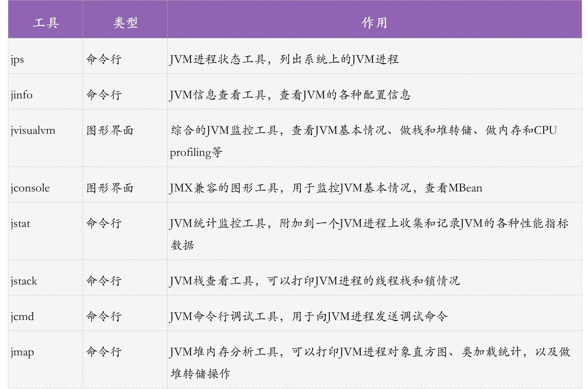

为了测试这些工具，我们先来写一段代码：启动 10 个死循环的线程，每个线程分配一个 10MB 左右的字符串，然后休眠 10 秒。可以想象到，这个程序会对 GC 造成压力。

```
//启动10个线程
IntStream.rangeClosed(1, 10).mapToObj(i -> new Thread(() -> {
    while (true) {
        //每一个线程都是一个死循环，休眠10秒，打印10M数据
        String payload = IntStream.rangeClosed(1, 10000000)
                .mapToObj(__ -> "a")
                .collect(Collectors.joining("")) + UUID.randomUUID().toString();
        try {
            TimeUnit.SECONDS.sleep(10);
        } catch (InterruptedException e) {
            e.printStackTrace();
        }
        System.out.println(payload.length());
    }
})).forEach(Thread::start);
TimeUnit.HOURS.sleep(1);
```

修改 pom.xml，配置 spring-boot-maven-plugin 插件打包的 Java 程序的 main 方法类：

```
<plugin>
    <groupId>org.springframework.boot</groupId>
    <artifactId>spring-boot-maven-plugin</artifactId>
    <configuration>
        <mainClass>org.geekbang.time.commonmistakes.troubleshootingtools.jdktool.CommonMistakesApplication
        </mainClass>
    </configuration>
</plugin>
```

然后使用 java -jar 启动进程，设置 JVM 参数，让堆最小最大都是 1GB：

```
java -jar common-mistakes-0.0.1-SNAPSHOT.jar -Xms1g -Xmx1g
```

完成这些准备工作后，我们就可以使用 JDK 提供的工具，来观察分析这个测试程序了。

### jps

首先，使用 jps 得到 Java 进程列表，这会比使用 ps 来的方便：

```
➜  ~ jps
12707
22261 Launcher
23864 common-mistakes-0.0.1-SNAPSHOT.jar
15608 RemoteMavenServer36
23243 Main
23868 Jps
22893 KotlinCompileDaemon
```

### jinfo

然后，可以使用 jinfo 打印 JVM 的各种参数：

```
➜  ~ jinfo 23864
Java System Properties:
#Wed Jan 29 12:49:47 CST 2020
...
user.name=zhuye
path.separator=\:
os.version=10.15.2
java.runtime.name=Java(TM) SE Runtime Environment
file.encoding=UTF-8
java.vm.name=Java HotSpot(TM) 64-Bit Server VM
...
VM Flags:
-XX:CICompilerCount=4 -XX:ConcGCThreads=2 -XX:G1ConcRefinementThreads=8 -XX:G1HeapRegionSize=1048576 -XX:GCDrainStackTargetSize=64 -XX:InitialHeapSize=268435456 -XX:MarkStackSize=4194304 -XX:MaxHeapSize=4294967296 -XX:MaxNewSize=2576351232 -XX:MinHeapDeltaBytes=1048576 -XX:NonNMethodCodeHeapSize=5835340 -XX:NonProfiledCodeHeapSize=122911450 -XX:ProfiledCodeHeapSize=122911450 -XX:ReservedCodeCacheSize=251658240 -XX:+SegmentedCodeCache -XX:+UseCompressedClassPointers -XX:+UseCompressedOops -XX:+UseG1GC
VM Arguments:
java_command: common-mistakes-0.0.1-SNAPSHOT.jar -Xms1g -Xmx1g
java_class_path (initial): common-mistakes-0.0.1-SNAPSHOT.jar
Launcher Type: SUN_STANDARD
```

查看第 15 行和 19 行可以发现，我们设置 JVM 参数的方式不对，-Xms1g 和 -Xmx1g 这两个参数被当成了 Java 程序的启动参数，整个 JVM 目前最大内存是 4GB 左右，而不是 1GB。

因此，当我们怀疑 JVM 的配置很不正常的时候，要第一时间使用工具来确认参数。除了使用工具确认 JVM 参数外，你也可以打印 VM 参数和程序参数：

```
System.out.println("VM options");
System.out.println(ManagementFactory.getRuntimeMXBean().getInputArguments().stream().collect(Collectors.joining(System.lineSeparator())));
System.out.println("Program arguments");
System.out.println(Arrays.stream(args).collect(Collectors.joining(System.lineSeparator())));
```

把 JVM 参数放到 -jar 之前，重新启动程序，可以看到如下输出，从输出也可以确认这次 JVM 参数的配置正确了：

```
➜  target git:(master) ✗ java -Xms1g -Xmx1g -jar common-mistakes-0.0.1-SNAPSHOT.jar test
VM options
-Xms1g
-Xmx1g
Program arguments
test
```

### jvisualvm

然后，启动另一个重量级工具 jvisualvm 观察一下程序，可以在概述面板再次确认 JVM 参数设置成功了：

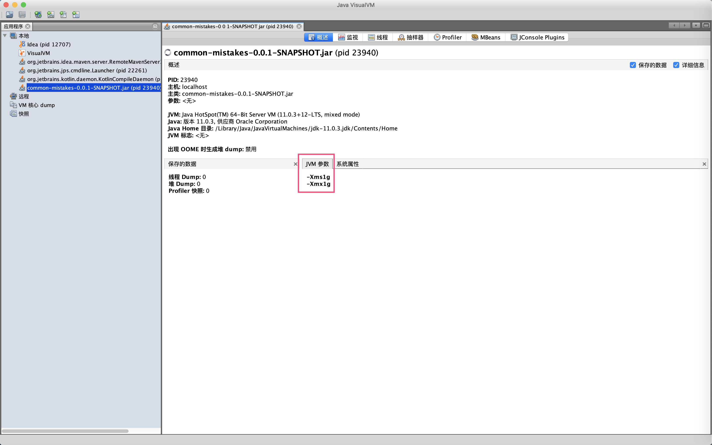

继续观察监视面板可以看到，JVM 的 GC 活动基本是 10 秒发生一次，堆内存在 250MB 到 900MB 之间波动，活动线程数是 22。我们可以在监视面板看到 JVM 的基本情况，也可以直接在这里进行手动 GC 和堆 Dump 操作：

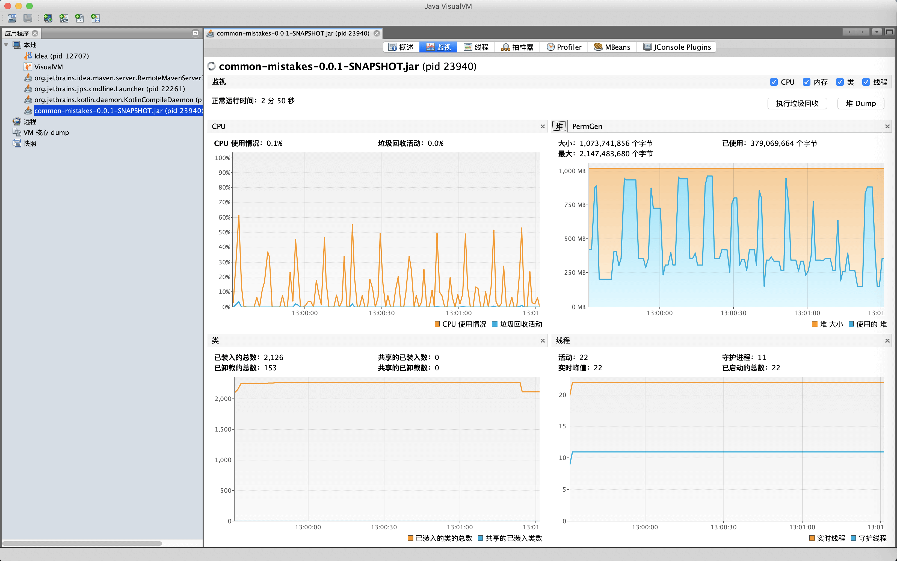

### jconsole

如果希望看到各个内存区的 GC 曲线图，可以使用 jconsole 观察。jconsole 也是一个综合性图形界面监控工具，比 jvisualvm 更方便的一点是，可以用曲线的形式监控各种数据，包括 MBean 中的属性值：

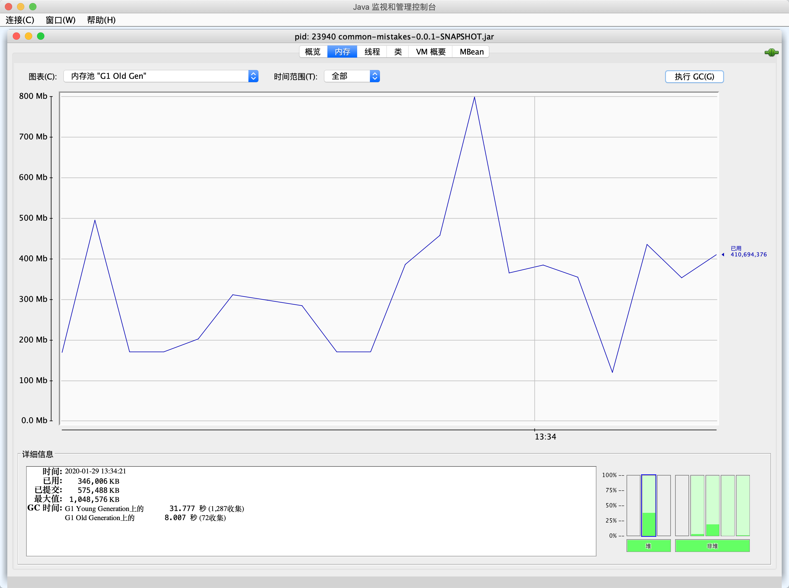

### jstat

同样，如果没有条件使用图形界面（毕竟在 Linux 服务器上，我们主要使用命令行工具），又希望看到 GC 趋势的话，我们可以使用 jstat 工具。

jstat 工具允许以固定的监控频次输出 JVM 的各种监控指标，比如使用 -gcutil 输出 GC 和内存占用汇总信息，每隔 5 秒输出一次，输出 100 次，可以看到 Young GC 比较频繁，而 Full GC 基本 10 秒一次：

```
➜  ~ jstat -gcutil 23940 5000 100
  S0     S1     E      O      M     CCS    YGC     YGCT    FGC    FGCT    CGC    CGCT     GCT
  0.00 100.00   0.36  87.63  94.30  81.06    539   14.021    33    3.972   837    0.976   18.968
  0.00 100.00   0.60  69.51  94.30  81.06    540   14.029    33    3.972   839    0.978   18.979
  0.00   0.00   0.50  99.81  94.27  81.03    548   14.143    34    4.002   840    0.981   19.126
  0.00 100.00   0.59  70.47  94.27  81.03    549   14.177    34    4.002   844    0.985   19.164
  0.00 100.00   0.57  99.85  94.32  81.09    550   14.204    34    4.002   845    0.990   19.196
  0.00 100.00   0.65  77.69  94.32  81.09    559   14.469    36    4.198   847    0.993   19.659
  0.00 100.00   0.65  77.69  94.32  81.09    559   14.469    36    4.198   847    0.993   19.659
  0.00 100.00   0.70  35.54  94.32  81.09    567   14.763    37    4.378   853    1.001   20.142
  0.00 100.00   0.70  41.22  94.32  81.09    567   14.763    37    4.378   853    1.001   20.142
  0.00 100.00   1.89  96.76  94.32  81.09    574   14.943    38    4.487   859    1.007   20.438
  0.00 100.00   1.39  39.20  94.32  81.09    575   14.946    38    4.487   861    1.010   20.442
```

其中，S0 表示 Survivor0 区占用百分比，S1 表示 Survivor1 区占用百分比，E 表示 Eden 区占用百分比，O 表示老年代占用百分比，M 表示元数据区占用百分比，YGC 表示年轻代回收次数，YGCT 表示年轻代回收耗时，FGC 表示老年代回收次数，FGCT 表示老年代回收耗时。

jstat 命令的参数众多，包含 -class、-compiler、-gc 等。Java 8、Linux/Unix 平台 jstat 工具的完整介绍，你可以查看这里。jstat 定时输出的特性，可以方便我们持续观察程序的各项指标。

继续来到线程面板可以看到，大量以 Thread 开头的线程基本都是有节奏的 10 秒运行一下，其他时间都在休眠，和我们的代码逻辑匹配：

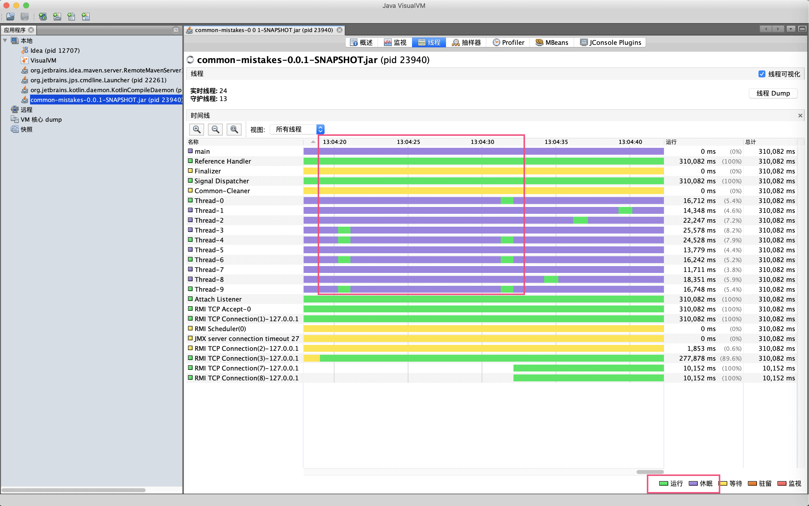

点击面板的线程 Dump 按钮，可以查看线程瞬时的线程栈：

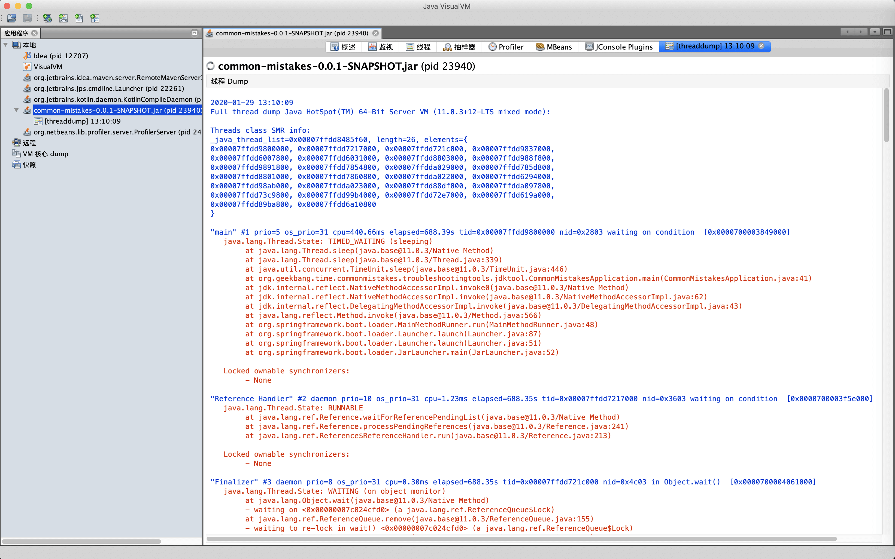

### jstack

通过命令行工具 jstack，也可以实现抓取线程栈的操作：

```
➜  ~ jstack 23940
2020-01-29 13:08:15
Full thread dump Java HotSpot(TM) 64-Bit Server VM (11.0.3+12-LTS mixed mode):
...
"main" #1 prio=5 os_prio=31 cpu=440.66ms elapsed=574.86s tid=0x00007ffdd9800000 nid=0x2803 waiting on condition  [0x0000700003849000]
   java.lang.Thread.State: TIMED_WAITING (sleeping)
  at java.lang.Thread.sleep([email protected]/Native Method)
  at java.lang.Thread.sleep([email protected]/Thread.java:339)
  at java.util.concurrent.TimeUnit.sleep([email protected]/TimeUnit.java:446)
  at org.geekbang.time.commonmistakes.troubleshootingtools.jdktool.CommonMistakesApplication.main(CommonMistakesApplication.java:41)
  at jdk.internal.reflect.NativeMethodAccessorImpl.invoke0([email protected]/Native Method)
  at jdk.internal.reflect.NativeMethodAccessorImpl.invoke([email protected]/NativeMethodAccessorImpl.java:62)
  at jdk.internal.reflect.DelegatingMethodAccessorImpl.invoke([email protected]/DelegatingMethodAccessorImpl.java:43)
  at java.lang.reflect.Method.invoke([email protected]/Method.java:566)
  at org.springframework.boot.loader.MainMethodRunner.run(MainMethodRunner.java:48)
  at org.springframework.boot.loader.Launcher.launch(Launcher.java:87)
  at org.springframework.boot.loader.Launcher.launch(Launcher.java:51)
  at org.springframework.boot.loader.JarLauncher.main(JarLauncher.java:52)
"Thread-1" #13 prio=5 os_prio=31 cpu=17851.77ms elapsed=574.41s tid=0x00007ffdda029000 nid=0x9803 waiting on condition  [0x000070000539d000]
   java.lang.Thread.State: TIMED_WAITING (sleeping)
  at java.lang.Thread.sleep([email protected]/Native Method)
  at java.lang.Thread.sleep([email protected]/Thread.java:339)
  at java.util.concurrent.TimeUnit.sleep([email protected]/TimeUnit.java:446)
  at org.geekbang.time.commonmistakes.troubleshootingtools.jdktool.CommonMistakesApplication.lambda$null$1(CommonMistakesApplication.java:33)
  at org.geekbang.time.commonmistakes.troubleshootingtools.jdktool.CommonMistakesApplication$$Lambda$41/0x00000008000a8c40.run(Unknown Source)
  at java.lang.Thread.run([email protected]/Thread.java:834)
...
```

抓取后可以使用类似fastthread这样的在线分析工具来分析线程栈。

### jcmd

最后，我们来看一下 Java HotSpot 虚拟机的 NMT 功能。

通过 NMT，我们可以观察细粒度内存使用情况，设置 -XX:NativeMemoryTracking=summary/detail 可以开启 NMT 功能，开启后可以使用 jcmd 工具查看 NMT 数据。

我们重新启动一次程序，这次加上 JVM 参数以 detail 方式开启 NMT：

```
-Xms1g -Xmx1g -XX:ThreadStackSize=256k -XX:NativeMemoryTracking=detail
```

在这里，我们还增加了 -XX:ThreadStackSize 参数，并将其值设置为 256k，也就是期望把线程栈设置为 256KB。我们通过 NMT 观察一下设置是否成功。

启动程序后执行如下 jcmd 命令，以概要形式输出 NMT 结果。可以看到，当前有 32 个线程，线程栈总共保留了差不多 4GB 左右的内存。我们明明配置线程栈最大 256KB 啊，为什么会出现 4GB 这么夸张的数字呢，到底哪里出了问题呢？

```
➜  ~ jcmd 24404 VM.native_memory summary
24404:
Native Memory Tracking:
Total: reserved=6635310KB, committed=5337110KB
\-                 Java Heap (reserved=1048576KB, committed=1048576KB)
                            (mmap: reserved=1048576KB, committed=1048576KB)
\-                     Class (reserved=1066233KB, committed=15097KB)
                            (classes #902)
                            (malloc=9465KB #908)
                            (mmap: reserved=1056768KB, committed=5632KB)
\-                    Thread (reserved=4209797KB, committed=4209797KB)
                            (thread #32)
                            (stack: reserved=4209664KB, committed=4209664KB)
                            (malloc=96KB #165)
                            (arena=37KB #59)
\-                      Code (reserved=249823KB, committed=2759KB)
                            (malloc=223KB #730)
                            (mmap: reserved=249600KB, committed=2536KB)
\-                        GC (reserved=48700KB, committed=48700KB)
                            (malloc=10384KB #135)
                            (mmap: reserved=38316KB, committed=38316KB)
\-                  Compiler (reserved=186KB, committed=186KB)
                            (malloc=56KB #105)
                            (arena=131KB #7)
\-                  Internal (reserved=9693KB, committed=9693KB)
                            (malloc=9661KB #2585)
                            (mmap: reserved=32KB, committed=32KB)
\-                    Symbol (reserved=2021KB, committed=2021KB)
                            (malloc=1182KB #334)
                            (arena=839KB #1)
\-    Native Memory Tracking (reserved=85KB, committed=85KB)
                            (malloc=5KB #53)
                            (tracking overhead=80KB)
\-               Arena Chunk (reserved=196KB, committed=196KB)
                            (malloc=196KB)            
```

重新以 VM.native_memory detail 参数运行 jcmd：

```
jcmd 24404 VM.native_memory detail
```

可以看到，有 16 个可疑线程，每一个线程保留了 262144KB 内存，也就是 256MB（通过下图红框可以看到，使用关键字 262144KB for Thread Stack from 搜索到了 16 个结果）：

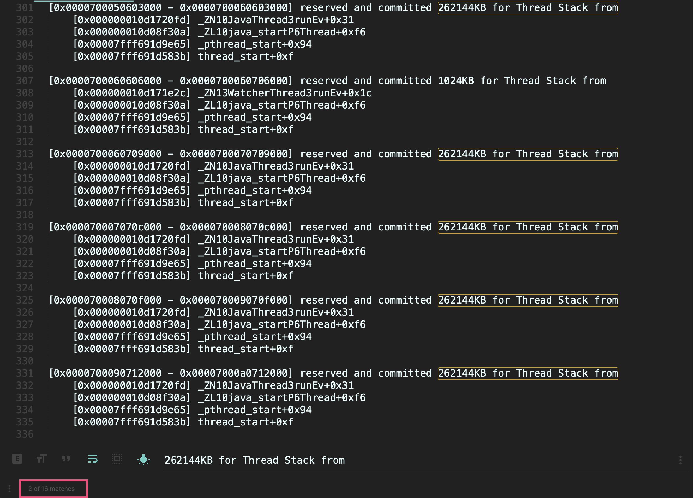

其实，ThreadStackSize 参数的单位是 KB，所以我们如果要设置线程栈 256KB，那么应该设置 256 而不是 256k。重新设置正确的参数后，使用 jcmd 再次验证下：

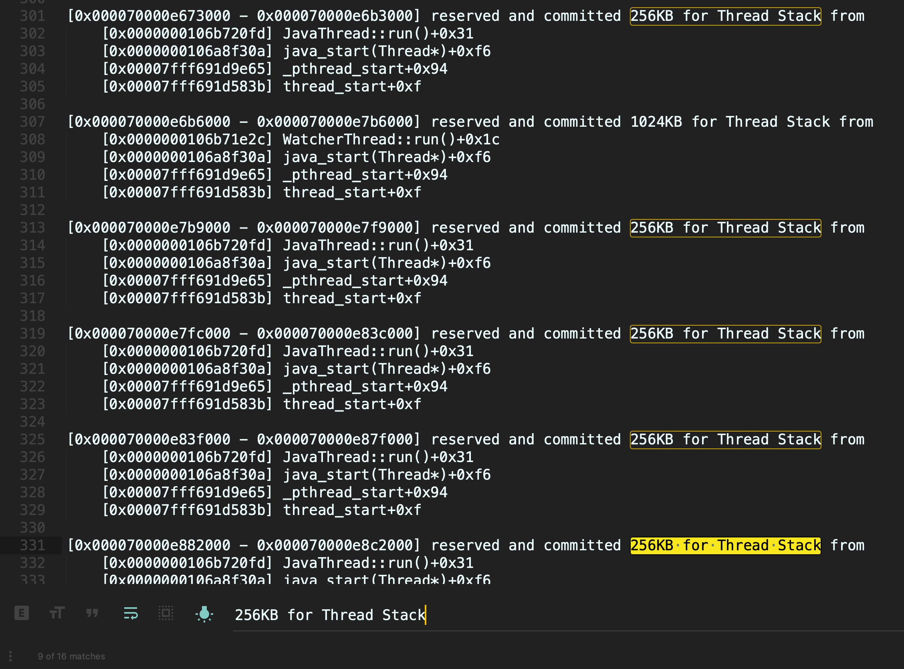

除了用于查看 NMT 外，jcmd 还有许多功能。我们可以通过 help，看到它的所有功能：

```
jcmd 24781 help
```

对于其中每一种功能，我们都可以进一步使用 help 来查看介绍。比如，使用 GC.heap_info 命令可以打印 Java 堆的一些信息：

```
jcmd 24781 help GC.heap_info
```

除了 jps、jinfo、jcmd、jstack、jstat、jconsole、jvisualvm 外，JDK 中还有一些工具，你可以通过官方文档查看完整介绍。

## 使用 Wireshark 分析 SQL 批量插入慢的问题

我之前遇到过这样一个案例：有一个数据导入程序需要导入大量的数据，开发同学就想到了使用 Spring JdbcTemplate 的批量操作功能进行数据批量导入，但是发现性能非常差，和普通的单条 SQL 执行性能差不多。

我们重现下这个案例。启动程序后，首先创建一个 testuser 表，其中只有一列 name，然后使用 JdbcTemplate 的 batchUpdate 方法，批量插入 10000 条记录到 testuser 表：

```
@SpringBootApplication
@Slf4j
public class BatchInsertAppliation implements CommandLineRunner {
    @Autowired
    private JdbcTemplate jdbcTemplate;
    public static void main(String[] args) {
        SpringApplication.run(BatchInsertApplication.class, args);
    }
    @PostConstruct
    public void init() {
        //初始化表
        jdbcTemplate.execute("drop table IF EXISTS `testuser`;");
        jdbcTemplate.execute("create TABLE `testuser` (\n" +
                "  `id` bigint(20) NOT NULL AUTO_INCREMENT,\n" +
                "  `name` varchar(255) NOT NULL,\n" +
                "  PRIMARY KEY (`id`)\n" +
                ") ENGINE=InnoDB DEFAULT CHARSET=utf8mb4;");
    }
    @Override
    public void run(String... args) {
        long begin = System.currentTimeMillis();
        String sql = "INSERT INTO `testuser` (`name`) VALUES (?)";
        //使用JDBC批量更新
        jdbcTemplate.batchUpdate(sql, new BatchPreparedStatementSetter() {
            @Override
            public void setValues(PreparedStatement preparedStatement, int i) throws SQLException {
                //第一个参数(索引从1开始)，也就是name列赋值
                preparedStatement.setString(1, "usera" + i);
            }
            @Override
            public int getBatchSize() {
                //批次大小为10000
                return 10000;
            }
        });
        log.info("took : {} ms", System.currentTimeMillis() - begin);
    }
}
```

执行程序后可以看到，1 万条数据插入耗时 26 秒：

```
[14:44:19.094] [main] [INFO ] [o.g.t.c.t.network.BatchInsertApplication:52  ] - took : 26144 ms
```

其实，对于批量操作，我们希望程序可以把多条 insert SQL 语句合并成一条，或至少是一次性提交多条语句到数据库，以减少和 MySQL 交互次数、提高性能。那么，我们的程序是这样运作的吗？

我在加餐 3中提到一条原则，“分析问题一定是需要依据的，靠猜是猜不出来的”。现在，我们就使用网络分析工具 Wireshark 来分析一下这个案例，眼见为实。

首先，我们可以在这里下载 Wireshark，启动后选择某个需要捕获的网卡。由于我们连接的是本地的 MySQL，因此选择 loopback 回环网卡：

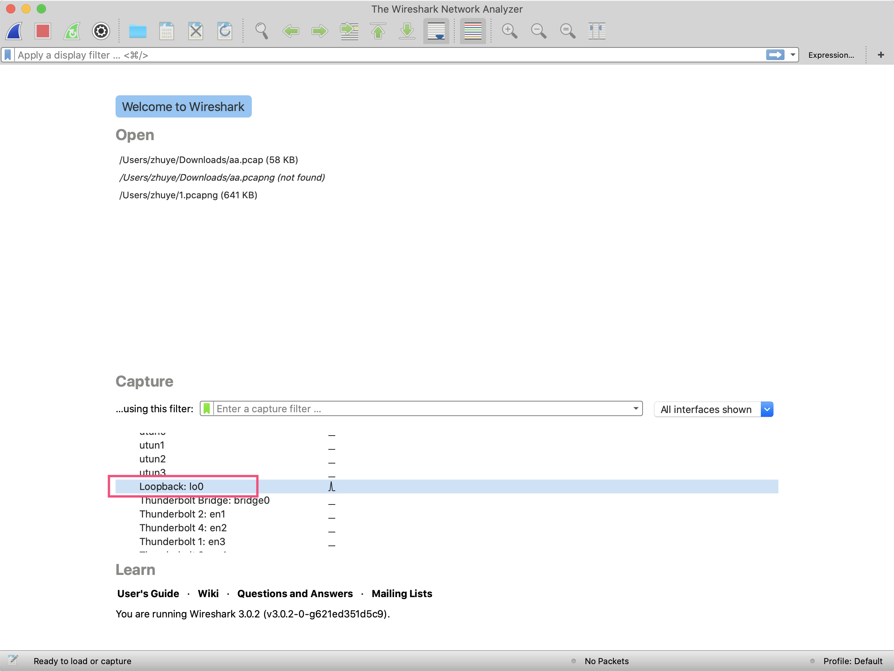

然后，Wireshark 捕捉这个网卡的所有网络流量。我们可以在上方的显示过滤栏输入 tcp.port == 6657，来过滤出所有 6657 端口的 TCP 请求（因为我们是通过 6657 端口连接 MySQL 的）。

可以看到，程序运行期间和 MySQL 有大量交互。因为 Wireshark 直接把 TCP 数据包解析为了 MySQL 协议，所以下方窗口可以直接显示 MySQL 请求的 SQL 查询语句。我们看到，testuser 表的每次 insert 操作，插入的都是一行记录：

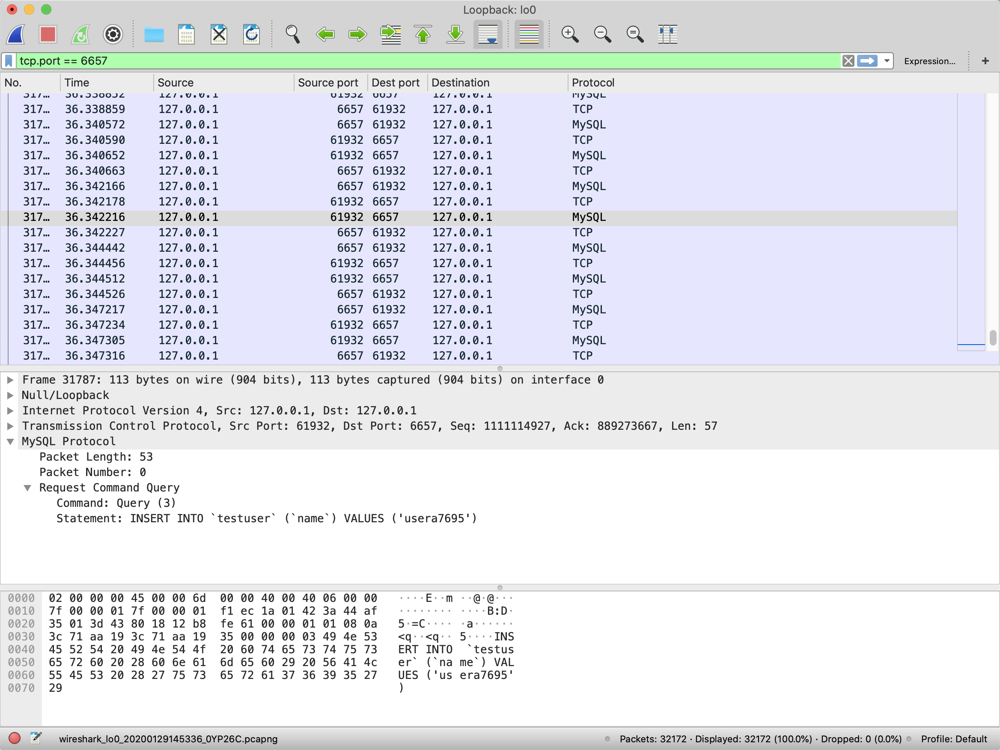

如果列表中的 Protocol 没有显示 MySQL 的话，你可以手动点击 Analyze 菜单的 Decode As 菜单，然后加一条规则，把 6657 端口设置为 MySQL 协议：

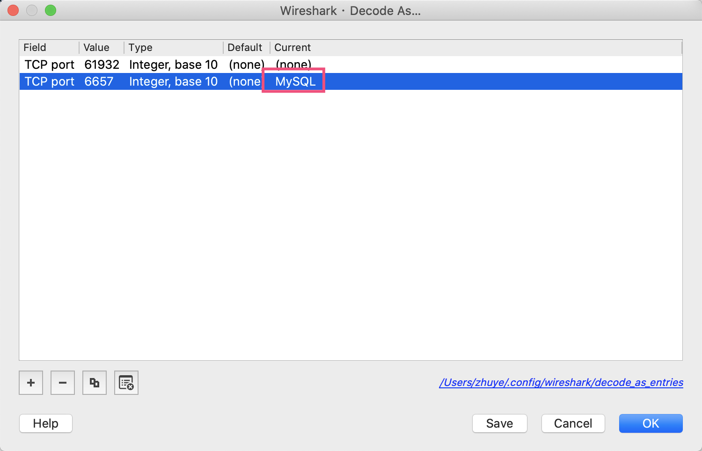

这就说明，我们的程序并不是在做批量插入操作，和普通的单条循环插入没有区别。调试程序进入 ClientPreparedStatement 类，可以看到执行批量操作的是 executeBatchInternal 方法。executeBatchInternal 方法的源码如下：

```
@Override
protected long[] executeBatchInternal() throws SQLException {
    synchronized (checkClosed().getConnectionMutex()) {
        if (this.connection.isReadOnly()) {
            throw new SQLException(Messages.getString("PreparedStatement.25") + Messages.getString("PreparedStatement.26"),
                    MysqlErrorNumbers.SQL_STATE_ILLEGAL_ARGUMENT);
        }
        if (this.query.getBatchedArgs() == null || this.query.getBatchedArgs().size() == 0) {
            return new long[0];
        }
        // we timeout the entire batch, not individual statements
        int batchTimeout = getTimeoutInMillis();
        setTimeoutInMillis(0);
        resetCancelledState();
        try {
            statementBegins();
            clearWarnings();
            if (!this.batchHasPlainStatements && this.rewriteBatchedStatements.getValue()) {
                if (((PreparedQuery<?>) this.query).getParseInfo().canRewriteAsMultiValueInsertAtSqlLevel()) {
                    return executeBatchedInserts(batchTimeout);
                }
                if (!this.batchHasPlainStatements && this.query.getBatchedArgs() != null
                        && this.query.getBatchedArgs().size() > 3 /* cost of option setting rt-wise */) {
                    return executePreparedBatchAsMultiStatement(batchTimeout);
                }
            }
            return executeBatchSerially(batchTimeout);
        } finally {
            this.query.getStatementExecuting().set(false);
            clearBatch();
        }
    }
}
```

注意第 18 行，判断了 rewriteBatchedStatements 参数是否为 true，是才会开启批量的优化。优化方式有 2 种：

如果有条件的话，优先把 insert 语句优化为一条语句，也就是 executeBatchedInserts 方法；

如果不行的话，再尝试把 insert 语句优化为多条语句一起提交，也就是 executePreparedBatchAsMultiStatement 方法。

到这里就明朗了，实现批量提交优化的关键，在于 rewriteBatchedStatements 参数。我们修改连接字符串，并将其值设置为 true：

```
spring.datasource.url=jdbc:mysql://localhost:6657/common_mistakes?characterEncoding=UTF-8&useSSL=false&rewriteBatchedStatements=true
```

重新按照之前的步骤打开 Wireshark 验证，可以看到：

这次 insert SQL 语句被拼接成了一条语句（如第二个红框所示）；

这个 TCP 包因为太大被分割成了 11 个片段传输，#699 请求是最后一个片段，其实际内容是 insert 语句的最后一部分内容（如第一和第三个红框显示）。

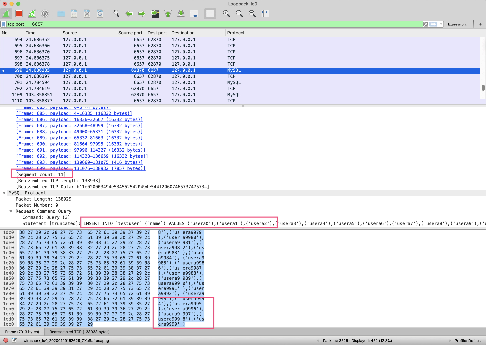

为了查看整个 TCP 连接的所有数据包，你可以在请求上点击右键，选择 Follow->TCP Stream：

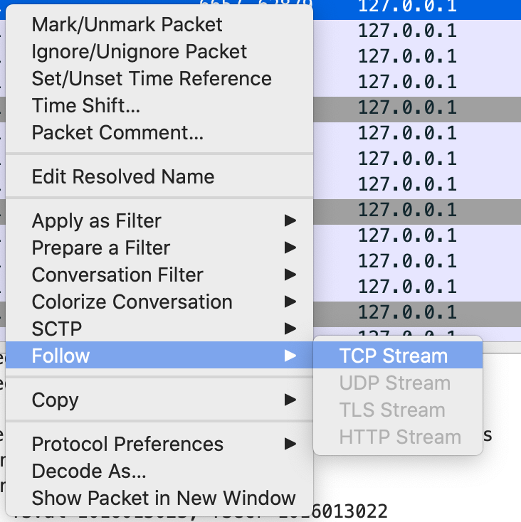

打开后可以看到，从 MySQL 认证开始到 insert 语句的所有数据包的内容：

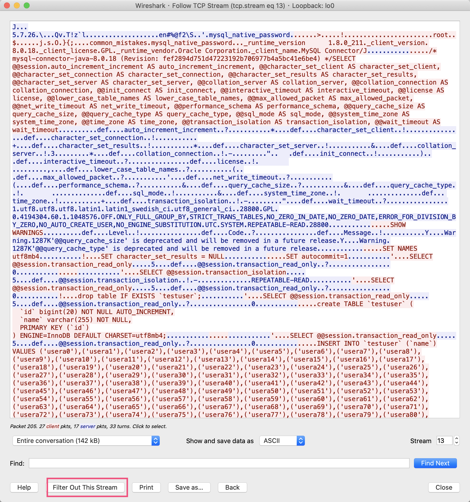

查看最开始的握手数据包可以发现，TCP 的最大分段大小（MSS）是 16344 字节，而我们的 MySQL 超长 insert 的数据一共 138933 字节，因此被分成了 11 段传输，其中最大的一段是 16332 字节，低于 MSS 要求的 16344 字节。

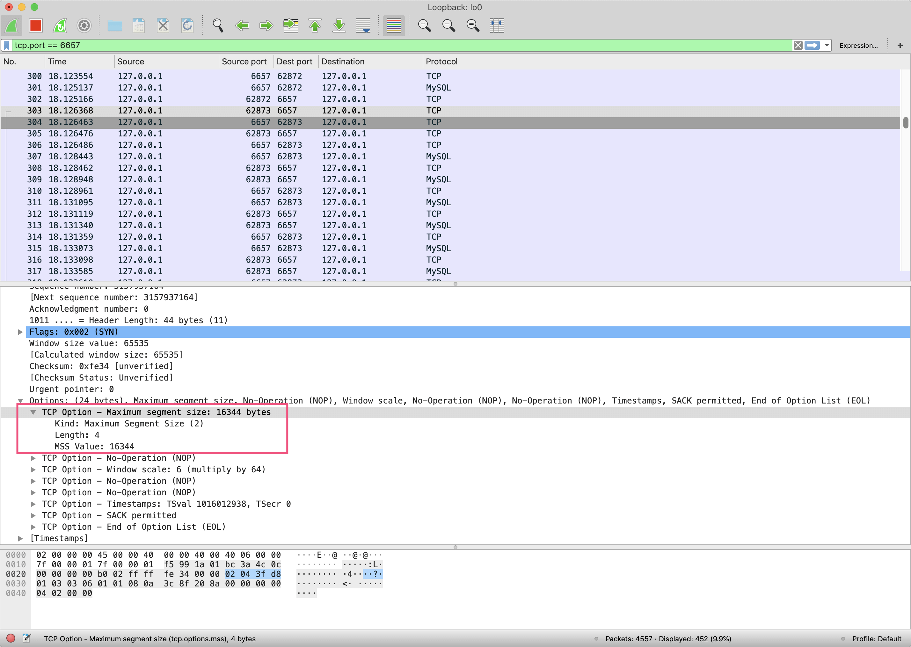

最后可以看到插入 1 万条数据仅耗时 253 毫秒，性能提升了 100 倍：

```
[20:19:30.185] [main] [INFO ] [o.g.t.c.t.network.BatchInsertApplication:52  ] - took : 253 ms
```

虽然我们一直在使用 MySQL，但我们很少会考虑 MySQL Connector Java 是怎么和 MySQL 交互的，实际发送给 MySQL 的 SQL 语句又是怎样的。有没有感觉到，MySQL 协议其实并不遥远，我们完全可以使用 Wireshark 来观察、分析应用程序与 MySQL 交互的整个流程。

## 重点回顾

今天，我就使用 JDK 自带工具查看 JVM 情况、使用 Wireshark 分析 SQL 批量插入慢的问题，和你展示了一些工具及其用法。

首先，JDK 自带的一些监控和故障诊断工具中，有命令行工具也有图形工具。其中，命令行工具更适合在服务器上使用，图形界面工具用于本地观察数据更直观。为了帮助你用好这些工具，我们带你使用这些工具，分析了程序错误设置 JVM 参数的两个问题，并且观察了 GC 工作的情况。

然后，我们使用 Wireshark 分析了 MySQL 批量 insert 操作慢的问题。我们看到，通过 Wireshark 分析网络包可以让一切变得如此透明。因此，学好 Wireshark，对我们排查 C/S 网络程序的 Bug 或性能问题，会有非常大的帮助。

比如，遇到诸如 Connection reset、Broken pipe 等网络问题的时候，你可以利用 Wireshark 来定位问题，观察客户端和服务端之间到底出了什么问题。

此外，如果你需要开发网络程序的话，Wireshark 更是分析协议、确认程序是否正确实现的必备工具。

今天用到的代码，我都放在了 GitHub 上，你可以点击这个链接查看。

## 思考与讨论

JDK 中还有一个 jmap 工具，我们会使用 jmap -dump 命令来进行堆转储。那么，这条命令和 jmap -dump:live 有什么区别呢？你能否设计一个实验，来证明下它们的区别呢？

你有没有想过，客户端是如何和 MySQL 进行认证的呢？你能否对照MySQL 的文档，使用 Wireshark 观察分析这一过程呢？

在平时工作中，你还会使用什么工具来分析排查 Java 应用程序的问题呢？我是朱晔，欢迎在评论区与我留言分享你的想法，也欢迎你把今天的内容分享给你的朋友或同事，一起交流。
