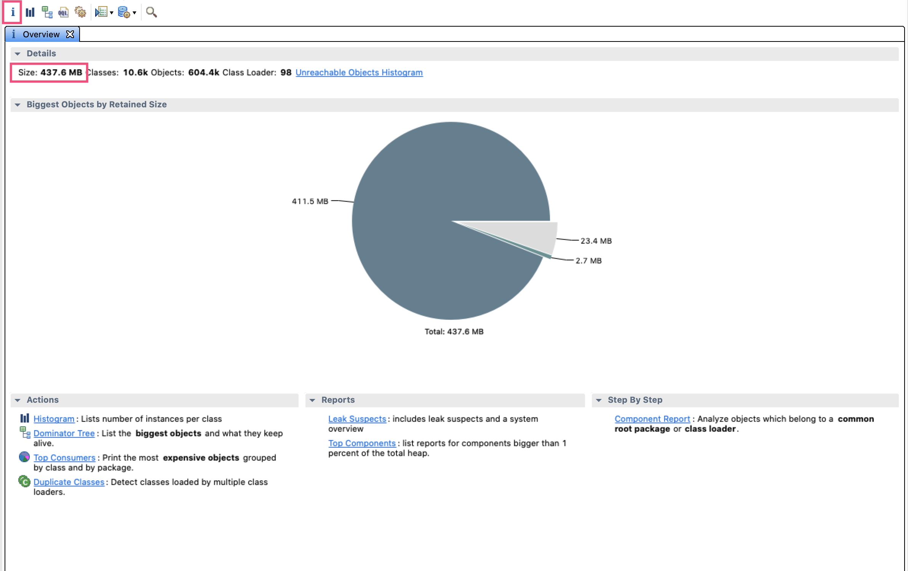
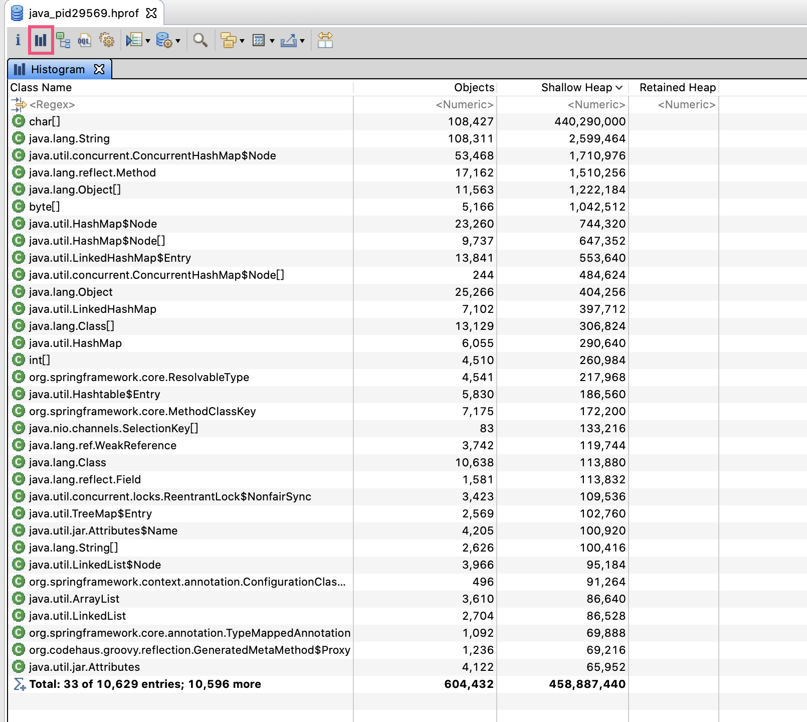
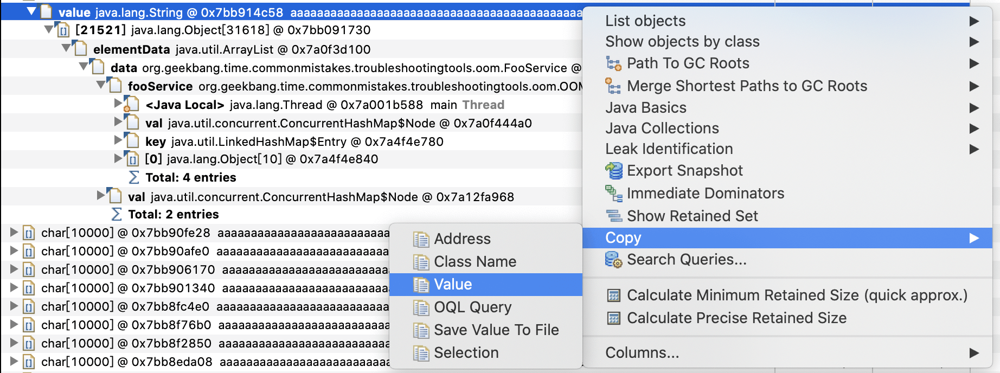
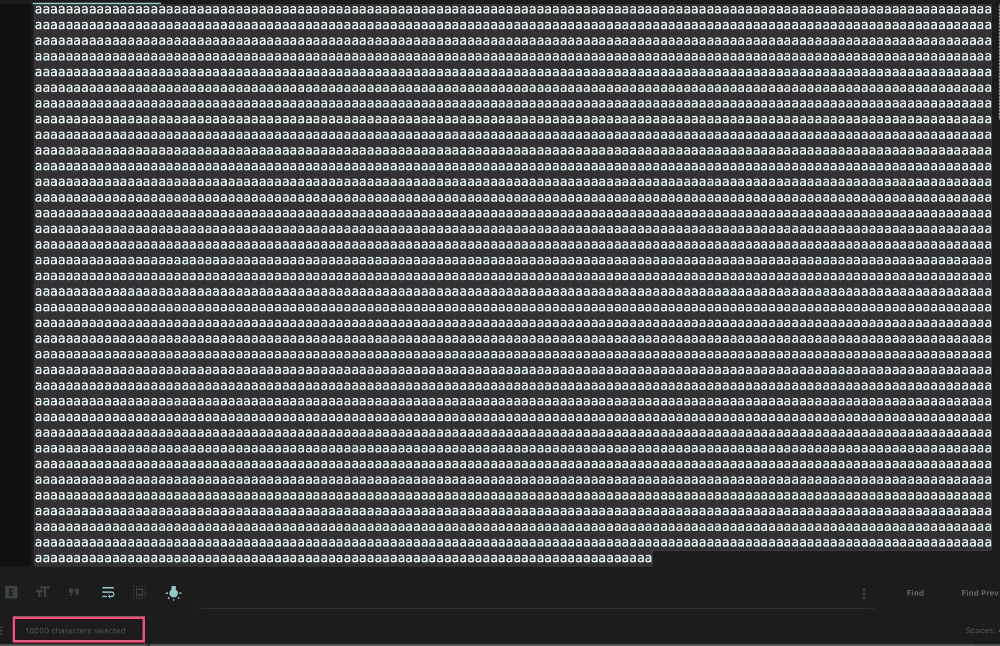
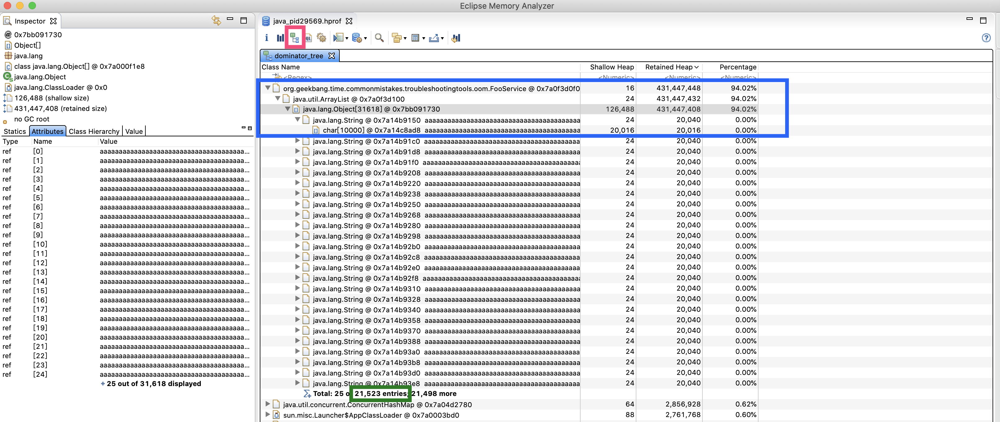
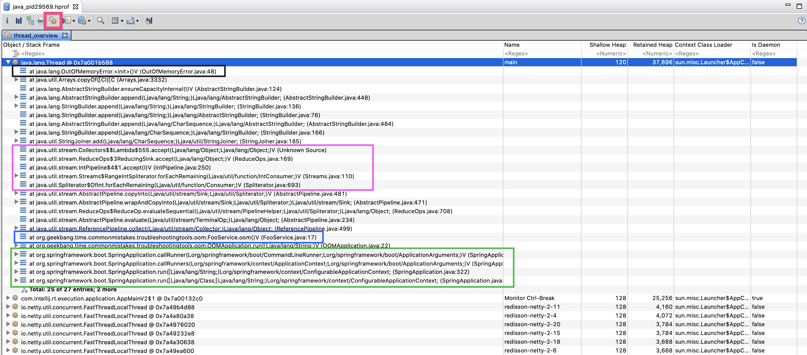
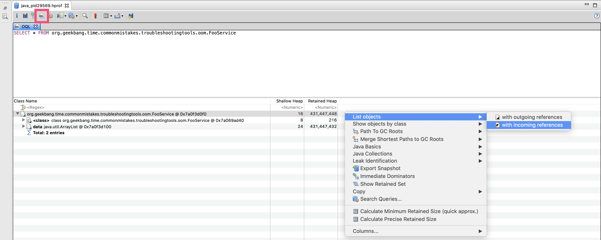
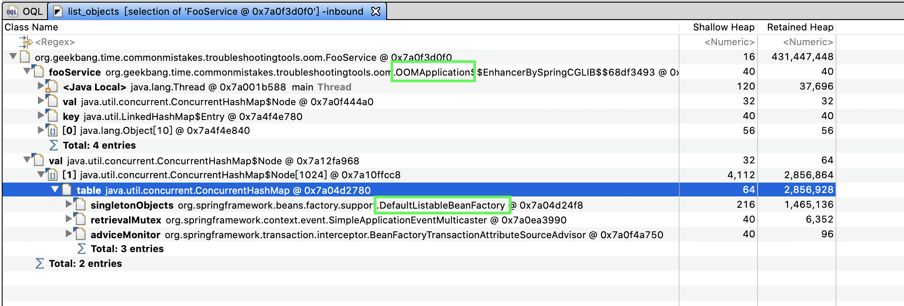
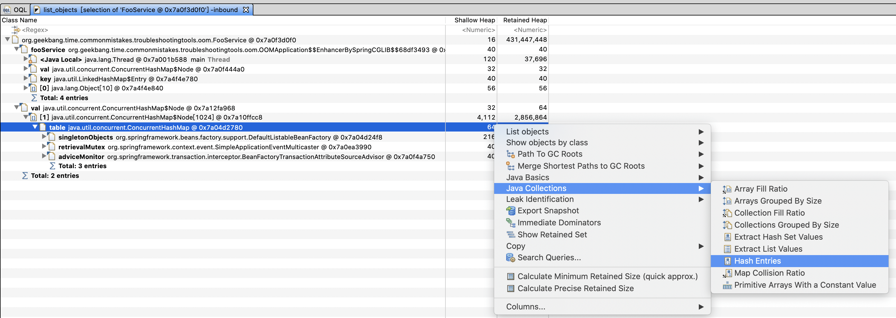

# 35 加餐5：分析定位Java问题，一定要用好这些工具（二）

你好，我是朱晔。

在上一篇加餐中，我们介绍了使用 JDK 内置的一些工具、网络抓包工具 Wireshark 去分析、定位 Java 程序的问题。很多同学看完这一讲，留言反馈说是“打开了一片新天地，之前没有关注过 JVM”“利用 JVM 工具发现了生产 OOM 的原因”。

其实，工具正是帮助我们深入到框架和组件内部，了解其运作方式和原理的重要抓手。所以，我们一定要用好它们。

今天，我继续和你介绍如何使用 JVM 堆转储的工具 MAT 来分析 OOM 问题，以及如何使用全能的故障诊断工具 Arthas 来分析、定位高 CPU 问题。

## 使用 MAT 分析 OOM 问题

对于排查 OOM 问题、分析程序堆内存使用情况，最好的方式就是分析堆转储。

堆转储，包含了堆现场全貌和线程栈信息（Java 6 Update 14 开始包含）。我们在上一篇加餐中看到，使用 jstat 等工具虽然可以观察堆内存使用情况的变化，但是对程序内到底有多少对象、哪些是大对象还一无所知，也就是说只能看到问题但无法定位问题。而堆转储，就好似得到了病人在某个瞬间的全景核磁影像，可以拿着慢慢分析。

Java 的 OutOfMemoryError 是比较严重的问题，需要分析出根因，所以对生产应用一般都会这样设置 JVM 参数，方便发生 OOM 时进行堆转储：

```
-XX:+HeapDumpOnOutOfMemoryError -XX:HeapDumpPath=.
```

上一篇加餐中我们提到的 jvisualvm 工具，同样可以进行一键堆转储后，直接打开这个 dump 查看。但是，jvisualvm 的堆转储分析功能并不是很强大，只能查看类使用内存的直方图，无法有效跟踪内存使用的引用关系，所以我更推荐使用 Eclipse 的 Memory Analyzer（也叫做 MAT）做堆转储的分析。你可以点击这个链接，下载 MAT。

使用 MAT 分析 OOM 问题，一般可以按照以下思路进行：

通过支配树功能或直方图功能查看消耗内存最大的类型，来分析内存泄露的大概原因；

查看那些消耗内存最大的类型、详细的对象明细列表，以及它们的引用链，来定位内存泄露的具体点；

配合查看对象属性的功能，可以脱离源码看到对象的各种属性的值和依赖关系，帮助我们理清程序逻辑和参数；

辅助使用查看线程栈来看 OOM 问题是否和过多线程有关，甚至可以在线程栈看到 OOM 最后一刻出现异常的线程。

比如，我手头有一个 OOM 后得到的转储文件 java_pid29569.hprof，现在要使用 MAT 的直方图、支配树、线程栈、OQL 等功能来分析此次 OOM 的原因。

首先，用 MAT 打开后先进入的是概览信息界面，可以看到整个堆是 437.6MB：



那么，这 437.6MB 都是什么对象呢？

如图所示，工具栏的第二个按钮可以打开直方图，直方图按照类型进行分组，列出了每个类有多少个实例，以及占用的内存。可以看到，char\[\]字节数组占用内存最多，对象数量也很多，结合第二位的 String 类型对象数量也很多，大概可以猜出（String 使用 char\[\]作为实际数据存储）程序可能是被字符串占满了内存，导致 OOM。



我们继续分析下，到底是不是这样呢。

在 char\[\]上点击右键，选择 List objects->with incoming references，就可以列出所有的 char\[\]实例，以及每个 char\[\]的整个引用关系链：


随机展开一个 char\[\]，如下图所示：


接下来，我们按照红色框中的引用链来查看，尝试找到这些大 char\[\]的来源：

在①处看到，这些 char\[\]几乎都是 10000 个字符、占用 20000 字节左右（char 是 UTF-16，每一个字符占用 2 字节）；

在②处看到，char\[\]被 String 的 value 字段引用，说明 char\[\]来自字符串；

在③处看到，String 被 ArrayList 的 elementData 字段引用，说明这些字符串加入了一个 ArrayList 中；

在④处看到，ArrayList 又被 FooService 的 data 字段引用，这个 ArrayList 整个 RetainedHeap 列的值是 431MB。

Retained Heap（深堆）代表对象本身和对象关联的对象占用的内存，Shallow Heap（浅堆）代表对象本身占用的内存。比如，我们的 FooService 中的 data 这个 ArrayList 对象本身只有 16 字节，但是其所有关联的对象占用了 431MB 内存。这些就可以说明，肯定有哪里在不断向这个 List 中添加 String 数据，导致了 OOM。

左侧的蓝色框可以查看每一个实例的内部属性，图中显示 FooService 有一个 data 属性，类型是 ArrayList。

如果我们希望看到字符串完整内容的话，可以右键选择 Copy->Value，把值复制到剪贴板或保存到文件中：



这里，我们复制出的是 10000 个字符 a（下图红色部分可以看到）。对于真实案例，查看大字符串、大数据的实际内容对于识别数据来源，有很大意义：



看到这些，我们已经基本可以还原出真实的代码是怎样的了。

其实，我们之前使用直方图定位 FooService，已经走了些弯路。你可以点击工具栏中第三个按钮（下图左上角的红框所示）进入支配树界面（有关支配树的具体概念参考这里）。这个界面会按照对象保留的 Retained Heap 倒序直接列出占用内存最大的对象。

可以看到，第一位就是 FooService，整个路径是 FooSerice->ArrayList->Object\[\]->String->char\[\]（蓝色框部分），一共有 21523 个字符串（绿色方框部分）：



这样，我们就从内存角度定位到 FooService 是根源了。那么，OOM 的时候，FooService 是在执行什么逻辑呢？

为解决这个问题，我们可以点击工具栏的第五个按钮（下图红色框所示）。打开线程视图，首先看到的就是一个名为 main 的线程（Name 列），展开后果然发现了 FooService：



先执行的方法先入栈，所以线程栈最上面是线程当前执行的方法，逐一往下看能看到整个调用路径。因为我们希望了解 FooService.oom() 方法，看看是谁在调用它，它的内部又调用了谁，所以选择以 FooService.oom() 方法（蓝色框）为起点来分析这个调用栈。

往下看整个绿色框部分，oom() 方法被 OOMApplication 的 run 方法调用，而这个 run 方法又被 SpringAppliction.callRunner 方法调用。看到参数中的 CommandLineRunner 你应该能想到，OOMApplication 其实是实现了 CommandLineRunner 接口，所以是 SpringBoot 应用程序启动后执行的。

以 FooService 为起点往上看，从紫色框中的 Collectors 和 IntPipeline，你大概也可以猜出，这些字符串是由 Stream 操作产生的。再往上看，可以发现在 StringBuilder 的 append 操作的时候，出现了 OutOfMemoryError 异常（黑色框部分），说明这这个线程抛出了 OOM 异常。

我们看到，整个程序是 Spring Boot 应用程序，那么 FooService 是不是 Spring 的 Bean 呢，又是不是单例呢？如果能分析出这点的话，就更能确认是因为反复调用同一个 FooService 的 oom 方法，然后导致其内部的 ArrayList 不断增加数据的。

点击工具栏的第四个按钮（如下图红框所示），来到 OQL 界面。在这个界面，我们可以使用类似 SQL 的语法，在 dump 中搜索数据（你可以直接在 MAT 帮助菜单搜索 OQL Syntax，来查看 OQL 的详细语法）。

比如，输入如下语句搜索 FooService 的实例：

```
SELECT * FROM org.geekbang.time.commonmistakes.troubleshootingtools.oom.FooService
```

可以看到只有一个实例，然后我们通过 List objects 功能搜索引用 FooService 的对象：



得到以下结果：



可以看到，一共两处引用：

第一处是，OOMApplication 使用了 FooService，这个我们已经知道了。

第二处是一个 ConcurrentHashMap。可以看到，这个 HashMap 是 DefaultListableBeanFactory 的 singletonObjects 字段，可以证实 FooService 是 Spring 容器管理的单例的 Bean。

你甚至可以在这个 HashMap 上点击右键，选择 Java Collections->Hash Entries 功能，来查看其内容：



这样就列出了所有的 Bean，可以在 Value 上的 Regex 进一步过滤。输入 FooService 后可以看到，类型为 FooService 的 Bean 只有一个，其名字是 fooService：


到现在为止，我们虽然没看程序代码，但是已经大概知道程序出现 OOM 的原因和大概的调用栈了。我们再贴出程序来对比一下，果然和我们看到得一模一样：

```
@SpringBootApplication
public class OOMApplication implements CommandLineRunner {
    @Autowired
    FooService fooService;
    public static void main(String[] args) {
        SpringApplication.run(OOMApplication.class, args);
    }
    @Override
    public void run(String... args) throws Exception {
        //程序启动后，不断调用Fooservice.oom()方法
        while (true) {
            fooService.oom();
        }
    }
}
@Component
public class FooService {
    List<String> data = new ArrayList<>();
    public void oom() {
        //往同一个ArrayList中不断加入大小为10KB的字符串
        data.add(IntStream.rangeClosed(1, 10_000)
                .mapToObj(__ -> "a")
                .collect(Collectors.joining("")));
    }
}
```

到这里，我们使用 MAT 工具从对象清单、大对象、线程栈等视角，分析了一个 OOM 程序的堆转储。可以发现，有了堆转储，几乎相当于拿到了应用程序的源码 + 当时那一刻的快照，OOM 的问题无从遁形。

## 使用 Arthas 分析高 CPU 问题

Arthas是阿里开源的 Java 诊断工具，相比 JDK 内置的诊断工具，要更人性化，并且功能强大，可以实现许多问题的一键定位，而且可以一键反编译类查看源码，甚至是直接进行生产代码热修复，实现在一个工具内快速定位和修复问题的一站式服务。今天，我就带你使用 Arthas 定位一个 CPU 使用高的问题，系统学习下这个工具的使用。

首先，下载并启动 Arthas：

```
curl -O https://alibaba.github.io/arthas/arthas-boot.jar
java -jar arthas-boot.jar
```

启动后，直接找到我们要排查的 JVM 进程，然后可以看到 Arthas 附加进程成功：

```
[INFO] arthas-boot version: 3.1.7
[INFO] Found existing java process, please choose one and hit RETURN.
\* [1]: 12707
  [2]: 30724 org.jetbrains.jps.cmdline.Launcher
  [3]: 30725 org.geekbang.time.commonmistakes.troubleshootingtools.highcpu.HighCPUApplication
  [4]: 24312 sun.tools.jconsole.JConsole
  [5]: 26328 org.jetbrains.jps.cmdline.Launcher
  [6]: 24106 org.netbeans.lib.profiler.server.ProfilerServer
3
[INFO] arthas home: /Users/zhuye/.arthas/lib/3.1.7/arthas
[INFO] Try to attach process 30725
[INFO] Attach process 30725 success.
[INFO] arthas-client connect 127.0.0.1 3658
  ,---.  ,------. ,--------.,--.  ,--.  ,---.   ,---.
 /  O  \ |  .--. ''--.  .--'|  '--'  | /  O  \ '   .-'
|  .-.  ||  '--'.'   |  |   |  .--.  ||  .-.  |`.  `-.
|  | |  ||  |\  \    |  |   |  |  |  ||  | |  |.-'    |
`--' `--'`--' '--'   `--'   `--'  `--'`--' `--'`-----'
wiki      https://alibaba.github.io/arthas
tutorials https://alibaba.github.io/arthas/arthas-tutorials
version   3.1.7
pid       30725
time      2020-01-30 15:48:33
```

输出 help 命令，可以看到所有支持的命令列表。今天，我们会用到 dashboard、thread、jad、watch、ognl 命令，来定位这个 HighCPUApplication 进程。你可以通过官方文档，查看这些命令的完整介绍：


dashboard 命令用于整体展示进程所有线程、内存、GC 等情况，其输出如下：


可以看到，CPU 高并不是 GC 引起的，占用 CPU 较多的线程有 8 个，其中 7 个是 ForkJoinPool.commonPool。学习过加餐 1的话，你应该就知道了，ForkJoinPool.commonPool 是并行流默认使用的线程池。所以，此次 CPU 高的问题，应该出现在某段并行流的代码上。

接下来，要查看最繁忙的线程在执行的线程栈，可以使用 thread -n 命令。这里，我们查看下最忙的 8 个线程：

```
thread -n 8
```

输出如下：


可以看到，由于这些线程都在处理 MD5 的操作，所以占用了大量 CPU 资源。我们希望分析出代码中哪些逻辑可能会执行这个操作，所以需要从方法栈上找出我们自己写的类，并重点关注。

由于主线程也参与了 ForkJoinPool 的任务处理，因此我们可以通过主线程的栈看到需要重点关注 org.geekbang.time.commonmistakes.troubleshootingtools.highcpu.HighCPUApplication 类的 doTask 方法。

接下来，使用 jad 命令直接对 HighCPUApplication 类反编译：

```
jad org.geekbang.time.commonmistakes.troubleshootingtools.highcpu.HighCPUApplication
```

可以看到，调用路径是 main->task()->doTask()，当 doTask 方法接收到的 int 参数等于某个常量的时候，会进行 1 万次的 MD5 操作，这就是耗费 CPU 的来源。那么，这个魔法值到底是多少呢？


你可能想到了，通过 jad 命令继续查看 User 类即可。这里因为是 Demo，所以我没有给出很复杂的逻辑。在业务逻辑很复杂的代码中，判断逻辑不可能这么直白，我们可能还需要分析出 doTask 的“慢”会慢在什么入参上。

这时，我们可以使用 watch 命令来观察方法入参。如下命令，表示需要监控耗时超过 100 毫秒的 doTask 方法的入参，并且输出入参，展开 2 层入参参数：

```
watch org.geekbang.time.commonmistakes.troubleshootingtools.highcpu.HighCPUApplication doTask '{params}' '#cost>100' -x 2
```

可以看到，所有耗时较久的 doTask 方法的入参都是 0，意味着 User.ADMN_ID 常量应该是 0。


最后，我们使用 ognl 命令来运行一个表达式，直接查询 User 类的 ADMIN_ID 静态字段来验证是不是这样，得到的结果果然是 0：

```
[[email protected]]$ ognl '@org[email protected]ADMIN_ID'
@Integer[0]
```

需要额外说明的是，由于 monitor、trace、watch 等命令是通过字节码增强技术来实现的，会在指定类的方法中插入一些切面来实现数据统计和观测，因此诊断结束要执行 shutdown 来还原类或方法字节码，然后退出 Arthas。

在这个案例中，我们通过 Arthas 工具排查了高 CPU 的问题：

首先，通过 dashboard + thread 命令，基本可以在几秒钟内一键定位问题，找出消耗 CPU 最多的线程和方法栈；

然后，直接 jad 反编译相关代码，来确认根因；

此外，如果调用入参不明确的话，可以使用 watch 观察方法入参，并根据方法执行时间来过滤慢请求的入参。

可见，使用 Arthas 来定位生产问题根本用不着原始代码，也用不着通过增加日志来帮助我们分析入参，一个工具即可完成定位问题、分析问题的全套流程。

对于应用故障分析，除了阿里 Arthas 之外，还可以关注去哪儿的Bistoury 工具，其提供了可视化界面，并且可以针对多台机器进行管理，甚至提供了在线断点调试等功能，模拟 IDE 的调试体验。

## 重点回顾

最后，我再和你分享一个案例吧。

有一次开发同学遇到一个 OOM 问题，通过查监控、查日志、查调用链路排查了数小时也无法定位问题，但我拿到堆转储文件后，直接打开支配树图一眼就看到了可疑点。Mybatis 每次查询都查询出了几百万条数据，通过查看线程栈马上可以定位到出现 Bug 的方法名，然后来到代码果然发现因为参数条件为 null 导致了全表查询，整个定位过程不足 5 分钟。

从这个案例我们看到，使用正确的工具、正确的方法来分析问题，几乎可以在几分钟内定位到问题根因。今天，我和你介绍的 MAT 正是分析 Java 堆内存问题的利器，而 Arthas 是快速定位分析 Java 程序生产 Bug 的利器。利用好这两个工具，就可以帮助我们在分钟级定位生产故障。

## 思考与讨论

在介绍线程池的时候，我们模拟了两种可能的 OOM 情况，一种是使用 Executors.newFixedThreadPool，一种是使用 Executors.newCachedThreadPool，你能回忆起 OOM 的原因吗？假设并不知道 OOM 的原因，拿到了这两种 OOM 后的堆转储，你能否尝试使用 MAT 分析堆转储来定位问题呢？

Arthas 还有一个强大的热修复功能。比如，遇到高 CPU 问题时，我们定位出是管理员用户会执行很多次 MD5，消耗大量 CPU 资源。这时，我们可以直接在服务器上进行热修复，步骤是：jad 命令反编译代码 -> 使用文本编辑器（比如 Vim）直接修改代码 -> 使用 sc 命令查找代码所在类的 ClassLoader-> 使用 redefine 命令热更新代码。你可以尝试使用这个流程，直接修复程序（注释 doTask 方法中的相关代码）吗？

在平时工作中，你还会使用什么工具来分析排查 Java 应用程序的问题呢？我是朱晔，欢迎在评论区与我留言分享你的想法，也欢迎你把今天的内容分享给你的朋友或同事，一起交流。
