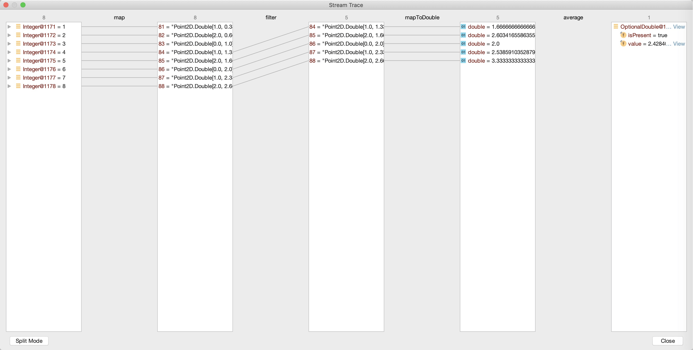
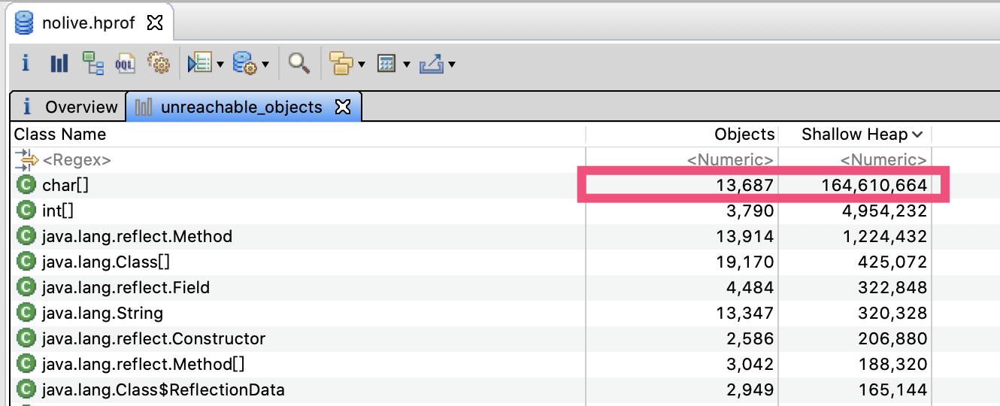
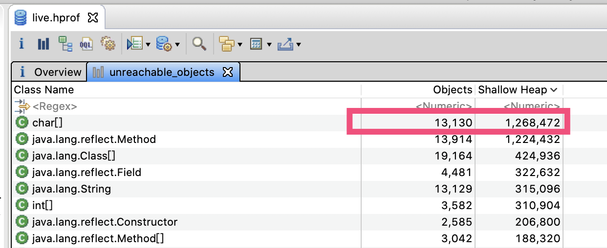
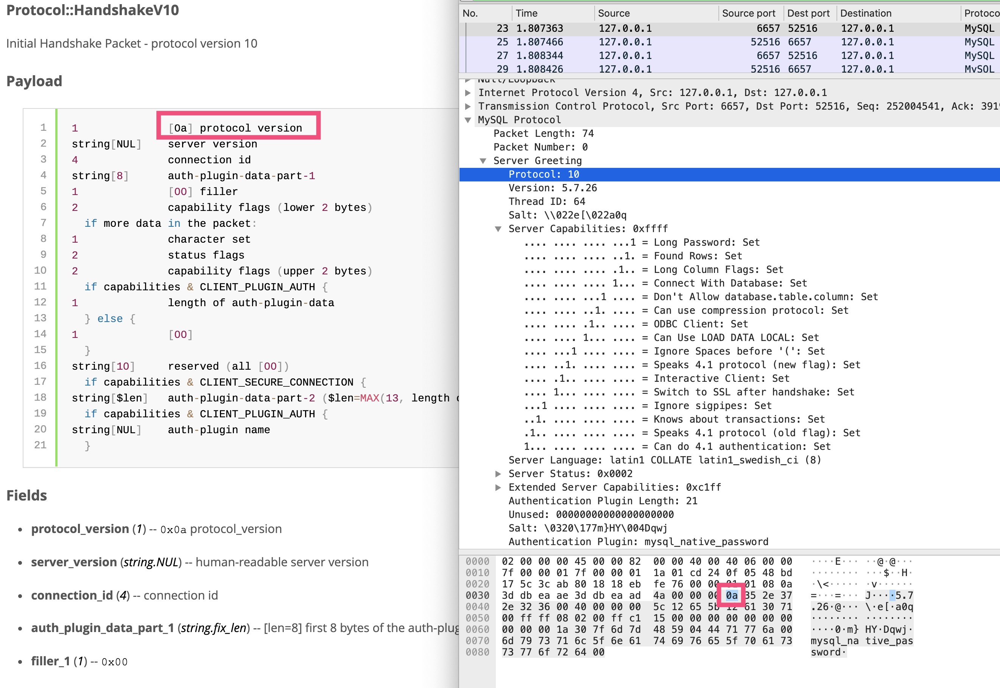
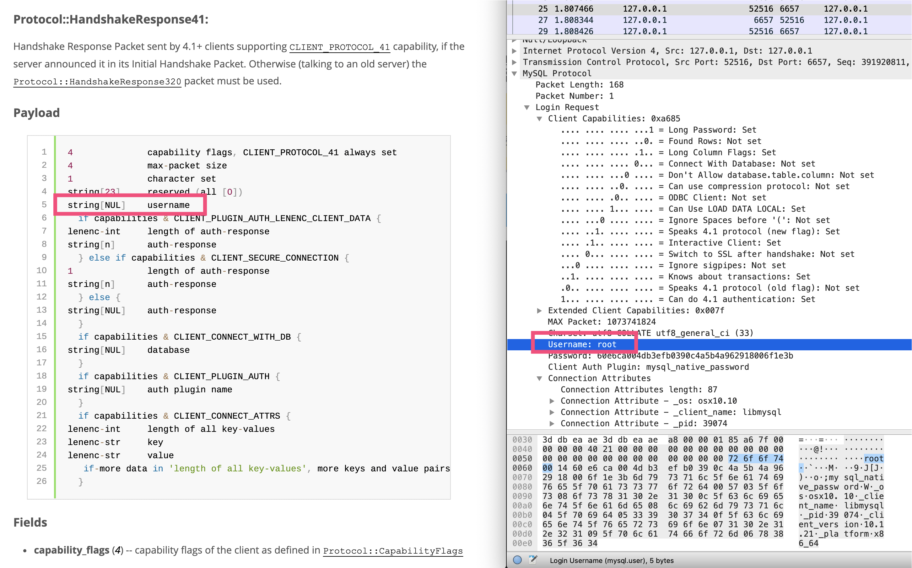
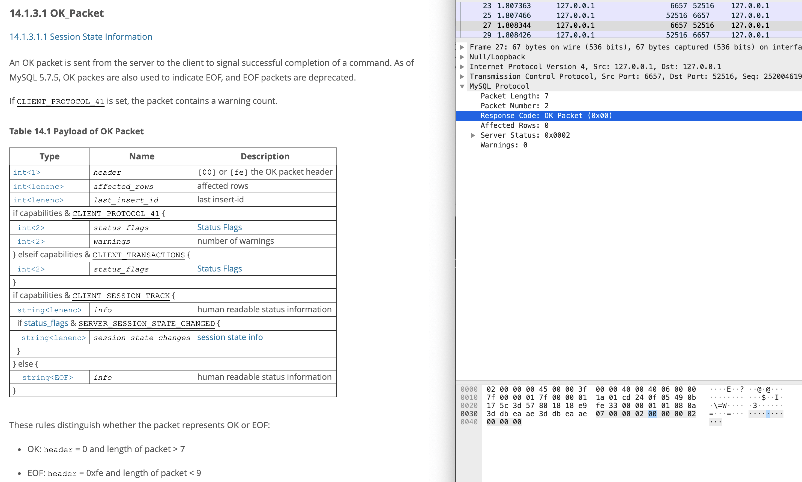

# 答疑篇：加餐篇思考题答案合集

你好，我是朱晔。

今天，我们继续一起分析这门课的“不定期加餐”篇中 5 讲的课后思考题。这些题目涉及了 Java 8 基础知识、定位和分析应用问题相关的几大知识点。

接下来，我们就一一具体分析吧。

### 加餐 1 | 带你吃透课程中 Java 8 的那些重要知识点（一）

问题：对于并行流部分的并行消费处理 1 到 100 的例子，如果把 forEach 替换为 forEachOrdered，你觉得会发生什么呢？

答：forEachOrdered 会让 parallelStream 丧失部分的并行能力，主要原因是 forEach 遍历的逻辑无法并行起来（需要按照循序遍历，无法并行）。

我们来比较下面的三种写法：

```
//模拟消息数据需要1秒时间
private static void consume(int i) {
    try {
        TimeUnit.SECONDS.sleep(1);
    } catch (InterruptedException e) {
        e.printStackTrace();
    }
    System.out.print(i);
}
//模拟过滤数据需要1秒时间
private static boolean filter(int i) {
    try {
        TimeUnit.SECONDS.sleep(1);
    } catch (InterruptedException e) {
        e.printStackTrace();
    }
    return i % 2 == 0;
}
@Test
public void test() {
    System.setProperty("java.util.concurrent.ForkJoinPool.common.parallelism", String.valueOf(10));
    StopWatch stopWatch = new StopWatch();
    stopWatch.start("stream");
    stream();
    stopWatch.stop();
    stopWatch.start("parallelStream");
    parallelStream();
    stopWatch.stop();
    stopWatch.start("parallelStreamForEachOrdered");
    parallelStreamForEachOrdered();
    stopWatch.stop();
    System.out.println(stopWatch.prettyPrint());
}
//filtre和forEach串行
private void stream() {
    IntStream.rangeClosed(1, 10)
            .filter(ForEachOrderedTest::filter)
            .forEach(ForEachOrderedTest::consume);
}
//filter和forEach并行
private void parallelStream() {
    IntStream.rangeClosed(1, 10).parallel()
            .filter(ForEachOrderedTest::filter)
            .forEach(ForEachOrderedTest::consume);
}
//filter并行而forEach串行
private void parallelStreamForEachOrdered() {
    IntStream.rangeClosed(1, 10).parallel()
            .filter(ForEachOrderedTest::filter)
            .forEachOrdered(ForEachOrderedTest::consume);
}
```

得到输出：

```
\---------------------------------------------
ns         %     Task name
\---------------------------------------------
15119607359  065%  stream
2011398298  009%  parallelStream
6033800802  026%  parallelStreamForEachOrdered
```

从输出中，我们可以看到：

stream 方法的过滤和遍历全部串行执行，总时间是 10 秒 +5 秒 =15 秒；

parallelStream 方法的过滤和遍历全部并行执行，总时间是 1 秒 +1 秒 =2 秒；

parallelStreamForEachOrdered 方法的过滤并行执行，遍历串行执行，总时间是 1 秒 +5 秒 =6 秒。

### 加餐 2 | 带你吃透课程中 Java 8 的那些重要知识点（二）

问题 1：使用 Stream 可以非常方便地对 List 做各种操作，那有没有什么办法可以实现在整个过程中观察数据变化呢？比如，我们进行 filter+map 操作，如何观察 filter 后 map 的原始数据呢？

答：要想观察使用 Stream 对 List 的各种操作的过程中的数据变化，主要有下面两个办法。

第一，使用 peek 方法。比如如下代码，我们对数字 1~10 进行了两次过滤，分别是找出大于 5 的数字和找出偶数，我们通过 peek 方法把两次过滤操作之前的原始数据保存了下来：

```
List<Integer> firstPeek = new ArrayList<>();
List<Integer> secondPeek = new ArrayList<>();
List<Integer> result = IntStream.rangeClosed(1, 10)
        .boxed()
        .peek(i -> firstPeek.add(i))
        .filter(i -> i > 5)
        .peek(i -> secondPeek.add(i))
        .filter(i -> i % 2 == 0)
        .collect(Collectors.toList());
System.out.println("firstPeek：" + firstPeek);
System.out.println("secondPeek：" + secondPeek);
System.out.println("result：" + result);
```

最后得到输出，可以看到第一次过滤之前是数字 1~10，一次过滤后变为 6~10，最终输出 6、8、10 三个数字：

```
firstPeek：[1, 2, 3, 4, 5, 6, 7, 8, 9, 10]
secondPeek：[6, 7, 8, 9, 10]
result：[6, 8, 10]
```

第二，借助 IDEA 的 Stream 的调试功能。详见这里，效果类似下图：



问题 2：Collectors 类提供了很多现成的收集器，那我们有没有办法实现自定义的收集器呢？比如，实现一个 MostPopularCollector，来得到 List 中出现次数最多的元素，满足下面两个测试用例：

```
assertThat(Stream.of(1, 1, 2, 2, 2, 3, 4, 5, 5).collect(new MostPopularCollector<>()).get(), is(2));
assertThat(Stream.of('a', 'b', 'c', 'c', 'c', 'd').collect(new MostPopularCollector<>()).get(), is('c'));
```

答：我来说下我的实现思路和方式：通过一个 HashMap 来保存元素的出现次数，最后在收集的时候找出 Map 中出现次数最多的元素：

```
public class MostPopularCollector<T> implements Collector<T, Map<T, Integer>, Optional<T>> {
    //使用HashMap保存中间数据
    @Override
    public Supplier<Map<T, Integer>> supplier() {
        return HashMap::new;
    }
    //每次累积数据则累加Value
    @Override
    public BiConsumer<Map<T, Integer>, T> accumulator() {
        return (acc, elem) -> acc.merge(elem, 1, (old, value) -> old + value);
    }
    //合并多个Map就是合并其Value
    @Override
    public BinaryOperator<Map<T, Integer>> combiner() {
        return (a, b) -> Stream.concat(a.entrySet().stream(), b.entrySet().stream())
                .collect(Collectors.groupingBy(Map.Entry::getKey, summingInt(Map.Entry::getValue)));
    }
    //找出Map中Value最大的Key
    @Override
    public Function<Map<T, Integer>, Optional<T>> finisher() {
        return (acc) -> acc.entrySet().stream()
                .reduce(BinaryOperator.maxBy(Map.Entry.comparingByValue()))
                .map(Map.Entry::getKey);
    }
    @Override
    public Set<Characteristics> characteristics() {
        return Collections.emptySet();
    }
}
```

### 加餐 3 | 定位应用问题，排错套路很重要

问题：如果你现在打开一个 App 后发现首页展示了一片空白，那这到底是客户端兼容性的问题，还是服务端的问题呢？如果是服务端的问题，又如何进一步细化定位呢？你有什么分析思路吗？

答：首先，我们需要区分客户端还是服务端错误。我们可以先从客户端下手，排查看看是否是服务端问题，也就是通过抓包来看服务端的返回（一般而言客户端发布之前会经过测试，而且无法随时变更，所以服务端出错的可能性会更大一点）。因为一个客户端程序可能对应几百个服务端接口，先从客户端（发出请求的根源）开始排查问题，更容易找到方向。

服务端没有返回正确的输出，那么就需要继续排查服务端接口或是上层的负载均衡了，排查方式为：

查看负载均衡（比如 Nginx）的日志；

查看服务端日志；

查看服务端监控。

如果服务端返回了正确的输出，那么要么是由于客户端的 Bug，要么就是外部配置等问题了，排查方式为：

查看客户端报错（一般而言，客户端都会对接 SAAS 的异常服务）；

直接本地启动客户端调试。

### 加餐 4 | 分析定位 Java 问题，一定要用好这些工具（一）

问题 1：JDK 中还有一个 jmap 工具，我们会使用 jmap -dump 命令来进行堆转储。那么，这条命令和 jmap -dump:live 有什么区别呢？你能否设计一个实验，来证明下它们的区别呢？

答：jmap -dump 命令是转储堆中的所有对象，而 jmap -dump:live 是转储堆中所有活着的对象。因为，jmap -dump:live 会触发一次 FullGC。

写一个程序测试一下：

```
@SpringBootApplication
@Slf4j
public class JMapApplication implements CommandLineRunner {
    //-Xmx512m -Xms512m
    public static void main(String[] args) {
        SpringApplication.run(JMapApplication.class, args);
    }
    @Override
    public void run(String... args) throws Exception {
        while (true) {
            //模拟产生字符串，每次循环后这个字符串就会失去引用可以GC
            String payload = IntStream.rangeClosed(1, 1000000)
                    .mapToObj(__ -> "a")
                    .collect(Collectors.joining("")) + UUID.randomUUID().toString();
            log.debug(payload);
            TimeUnit.MILLISECONDS.sleep(1);
        }
    }
}
```

然后，使用 jmap 不带和带 live 分别生成两个转储：

```
jmap -dump:format=b,file=nolive.hprof 57323
jmap -dump:live,format=b,file=live.hprof 5732
```

可以看到，nolive 这个转储的不可到达对象包含了 164MB char\[\]（可以认为基本是字符串）：



而 live 这个转储只有 1.3MB 的 char\[\]，说明程序循环中的这些字符串都被 GC 了：



问题 2：你有没有想过，客户端是如何和 MySQL 进行认证的呢？你能否对照MySQL 的文档，使用 Wireshark 观察分析这一过程呢？

答：一般而言，认证（握手）过程分为三步。

首先，服务端给客户端主动发送握手消息：



Wireshark 已经把消息的字段做了解析，你可以对比官方文档的协议格式一起查看。HandshakeV10 消息体的第一个字节是消息版本 0a，见图中红色框标注的部分。前面四个字节是 MySQL 的消息头，其中前三个字节是消息体长度（16 进制 4a=74 字节），最后一个字节是消息序列号。

然后，客户端给服务端回复的 HandshakeResponse41 消息体，包含了登录的用户名和密码：



可以看到，用户名是 string\[NUL\]类型的，说明字符串以 00 结尾代表字符串结束。关于 MySQL 协议中的字段类型，你可以参考这里。

最后，服务端回复的 OK 消息，代表握手成功：



这样分析下来，我们可以发现使用 Wireshark 观察客户端和 MySQL 的认证过程，非常方便。而如果不借助 Wireshark 工具，我们只能一个字节一个字节地对照协议文档分析内容。

其实，各种 CS 系统定义的通讯协议本身并不深奥，甚至可以说对着协议文档写通讯客户端是体力活。你可以继续按照这里我说的方式，结合抓包和文档，分析一下 MySQL 的查询协议。

### 加餐 5 | 分析定位 Java 问题，一定要用好这些工具（二）

问题：Arthas 还有一个强大的热修复功能。比如，遇到高 CPU 问题时，我们定位出是管理员用户会执行很多次 MD5，消耗大量 CPU 资源。这时，我们可以直接在服务器上进行热修复，步骤是：jad 命令反编译代码 -> 使用文本编辑器（比如 Vim）直接修改代码 -> 使用 sc 命令查找代码所在类的 ClassLoader-> 使用 redefine 命令热更新代码。你可以尝试使用这个流程，直接修复程序（注释 doTask 方法中的相关代码）吗？

答：Arthas 的官方文档有详细的操作步骤，实现 jad->sc->redefine 的整个流程，需要注意的是：

redefine 命令和 jad/watch/trace/monitor/tt 等命令会冲突。执行完 redefine 之后，如果再执行上面提到的命令，则会把 redefine 的字节码重置。 原因是，JDK 本身 redefine 和 Retransform 是不同的机制，同时使用两种机制来更新字节码，只有最后的修改会生效。

使用 redefine 不允许新增或者删除 field/method，并且运行中的方法不会立即生效，需要等下次运行才能生效。

以上，就是咱们这门课里面 5 篇加餐文章的思考题答案了。至此，咱们这个课程的“答疑篇”模块也就结束了。

关于这些题目，以及背后涉及的知识点，如果你还有哪里感觉不清楚的，欢迎在评论区与我留言，也欢迎你把今天的内容分享给你的朋友或同事，一起交流。
