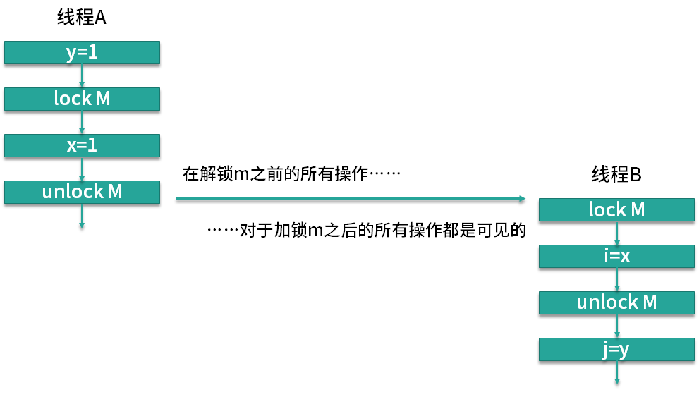

# 22 synchronized 和 Lock 孰优孰劣，如何选择？

本课时我们主要学习 synchronized 和 Lock 的异同点，以及该如何选择。

### 相同点

synchronized 和 Lock 的相同点非常多，我们这里重点讲解 3 个比较大的相同点。

- synchronized 和 Lock 都是用来保护资源线程安全的。

这一点毋庸置疑，这是它们的基本作用。

- 都可以保证可见性。

对于 synchronized 而言，线程 A 在进入 synchronized 块之前或在 synchronized 块内进行操作，对于后续的获得同一个 monitor 锁的线程 B 是可见的，也就是线程 B 是可以看到线程 A 之前的操作的，这也体现了 happens-before 针对 synchronized 的一个原则。


而对于 Lock 而言，它和 synchronized 是一样，都可以保证可见性，如图所示，在解锁之前的所有操作对加锁之后的所有操作都是可见的。



如果你之前不了解什么是可见性，此时理解可能会有一定的困难，可以在学习本专栏的 Java 内存模型相关内容后，再复习本课时，就会豁然开朗。

- synchronized 和 ReentrantLock 都拥有可重入的特点。

这里的 ReentrantLock 是 Lock 接口的一个最主要的实现类，在对比 synchronized 和 Lock 的时候，也会选择 Lock 的主要实现类来进行对比。可重入指的是某个线程如果已经获得了一个锁，现在试图再次请求这个它已经获得的锁，如果它无需提前释放这个锁，而是直接可以继续使用持有的这个锁，那么就是可重入的。如果必须释放锁后才能再次申请这个锁，就是不可重入的。而 synchronized 和 ReentrantLock 都具有可重入的特性。

### 不同点

下面我们来看下 synchronized 和 Lock 的区别，和相同点一样，它们之间也有非常多的区别，这里讲解其中比较大的 7 点不同。

- 用法区别

synchronized 关键字可以加在方法上，不需要指定锁对象（此时的锁对象为 this），也可以新建一个同步代码块并且自定义 monitor 锁对象；而 Lock 接口必须显示用 Lock 锁对象开始加锁 lock() 和解锁 unlock()，并且一般会在 finally 块中确保用 unlock() 来解锁，以防发生死锁。

与 Lock 显式的加锁和解锁不同的是 synchronized 的加解锁是隐式的，尤其是抛异常的时候也能保证释放锁，但是 Java 代码中并没有相关的体现。

- 加解锁顺序不同

对于 Lock 而言如果有多把 Lock 锁，Lock 可以不完全按照加锁的反序解锁，比如我们可以先获取 Lock1 锁，再获取 Lock2 锁，解锁时则先解锁 Lock1，再解锁 Lock2，加解锁有一定的灵活度，如代码所示。

```java
lock1.lock();


lock2.lock();


...


lock1.unlock();


lock2.unlock();

```

但是 synchronized 无法做到，synchronized 解锁的顺序和加锁的顺序必须完全相反，例如：

```java
synchronized(obj1){


    synchronized(obj2){


        ...


    }


}

```

那么在这里，顺序就是先对 obj1 加锁，然后对 obj2 加锁，然后对 obj2 解锁，最后解锁 obj1。这是因为 synchronized 加解锁是由 JVM 实现的，在执行完 synchronized 块后会自动解锁，所以会按照 synchronized 的嵌套顺序加解锁，不能自行控制。

- synchronized 锁不够灵活

一旦 synchronized 锁已经被某个线程获得了，此时其他线程如果还想获得，那它只能被阻塞，直到持有锁的线程运行完毕或者发生异常从而释放这个锁。如果持有锁的线程持有很长时间才释放，那么整个程序的运行效率就会降低，而且如果持有锁的线程永远不释放锁，那么尝试获取锁的线程只能永远等下去。

相比之下，Lock 类在等锁的过程中，如果使用的是 lockInterruptibly 方法，那么如果觉得等待的时间太长了不想再继续等待，可以中断退出，也可以用 tryLock() 等方法尝试获取锁，如果获取不到锁也可以做别的事，更加灵活。

- synchronized 锁只能同时被一个线程拥有，但是 Lock 锁没有这个限制

例如在读写锁中的读锁，是可以同时被多个线程持有的，可是 synchronized 做不到。

- 原理区别 synchronized 是内置锁，由 JVM 实现获取锁和释放锁的原理，还分为偏向锁、轻量级锁、重量级锁。

Lock 根据实现不同，有不同的原理，例如 ReentrantLock 内部是通过 AQS 来获取和释放锁的。

- 是否可以设置公平/非公平

公平锁是指多个线程在等待同一个锁时，根据先来后到的原则依次获得锁。ReentrantLock 等 Lock 实现类可以根据自己的需要来设置公平或非公平，synchronized 则不能设置。

- 性能区别

在 Java 5 以及之前，synchronized 的性能比较低，但是到了 Java 6 以后，发生了变化，因为 JDK 对 synchronized 进行了很多优化，比如自适应自旋、锁消除、锁粗化、轻量级锁、偏向锁等，所以后期的 Java 版本里的 synchronized 的性能并不比 Lock 差。

### 如何选择

讲完了 synchronized 和 Lock 的相同点和区别，最后我们再来看下如何选择它们，在 Java 并发编程实战和 Java 核心技术里都认为：

1. 如果能不用最好既不使用 Lock 也不使用 synchronized。因为在许多情况下你可以使用 java.util.concurrent 包中的机制，它会为你处理所有的加锁和解锁操作，也就是推荐优先使用工具类来加解锁。
1. 如果 synchronized 关键字适合你的程序， 那么请尽量使用它，这样可以减少编写代码的数量，减少出错的概率。因为一旦忘记在 finally 里 unlock，代码可能会出很大的问题，而使用 synchronized 更安全。
1. 如果特别需要 Lock 的特殊功能，比如尝试获取锁、可中断、超时功能等，才使用 Lock。
