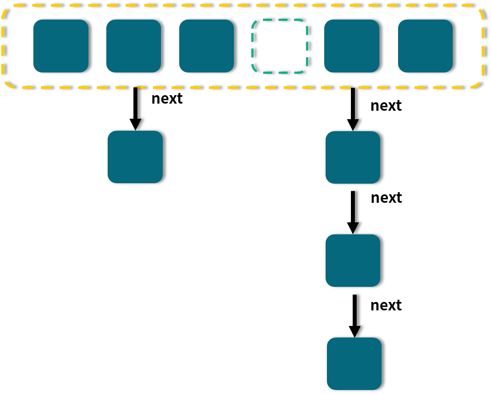
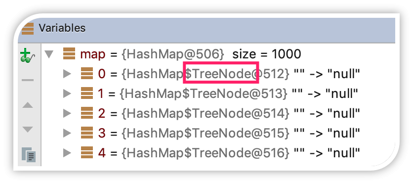

# 31 为什么 Map 桶中超过 8 个才转为红黑树？

这一课时我们主要讲解为什么 Map 的桶中超过 8 个才转为红黑树？

JDK 1.8 的 HashMap 和 ConcurrentHashMap 都有这样一个特点：最开始的 Map 是空的，因为里面没有任何元素，往里放元素时会计算 hash 值，计算之后，第 1 个 value 会首先占用一个桶（也称为槽点）位置，后续如果经过计算发现需要落到同一个桶中，那么便会使用链表的形式往后延长，俗称“拉链法”，如图所示：



图中，有的桶是空的， 比如第 4 个；有的只有一个元素，比如 1、3、6；有的就是刚才说的拉链法，比如第 2 和第 5 个桶。

当链表长度大于或等于阈值（默认为 8）的时候，如果同时还满足容量大于或等于 MIN_TREEIFY_CAPACITY（默认为 64）的要求，就会把链表转换为红黑树。同样，后续如果由于删除或者其他原因调整了大小，当红黑树的节点小于或等于 6 个以后，又会恢复为链表形态。

让我们回顾一下 HashMap 的结构示意图：


在图中我们可以看到，有一些槽点是空的，有一些是拉链，有一些是红黑树。

更多的时候我们会关注，为何转为红黑树以及红黑树的一些特点，可是，为什么转化的这个阈值要默认设置为 8 呢？要想知道为什么设置为 8，那首先我们就要知道为什么要转换，因为转换是第一步。

每次遍历一个链表，平均查找的时间复杂度是 O(n)，n 是链表的长度。红黑树有和链表不一样的查找性能，由于红黑树有自平衡的特点，可以防止不平衡情况的发生，所以可以始终将查找的时间复杂度控制在 O(log(n))。最初链表还不是很长，所以可能 O(n) 和 O(log(n)) 的区别不大，但是如果链表越来越长，那么这种区别便会有所体现。所以为了提升查找性能，需要把链表转化为红黑树的形式。

那为什么不一开始就用红黑树，反而要经历一个转换的过程呢？其实在 JDK 的源码注释中已经对这个问题作了解释：

```java
Because TreeNodes are about twice the size of regular nodes,


use them only when bins contain enough nodes to warrant use


(see TREEIFY_THRESHOLD). And when they become too small (due 


removal or resizing) they are converted back to plain bins.

```

这段话的意思是：单个 TreeNode 需要占用的空间大约是普通 Node 的两倍，所以只有当包含足够多的 Nodes 时才会转成 TreeNodes，而是否足够多就是由 TREEIFY_THRESHOLD 的值决定的。而当桶中节点数由于移除或者 resize 变少后，又会变回普通的链表的形式，以便节省空间。

通过查看源码可以发现，默认是链表长度达到 8 就转成红黑树，而当长度降到 6 就转换回去，这体现了时间和空间平衡的思想，最开始使用链表的时候，空间占用是比较少的，而且由于链表短，所以查询时间也没有太大的问题。可是当链表越来越长，需要用红黑树的形式来保证查询的效率。对于何时应该从链表转化为红黑树，需要确定一个阈值，这个阈值默认为 8，并且在源码中也对选择 8 这个数字做了说明，原文如下：

```java
In usages with well-distributed user hashCodes, tree bins 


are rarely used.  Ideally, under random hashCodes, the 


frequency of nodes in bins follows a Poisson distribution 


(http://en.wikipedia.org/wiki/Poisson_distribution) with a 


parameter of about 0.5 on average for the default resizing 


threshold of 0.75, although with a large variance because 


of resizing granularity. Ignoring variance, the expected 


occurrences of list size k are (exp(-0.5) * pow(0.5, k) / 


factorial(k)). The first values are:


 0:    0.60653066


 1:    0.30326533


 2:    0.07581633


 3:    0.01263606


 4:    0.00157952


 5:    0.00015795


 6:    0.00001316


 7:    0.00000094


 8:    0.00000006


 more: less than 1 in ten million

```

上面这段话的意思是，如果 hashCode 分布良好，也就是 hash 计算的结果离散好的话，那么红黑树这种形式是很少会被用到的，因为各个值都均匀分布，很少出现链表很长的情况。在理想情况下，链表长度符合泊松分布，各个长度的命中概率依次递减，当长度为 8 的时候，概率仅为 0.00000006。这是一个小于千万分之一的概率，通常我们的 Map 里面是不会存储这么多的数据的，所以通常情况下，并不会发生从链表向红黑树的转换。

但是，HashMap 决定某一个元素落到哪一个桶里，是和这个对象的 hashCode 有关的，JDK 并不能阻止我们用户实现自己的哈希算法，如果我们故意把哈希算法变得不均匀，例如：

```java
@Override


public int hashCode() {


    return 1;


}

```

这里 hashCode 计算出来的值始终为 1，那么就很容易导致 HashMap 里的链表变得很长。让我们来看下面这段代码：

```java
public class HashMapDemo {


    public static void main(String[] args) {


        HashMap map = new HashMap<HashMapDemo,Integer>(1);


        for (int i = 0; i < 1000; i++) {


            HashMapDemo hashMapDemo1 = new HashMapDemo();


            map.put(hashMapDemo1, null);


        }


        System.out.println("运行结束");


    }


    @Override


    public int hashCode() {


        return 1;


    }


}

```

在这个例子中，我们建了一个 HashMap，并且不停地往里放入值，所放入的 key 的对象，它的 hashCode 是被重写过得，并且始终返回 1。这段代码运行时，如果通过 debug 让程序暂停在 System.out.println("运行结束") 这行语句，我们观察 map 内的节点，可以发现已经变成了 TreeNode，而不是通常的 Node，这说明内部已经转为了红黑树。



事实上，链表长度超过 8 就转为红黑树的设计，更多的是为了防止用户自己实现了不好的哈希算法时导致链表过长，从而导致查询效率低，而此时转为红黑树更多的是一种保底策略，用来保证极端情况下查询的效率。

通常如果 hash 算法正常的话，那么链表的长度也不会很长，那么红黑树也不会带来明显的查询时间上的优势，反而会增加空间负担。所以通常情况下，并没有必要转为红黑树，所以就选择了概率非常小，小于千万分之一概率，也就是长度为 8 的概率，把长度 8 作为转化的默认阈值。

所以如果平时开发中发现 HashMap 或是 ConcurrentHashMap 内部出现了红黑树的结构，这个时候往往就说明我们的哈希算法出了问题，需要留意是不是我们实现了效果不好的 hashCode 方法，并对此进行改进，以便减少冲突。
