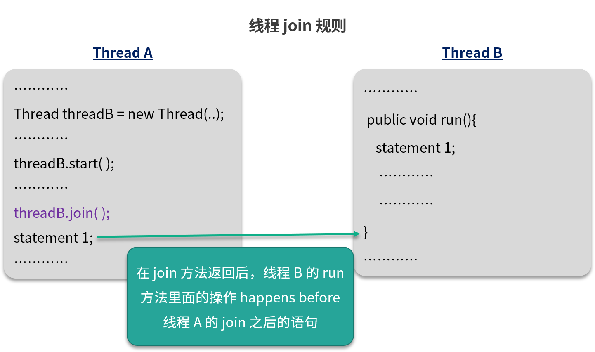

# 61 什么是 happens-before 规则？

本课时我们主要讲解什么是 happens-before 关系。

### 什么是 happens-before 关系

Happens-before 关系是用来描述和可见性相关问题的：如果第一个操作 happens-before 第二个操作（也可以描述为，第一个操作和第二个操作之间满足 happens-before 关系），那么我们就说第一个操作对于第二个操作一定是可见的，也就是第二个操作在执行时就一定能保证看见第一个操作执行的结果。

#### 不具备 happens-before 关系的例子

我们先来举一个不具备 happens-before 关系的例子，从宏观上进一步理解 happens-before 关系想要表达的内容。我们来看看下面的代码：

```
public class Visibility {
    int x = 0;
    public void write() {
        x = 1;
    }
    public void read() {
        int y = x;
    }
}
```

代码很简单，类里面有一个 int x 变量 ，初始值为 0，而 write 方法的作用是把 x 的值改写为 1， 而 read 方法的作用则是读取 x 的值。

如果有两个线程，分别执行 write 和 read 方法，那么由于这两个线程之间没有相互配合的机制，所以 write 和 read 方法内的代码不具备 happens-before 关系，其中的变量的可见性无法保证，下面我们用例子说明这个情况。

比如，假设线程 1 已经先执行了 write 方法，修改了共享变量 x 的值，然后线程 2 执行 read 方法去读取 x 的值，此时我们并不能确定线程 2 现在是否能读取到之前线程 1 对 x 所做的修改，线程 2 有可能看到这次修改，所以读到的 x 值是 1，也有可能看不到本次修改，所以读到的 x 值是最初始的 0。既然存在不确定性，那么 write 和 read 方法内的代码就不具备 happens-before 关系。相反，如果第一个操作 happens-before 第二个操作，那么第一个操作对于第二个操作而言一定是可见的。

下面我们来看一下 happens-before 关系包含哪些具体的规则 。

#### Happens-before 关系的规则有哪些？

如果分别有操作 x 和操作 y，用 hb(x, y) 来表示 x happens-before y。

**（1）单线程规则**： 在一个单独的线程中，按照程序代码的顺序，先执行的操作 happen-before 后执行的操作。也就是说，如果操作 x 和操作 y 是同一个线程内的两个操作，并且在代码里 x 先于 y 出现，那么有 hb(x, y)，正如下图所示： 

这一个 happens-before 的规则非常重要，因为如果对于同一个线程内部而言，后面语句都不能保证可以看见前面的语句的执行结果的话，那会造成非常严重的后果，程序的逻辑性就无法保证了。

这里有一个注意点，我们之前讲过重排序，那是不是意味着 happens-before 关系的规则和重排序冲突，为了满足 happens-before 关系，就不能重排序了？

答案是否定的。其实只要重排序后的结果依然符合 happens-before 关系，也就是能保证可见性的话，那么就不会因此限制重排序的发生。比如，单线程内，语句 1 在语句 2 的前面，所以根据“单线程规则”，语句 1 happens-before 语句 2，但是并不是说语句 1 一定要在语句 2 之前被执行，例如语句 1 修改的是变量 a 的值，而语句 2 的内容和变量 a 无关，那么语句 1 和语句 2 依然有可能被重排序。当然，如果语句 1 修改的是变量 a，而语句 2 正好是去读取变量 a 的值，那么语句 1 就一定会在语句 2 之前执行了。**（2）锁操作规则（synchronized 和 Lock 接口等）**： 如果操作 A 是解锁，而操作 B 是对同一个锁的加锁，那么 hb(A, B) 。正如下图所示： 

从上图中可以看到，有线程 A 和线程 B 这两个线程。线程 A 在解锁之前的所有操作，对于线程 B 的对同一个锁的加锁之后的所有操作而言，都是可见的。这就是锁操作的 happens-before 关系的规则。**（3）volatile 变量规则**： 对一个 volatile 变量的写操作 happen-before 后面对该变量的读操作。

这就代表了如果变量被 volatile 修饰，那么每次修改之后，其他线程在读取这个变量的时候一定能读取到该变量最新的值。我们之前介绍过 volatile 关键字，知道它能保证可见性，而这正是由本条规则所规定的。**（4）线程启动规则**： Thread 对象的 start 方法 happen-before 此线程 run 方法中的每一个操作。如下图所示：


在图中的例子中，左侧区域是线程 A 启动了一个子线程 B，而右侧区域是子线程 B，那么子线程 B 在执行 run 方法里面的语句的时候，它一定能看到父线程在执行 threadB.start() 前的所有操作的结果。**（5）线程 join 规则**：

我们知道 join 可以让线程之间等待，假设线程 A 通过调用 threadB.start() 启动了一个新线程 B，然后调用 threadB.join() ，那么线程 A 将一直等待到线程 B 的 run 方法结束（不考虑中断等特殊情况），然后 join 方法才返回。在 join 方法返回后，线程 A 中的所有后续操作都可以看到线程 B 的 run 方法中执行的所有操作的结果，也就是线程 B 的 run 方法里面的操作 happens-before 线程 A 的 join 之后的语句。如下图所示： **（6）中断规则**： 对线程 interrupt 方法的调用 happens-before 检测该线程的中断事件。

也就是说，如果一个线程被其他线程 interrupt，那么在检测中断时（比如调用 Thread.interrupted 或者 Thread.isInterrupted 方法）一定能看到此次中断的发生，不会发生检测结果不准的情况。**（7）并发工具类的规则**：

- 线程安全的并发容器（如 HashTable）在 get 某个值时一定能看到在此之前发生的 put 等存入操作的结果。也就是说，线程安全的并发容器的存入操作 happens-before 读取操作。
- 信号量（Semaphore）它会释放许可证，也会获取许可证。这里的释放许可证的操作 happens-before 获取许可证的操作，也就是说，如果在获取许可证之前有释放许可证的操作，那么在获取时一定可以看到。
- Future：Future 有一个 get 方法，可以用来获取任务的结果。那么，当 Future 的 get 方法得到结果的时候，一定可以看到之前任务中所有操作的结果，也就是说 Future 任务中的所有操作 happens-before Future 的 get 操作。
- 线程池：要想利用线程池，就需要往里面提交任务（Runnable 或者 Callable），这里面也有一个 happens-before 关系的规则，那就是提交任务的操作 happens-before 任务的执行。

### 总结

以上就是我们对于 happens-before 关系的介绍。本课时首先介绍了什么是 happens-before 关系，然后举了一个不具备 happens-before 关系的例子；接下来我们重点介绍了 happens-before 关系的众多规则，在这些规则中大部分是你所熟知的或者是不需要额外去记的，但在这里面你需要重点记忆的有：锁操作的 happens-before 规则和 volatile 的 happens-before 规则，因为它们与 synchronized 和 volatile 的使用都有着紧密的联系。而线程启动、线程 join、线程中断以及并发工具类的 happens-before 规则你可以不做重点了解，因为通常情况下，这些规则都会默认被当作已知条件去使用的。
