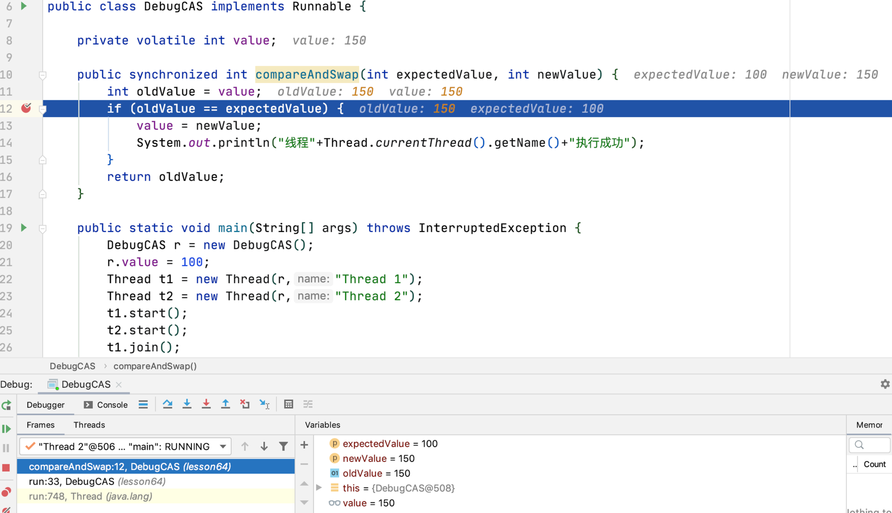

64 你知道什么是 CAS 吗？
================

本课时，我将讲解 CAS。

### CAS 简介

CAS 其实是我们面试中的常客，因为它是原子类的底层原理，同时也是乐观锁的原理，所以当你去面试的时候，经常会遇到这样的问题“你知道哪些类型的锁”？你可能会回答“悲观锁和乐观锁”，那么下一个问题很有可能是问乐观锁的原理，也就是和 CAS 相关的问题，当然也有可能会继续深入问你 **CAS 的应用场景或者是缺点**等问题。在本课时和接下来的这两个课时里，我将带领你学习如何回答这些问题。

首先我们来看一下 CAS 是什么，它的英文全称是**Compare-And-Swap**，中文叫做“比较并交换”，它是一种思想、一种算法。

在多线程的情况下，各个代码的执行顺序是不能确定的，所以为了保证并发安全，我们可以使用互斥锁。而 CAS 的特点是避免使用互斥锁，当多个线程同时使用 CAS 更新同一个变量时，只有其中一个线程能够操作成功，而其他线程都会更新失败。不过和同步互斥锁不同的是，更新失败的线程并**不会被阻塞**，而是被告知这次由于竞争而导致的操作失败，但还可以再次尝试。

CAS 被广泛应用在并发编程领域中，以实现那些不会被打断的数据交换操作，从而就实现了无锁的线程安全。

### CAS 的思路

在大多数处理器的指令中，都会实现 CAS 相关的指令，这一条指令就可以完成“**比较并交换**”的操作，也正是由于这是一条（而不是多条）CPU 指令，所以 CAS 相关的指令是具备原子性的，这个组合操作在执行期间不会被打断，这样就能保证并发安全。由于这个原子性是由 CPU 保证的，所以无需我们程序员来操心。

CAS 有三个操作数：内存值 V、预期值 A、要修改的值 B。CAS 最核心的思路就是，**仅当预期值 A 和当前的内存值 V 相同时，才将内存值修改为 B**。

我们对此展开描述一下：CAS 会提前假定当前内存值 V 应该等于值 A，而值 A 往往是之前读取到当时的内存值 V。在执行 CAS 时，如果发现当前的内存值 V 恰好是值 A 的话，那 CAS 就会把内存值 V 改成值 B，而值 B 往往是在拿到值 A 后，在值 A 的基础上经过计算而得到的。如果执行 CAS 时发现此时内存值 V 不等于值 A，则说明在刚才计算 B 的期间内，内存值已经被其他线程修改过了，那么本次 CAS 就不应该再修改了，可以避免多人同时修改导致出错。这就是 CAS 的主要思路和流程。

JDK 正是利用了这些 CAS 指令，可以实现并发的数据结构，比如 AtomicInteger 等原子类。

利用 CAS 实现的无锁算法，就像我们谈判的时候，用一种非常乐观的方式去协商，彼此之间很友好，这次没谈成，还可以重试。CAS 的思路和之前的互斥锁是两种完全不同的思路，如果是互斥锁，不存在协商机制，大家都会尝试抢占资源，如果抢到了，在操作完成前，会把这个资源牢牢的攥在自己的手里。当然，利用 CAS 和利用互斥锁，都可以保证并发安全，它们是实现同一目标的不同手段。

### 例子

下面我们用图解和例子的方式，让 CAS 的过程变得更加清晰，如下图所示：


假设有两个线程，分别使用两个 CPU，它们都想利用 CAS 来改变右边的变量的值。我们先来看线程 1，它使用 CPU 1，假设它先执行，它期望当前的值是 100，并且想将其改成 150。在执行的时候，它会去检查当前的值是不是 100，发现真的是 100，所以可以改动成功，而当改完之后，右边的值就会从 100 变成 150。 

如上图所示，假设现在才刚刚轮到线程 2 所使用的 CPU 2 来执行，它想要把这个值从 100 改成 200，所以它也希望当前值是 100，可实际上当前值是 150，所以它会发现当前值不是自己期望的值，所以并不会真正的去继续把 100 改成 200，也就是说整个操作都是没有效果的，此次没有修改成功，CAS 操作失败。

当然，接下来线程 2 还可以有其他的操作，这需要根据业务需求来决定，比如重试、报错或者干脆跳过执行。举一个例子，在秒杀场景下，多个线程同时执行秒杀，只要有一个执行成功就够了，剩下的线程当发现自己 CAS 失败了，其实说明兄弟线程执行成功了，也就没有必要继续执行了，这就是跳过操作。所以业务逻辑不同，就会有不同的处理方法，但无论后续怎么处理，之前的那一次 CAS 操作是已经失败了的。

### CAS 的语义

我们来看一看 CAS 的**语义**，有了下面的等价代码之后，理解起来会比前面的图示和文字更加容易，因为代码实际上是一目了然的。接下来我们把 CAS 拆开，看看它内部究竟做了哪些事情。CAS 的等价语义的代码，如下所示：

```java
/**


 * 描述：     模拟CAS操作，等价代码


 */


public class SimulatedCAS {


    private int value;


    public synchronized int compareAndSwap(int expectedValue, int newValue) {


        int oldValue = value;


        if (oldValue == expectedValue) {


            value = newValue;


        }


        return oldValue;


    }


}

```

在这段代码中有一个 compareAndSwap 方法，在这个方法里有两个入参， **第 1 个入参期望值 expectedValue，第 2 个入参是 newValue** ，它就是我们计算好的新的值，我们希望把这个新的值去更新到变量上去。

你一定注意到了， compareAndSwap 方法是被 **synchronized**修饰的，我们用同步方法为 CAS 的等价代码保证了原子性。

接下来我将讲解，在 compareAndSwap 方法里都做了哪些事情。需要先拿到变量的当前值，所以代码里用就会用 int oldValue = value 把变量的当前值拿到。然后就是 compare，也就是“比较”，所以此时会用 if (oldValue == expectedValue) 把当前值和期望值进行比较，如果它们是相等的话，那就意味着现在的值正好就是我们所期望的值，满足条件，说明此时可以进行 swap，也就是交换，所以就把 value 的值修改成 newValue，最后再返回 oldValue，完成了整个 CAS 过程。

CAS 最核心的思想就在上面这个流程中体现了，可以看出，compare 指的就是 if 里的比较，比较 oldValue 是否等于 expectedValue；同样，swap 实际上就是把 value 改成 newValue，并且返回 oldValue。所以这整个 compareAndSwap 方法就还原了 CAS 的语义，也象征了 CAS 指令在背后所做的工作。

### 案例演示：两个线程竞争 CAS，其中一个落败

有了这前面的等价代码之后，我们再来深入介绍一个具体的案例：两个线来执行 CAS，尝试修改数据，第一个线程能修改成功，而第二个线程由于来晚了，会发现数据已经被修改过了，就不再修改了。我们通过 debug 的方式可以看到 CAS 在执行过程中的具体情况。

下面我们用代码来演示一下 CAS 在两个线程竞争的时候，会发生的情况，同时我也录制了一段视频，你也可以直接跳过文字版看视频演示。

我们看下面的这段代码：

```java
public class DebugCAS implements Runnable {


    private volatile int value;


    public synchronized int compareAndSwap(int expectedValue, int newValue) {


        int oldValue = value;


        if (oldValue == expectedValue) {


            value = newValue;


            System.out.println("线程"+Thread.currentThread().getName()+"执行成功");


        }


        return oldValue;


    }


    public static void main(String[] args) throws InterruptedException {


        DebugCAS r = new DebugCAS();


        r.value = 100;


        Thread t1 = new Thread(r,"Thread 1");


        Thread t2 = new Thread(r,"Thread 2");


        t1.start();


        t2.start();


        t1.join();


        t2.join();


        System.out.println(r.value);


    }


    @Override


    public void run() {


        compareAndSwap(100, 150);


    }


}

```

这里的 compareAndSwap 方法就是刚才所讲过的 CAS 的等价语义的代码，然后我们在此基础上加了一行代码，如果执行成功的话，它会打印出是哪个线程执行成功。

而在我们的 main() 方法里面，首先把 DebugCAS 类实例化出来，并把 value 的值修改为 100，这样它的初始值就为 100，接着我们新建两个线程 Thread t1 和 Thread t2，把它们启动起来，并且主线程等待两个线程执行完毕之后，去打印出最后 value 的值。

新建的这两个线程都做了什么内容呢？在 run() 方法里面可以看到，就是执行 compareAndSwap 方法，并且期望的值是 100，希望改成的值是 150，那么当两个线程都去执行 run() 方法的时候，可以预见到的是，只会有一个线程执行成功，另外一个线程不会打印出“执行成功”这句话，因为当它执行的时候会发现，当时的值已经被修改过了，不是 100 了。

首先，我们不打断点，直接执行看看运行的结果：

```java
线程Thread 1执行成功


150

```

可以看到，Thread 1 执行成功，且最终的结果是 150。在这里，打印“Thread 1 执行成功”这句话的概率比打印“Thread 2 执行成功”这句话的概率要大得多，因为 Thread 1 是先 start 的。

下面我们用 debug 的方法来看看内部究竟是如何执行的。我们先在“if (oldValue == expectedValue){”这一行打断点，然后用 Debug 的形式去运行。


可以看到，此时程序已经停留在打断点的地方了，停留的是 Thread 1（在 Debugger 里可以显示出来当前线程的名字和状态），而 Thread 2 此时的状态是 Monitor （对应 Java 线程的 Blocked 状态），其含义是没有拿到这把锁 synchronized，正在外面等待这把锁。

现在 Thread 1 进到 compareAndSwap 方法里了，我们可以很清楚地看到，oldValue 值是 100，而 expectedValue 的值也是 100，所以它们是相等的。

继续让代码单步运行，因为满足 if 判断条件，所以可以进到 if 语句中，所以接下来会把 value 改成 newValue，而 newValue 的值正是 150。


在修改完成后，还会打印出“线程Thread 1执行成功”这句话，如下图所示。


接下来我们按下左侧的执行按钮，就轮到 Thread 2 了，此时情景就不同了。



可以看到，**oldValue 拿到的值是 150，因为 value 的值已经被 Thread 1 修改过了**，所以，150 与 Thread 2 所期望的 expectedValue 的值 100 是不相等的，从而会跳过整个 if 语句，也就不能打印出“Thread 2 执行成功”这句话，最后会返回 oldValue，其实对这个值没有做任何的修改。

到这里，两个线程就执行完毕了。在控制台，只打印出 Thread 1 执行成功，而没有打印出 Thread 2 执行成功。其中的原因，我们通过 Debug 的方式已经知晓了。


以上代码通过 Debug 的方式，看到了当两个线程去竞争 CAS 时，其中一个成功、另一个失败的情况。

### 总结

在本课时中，我们讲解了什么是 CAS，它的核心思想是通过将内存中的值与指定数据进行比较，当这两个数值一样时，才将内存中的数据替换为新的值，整个过程是具备原子性的；然后介绍了一个关于两个线先后进行的 CAS 例子，并且用等价代码的形式描述了 CAS 的语义，最后还用 Debug 的方式进行了实操演示。
