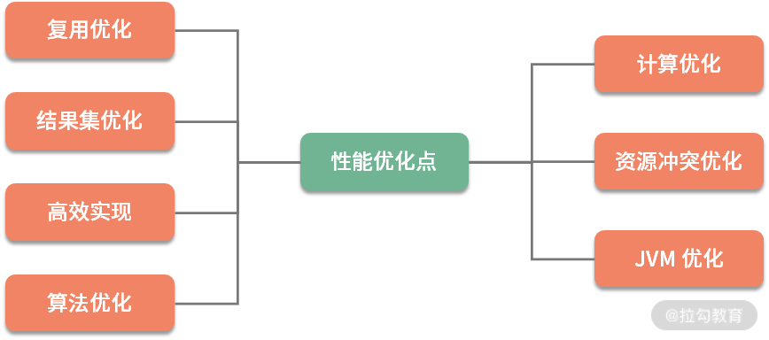

02 理论分析：性能优化有章可循，谈谈常用的切入点
=========================

本课时主要讲解 Java 性能优化有哪些可以遵循的规律。

在上一课时，我们详细地了解了对于性能的定义，这样在做性能优化的时候，就有了具体的优化目标和衡量方法，优化效果也不会仅仅停留在直观感觉上。

了解了优化目标后，那接下来应该从哪些方面入手呢？本课时主要侧重于理论分析，我们从整体上看一下 Java 性能优化都有哪些可以遵循的规律。本课主讲理论，关于实践，后面的课时会用较多的案例来细化本课时的知识点，适合反复思考和归纳。

性能优化的 7 类技术手段
=============

性能优化根据优化的类别，分为 **业务优化** 和**技术优化**。业务优化产生的效果也是非常大的，但它属于产品和管理的范畴。同作为程序员，在平常工作中，我们面对的优化方式，主要是通过一系列的技术手段，来完成对既定的优化目标。这一系列的技术手段，我大体归纳为如图以下 7 类：

可以看到，优化方式集中在对计算资源和存储资源的规划上。优化方法中有多种用空间换时间的方式，但只照顾计算速度，而不考虑复杂性和空间问题，也是不可取的。我们要做的，就是在照顾性能的前提下，达到资源利用的最优状态。

接下来，我简要介绍一下这 7 种优化方式。如果你感觉比较枯燥，那也没关系，我们本课时的目的，就是让你的脑海里有一个总分的概念，以及对理论基础有一个整体的认识。

1\. 复用优化
--------

在写代码的时候，你会发现有很多重复的代码可以提取出来，做成公共的方法。这样，在下次用的时候，就不用再费劲写一遍了。

这种思想就是**复用**。上面的描述是编码逻辑上的优化，对于数据存取来说，有同样的复用情况。无论是在生活中还是编码中，重复的事情一直在发生，如果没有复用，工作和生活就会比较累。

在软件系统中，谈到数据复用，我们首先想到的就是**缓冲和缓存**。注意这两个词的区别，它们的意义是完全不同的，很多同学很容易搞混，在这里简单地介绍一下（后续 06 和 07 课时会再详细讲解）。

* 缓冲（Buffer），常见于对数据的暂存，然后批量传输或者写入。多使用顺序方式，用来缓解不同设备之间频繁地、缓慢地随机写， **缓冲主要针对的是写操作** 。
* 缓存（Cache），常见于对已读取数据的复用，通过将它们缓存在相对高速的区域， **缓存主要针对的是读操作** 。

与之类似的，是对于对象的池化操作，比如数据库连接池、线程池等，在 Java 中使用得非常频繁。由于这些对象的创建和销毁成本都比较大，我们在使用之后，也会将这部分对象暂时存储，下次用的时候，就不用再走一遍耗时的初始化操作了。

2\. 计算优化
--------

（1）并行执行

现在的 CPU 发展速度很快，绝大多数硬件，都是多核。要想加快某个任务的执行，最快最优的解决方式，就是让它并行执行。并行执行有以下三种模式。

第一种模式是 **多机** ，采用负载均衡的方式，将流量或者大的计算拆分成多个部分，同时进行处理。比如，Hadoop 通过 MapReduce 的方式，把任务打散，多机同时进行计算。

第二种模式是 **采用多进程** 。比如 Nginx，采用 NIO 编程模型，Master 统一管理 Worker 进程，然后由 Worker 进程进行真正的请求代理，这也能很好地利用硬件的多个 CPU。

第三种模式是 **使用多线程** ，这也是 Java 程序员接触最多的。比如 Netty，采用 Reactor 编程模型，同样使用 NIO，但它是基于线程的。Boss 线程用来接收请求，然后调度给相应的 Worker 线程进行真正的业务计算。

像 Golang 这样的语言，有更加轻量级的协程（Coroutine），协程是一种比线程更加轻量级的存在，但目前在 Java 中还不太成熟，就不做过多介绍了，但本质上，它也是对于多核的应用，使得任务并行执行。

（2）变同步为异步

再一种对于计算的优化，就是 **变同步为异步** ，这通常涉及编程模型的改变。同步方式，请求会一直阻塞，直到有成功，或者失败结果的返回。虽然它的编程模型简单，但应对突发的、时间段倾斜的流量，问题就特别大，请求很容易失败。

异步操作可以方便地支持横向扩容，也可以缓解瞬时压力，使请求变得平滑。同步请求，就像拳头打在钢板上；异步请求，就像拳头打在海绵上。你可以想象一下这个过程，后者肯定是富有弹性的，体验更加友好。

（3）惰性加载

最后一种，就是使用一些常见的设计模式来优化业务，提高体验，比如单例模式、代理模式等。举个例子，在绘制 Swing 窗口的时候，如果要显示比较多的图片，就可以先加载一个占位符，然后通过后台线程慢慢加载所需要的资源，这就可以避免窗口的僵死。

3\. 结果集优化
---------

接下来介绍一下对结果集的优化。举个比较直观的例子，我们都知道 XML 的表现形式是非常好的，那为什么还有 JSON 呢？除了书写要简单一些，一个重要的原因就是它的体积变小了，传输效率和解析效率变高了，像 Google 的 Protobuf，体积就更小了一些。虽然可读性降低，但在一些高并发场景下（如 RPC），能够显著提高效率，这是典型的对结果集的优化。

这是由于我们目前的 Web 服务，都是 C/S 模式。数据从服务器传输到客户端，需要分发多份，这个数据量是急剧膨胀的，每减少一小部分存储，都会有比较大的传输性能和成本提升。

像 Nginx，一般都会开启 GZIP 压缩，使得传输的内容保持紧凑。客户端只需要一小部分计算能力，就可以方便解压。由于这个操作是分散的，所以性能损失是固定的。

了解了这个道理，我们就能看到对于结果集优化的一般思路，你要尽量保持返回数据的精简。一些客户端不需要的字段，那就在代码中，或者直接在 SQL 查询中，就把它去掉。

对于一些对时效性要求不高，但对处理能力有高要求的业务。我们要吸取缓冲区的经验，尽量减少网络连接的交互，采用批量处理的方式，增加处理速度。

结果集合很可能会有二次使用，你可能会把它加入缓存中，但依然在速度上有所欠缺。这个时候，就需要对数据集合进行处理优化，采用索引或者 Bitmap 位图等方式，加快数据访问速度。

4\. 资源冲突优化
----------

我们在平常的开发中，会涉及很多共享资源。这些共享资源，有的是单机的，比如一个 HashMap；有的是外部存储，比如一个数据库行；有的是单个资源，比如 Redis 某个 key 的Setnx；有的是多个资源的协调，比如事务、分布式事务等。

现实中的性能问题，和锁相关的问题是非常多的。大多数我们会想到数据库的行锁、表锁、Java 中的各种锁等。在更底层，比如 CPU 命令级别的锁、JVM 指令级别的锁、操作系统内部锁等，可以说无处不在。

只有并发，才能产生资源冲突。也就是在同一时刻，只能有一个处理请求能够获取到共享资源。解决资源冲突的方式，就是加锁。再比如事务，在本质上也是一种锁。

按照锁级别，锁可分为乐观锁和悲观锁，乐观锁在效率上肯定是更高一些；按照锁类型，锁又分为公平锁和非公平锁，在对任务的调度上，有一些细微的差别。

对资源的争用，会造成严重的性能问题，所以会有一些针对无锁队列之类的研究，对性能的提升也是巨大的。

5\. 算法优化
--------

算法能够显著提高复杂业务的性能，但在实际的业务中，往往都是变种。由于存储越来越便宜，在一些 CPU 非常紧张的业务中，往往采用空间换取时间的方式，来加快处理速度。

算法属于代码调优，代码调优涉及很多编码技巧，需要使用者对所使用语言的 API 也非常熟悉。有时候，对算法、数据结构的灵活使用，也是代码优化的一个重要内容。比如，常用的降低时间复杂度的方式，就有递归、二分、排序、动态规划等。

一个优秀的实现，比一个拙劣的实现，对系统的影响是非常大的。比如，作为 List 的实现，LinkedList 和 ArrayList 在随机访问的性能上，差了好几个数量级；又比如，CopyOnWriteList 采用写时复制的方式，可以显著降低读多写少场景下的锁冲突。而什么时候使用同步，什么时候是线程安全的，也对我们的编码能力有较高的要求。

这部分的知识，就需要我们在平常的工作中注意积累，后面的课时中，也会挑比较重要的知识点穿插讲解。

6\. 高效实现
--------

在平时的编程中，尽量使用一些设计理念良好、性能优越的组件。比如，有了 Netty，就不用再选择比较老的 Mina 组件。而在设计系统时，从性能因素考虑，就不要选 SOAP 这样比较耗时的协议。再比如，一个好的语法分析器（比如使用 JavaCC），其效率会比正则表达式高很多。

总之，如果通过测试分析，找到了系统的瓶颈点，就要把关键的组件，使用更加高效的组件进行替换。在这种情况下，适配器模式是非常重要的。这也是为什么很多公司喜欢在现有的组件之上，再抽象一层自己的；而当在底层组件进行切换的时候，上层的应用并无感知。

7\. JVM 优化
----------

因为 Java 是运行在 JVM 虚拟机之上，它的诸多特性，就要受到 JVM 的制约。对 JVM 虚拟机进行优化，也能在一定程度上能够提升 JAVA 程序的性能。如果参数配置不当，甚至会造成 OOM 等比较严重的后果。

目前被广泛使用的垃圾回收器是 G1，通过很少的参数配置，内存即可高效回收。CMS 垃圾回收器已经在 Java 14 中被移除，由于它的 GC 时间不可控，有条件应该尽量避免使用。

JVM 性能调优涉及方方面面的取舍，往往是牵一发而动全身，需要全盘考虑各方面的影响。所以了解 JVM 内部的一些运行原理，还是特别重要的，它有益于我们加深对代码更深层次的理解，帮助我们书写出更高效的代码。

小结
==

以上就是代码优化的 7 个大方向，我们通过简要的介绍，让大家对性能优化的内容有了大体的了解。这 7 大方向是代码优化的最主要方向，当然，性能优化还包含数据库优化、操作系统优化、架构优化等其他一些内容，这些不是我们的重点，在后面的课时中，我们也只做简要的介绍。

接下来，我们会了解一些性能评估工具，了解操作系统的一些资源限制，然后针对这 7 个优化点，进行展开讨论。本课时适合案例分析后回读，更加能够加深你对 Java 性能优化的理解。
