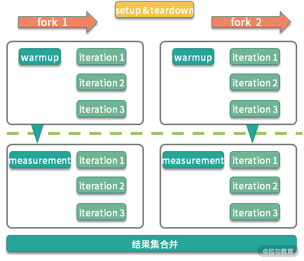
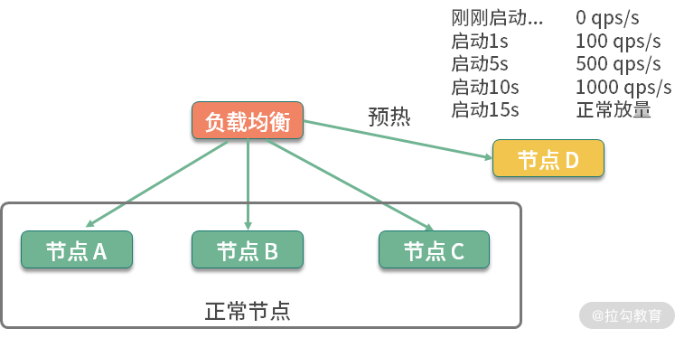
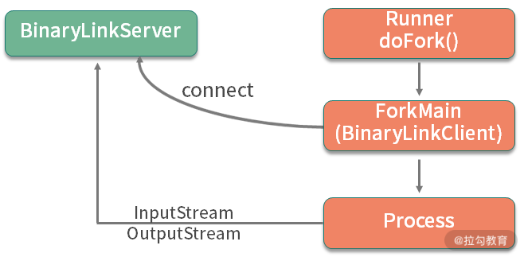
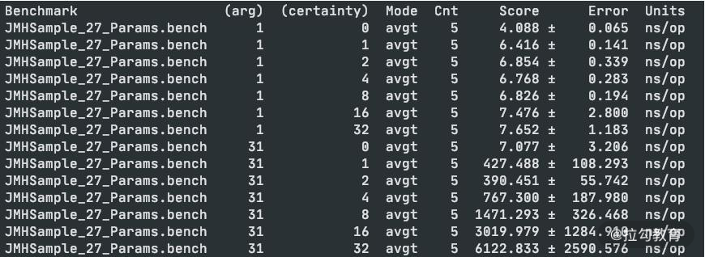
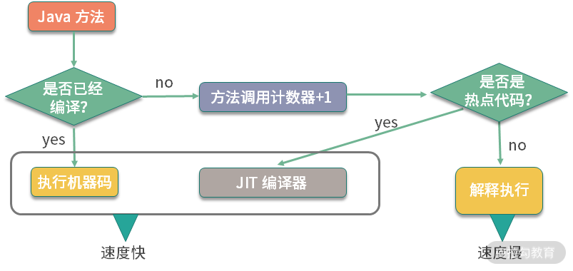
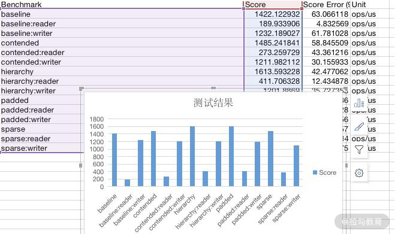
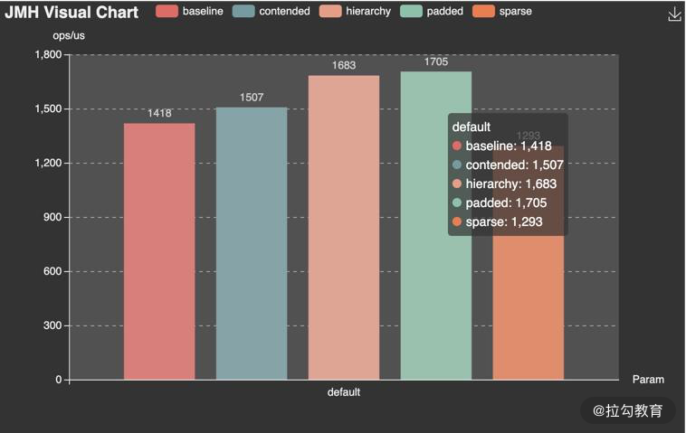
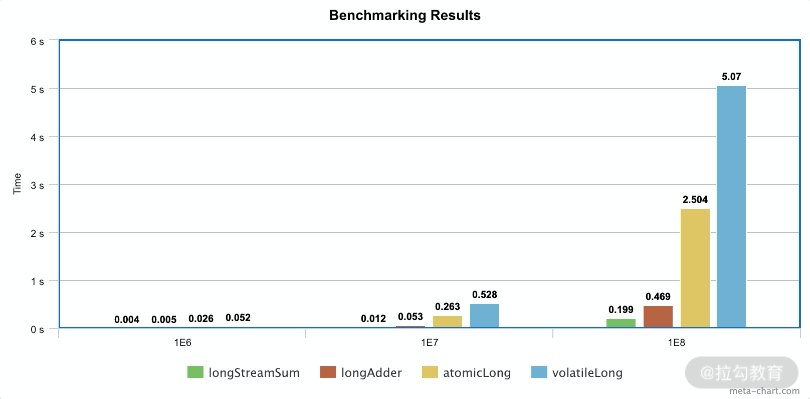

# 05 工具实践：基准测试 JMH，精确测量方法性能

上一课时，我们了解到一些外部工具可以获取系统的性能数据。

但有时候，我们想要测量某段具体代码的性能情况，这时经常会写一些统计执行时间的代码，这些代码穿插在我们的逻辑中，进行一些简单的计时运算。比如下面这几行：

```
long start = System.currentTimeMillis(); 
//logic 
long cost = System.currentTimeMillis() - start; 
System.out.println("Logic cost : " + cost);
```

可惜的是，这段代码的统计结果，并不一定准确。举个例子来说，JVM 在执行时，会对一些代码块，或者一些频繁执行的逻辑，进行 JIT 编译和内联优化，在得到一个稳定的测试结果之前，需要先循环上万次进行预热。预热前和预热后的性能差别非常大。

另外，从 01 课时我们就知道，评估性能，有很多的指标，如果这些指标数据，每次都要手工去算的话，那肯定是枯燥乏味且低效的。

# JMH—基准测试工具

**JMH（the Java Microbenchmark Harness）就是这样一个能做基准测试的工具** 。如果你通过 04 课时介绍的一系列外部工具，定位到了热点代码，要测试它的性能数据，评估改善情况，就可以交给 JMH。它的 **测量精度非常高，可达纳秒级别。**

JMH 已经在 JDK 12中被包含，其他版本的需要自行引入 maven，坐标如下：

```
<dependencies> 
        <dependency> 
            <groupId>org.openjdk.jmh</groupId> 
            <artifactId>jmh-core</artifactId> 
            <version>1.23</version> 
        </dependency> 
        <dependency> 
            <groupId>org.openjdk.jmh</groupId> 
            <artifactId>jmh-generator-annprocess</artifactId> 
            <version>1.23</version> 
            <scope>provided</scope> 
        </dependency> 
</dependencies>
```

下面，我们介绍一下这个工具的使用。

JMH 是一个 jar 包，它和单元测试框架 JUnit 非常像，可以通过注解进行一些基础配置。这部分配置有很多是可以通过 main 方法的 OptionsBuilder 进行设置的。



上图是一个典型的 JMH 程序执行的内容。通过开启多个进程，多个线程，先执行预热，然后执行迭代，最后汇总所有的测试数据进行分析。在执行前后，还可以根据粒度处理一些前置和后置操作。

一段简单的 JMH 代码如下所示：

```
@BenchmarkMode(Mode.Throughput) 
@OutputTimeUnit(TimeUnit.MILLISECONDS) 
@State(Scope.Thread) 
@Warmup(iterations = 3, time = 1, timeUnit = TimeUnit.SECONDS) 
@Measurement(iterations = 5, time = 1, timeUnit = TimeUnit.SECONDS) 
@Fork(1) 
@Threads(2) 
public class BenchmarkTest { 
    @Benchmark 
    public long shift() { 
        long t = 455565655225562L; 
        long a = 0; 
        for (int i = 0; i < 1000; i++) { 
            a = t >> 30; 
        } 
        return a; 
    }  
    @Benchmark 
    public long div() { 
        long t = 455565655225562L; 
        long a = 0; 
        for (int i = 0; i < 1000; i++) { 
            a = t / 1024 / 1024 / 1024; 
        } 
        return a; 
    }  
    public static void main(String[] args) throws Exception { 
        Options opts = new OptionsBuilder() 
                .include(BenchmarkTest.class.getSimpleName()) 
                .resultFormat(ResultFormatType.JSON) 
                .build(); 
        new Runner(opts).run(); 
    } 
}
```

下面，我们逐一介绍一下比较关键的注解和参数。

# 关键注解

## 1. @Warmup

样例如下：

```
@Warmup( 
iterations = 5, 
time = 1, 
timeUnit = TimeUnit.SECONDS)
```

我们不止一次提到预热 warmup 这个注解，可以用在类或者方法上，进行预热配置。可以看到，它有几个配置参数：

- timeUnit：时间的单位，默认的单位是秒；
- iterations：预热阶段的迭代数；
- time：每次预热的时间；
- batchSize：批处理大小，指定了每次操作调用几次方法。

上面的注解，意思是对代码预热总计 5 秒（迭代 5 次，每次一秒）。预热过程的测试数据，是不记录测量结果的。

我们可以看一下它执行的效果：

```
# Warmup: 3 iterations, 1 s each 
# Warmup Iteration   1: 0.281 ops/ns 
# Warmup Iteration   2: 0.376 ops/ns 
# Warmup Iteration   3: 0.483 ops/ns
```

一般来说，基准测试都是针对比较小的、执行速度相对较快的代码块，这些代码有很大的可能性被 JIT 编译、内联，所以在编码时保持方法的精简，是一个好的习惯。具体优化过程，我们将在 18 课时介绍。

说到预热，就不得不提一下在分布式环境下的服务预热。在对服务节点进行发布的时候，通常也会有预热过程，逐步放量到相应的服务节点，直到服务达到最优状态。如下图所示，负载均衡负责这个放量过程，一般是根据百分比进行放量。



## 2. @Measurement

样例如下：

```
@Measurement( 
iterations = 5,
time = 1,
timeUnit = TimeUnit.SECONDS)
```

Measurement 和 Warmup 的参数是一样的，不同于预热，它指的是真正的迭代次数。

我们能够从日志中看到这个执行过程：

```
# Measurement: 5 iterations, 1 s each 
Iteration   1: 1646.000 ns/op 
Iteration   2: 1243.000 ns/op 
Iteration   3: 1273.000 ns/op 
Iteration   4: 1395.000 ns/op 
Iteration   5: 1423.000 ns/op
```

虽然经过预热之后，代码都能表现出它的最优状态，但一般和实际应用场景还是有些出入。如果你的测试机器性能很高，或者你的测试机资源利用已经达到了极限，都会影响测试结果的数值。

所以，通常情况下，我都会在测试时，给机器充足的资源，保持一个稳定的环境。在分析结果时，也会更加关注不同代码实现方式下的 **性能差异** ，而不是测试数据本身。

## 3. @BenchmarkMode

此注解用来指定基准测试类型，对应 Mode 选项，用来修饰类和方法都可以。这里的 value，是一个数组，可以配置多个统计维度。比如：

@BenchmarkMode({Throughput,Mode.AverageTime})，统计的就是吞吐量和平均执行时间两个指标。

所谓的模式，其实就是我们第 01 课时里说的一些指标，在 JMH 中，可以分为以下几种：

- **Throughput：** 整体吞吐量，比如 QPS，单位时间内的调用量等；
- **AverageTime：** 平均耗时，指的是每次执行的平均时间。如果这个值很小不好辨认，可以把统计的单位时间调小一点；
- **SampleTime：** 随机取样，这和我们在第一课时里聊到的 TP 值是一个概念；
- **SingleShotTime：** 如果你想要测试仅仅一次的性能，比如第一次初始化花了多长时间，就可以使用这个参数，其实和传统的 main 方法没有什么区别；
- **All：** 所有的指标，都算一遍，你可以设置成这个参数看下效果。

我们拿平均时间，看一下一个大体的执行结果：

```
Result "com.github.xjjdog.tuning.BenchmarkTest.shift": 
  2.068 ±(99.9%) 0.038 ns/op [Average] 
  (min, avg, max) = (2.059, 2.068, 2.083), stdev = 0.010 
  CI (99.9%): [2.030, 2.106] (assumes normal distribution)
```

由于我们声明的时间单位是纳秒，本次 shift 方法的平均响应时间就是 2.068 纳秒。

我们也可以看下最终的耗时时间：

```
Benchmark            Mode  Cnt  Score   Error  Units 
BenchmarkTest.div    avgt    5  2.072 ± 0.053  ns/op 
BenchmarkTest.shift  avgt    5  2.068 ± 0.038  ns/op
```

由于是平均数，这里的 Error 值的是误差（或者波动）的意思。

可以看到，在衡量这些指标的时候，都有一个时间维度，它就是通过 **@OutputTimeUnit** 注解进行配置的。

这个就比较简单了，它指明了基准测试结果的时间类型。可用于类或者方法上，一般选择秒、毫秒、微秒，纳秒那是针对的速度非常快的方法。

举个例子，@BenchmarkMode(Mode.Throughput) 和 @OutputTimeUnit(TimeUnit.MILLISECONDS) 进行组合，代表的就是每毫秒的吞吐量。

如下面的关于吞吐量的结果，就是以毫秒计算的：

```
Benchmark             Mode  Cnt       Score       Error   Units 
BenchmarkTest.div    thrpt    5  482999.685 ±  6415.832  ops/ms 
BenchmarkTest.shift  thrpt    5  480599.263 ± 20752.609  ops/ms
```

OutputTimeUnit 注解同样可以修饰类或者方法，通过更改时间级别，可以获取更加易读的结果。

## 4. @Fork

fork 的值一般设置成 1，表示只使用一个进程进行测试；如果这个数字大于 1，表示会启用新的进程进行测试；但如果设置成 0，程序依然会运行，不过是这样是在用户的 JVM 进程上运行的，可以看下下面的提示，但不推荐这么做。

```
# Fork: N/A, test runs in the host VM 
# *** WARNING: Non-forked runs may silently omit JVM options, mess up profilers, disable compiler hints, etc.** *# *** WARNING: Use non-forked runs only for debugging purposes, not for actual performance runs.** *
```

那么 fork 到底是在进程还是线程环境里运行呢？

我们追踪一下 JMH 的源码，发现每个 fork 进程是单独运行在 Proccess 进程里的，这样就可以做完全的环境隔离，避免交叉影响。

它的输入输出流，通过 Socket 连接的模式，发送到我们的执行终端。



在这里分享一个小技巧。其实 fork 注解有一个参数叫作 jvmArgsAppend，我们可以通过它传递一些 JVM 的参数。

```
@Fork(value = 3, jvmArgsAppend = {"-Xmx2048m", "-server", "-XX:+AggressiveOpts"})
```

在平常的测试中，也可以适当增加 fork 数，来减少测试的误差。

## 5. @Threads

fork 是面向进程的，而 Threads 是面向线程的。指定了这个注解以后，将会开启并行测试。如果配置了 Threads.MAX，则使用和处理机器核数相同的线程数。

这个和我们平常编码中的习惯也是相同的，并不是说开的线程越多越好。线程多了，操作系统就需要耗费更多的时间在上下文切换上，造成了整体性能的下降。

## 6. @Group

@Group 注解只能加在方法上，用来把测试方法进行归类。如果你单个测试文件中方法比较多，或者需要将其归类，则可以使用这个注解。

与之关联的 @GroupThreads 注解，会在这个归类的基础上，再进行一些线程方面的设置。这两个注解都很少使用，除非是非常大的性能测试案例。

## 7. @State

@State 指定了在类中变量的作用范围，用于声明某个类是一个“状态”，可以用 Scope 参数用来表示该状态的共享范围。这个注解必须加在类上，否则提示无法运行。

Scope 有如下三种值。

- **Benchmark** ：表示变量的作用范围是某个基准测试类。
- **Thread** ：每个线程一份副本，如果配置了 Threads 注解，则每个 Thread 都拥有一份变量，它们互不影响。
- **Group** ：联系上面的 @Group 注解，在同一个 Group 里，将会共享同一个变量实例。

在 JMHSample04DefaultState 测试文件中，演示了变量 x 的默认作用范围是 Thread，关键代码如下：

```
@State(Scope.Thread) 
public class JMHSample_04_DefaultState { 
    double x = Math.PI; 
    @Benchmark 
    public void measure() { 
        x++; 
    } 
}
```

## 8. @Setup 和 @TearDown

和单元测试框架 JUnit 类似，@Setup 用于基准测试前的初始化动作，@TearDown 用于基准测试后的动作，来做一些全局的配置。

这两个注解，同样有一个 Level 值，标明了方法运行的时机，它有三个取值。

- **Trial** ：默认的级别，也就是 Benchmark 级别。
- **Iteration** ：每次迭代都会运行。
- **Invocation** ：每次方法调用都会运行，这个是粒度最细的。

如果你的初始化操作，是和方法相关的，那最好使用 Invocation 级别。但大多数场景是一些全局的资源，比如一个 Spring 的 DAO，那么就使用默认的 Trial，只初始化一次就可以。

## 9. @Param

@Param 注解只能修饰字段，用来测试不同的参数，对程序性能的影响。配合 @State注解，可以同时制定这些参数的执行范围。

代码样例如下：

```
@BenchmarkMode(Mode.AverageTime) 
@OutputTimeUnit(TimeUnit.NANOSECONDS) 
@Warmup(iterations = 5, time = 1, timeUnit = TimeUnit.SECONDS) 
@Measurement(iterations = 5, time = 1, timeUnit = TimeUnit.SECONDS) 
@Fork(1) 
@State(Scope.Benchmark) 
public class JMHSample_27_Params { 
    @Param({"1", "31", "65", "101", "103"}) 
    public int arg; 
    @Param({"0", "1", "2", "4", "8", "16", "32"}) 
    public int certainty; 
    @Benchmark 
    public boolean bench() { 
        return BigInteger.valueOf(arg).isProbablePrime(certainty); 
    } 
    public static void main(String[] args) throws RunnerException { 
        Options opt = new OptionsBuilder() 
                .include(JMHSample_27_Params.class.getSimpleName()) 
//                .param("arg", "41", "42") // Use this to selectively constrain/override parameters 
                .build();  
        new Runner(opt).run(); 
    } 
}
```

值得注意的是，如果你设置了非常多的参数，这些参数将执行多次，通常会运行很长时间。比如参数 1 M 个，参数 2 N 个，那么总共要执行 M\*N 次。

下面是一个执行结果的截图：



## 10. @CompilerControl

这可以说是一个非常有用的功能了。

Java 中方法调用的开销是比较大的，尤其是在调用量非常大的情况下。拿简单的getter/setter 方法来说，这种方法在 Java 代码中大量存在。我们在访问的时候，就需要创建相应的栈帧，访问到需要的字段后，再弹出栈帧，恢复原程序的执行。

如果能够把这些对象的访问和操作，纳入目标方法的调用范围之内，就少了一次方法调用，速度就能得到提升，这就是方法内联的概念。如下图所示，代码经过 JIT 编译之后，效率会有大的提升。



这个注解可以用在类或者方法上，能够控制方法的编译行为，常用的有 3 种模式：

强制使用内联（INLINE），禁止使用内联（DONT_INLINE），甚至是禁止方法编译（EXCLUDE）等。

# 将结果图形化

使用 JMH 测试的结果，可以二次加工，进行图形化展示。结合图表数据，更加直观。通过运行时，指定输出的格式文件，即可获得相应格式的性能测试结果。

比如下面这行代码，就是指定输出 JSON 格式的数据：

```
Options opt = new OptionsBuilder() 
    .resultFormat(ResultFormatType.JSON) 
    .build();
```

## 1. JMH 支持 5 种格式结果

- **TEXT** 导出文本文件。
- **CSV** 导出 csv 格式文件。
- **SCSV** 导出 scsv 等格式的文件。
- **JSON** 导出成 json 文件。
- **LATEX** 导出到 latex，一种基于 ΤΕΧ 的排版系统。

一般来说，我们导出成 CSV 文件，直接在 Excel 中操作，生成如下相应的图形就可以了。



2\. 结果图形化制图工具
------------- **JMH Visualizer** 这里有一个开源的项目，通过导出 json 文件，上传至 [JMH Visualizer](https://jmh.morethan.io/)（点击链接跳转），可得到简单的统计结果。由于很多操作需要鼠标悬浮在上面进行操作，所以个人认为它的展示方式并不是很好。 **JMH Visual Chart** 相比较而言， [JMH Visual Chart](http://deepoove.com/jmh-visual-chart)（点击链接跳转）这个工具，就相对直观一些。

 **meta-chart**

一个通用的 [在线图表生成器](https://www.meta-chart.com/)（点击链接跳转），导出 CSV 文件后，做适当处理，即可导出精美图像。



像 Jenkins 等一些持续集成工具，也提供了相应的插件，用来直接显示这些测试结果。

# 小结

本课时主要介绍了 基准测试工具— JMH，官方的 JMH 有非常丰富的示例，比如伪共享（FalseSharing）的影响等高级话题。我已经把它放在了 [Gitee](https://gitee.com/xjjdog/tuning-lagou-res)（点击链接跳转）上，你可以将其导入至 Idea 编辑器进行测试。

JMH 这个工具非常好用，它可以使用确切的测试数据，来支持我们的分析结果。一般情况下，如果定位到热点代码，就需要使用基准测试工具进行专项优化，直到性能有了显著的提升。

接下来的课程，将涉及对一些性能问题细节的验证，也会使用 JMH 进行进一步的分析。
