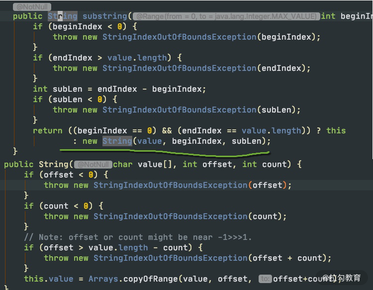
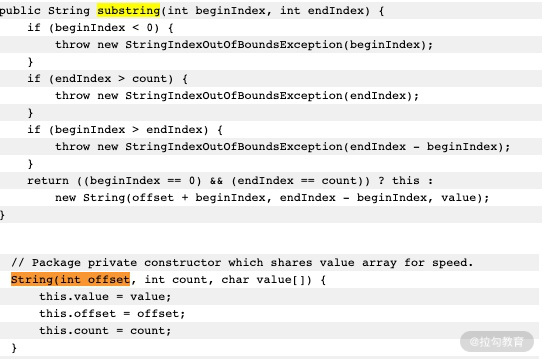

# 10 案例分析：大对象复用的目标和注意点

本课时我们将讲解一下对于“ **大对象** ”的优化。这里的“大对象”，是一个泛化概念，它可能存放在 JVM 中，也可能正在网络上传输，也可能存在于数据库中。那么为什么大对象会影响我们的应用性能呢？

- 第一，大对象 **占用的资源多** ，垃圾回收器要花一部分精力去对它进行回收；
- 第二，大对象在不同的 **设备** 之间 **交换** ，会耗费网络流量，以及昂贵的 I/O；
- 第三，对大对象的解析和处理操作是 **耗时** 的，对象职责不聚焦，就会承担额外的性能开销。

结合我们前面提到的缓存，以及对象的池化操作，加上对一些中间结果的保存，我们能够对大对象进行初步的提速。

但这还远远不够，我们仅仅减少了对象的创建频率，但并没有改变对象“大”这个事实。本课时，将从 JDK 的一些知识点讲起，先来看几个面试频率比较高的 **对象复用问题** ；接下来，从数据的 **结构纬度** 和**时间维度**出发，分别逐步看一下一些把对象变小，把操作聚焦的策略。

### String 的 substring 方法

我们都知道，String 在 Java 中是不可变的，如果你改动了其中的内容，它就会生成一个新的字符串。

如果我们想要用到字符串中的一部分数据，就可以使用 substring 方法。



如上图所示，当我们需要一个子字符串的时候，substring 生成了一个新的字符串，这个字符串通过构造函数的 Arrays.copyOfRange 函数进行构造。

这个函数在 JDK7 之后是没有问题的，但在 JDK6 中，却有着内存泄漏的风险，我们可以学习一下这个案例，来看一下大对象复用可能会产生的问题。



上图是我从 JDK 官方的一张截图。可以看到，它在创建子字符串的时候，并不只拷贝所需要的对象，而是把整个 value 引用了起来。如果原字符串比较大，即使不再使用，内存也不会释放。

比如，一篇文章内容可能有几兆，我们仅仅是需要其中的摘要信息，也不得不维持整个的大对象。

````
String content = dao.getArticle(id); 
String summary=content.substring(0,100); 
articles.put(id,summary);
```** 有一些工作年限比较长的面试官，对 substring 还停留在 JDK6 的印象，但其实，Java 已经将这个 bug 给修改了。 **** 这对我们的借鉴意义是**：如果你创建了比较大的对象，并基于这个对象生成了一些其他的信息，这个时候，一定要记得去掉和这个大对象的引用关系。

### 集合大对象扩容

对象扩容，在 Java 中是司空见惯的现象，比如 StringBuilder、StringBuffer、HashMap，ArrayList 等。概括来讲，Java 的集合，包括 List、Set、Queue、Map 等，其中的数据都不可控。在容量不足的时候，都会有扩容操作，扩容操作需要重新组织数据，所以都不是线程安全的。

我们先来看下 StringBuilder 的扩容代码：

````

void expandCapacity(int minimumCapacity) {

```
    int newCapacity = value.length * 2 + 2; 

    if (newCapacity - minimumCapacity < 0) 

        newCapacity = minimumCapacity; 

    if (newCapacity < 0) { 

        if (minimumCapacity < 0) // overflow 

            throw new OutOfMemoryError(); 

        newCapacity = Integer.MAX_VALUE; 

    } 

    value = Arrays.copyOf(value, newCapacity); 
```

}

```

容量不够的时候，会将内存翻倍，并使用 Arrays.copyOf 复制源数据。

下面是 HashMap 的扩容代码，扩容后大小也是翻倍。它的扩容动作就复杂得多，除了有负载因子的影响，它还需要把原来的数据重新进行散列，由于无法使用 native 的 Arrays.copy 方法，速度就会很慢。

```

void addEntry(int hash, K key, V value, int bucketIndex) {

```
    if ((size >= threshold) && (null != table[bucketIndex])) { 

        resize(2 * table.length); 

        hash = (null != key) ? hash(key) : 0; 

        bucketIndex = indexFor(hash, table.length); 

    } 

    createEntry(hash, key, value, bucketIndex); 
```

} void resize(int newCapacity) {

```
    Entry[] oldTable = table; 

    int oldCapacity = oldTable.length; 

    if (oldCapacity == MAXIMUM_CAPACITY) { 

        threshold = Integer.MAX_VALUE; 

        return; 

    } 

    Entry[] newTable = new Entry[newCapacity]; 

    transfer(newTable, initHashSeedAsNeeded(newCapacity)); 

    table = newTable; 

    threshold = (int)Math.min(newCapacity * loadFactor, MAXIMUM_CAPACITY + 1); 
```

}

```

List 的代码大家可自行查看，也是阻塞性的，扩容策略是原长度的 1.5 倍。

由于集合在代码中使用的频率非常高，如果你知道具体的数据项上限，那么不妨设置一个合理的初始化大小。比如，HashMap 需要 1024 个元素，需要 7 次扩容，会影响应用的性能。**面试中会频繁出现这个问题，你需要了解这些扩容操作对性能的影响。 **但是要注意，像 HashMap 这种有负载因子的集合（0.75），** 初始化大小 = 需要的个数/负载因子+1 **，如果你不是很清楚底层的结构，那就不妨保持默认。

接下来，我将从数据的** 结构纬度 **和** 时间维度**出发，讲解一下应用层面的优化。

### 保持合适的对象粒度

给你分享一个实际案例：我们有一个并发量非常高的业务系统，需要频繁使用到用户的基本数据。

如下图所示，由于用户的基本信息，都是存放在另外一个服务中，所以每次用到用户的基本信息，都需要有一次网络交互。更加让人无法接受的是，即使是只需要用户的性别属性，也需要把所有的用户信息查询，拉取一遍。


为了加快数据的查询速度，根据我们之前 \[《08 | 案例分析：Redis 如何助力秒杀业务》\]的描述，对数据进行了初步的缓存，放入到了 Redis 中，查询性能有了大的改善，但每次还是要查询很多冗余数据。

原始的 redis key 是这样设计的：

```

type: string
key: user\_${userid}
value: json

```

这样的设计有两个问题：

*   查询其中某个字段的值，需要把所有 json 数据查询出来，并自行解析；
*   更新其中某个字段的值，需要更新整个 json 串，代价较高。

针对这种大粒度 json 信息，就可以采用打散的方式进行优化，使得每次更新和查询，都有聚焦的目标。

接下来对 Redis 中的数据进行了以下设计，采用 hash 结构而不是 json 结构：

```

type: hash
key: user\_${userid}
value: {sex:f, id:1223, age:23}

```

这样，我们使用 hget 命令，或者 hmget 命令，就可以获取到想要的数据，加快信息流转的速度。

### Bitmap 把对象变小

除了以上操作，还能再进一步优化吗？比如，我们系统中就频繁用到了用户的性别数据，用来发放一些礼品，推荐一些异性的好友，定时循环用户做一些清理动作等；或者，存放一些用户的状态信息，比如是否在线，是否签到，最近是否发送信息等，从而统计一下活跃用户等。那么对 **是、否** 这两个值的操作，就可以使用 Bitmap 这个结构进行压缩。

**这里还有个高频面试问题，那就是 Java 的 Boolean 占用的是多少位？ **在 Java 虚拟机规范里，描述是：将 Boolean 类型映射成的是 1 和 0 两个数字，它占用的空间是和 int 相同的 32 位。即使有的虚拟机实现把 Boolean 映射到了 byte 类型上，它所占用的空间，对于大量的、有规律的 Boolean 值来说，也是太大了。

如代码所示，通过判断 int 中的每一位，它可以保存 32 个 Boolean 值！

```

int a= 0b0001_0001_1111_1101_1001_0001_1111_1101;

```

Bitmap 就是使用 Bit 进行记录的数据结构，里面存放的数据不是 0 就是 1。还记得我们在之前 \[《08 | 案例分析：Redis 如何助力秒杀业务》\]中提到的缓存穿透吗？就可以使用Bitmap 避免，Java 中的相关结构类，就是 java.util.BitSet，BitSet 底层是使用 long 数组实现的，所以它的最小容量是 64。

100 亿的 Boolean 值，只需要 128MB 的内存，下面既是一个占用了 256MB 的用户性别的判断逻辑，可以涵盖长度为 100 亿的 ID。

```

static BitSet missSet = new BitSet(010_000_000_000);
static BitSet sexSet = new BitSet(010_000_000_000);
String getSex(int userId) {

```
boolean notMiss = missSet.get(userId); 

if (!notMiss) { 

    //lazy fetch 

    String lazySex = dao.getSex(userId); 

    missSet.set(userId, true); 

    sexSet.set(userId, "female".equals(lazySex)); 

} 

return sexSet.get(userId) ? "female" : "male"; 
```

}

```

这些数据，放在堆内内存中，还是过大了。幸运的是，Redis 也支持 Bitmap 结构，如果内存有压力，我们可以把这个结构放到 Redis 中，判断逻辑也是类似的。** 再插一道面试算法题：给出一个 1GB 内存的机器，提供 60亿 int 数据，如何快速判断有哪些数据是重复的？ **大家可以类比思考一下。Bitmap 是一个比较底层的结构，在它之上还有一个叫作布隆过滤器的结构（Bloom Filter），布隆过滤器可以判断一个值不存在，或者可能存在。


如图，它相比较 Bitmap，它多了一层 hash 算法。既然是 hash 算法，就会有冲突，所以有可能有多个值落在同一个 bit 上。它不像 HashMap一样，使用链表或者红黑树来处理冲突，而是直接将这个hash槽重复使用。从这个特性我们能够看出，布隆过滤器能够明确表示一个值不在集合中，但无法判断一个值确切的在集合中。

Guava 中有一个 BloomFilter 的类，可以方便地实现相关功能。

上面这种优化方式，** 本质上也是把大对象变成小对象的方式 **，在软件设计中有很多类似的思路。比如像一篇新发布的文章，频繁用到的是摘要数据，就不需要把整个文章内容都查询出来；用户的 feed 信息，也只需要保证可见信息的速度，而把完整信息存放在速度较慢的大型存储里。

### 数据的冷热分离

数据除了横向的结构纬度，还有一个纵向的** 时间维度 **，对时间维度的优化，最有效的方式就是** 冷热分离 **。

所谓** 热数据 **，就是靠近用户的，被频繁使用的数据；而** 冷数据 **是那些访问频率非常低，年代非常久远的数据。

同一句复杂的 SQL，运行在几千万的数据表上，和运行在几百万的数据表上，前者的效果肯定是很差的。所以，虽然你的系统刚开始上线时速度很快，但随着时间的推移，数据量的增加，就会渐渐变得很慢。** 冷热分离 **是把数据分成两份，如下图，一般都会保持一份全量数据，用来做一些耗时的统计操作。

** 由于冷热分离在工作中经常遇到，所以面试官会频繁问到数据冷热分离的方案。下面简单介绍三种：**

#### 1.数据双写

把对冷热库的插入、更新、删除操作，全部放在一个统一的事务里面。由于热库（比如 MySQL）和冷库（比如 Hbase）的类型不同，这个事务大概率会是分布式事务。在项目初期，这种方式是可行的，但如果是改造一些遗留系统，分布式事务基本上是改不动的，我通常会把这种方案直接废弃掉。

#### 2.写入 MQ 分发

通过 MQ 的发布订阅功能，在进行数据操作的时候，先不落库，而是发送到 MQ 中。单独启动消费进程，将 MQ 中的数据分别落到冷库、热库中。使用这种方式改造的业务，逻辑非常清晰，结构也比较优雅。像订单这种结构比较清晰、对顺序性要求较低的系统，就可以采用 MQ 分发的方式。但如果你的数据库实体量非常大，用这种方式就要考虑程序的复杂性了。

#### 3.使用 Binlog 同步

针对 MySQL，就可以采用 Binlog 的方式进行同步，使用 Canal 组件，可持续获取最新的 Binlog 数据，结合 MQ，可以将数据同步到其他的数据源中。

### 思维发散

对于结果集的操作，我们可以再发散一下思维。可以将一个简单冗余的结果集，改造成复杂高效的数据结构。这个复杂的数据结构可以代理我们的请求，有效地转移耗时操作。

*   比如，我们常用的 **数据库索引** ，就是一种对数据的重新组织、加速。

B+ tree 可以有效地减少数据库与磁盘交互的次数，它通过类似 B+ tree 的数据结构，将最常用的数据进行索引，存储在有限的存储空间中。

*   还有就是， **在 RPC 中常用的序列化** 。

有的服务是采用的 SOAP 协议的 WebService，它是基于 XML 的一种协议，内容大传输慢，效率低下。现在的 Web 服务中，大多数是使用 json 数据进行交互的，json 的效率相比 SOAP 就更高一些。

另外，大家应该都听过 google 的 protobuf，由于它是二进制协议，而且对数据进行了压缩，性能是非常优越的。protobuf 对数据压缩后，大小只有 json 的 1/10，xml 的 1/20，但是性能却提高了 5-100 倍。

protobuf 的设计是值得借鉴的，它通过 tag|leng|value 三段对数据进行了非常紧凑的处理，解析和传输速度都特别快。

### 小结

最后总结一下本课时的内容重点：

首先，我们看了比较老的 JDK 版本中，String 为了复用引起的内容泄漏问题，所以我们平常的编码中，一定要注意 **大对象** 的回收，及时切断与它的联系。

接下来，我们看了 Java 中集合的一些 **扩容** 操作，如果你知道确切的集合大小，就可以指定一个初始值，避免耗时的扩容操作。

针对大对象，我们有结构纬度的优化和时间维度的优化两种方法：

从 **结构纬度** 来说，通过把对象 **切分成合适的粒度** ，可以把操作集中在小数据结构上，减少时间处理成本；通过把对象进行 **压缩、转换** ，或者 **提取热点数据** ，就可以避免大对象的存储和传输成本。

从 **时间纬度** 来说，就可以通过 **冷热分离** 的手段，将常用的数据存放在高速设备中，减少数据处理的集合，加快处理速度。

到现在为止，我们学习了缓冲、缓存、对象池化、结果缓存池、大对象处理等优化性能的手段，由于它们都加入了额外的中间层，会使得编程模型变得复杂。

接下来，我将在下一课时《11 | 案例分析：如何用设计模式优化性能》中介绍几种常用的设计模式，来看一下设计模式可以如何助力我们的性能优化，又有哪些可以注意的地方。
```
