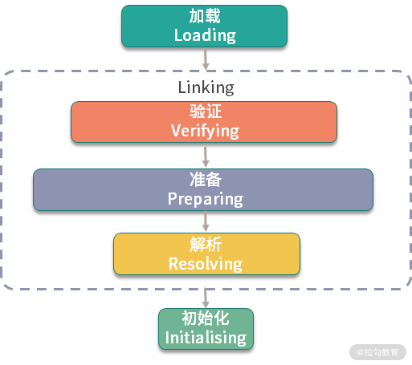
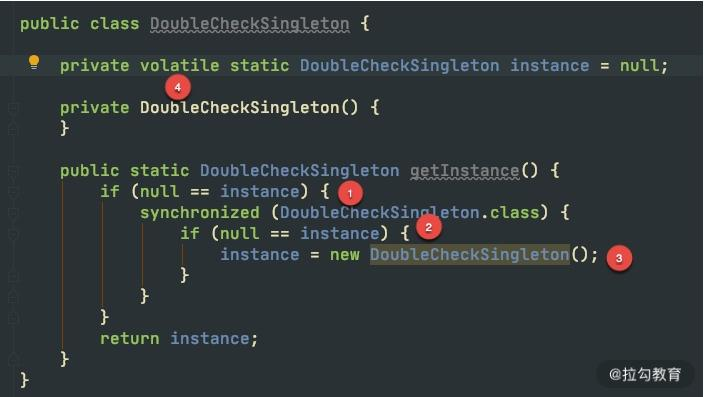

# 11 案例分析：如何用设计模式优化性能

代码的结构对应用的整体性能，有着重要的影响。结构优秀的代码，可以避免很多潜在的性能问题，在代码的扩展性上也有巨大的作用；结构清晰、层次分明的代码，也有助于帮你找到系统的瓶颈点，进行专项优化。

**设计模式**就是对常用开发技巧进行的总结，它使得程序员之间交流问题，有了更专业、便捷的方式。比如，我们在《02 | 理论分析：性能优化有章可循，谈谈常用的切入点》中提到，I/O 模块使用的是装饰器模式，你就能很容易想到 I/O 模块的代码组织方式。

事实上，大多数设计模式并不能增加程序的性能，它只是代码的一种组织方式。本课时，我们将一一举例讲解和性能相关的几个设计模式，包括代理模式、单例模式、享元模式、原型模式等。

### 如何找到动态代理慢逻辑的原因?

Spring 广泛使用了代理模式，它使用 CGLIB 对 Java 的字节码进行了增强。在复杂的项目中，会有非常多的 AOP 代码，比如权限、日志等切面。在方便了编码的同时，AOP 也给不熟悉项目代码的同学带来了很多困扰。

下面我将分析一个**使用 arthas 找到动态代理慢逻辑的具体原因**，这种方式在复杂项目中，非常有效，你不需要熟悉项目的代码，就可以定位到性能瓶颈点。

首先，我们创建一个最简单的 Bean（[代码见仓库](https://gitee.com/xjjdog/tuning-lagou-res/tree/master/tuning-011/design-pattern)）。

```
@Component 
public class ABean { 
    public void method() { 
        System.out.println("*******************"); 
    } 
} 
```

然后，我们使用 Aspect 注解，完成切面的书写，在前置方法里，我们让线程 sleep 了 1 秒钟。

```
@Aspect 
@Component 
public class MyAspect { 
    @Pointcut("execution(* com.github.xjjdog.spring.ABean.*(..)))") 
    public void pointcut() { 
    }  
    @Before("pointcut()") 
    public void before() { 
        System.out.println("before"); 
        try { 
            Thread.sleep(TimeUnit.SECONDS.toMillis(1)); 
        } catch (InterruptedException e) { 
            throw new IllegalStateException(); 
        } 
    } 
} 
```

创建一个 Controller，当访问 /aop 链接时，将会输出 Bean 的类名称，以及它的耗时。

```
@Controller 
public class AopController { 
    @Autowired 
    private ABean aBean;  
    @ResponseBody 
    @GetMapping("/aop") 
    public String aop() { 
        long begin = System.currentTimeMillis(); 
        aBean.method(); 
        long cost = System.currentTimeMillis() - begin; 
        String cls = aBean.getClass().toString(); 
        return cls + " | " + cost; 
    } 
} 
```

执行结果如下，可以看到 AOP 代理已经生效，内存里的 Bean 对象，已经变成了EnhancerBySpringCGLIB 类型，调用方法 method，耗时达到了1023ms。

```
class com.github.xjjdog.spring.ABean$$EnhancerBySpringCGLIB$$a5d91535 | 1023 
```

下面使用 arthas 分析这个执行过程，找出耗时最高的 AOP 方法。启动 arthas 后，可以从列表中看到我们的应用程序，在这里，输入 2 进入分析界面。


在终端输入 trace 命令，然后访问 /aop 接口，终端将打印出一些 debug 信息，可以发现耗时操作就是 Spring 的代理类。

```
trace com.github.xjjdog.spring.ABean method 
```


### 代理模式

代理模式（Proxy）可以通过一个代理类，来控制对一个对象的访问。

Java 中实现动态代理主要有两种模式：一种是使用 JDK，另外一种是使用 CGLib。

- 其中，JDK 方式是面向接口的，主 要的相关类是 InvocationHandler 和 Proxy；
- CGLib 可以代理普通类，主要的相关类是 MethodInterceptor 和 Enhancer。

**这个知识点面试频率非常高**，仓库中有这两个实现的完整代码，这里就不贴出来了。

下面是 JDK 方式和 CGLib 方式代理速度的 JMH 测试结果：

```
Benchmark              Mode  Cnt      Score      Error   Units 
ProxyBenchmark.cglib  thrpt   10  78499.580 ± 1771.148  ops/ms 
ProxyBenchmark.jdk    thrpt   10  88948.858 ±  814.360  ops/ms 
```

我现在用的**JDK **版本是 1.8，可以看到，CGLib 的速度并没有传得那么快（有传言高出10 倍），相比较而言，它的速度甚至略有下降。 我们再来看下** 代理**的创建速度，结果如下所示。可以看到，在代理类初始化方面，JDK 的吞吐量要高出 CGLib 一倍。

```
Benchmark                    Mode  Cnt      Score      Error   Units 
ProxyCreateBenchmark.cglib  thrpt   10   7281.487 ± 1339.779  ops/ms 
ProxyCreateBenchmark.jdk    thrpt   10  15612.467 ±  268.362  ops/ms 
```

综上所述，JDK 动态代理和 CGLib 代理的创建速度和执行速度，在新版本的 Java 中差别并不是很大，Spring 选用了 CGLib，主要是因为它能够代理普通类的缘故。

### 单例模式

Spring 在创建组件的时候，可以通过 scope 注解指定它的作用域，用来标示这是一个prototype（多例）还是 singleton（单例）。

当指定为单例时（默认行为），在 Spring 容器中，组件有且只有一份，当你注入相关组件的时候，获取的组件实例也是同一份。

如果是普通的单例类，我们通常将单例的构造方法设置成私有的，单例有懒汉加载和饿汉加载模式。

了解 JVM 类加载机制的同学都知道，一个类从加载到初始化，要经历 5 个步骤：加载、验证、准备、解析、初始化。



其中，static 字段和 static 代码块，是属于类的，在类加载的初始化阶段就已经被执行。它在字节码中对应的是 方法，属于类的（构造方法）。因为类的初始化只有一次，所以它就能够保证这个加载动作是线程安全的。

根据以上原理，只要把单例的初始化动作，放在方法里，就能够实现**饿汉模式**。

```
private static Singleton instace = new Singleton();  
```

饿汉模式在代码里用的很少，它会造成资源的浪费，生成很多可能永远不会用到的对象。 而对象初始化就不一样了。通常，我们在 new 一个新对象的时候，都会调用它的构造方法，就是，用来初始化对象的属性。由于在同一时刻，多个线程可以同时调用函数，我们就需要使用 synchronized 关键字对生成过程进行同步。

目前，**公认的兼顾线程安全和效率的单例模式，就是 double check。很多面试官，会要求你手写，并分析 double check 的原理。**



如上图，是 double check 的关键代码，我们介绍一下四个关键点：

- 第一次检查，当 instance 为 null 的时候，进入对象实例化逻辑，否则直接返回。
- 加同步锁，这里是类锁。
- 第二次检查才是关键。如果不加这次判空动作，可能会有多个线程进入同步代码块，进而生成多个实例。
- 最后一个关键点是 volatile 关键字。在一些低版本的 Java 里，由于指令重排的缘故，可能会导致单例被 new 出来后，还没来得及执行构造函数，就被其他线程使用。 这个关键字，可以阻止字节码指令的重排序，在写 double check 代码时，习惯性会加上 volatile。

可以看到， **double check 的写法繁杂，注意点很多，它现在其实是一种反模式，已经不推荐使用了** ，我也不推荐你用在自己的代码里。但它能够考察面试者对并发的理解，所以这个问题经常被问到。

推荐使用 enum 实现懒加载的单例，代码片段如下：

> [《Effective Java》](https://book.douban.com/subject/1103015/)这本书也同样推荐了该方式。

```
public class EnumSingleton { 
    private EnumSingleton() { 
    } 
    public static EnumSingleton getInstance() { 
        return Holder.HOLDER.instance; 
    } 
    private enum Holder { 
        HOLDER; 
        private final EnumSingleton instance; 
        Holder() { 
            instance = new EnumSingleton(); 
        } 
    } 
} 
```

### 享元模式

享元模式（Flyweight）是难得的，专门针对性能优化的设计模式，它通过共享技术，最大限度地复用对象。享元模式一般会使用唯一的标识码进行判断，然后返回对应的对象，使用 HashMap 一类的集合存储非常合适。

上面的描述，我们非常熟悉，因为在过去的一些课时中，我们就能看到很多享元模式的身影，比如《09 | 案例分析：池化对象的应用场景》里的池化对象和《10 | 案例分析：大对象复用的目标和注意点》里的对象复用等。

设计模式对这我们平常的编码进行了抽象，从不同的角度去解释设计模式，都会找到设计思想的一些共通点。比如，单例模式就是享元模式的一种特殊情况，它通过共享 **单个实例** ，达到对象的复用。

值得一提的是，同样的代码，不同的解释，会产生不同的效果。比如下面这段代码：

```
Map<String,Strategy> strategys = new HashMap<>(); 
strategys.put("a",new AStrategy()); 
strategys.put("b",new BStrategy()); 
```

如果我们从对象复用的角度来说，它就是享元模式；如果我们从对象的功能角度来说，那它就是策略模式。所以大家在讨论设计模式的时候，一定要注意上下文语境的这些差别。

### 原型模式

原型模式（Prototype）比较类似于复制粘贴的思想，它可以首先创建一个实例，然后通过这个实例进行新对象的创建。在 Java 中，最典型的就是 **Object 类的 clone 方法**。

但编码中这个方法很少用，我们上面在代理模式提到的 prototype，并不是通过 clone 实现的，而是使用了更复杂的反射技术。

一个比较重要的原因就是 clone 如果只拷贝当前层次的对象，实现的只是浅拷贝。在现实情况下，对象往往会非常复杂，想要实现深拷贝的话，需要在 clone 方法里做大量的编码，远远不如调用 new 方法方便。

实现深拷贝，还有序列化等手段，比如实现 Serializable 接口，或者把对象转化成 JSON。

所以，在现实情况下，**原型模式变成了一种思想，而不是加快对象创建速度的工具**。

### 小结

本课时，我们主要看了几个与性能相关的设计模式，包括一些高频的考点。我们了解到了**Java 实现动态代理 **的两种方式，以及他们的区别，在现版本的 JVM 中，性能差异并不大；我们还了解到** 单例模式的三种创建方式 **，并看了一个 double check 的反例，平常编码中，推荐使用枚举去实现单例；最后，我们学习了** 享元模式 **和** 原型模式**，它们概念性更强一些，并没有固定的编码模式。

我们还顺便学习了 arthas 使用 trace 命令，寻找耗时代码块的方法，最终将问题定位到 Spring 的 AOP 功能模块里，而这种场景在复杂项目中经常发生，需要你特别注意。

此外，在设计模式中，对性能帮助最大的是生产者消费者模式，比如异步消息、reactor 模型等，而这一部分内容，我们将在之后的《15 | 案例分析：从 BIO 到 NIO，再到 AIO》中详细讲解。

不过，想要了解这方面的内容，需要首先了解一些多线程编程的知识，所以下一课时，我将讲解并行计算的一些知识点，记得按时来听课。
