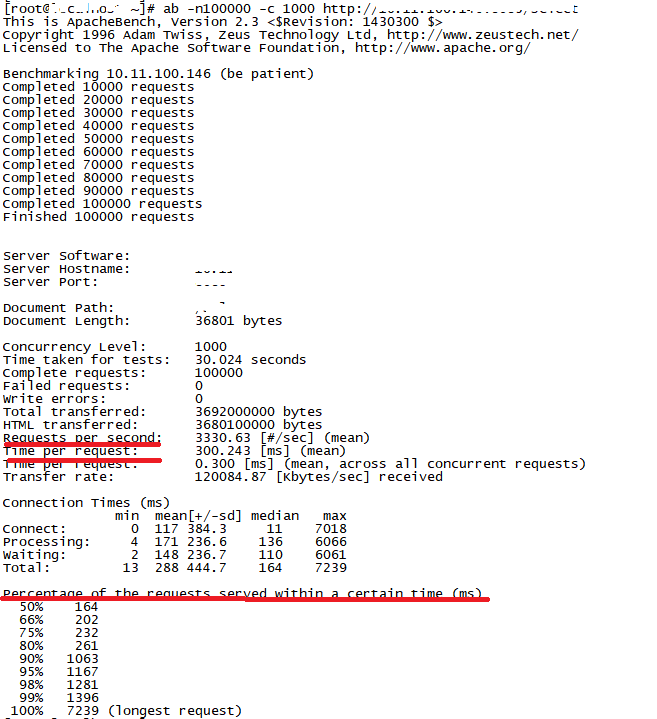
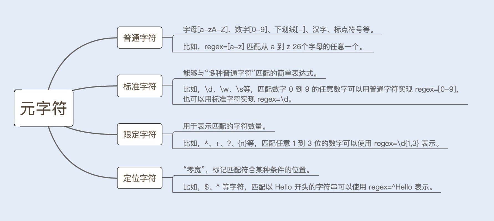
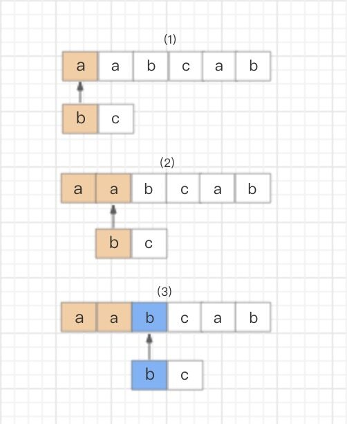
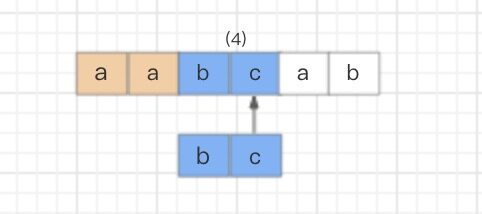
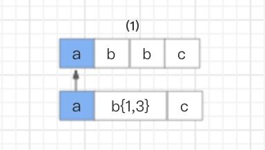
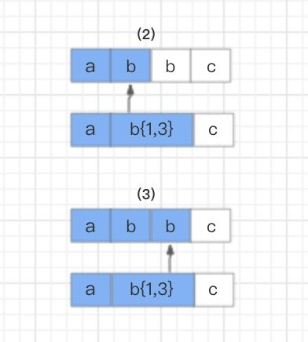
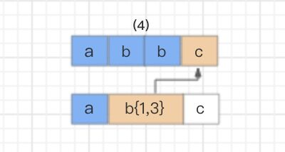
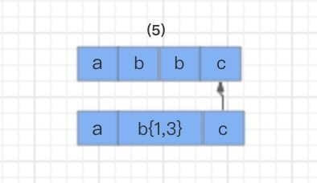

# 04 慎重使用正则表达式

```
你好，我是刘超。

```

上一讲，我在讲 String 对象优化时，提到了 Split() 方法，该方法使用的正则表达式可能引起回溯问题，今天我们就来深入了解下，这究竟是怎么回事？

\*\*开始之前，我们先来看一个案例，\*\*可以帮助你更好地理解内容。

在一次小型项目开发中，我遇到过这样一个问题。为了宣传新品，我们开发了一个小程序，按照之前评估的访问量，这次活动预计参与用户量 30W+，TPS（每秒事务处理量）最高 3000 左右。

这个结果来自我对接口做的微基准性能测试。我习惯使用 ab 工具（通过 yum -y install httpd-tools 可以快速安装）在另一台机器上对 http 请求接口进行测试。

我可以通过设置 -n 请求数 /-c 并发用户数来模拟线上的峰值请求，再通过 TPS、RT（每秒响应时间）以及每秒请求时间分布情况这三个指标来衡量接口的性能，如下图所示（图中隐藏部分为我的服务器地址）：



就在做性能测试的时候，我发现有一个提交接口的 TPS 一直上不去，按理说这个业务非常简单，存在性能瓶颈的可能性并不大。

我迅速使用了排除法查找问题。首先将方法里面的业务代码全部注释，留一个空方法在这里，再看性能如何。这种方式能够很好地区分是框架性能问题，还是业务代码性能问题。

我快速定位到了是业务代码问题，就马上逐一查看代码查找原因。我将插入数据库操作代码加上之后，TPS 稍微下降了，但还是没有找到原因。最后，就只剩下 Split() 方法操作了，果然，我将 Split() 方法加入之后，TPS 明显下降了。

可是一个 Split() 方法为什么会影响到 TPS 呢？下面我们就来了解下正则表达式的相关内容，学完了答案也就出来了。

## 什么是正则表达式？

很基础，这里带你简单回顾一下。

正则表达式是计算机科学的一个概念，很多语言都实现了它。正则表达式使用一些特定的元字符来检索、匹配以及替换符合规则的字符串。

构造正则表达式语法的元字符，由普通字符、标准字符、限定字符（量词）、定位字符（边界字符）组成。详情可见下图：



## 正则表达式引擎

正则表达式是一个用正则符号写出的公式，程序对这个公式进行语法分析，建立一个语法分析树，再根据这个分析树结合正则表达式的引擎生成执行程序（这个执行程序我们把它称作状态机，也叫状态自动机），用于字符匹配。

而这里的正则表达式引擎就是一套核心算法，用于建立状态机。

目前实现正则表达式引擎的方式有两种：DFA 自动机（Deterministic Final Automata 确定有限状态自动机）和 NFA 自动机（Non deterministic Finite Automaton 非确定有限状态自动机）。

对比来看，构造 DFA 自动机的代价远大于 NFA 自动机，但 DFA 自动机的执行效率高于 NFA 自动机。

假设一个字符串的长度是 n，如果用 DFA 自动机作为正则表达式引擎，则匹配的时间复杂度为 O(n)；如果用 NFA 自动机作为正则表达式引擎，由于 NFA 自动机在匹配过程中存在大量的分支和回溯，假设 NFA 的状态数为 s，则该匹配算法的时间复杂度为 O（ns）。

NFA 自动机的优势是支持更多功能。例如，捕获 group、环视、占有优先量词等高级功能。这些功能都是基于子表达式独立进行匹配，因此在编程语言里，使用的正则表达式库都是基于 NFA 实现的。

那么 NFA 自动机到底是怎么进行匹配的呢？我以下面的字符和表达式来举例说明。

text=“aabcab” regex=“bc”

NFA 自动机会读取正则表达式的每一个字符，拿去和目标字符串匹配，匹配成功就换正则表达式的下一个字符，反之就继续和目标字符串的下一个字符进行匹配。分解一下过程。

首先，读取正则表达式的第一个匹配符和字符串的第一个字符进行比较，b 对 a，不匹配；继续换字符串的下一个字符，也是 a，不匹配；继续换下一个，是 b，匹配。



然后，同理，读取正则表达式的第二个匹配符和字符串的第四个字符进行比较，c 对 c，匹配；继续读取正则表达式的下一个字符，然而后面已经没有可匹配的字符了，结束。



这就是 NFA 自动机的匹配过程，虽然在实际应用中，碰到的正则表达式都要比这复杂，但匹配方法是一样的。

### NFA 自动机的回溯

用 NFA 自动机实现的比较复杂的正则表达式，在匹配过程中经常会引起回溯问题。大量的回溯会长时间地占用 CPU，从而带来系统性能开销。我来举例说明。

text=“abbc” regex=“ab{1,3}c”

这个例子，匹配目的比较简单。匹配以 a 开头，以 c 结尾，中间有 1-3 个 b 字符的字符串。NFA 自动机对其解析的过程是这样的：

首先，读取正则表达式第一个匹配符 a 和字符串第一个字符 a 进行比较，a 对 a，匹配。



然后，读取正则表达式第二个匹配符 b{1,3} 和字符串的第二个字符 b 进行比较，匹配。但因为 b{1,3} 表示 1-3 个 b 字符串，NFA 自动机又具有贪婪特性，所以此时不会继续读取正则表达式的下一个匹配符，而是依旧使用 b{1,3} 和字符串的第三个字符 b 进行比较，结果还是匹配。



接着继续使用 b{1,3} 和字符串的第四个字符 c 进行比较，发现不匹配了，此时就会发生回溯，已经读取的字符串第四个字符 c 将被吐出去，指针回到第三个字符 b 的位置。



那么发生回溯以后，匹配过程怎么继续呢？程序会读取正则表达式的下一个匹配符 c，和字符串中的第四个字符 c 进行比较，结果匹配，结束。



### 如何避免回溯问题？

既然回溯会给系统带来性能开销，那我们如何应对呢？如果你有仔细看上面那个案例的话，你会发现 NFA 自动机的贪婪特性就是导火索，这和正则表达式的匹配模式息息相关，一起来了解一下。

**1. 贪婪模式（Greedy）**

顾名思义，就是在数量匹配中，如果单独使用 +、 ? 、\* 或{min,max} 等量词，正则表达式会匹配尽可能多的内容。

例如，上边那个例子：

text=“abbc” regex=“ab{1,3}c”

就是在贪婪模式下，NFA 自动机读取了最大的匹配范围，即匹配 3 个 b 字符。匹配发生了一次失败，就引起了一次回溯。如果匹配结果是“abbbc”，就会匹配成功。

text=“abbbc” regex=“ab{1,3}c”

\*\*2. 懒惰模式（Reluctant）\*\*在该模式下，正则表达式会尽可能少地重复匹配字符。如果匹配成功，它会继续匹配剩余的字符串。

例如，在上面例子的字符后面加一个“？”，就可以开启懒惰模式。

text=“abc” regex=“ab{1,3}?c”

匹配结果是“abc”，该模式下 NFA 自动机首先选择最小的匹配范围，即匹配 1 个 b 字符，因此就避免了回溯问题。\*\*3. 独占模式（Possessive）\*\*同贪婪模式一样，独占模式一样会最大限度地匹配更多内容；不同的是，在独占模式下，匹配失败就会结束匹配，不会发生回溯问题。

还是上边的例子，在字符后面加一个“+”，就可以开启独占模式。

text=“abbc” regex=“ab{1,3}+bc”

结果是不匹配，结束匹配，不会发生回溯问题。讲到这里，你应该非常清楚了，**避免回溯的方法就是：使用懒惰模式和独占模式。**

还有开头那道“一个 split() 方法为什么会影响到 TPS”的存疑，你应该也清楚了吧？

我使用了 split() 方法提取域名，并检查请求参数是否符合规定。split() 在匹配分组时遇到特殊字符产生了大量回溯，我当时是在正则表达式后加了一个需要匹配的字符和“+”，解决了这个问题。

```
\\?(([A-Za-z0-9-~_=%]++\\&{0,1})+)


```

## 正则表达式的优化

正则表达式带来的性能问题，给我敲了个警钟，在这里我也希望分享给你一些心得。任何一个细节问题，都有可能导致性能问题，而这背后折射出来的是我们对这项技术的了解不够透彻。所以我鼓励你学习性能调优，要掌握方法论，学会透过现象看本质。下面我就总结几种正则表达式的优化方法给你。

### 1. 少用贪婪模式，多用独占模式

贪婪模式会引起回溯问题，我们可以使用独占模式来避免回溯。前面详解过了，这里我就不再解释了。

### 2. 减少分支选择

分支选择类型“(X|Y|Z)”的正则表达式会降低性能，我们在开发的时候要尽量减少使用。如果一定要用，我们可以通过以下几种方式来优化：

首先，我们需要考虑选择的顺序，将比较常用的选择项放在前面，使它们可以较快地被匹配；

其次，我们可以尝试提取共用模式，例如，将“(abcd|abef)”替换为“ab(cd|ef)”，后者匹配速度较快，因为 NFA 自动机会尝试匹配 ab，如果没有找到，就不会再尝试任何选项；

最后，如果是简单的分支选择类型，我们可以用三次 index 代替“(X|Y|Z)”，如果测试的话，你就会发现三次 index 的效率要比“(X|Y|Z)”高出一些。

### 3. 减少捕获嵌套

在讲这个方法之前，我先简单介绍下什么是捕获组和非捕获组。

捕获组是指把正则表达式中，子表达式匹配的内容保存到以数字编号或显式命名的数组中，方便后面引用。一般一个 () 就是一个捕获组，捕获组可以进行嵌套。

非捕获组则是指参与匹配却不进行分组编号的捕获组，其表达式一般由（?:exp）组成。

在正则表达式中，每个捕获组都有一个编号，编号 0 代表整个匹配到的内容。我们可以看下面的例子：

```
public static void main( String[] args )

{

 String text = "<input high=\"20\" weight=\"70\">test</input>";

 String reg="(<input.*?>)(.*?)(</input>)";

 Pattern p = Pattern.compile(reg);

 Matcher m = p.matcher(text);

 while(m.find()) {

  System.out.println(m.group(0));// 整个匹配到的内容

  System.out.println(m.group(1));//(<input.*?>)

  System.out.println(m.group(2));//(.*?)

  System.out.println(m.group(3));//(</input>)

 }

}

```

运行结果：

```
<input high=\"20\" weight=\"70\">test</input>

<input high=\"20\" weight=\"70\">

test

</input>

```

如果你并不需要获取某一个分组内的文本，那么就使用非捕获分组。例如，使用“(?:X)”代替“(X)”，我们再看下面的例子：

```
public static void main( String[] args )

{

 String text = "<input high=\"20\" weight=\"70\">test</input>";

 String reg="(?:<input.*?>)(.*?)(?:</input>)";

 Pattern p = Pattern.compile(reg);

 Matcher m = p.matcher(text);

 while(m.find()) {

  System.out.println(m.group(0));// 整个匹配到的内容

  System.out.println(m.group(1));//(.*?)

 }

}

```

运行结果：

```
<input high=\"20\" weight=\"70\">test</input>

test

```

综上可知：减少不需要获取的分组，可以提高正则表达式的性能。

## 总结

正则表达式虽然小，却有着强大的匹配功能。我们经常用到它，比如，注册页面手机号或邮箱的校验。

但很多时候，我们又会因为它小而忽略它的使用规则，测试用例中又没有覆盖到一些特殊用例，不乏上线就中招的情况发生。

综合我以往的经验来看，如果使用正则表达式能使你的代码简洁方便，那么在做好性能排查的前提下，可以去使用；如果不能，那么正则表达式能不用就不用，以此避免造成更多的性能问题。

## 思考题

除了 Split() 方法使用到正则表达式，其实 Java 还有一些方法也使用了正则表达式去实现一些功能，使我们很容易掉入陷阱。现在就请你想一想 JDK 里面，还有哪些工具方法用到了正则表达式？
