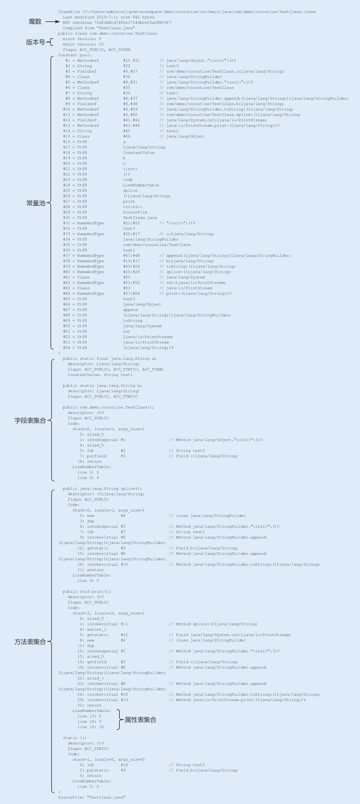
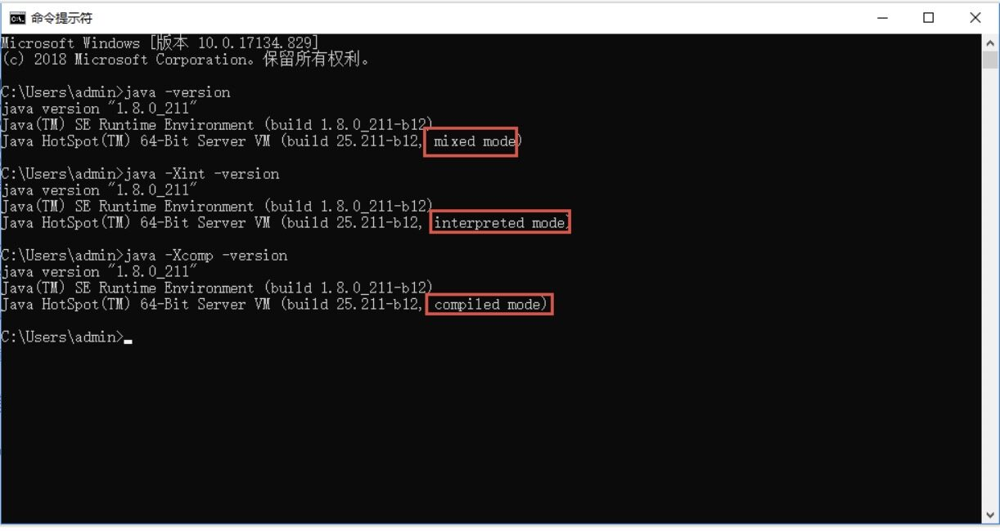
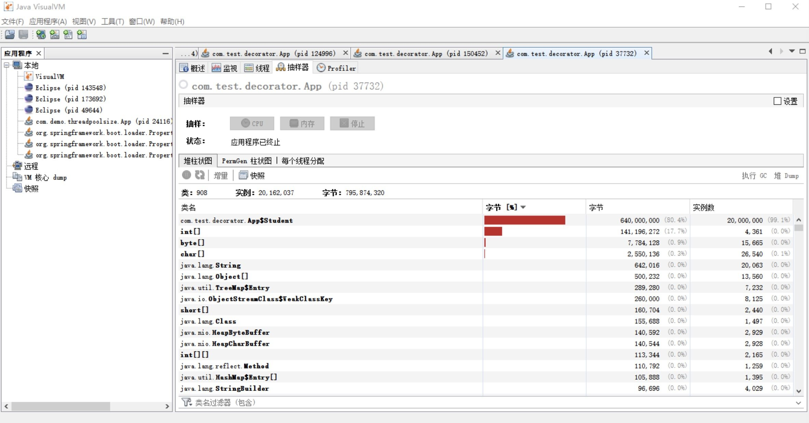

# 21 深入JVM即时编译器JIT，优化Java编译

你好，我是刘超。

说到编译，我猜你一定会想到 .java 文件被编译成 .class 文件的过程，这个编译我们一般称为前端编译。Java 的编译和运行过程非常复杂，除了前端编译，还有运行时编译。由于机器无法直接运行 Java 生成的字节码，所以在运行时，JIT 或解释器会将字节码转换成机器码，这个过程就叫运行时编译。

类文件在运行时被进一步编译，它们可以变成高度优化的机器代码，由于 C/C++ 编译器的所有优化都是在编译期间完成的，运行期间的性能监控仅作为基础的优化措施则无法进行，例如，调用频率预测、分支频率预测、裁剪未被选择的分支等，而 Java 在运行时的再次编译，就可以进行基础的优化措施。因此，JIT 编译器可以说是 JVM 中运行时编译最重要的部分之一。

然而许多 Java 开发人员对 JIT 编译器的了解并不多，不深挖其工作原理，也不深究如何检测应用程序的即时编译情况，线上发生问题后很难做到从容应对。今天我们就来学习运行时编译如何实现对 Java 代码的优化。

## 类编译加载执行过程

在这之前，我们先了解下 Java 从编译到运行的整个过程，为后面的学习打下基础。请看下图：


### 类编译

在编写好代码之后，我们需要将 .java 文件编译成 .class 文件，才能在虚拟机上正常运行代码。文件的编译通常是由 JDK 中自带的 Javac 工具完成，一个简单的 .java 文件，我们可以通过 javac 命令来生成 .class 文件。

下面我们通过 javap（ \[第 12 讲\] 讲过如何使用 javap 反编译命令行）反编译来看看一个 class 文件结构中主要包含了哪些信息：



看似一个简单的命令执行，前期编译的过程其实是非常复杂的，包括词法分析、填充符号表、注解处理、语义分析以及生成 class 文件，这个过程我们不用过多关注。只要从上图中知道，编译后的字节码文件主要包括常量池和方法表集合这两部分就可以了。

常量池主要记录的是类文件中出现的字面量以及符号引用。字面常量包括字符串常量（例如 String str=“abc”，其中"abc"就是常量），声明为 final 的属性以及一些基本类型（例如，范围在 -127-128 之间的整型）的属性。符号引用包括类和接口的全限定名、类引用、方法引用以及成员变量引用（例如 String str=“abc”，其中 str 就是成员变量引用）等。

方法表集合中主要包含一些方法的字节码、方法访问权限（public、protect、prviate 等）、方法名索引（与常量池中的方法引用对应）、描述符索引、JVM 执行指令以及属性集合等。

### 类加载

当一个类被创建实例或者被其它对象引用时，虚拟机在没有加载过该类的情况下，会通过类加载器将字节码文件加载到内存中。

不同的实现类由不同的类加载器加载，JDK 中的本地方法类一般由根加载器（Bootstrp loader）加载进来，JDK 中内部实现的扩展类一般由扩展加载器（ExtClassLoader ）实现加载，而程序中的类文件则由系统加载器（AppClassLoader ）实现加载。

在类加载后，class 类文件中的常量池信息以及其它数据会被保存到 JVM 内存的方法区中。

### 类连接

类在加载进来之后，会进行连接、初始化，最后才会被使用。在连接过程中，又包括验证、准备和解析三个部分。

\*\*验证：\*\*验证类符合 Java 规范和 JVM 规范，在保证符合规范的前提下，避免危害虚拟机安全。

\*\*准备：\*\*为类的静态变量分配内存，初始化为系统的初始值。对于 final static 修饰的变量，直接赋值为用户的定义值。例如，private final static int value=123，会在准备阶段分配内存，并初始化值为 123，而如果是 private static int value=123，这个阶段 value 的值仍然为 0。

\*\*解析：\*\*将符号引用转为直接引用的过程。我们知道，在编译时，Java 类并不知道所引用的类的实际地址，因此只能使用符号引用来代替。类结构文件的常量池中存储了符号引用，包括类和接口的全限定名、类引用、方法引用以及成员变量引用等。如果要使用这些类和方法，就需要把它们转化为 JVM 可以直接获取的内存地址或指针，即直接引用。

### 类初始化

类初始化阶段是类加载过程的最后阶段，在这个阶段中，JVM 首先将执行构造器 方法，编译器会在将 .java 文件编译成 .class 文件时，收集所有类初始化代码，包括静态变量赋值语句、静态代码块、静态方法，收集在一起成为 () 方法。

初始化类的静态变量和静态代码块为用户自定义的值，初始化的顺序和 Java 源码从上到下的顺序一致。例如：

```
private static int i=1；

static{

  i=0;

}

public static void main(String [] args){

  System.out.println(i);

}

 

```

此时运行结果为：

```
0


```

再来看看以下代码：

```
static{

  i=0;

}

private static int i=1；

public static void main(String [] args){

  System.out.println(i);

}

```

此时运行结果为：

```
1


```

子类初始化时会首先调用父类的 () 方法，再执行子类的 () 方法，运行以下代码：

```
public class Parent{

  public static String parentStr= "parent static string";

  static{

    System.out.println("parent static fields");

    System.out.println(parentStr);

  }

  public Parent(){

    System.out.println("parent instance initialization");

 }

}

 

public class Sub extends Parent{

  public static String subStr= "sub static string";

  static{

    System.out.println("sub static fields");

    System.out.println(subStr);

  }

 

  public Sub(){

    System.out.println("sub instance initialization");

  }

 

  public static void main(String[] args){

    System.out.println("sub main");

    new Sub();

 }

}

```

运行结果：

```
parent static fields

parent static string

sub static fields

sub static string

sub main

parent instance initialization

sub instance initialization

```

JVM 会保证 () 方法的线程安全，保证同一时间只有一个线程执行。

JVM 在初始化执行代码时，如果实例化一个新对象，会调用 方法对实例变量进行初始化，并执行对应的构造方法内的代码。

## 即时编译

初始化完成后，类在调用执行过程中，执行引擎会把字节码转为机器码，然后在操作系统中才能执行。在字节码转换为机器码的过程中，虚拟机中还存在着一道编译，那就是即时编译。

最初，虚拟机中的字节码是由解释器（ Interpreter ）完成编译的，当虚拟机发现某个方法或代码块的运行特别频繁的时候，就会把这些代码认定为“热点代码”。

为了提高热点代码的执行效率，在运行时，即时编译器（JIT）会把这些代码编译成与本地平台相关的机器码，并进行各层次的优化，然后保存到内存中。

### 即时编译器类型

在 HotSpot 虚拟机中，内置了两个 JIT，分别为 C1 编译器和 C2 编译器，这两个编译器的编译过程是不一样的。

C1 编译器是一个简单快速的编译器，主要的关注点在于局部性的优化，适用于执行时间较短或对启动性能有要求的程序，例如，GUI 应用对界面启动速度就有一定要求。

C2 编译器是为长期运行的服务器端应用程序做性能调优的编译器，适用于执行时间较长或对峰值性能有要求的程序。根据各自的适配性，这两种即时编译也被称为 Client Compiler 和 Server Compiler。

在 Java7 之前，需要根据程序的特性来选择对应的 JIT，虚拟机默认采用解释器和其中一个编译器配合工作。

Java7 引入了分层编译，这种方式综合了 C1 的启动性能优势和 C2 的峰值性能优势，我们也可以通过参数 “-client”“-server” 强制指定虚拟机的即时编译模式。**分层编译将 JVM 的执行状态分为了 5 个层次：**

- 第 0 层：程序解释执行，默认开启性能监控功能（Profiling），如果不开启，可触发第二层编译；
- 第 1 层：可称为 C1 编译，将字节码编译为本地代码，进行简单、可靠的优化，不开启 Profiling；
- 第 2 层：也称为 C1 编译，开启 Profiling，仅执行带方法调用次数和循环回边执行次数 profiling 的 C1 编译；
- 第 3 层：也称为 C1 编译，执行所有带 Profiling 的 C1 编译；
- 第 4 层：可称为 C2 编译，也是将字节码编译为本地代码，但是会启用一些编译耗时较长的优化，甚至会根据性能监控信息进行一些不可靠的激进优化。

在 Java8 中，默认开启分层编译，-client 和 -server 的设置已经是无效的了。如果只想开启 C2，可以关闭分层编译（-XX:-TieredCompilation），如果只想用 C1，可以在打开分层编译的同时，使用参数：-XX:TieredStopAtLevel=1。

除了这种默认的混合编译模式，我们还可以使用“-Xint”参数强制虚拟机运行于只有解释器的编译模式下，这时 JIT 完全不介入工作；我们还可以使用参数“-Xcomp”强制虚拟机运行于只有 JIT 的编译模式下。

通过 java -version 命令行可以直接查看到当前系统使用的编译模式。如下图所示：



### 热点探测

在 HotSpot 虚拟机中的热点探测是 JIT 优化的条件，热点探测是基于计数器的热点探测，采用这种方法的虚拟机会为每个方法建立计数器统计方法的执行次数，如果执行次数超过一定的阈值就认为它是“热点方法” 。

虚拟机为每个方法准备了两类计数器：方法调用计数器（Invocation Counter）和回边计数器（Back Edge Counter）。在确定虚拟机运行参数的前提下，这两个计数器都有一个确定的阈值，当计数器超过阈值溢出了，就会触发 JIT 编译。

\*\*方法调用计数器：\*\*用于统计方法被调用的次数，方法调用计数器的默认阈值在 C1 模式下是 1500 次，在 C2 模式在是 10000 次，可通过 -XX: CompileThreshold 来设定；而在分层编译的情况下，-XX: CompileThreshold 指定的阈值将失效，此时将会根据当前待编译的方法数以及编译线程数来动态调整。当方法计数器和回边计数器之和超过方法计数器阈值时，就会触发 JIT 编译器。

\*\*回边计数器：\*\*用于统计一个方法中循环体代码执行的次数，在字节码中遇到控制流向后跳转的指令称为“回边”（Back Edge），该值用于计算是否触发 C1 编译的阈值，在不开启分层编译的情况下，C1 默认为 13995，C2 默认为 10700，可通过 -XX: OnStackReplacePercentage=N 来设置；而在分层编译的情况下，-XX: OnStackReplacePercentage 指定的阈值同样会失效，此时将根据当前待编译的方法数以及编译线程数来动态调整。

建立回边计数器的主要目的是为了触发 OSR（On StackReplacement）编译，即栈上编译。在一些循环周期比较长的代码段中，当循环达到回边计数器阈值时，JVM 会认为这段是热点代码，JIT 编译器就会将这段代码编译成机器语言并缓存，在该循环时间段内，会直接将执行代码替换，执行缓存的机器语言。

### 编译优化技术

JIT 编译运用了一些经典的编译优化技术来实现代码的优化，即通过一些例行检查优化，可以智能地编译出运行时的最优性能代码。今天我们主要来学习以下两种优化手段：

**1. 方法内联**

调用一个方法通常要经历压栈和出栈。调用方法是将程序执行顺序转移到存储该方法的内存地址，将方法的内容执行完后，再返回到执行该方法前的位置。

这种执行操作要求在执行前保护现场并记忆执行的地址，执行后要恢复现场，并按原来保存的地址继续执行。 因此，方法调用会产生一定的时间和空间方面的开销。

那么对于那些方法体代码不是很大，又频繁调用的方法来说，这个时间和空间的消耗会很大。方法内联的优化行为就是把目标方法的代码复制到发起调用的方法之中，避免发生真实的方法调用。

例如以下方法：

```
private int add1(int x1, int x2, int x3, int x4) {

    return add2(x1, x2) + add2(x3, x4);

}

private int add2(int x1, int x2) {

    return x1 + x2;

}

```

最终会被优化为：

```
private int add1(int x1, int x2, int x3, int x4) {

    return x1 + x2+ x3 + x4;

}

```

JVM 会自动识别热点方法，并对它们使用方法内联进行优化。我们可以通过 -XX:CompileThreshold 来设置热点方法的阈值。但要强调一点，热点方法不一定会被 JVM 做内联优化，如果这个方法体太大了，JVM 将不执行内联操作。而方法体的大小阈值，我们也可以通过参数设置来优化：

- 经常执行的方法，默认情况下，方法体大小小于 325 字节的都会进行内联，我们可以通过 -XX:MaxFreqInlineSize=N 来设置大小值；
- 不是经常执行的方法，默认情况下，方法大小小于 35 字节才会进行内联，我们也可以通过 -XX:MaxInlineSize=N 来重置大小值。

之后我们就可以通过配置 JVM 参数来查看到方法被内联的情况：

```
-XX:+PrintCompilation // 在控制台打印编译过程信息

-XX:+UnlockDiagnosticVMOptions // 解锁对 JVM 进行诊断的选项参数。默认是关闭的，开启后支持一些特定参数对 JVM 进行诊断

-XX:+PrintInlining // 将内联方法打印出来

```

当我们设置 VM 参数：-XX:+PrintCompilation -XX:+UnlockDiagnosticVMOptions -XX:+PrintInlining 之后，运行以下代码：

```
 public static void main(String[] args) {

  for(int i=0; i<1000000; i++) {// 方法调用计数器的默认阈值在 C1 模式下是 1500 次，在 C2 模式在是 10000 次，我们循环遍历超过需要阈值

   add1(1,2,3,4);

  }

 }

```

我们可以看到运行结果中，显示了方法内联的日志：


热点方法的优化可以有效提高系统性能，一般我们可以通过以下几种方式来提高方法内联：

- 通过设置 JVM 参数来减小热点阈值或增加方法体阈值，以便更多的方法可以进行内联，但这种方法意味着需要占用更多地内存；
- 在编程中，避免在一个方法中写大量代码，习惯使用小方法体；
- 尽量使用 final、private、static 关键字修饰方法，编码方法因为继承，会需要额外的类型检查。

\\2. 逃逸分析

逃逸分析（Escape Analysis）是判断一个对象是否被外部方法引用或外部线程访问的分析技术，编译器会根据逃逸分析的结果对代码进行优化。

**栈上分配**我们知道，在 Java 中默认创建一个对象是在堆中分配内存的，而当堆内存中的对象不再使用时，则需要通过垃圾回收机制回收，这个过程相对分配在栈中的对象的创建和销毁来说，更消耗时间和性能。这个时候，逃逸分析如果发现一个对象只在方法中使用，就会将对象分配在栈上。

以下是通过循环获取学生年龄的案例，方法中创建一个学生对象，我们现在通过案例来看看打开逃逸分析和关闭逃逸分析后，堆内存对象创建的数量对比。

```
public static void main(String[] args) {

    for (int i = 0; i < 200000 ; i++) {

     getAge();

    }

}

 

public static int getAge(){

 Student person = new Student(" 小明 ",18,30);   

    return person.getAge();

}

 

static class Student {

    private String name;

    private int age;

   

    public Student(String name, int age) {

        this.name = name;

        this.age = age;

    }

 

    public String getName() {

        return name;

    }

 

    public void setName(String name) {

        this.name = name;

    }

 

    public int getAge() {

        return age;

    }

 

    public void setAge(int age) {

        this.age = age;

    }

}

```

然后，我们分别设置 VM 参数：Xmx1000m -Xms1000m -XX:-DoEscapeAnalysis -XX:+PrintGC 以及 -Xmx1000m -Xms1000m -XX:+DoEscapeAnalysis -XX:+PrintGC，通过之前讲过的 VisualVM 工具，查看堆中创建的对象数量。

然而，运行结果却没有达到我们想要的优化效果，也许你怀疑是 JDK 版本的问题，然而我分别在 1.6~1.8 版本都测试过了，效果还是一样的：

（-server -Xmx1000m -Xms1000m -XX:-DoEscapeAnalysis -XX:+PrintGC）



（-server -Xmx1000m -Xms1000m -XX:+DoEscapeAnalysis -XX:+PrintGC）


这其实是因为由于 HotSpot 虚拟机目前的实现导致栈上分配实现比较复杂，可以说，在 HotSpot 中暂时没有实现这项优化。随着即时编译器的发展与逃逸分析技术的逐渐成熟，相信不久的将来 HotSpot 也会实现这项优化功能。**锁消除**在非线程安全的情况下，尽量不要使用线程安全容器，比如 StringBuffer。由于 StringBuffer 中的 append 方法被 Synchronized 关键字修饰，会使用到锁，从而导致性能下降。

但实际上，在以下代码测试中，StringBuffer 和 StringBuilder 的性能基本没什么区别。这是因为在局部方法中创建的对象只能被当前线程访问，无法被其它线程访问，这个变量的读写肯定不会有竞争，这个时候 JIT 编译会对这个对象的方法锁进行锁消除。

````
     public static String getString(String s1, String s2) {

        StringBuffer sb = new StringBuffer();

        sb.append(s1);

        sb.append(s2);

        return sb.toString();

    }

```** 标量替换**

逃逸分析证明一个对象不会被外部访问，如果这个对象可以被拆分的话，当程序真正执行的时候可能不创建这个对象，而直接创建它的成员变量来代替。将对象拆分后，可以分配对象的成员变量在栈或寄存器上，原本的对象就无需分配内存空间了。这种编译优化就叫做标量替换。

我们用以下代码验证：

````

public void foo() {

```
    TestInfo info = new TestInfo();

    info.id = 1;

    info.count = 99;

      ...//to do something

}
```

```

逃逸分析后，代码会被优化为：

```

public void foo() {

```
    id = 1;

    count = 99;

    ...//to do something

}
```

```

我们可以通过设置 JVM 参数来开关逃逸分析，还可以单独开关同步消除和标量替换，在 JDK1.8 中 JVM 是默认开启这些操作的。

```

-XX:+DoEscapeAnalysis 开启逃逸分析（jdk1.8 默认开启，其它版本未测试）

-XX:-DoEscapeAnalysis 关闭逃逸分析

-XX:+EliminateLocks 开启锁消除（jdk1.8 默认开启，其它版本未测试）

-XX:-EliminateLocks 关闭锁消除

-XX:+EliminateAllocations 开启标量替换（jdk1.8 默认开启，其它版本未测试）

-XX:-EliminateAllocations 关闭就可以了

```

总结
--

今天我们主要了解了 JKD1.8 以及之前的类的编译和加载过程，Java 源程序是通过 Javac 编译器编译成 .class 文件，其中文件中包含的代码格式我们称之为 Java 字节码（bytecode）。

这种代码格式无法直接运行，但可以被不同平台 JVM 中的 Interpreter 解释执行。由于 Interpreter 的效率低下，JVM 中的 JIT 会在运行时有选择性地将运行次数较多的方法编译成二进制代码，直接运行在底层硬件上。

在 Java8 之前，HotSpot 集成了两个 JIT，用 C1 和 C2 来完成 JVM 中的即时编译。虽然 JIT 优化了代码，但收集监控信息会消耗运行时的性能，且编译过程会占用程序的运行时间。

到了 Java9，AOT 编译器被引入。和 JIT 不同，AOT 是在程序运行前进行的静态编译，这样就可以避免运行时的编译消耗和内存消耗，且 .class 文件通过 AOT 编译器是可以编译成 .so 的二进制文件的。

到了 Java10，一个新的 JIT 编译器 Graal 被引入。Graal 是一个以 Java 为主要编程语言、面向 Java bytecode 的编译器。与用 C++ 实现的 C1 和 C2 相比，它的模块化更加明显，也更容易维护。Graal 既可以作为动态编译器，在运行时编译热点方法；也可以作为静态编译器，实现 AOT 编译。

思考题
---

我们知道 Class.forName 和 ClassLoader.loadClass 都能加载类，你知道这两者在加载类时的区别吗？
```
