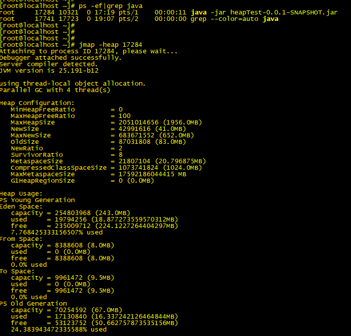
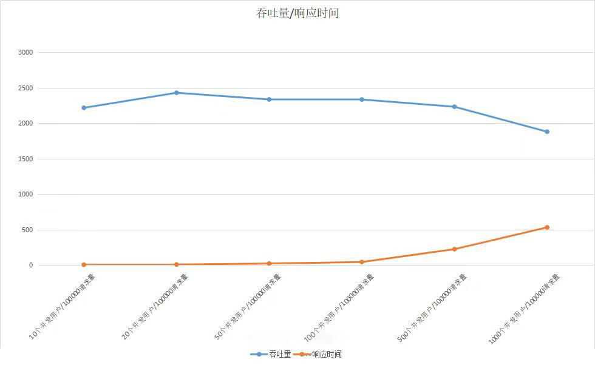
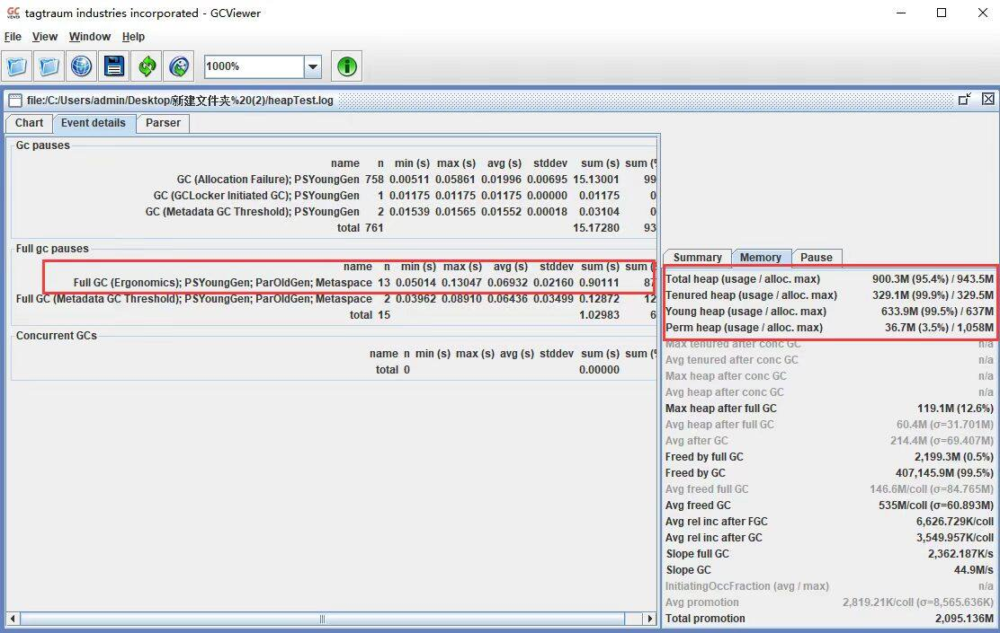
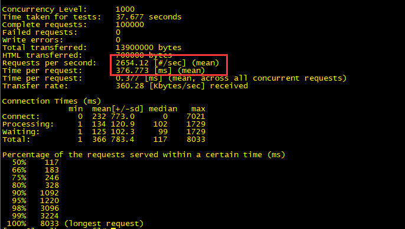
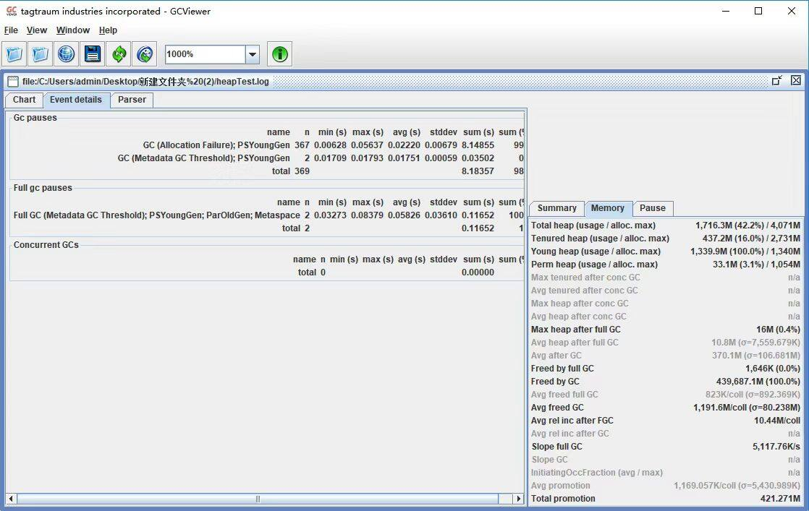
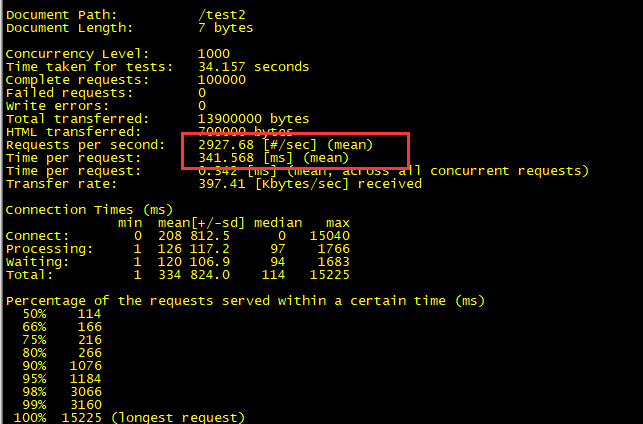
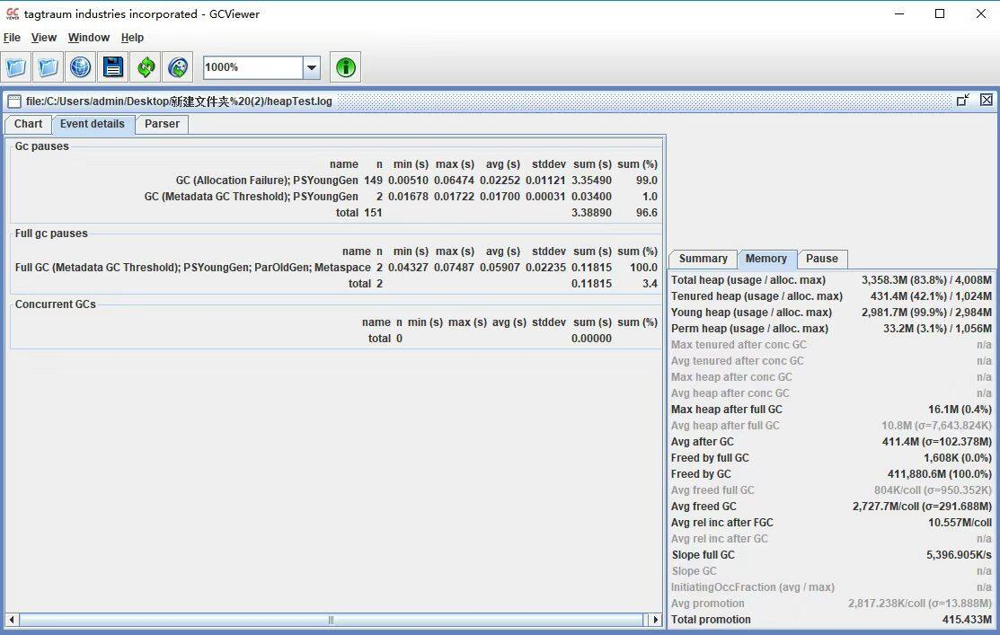
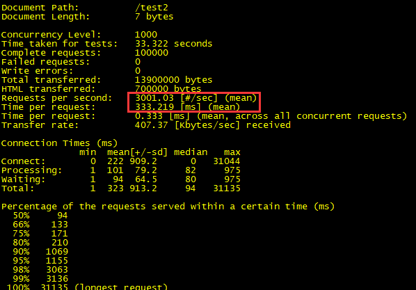
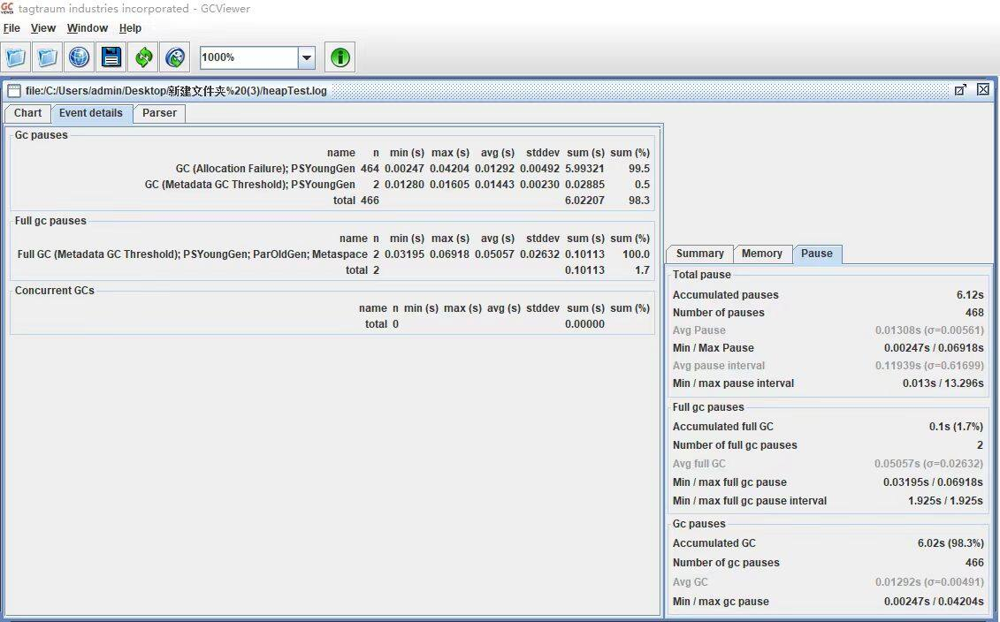

# 23 如何优化JVM内存分配？

你好，我是刘超。

JVM 调优是一个系统而又复杂的过程，但我们知道，在大多数情况下，我们基本不用去调整 JVM 内存分配，因为一些初始化的参数已经可以保证应用服务正常稳定地工作了。

但所有的调优都是有目标性的，JVM 内存分配调优也一样。没有性能问题的时候，我们自然不会随意改变 JVM 内存分配的参数。那有了问题呢？有了什么样的性能问题我们需要对其进行调优呢？又该如何调优呢？这就是我今天要分享的内容。

## JVM 内存分配性能问题

谈到 JVM 内存表现出的性能问题时，你可能会想到一些线上的 JVM 内存溢出事故。但这方面的事故往往是应用程序创建对象导致的内存回收对象难，一般属于代码编程问题。

但其实很多时候，在应用服务的特定场景下，JVM 内存分配不合理带来的性能表现并不会像内存溢出问题这么突出。可以说如果你没有深入到各项性能指标中去，是很难发现其中隐藏的性能损耗。

JVM 内存分配不合理最直接的表现就是频繁的 GC，这会导致上下文切换等性能问题，从而降低系统的吞吐量、增加系统的响应时间。因此，如果你在线上环境或性能测试时，发现频繁的 GC，且是正常的对象创建和回收，这个时候就需要考虑调整 JVM 内存分配了，从而减少 GC 所带来的性能开销。

## 对象在堆中的生存周期

了解了性能问题，那需要做的势必就是调优了。但先别急，在了解 JVM 内存分配的调优过程之前，我们先来看看一个新创建的对象在堆内存中的生存周期，为后面的学习打下基础。

在\[第 20 讲\]中，我讲过 JVM 内存模型。我们知道，在 JVM 内存模型的堆中，堆被划分为新生代和老年代，新生代又被进一步划分为 Eden 区和 Survivor 区，最后 Survivor 由 From Survivor 和 To Survivor 组成。

当我们新建一个对象时，对象会被优先分配到新生代的 Eden 区中，这时虚拟机会给对象定义一个对象年龄计数器（通过参数 -XX:MaxTenuringThreshold 设置）。

同时，也有另外一种情况，当 Eden 空间不足时，虚拟机将会执行一个新生代的垃圾回收（Minor GC）。这时 JVM 会把存活的对象转移到 Survivor 中，并给对象的年龄 +1。对象在 Survivor 中同样也会经历 MinorGC，每经过一次 MinorGC，对象的年龄将会 +1。

当然了，内存空间也是有设置阈值的，可以通过参数 -XX:PetenureSizeThreshold 设置直接被分配到老年代的最大对象，这时如果分配的对象超过了设置的阀值，对象就会直接被分配到老年代，这样做的好处就是可以减少新生代的垃圾回收。

## 查看 JVM 堆内存分配

我们知道了一个对象从创建至回收到堆中的过程，接下来我们再来了解下 JVM 堆内存是如何分配的。在默认不配置 JVM 堆内存大小的情况下，JVM 根据默认值来配置当前内存大小。我们可以通过以下命令来查看堆内存配置的默认值：

```
java -XX:+PrintFlagsFinal -version | grep HeapSize 
jmap -heap 17284
```




通过命令，我们可以获得在这台机器上启动的 JVM 默认最大堆内存为 1953MB，初始化大小为 124MB。

在 JDK1.7 中，默认情况下年轻代和老年代的比例是 1:2，我们可以通过–XX:NewRatio 重置该配置项。年轻代中的 Eden 和 To Survivor、From Survivor 的比例是 8:1:1，我们可以通过 -XX:SurvivorRatio 重置该配置项。

在 JDK1.7 中如果开启了 -XX:+UseAdaptiveSizePolicy 配置项，JVM 将会动态调整 Java 堆中各个区域的大小以及进入老年代的年龄，–XX:NewRatio 和 -XX:SurvivorRatio 将会失效，而 JDK1.8 是默认开启 -XX:+UseAdaptiveSizePolicy 配置项的。

还有，在 JDK1.8 中，不要随便关闭 UseAdaptiveSizePolicy 配置项，除非你已经对初始化堆内存 / 最大堆内存、年轻代 / 老年代以及 Eden 区 /Survivor 区有非常明确的规划了。否则 JVM 将会分配最小堆内存，年轻代和老年代按照默认比例 1:2 进行分配，年轻代中的 Eden 和 Survivor 则按照默认比例 8:2 进行分配。这个内存分配未必是应用服务的最佳配置，因此可能会给应用服务带来严重的性能问题。

## JVM 内存分配的调优过程

我们先使用 JVM 的默认配置，观察应用服务的运行情况，下面我将结合一个实际案例来讲述。现模拟一个抢购接口，假设需要满足一个 5W 的并发请求，且每次请求会产生 20KB 对象，我们可以通过千级并发创建一个 1MB 对象的接口来模拟万级并发请求产生大量对象的场景，具体代码如下：

```
 @RequestMapping(value = "/test1")
 public String test1(HttpServletRequest request) {
  List<Byte[]> temp = new ArrayList<Byte[]>();
  Byte[] b = new Byte[1024*1024];
  temp.add(b);
  return "success";
 }
```

### AB 压测

分别对应用服务进行压力测试，以下是请求接口的吞吐量和响应时间在不同并发用户数下的变化情况：



可以看到，当并发数量到了一定值时，吞吐量就上不去了，响应时间也迅速增加。那么，在 JVM 内部运行又是怎样的呢？

### 分析 GC 日志

此时我们可以通过 GC 日志查看具体的回收日志。我们可以通过设置 VM 配置参数，将运行期间的 GC 日志 dump 下来，具体配置参数如下：

```
 -XX:+PrintGCTimeStamps -XX:+PrintGCDetails -Xloggc:/log/heapTest.log
```

以下是各个配置项的说明：

- -XX:PrintGCTimeStamps：打印 GC 具体时间；
- -XX:PrintGCDetails ：打印出 GC 详细日志；
- -Xloggc: path：GC 日志生成路径。

收集到 GC 日志后，我们就可以使用\[第 22 讲\]中介绍过的 GCViewer 工具打开它，进而查看到具体的 GC 日志如下：



主页面显示 FullGC 发生了 13 次，右下角显示年轻代和老年代的内存使用率几乎达到了 100%。而 FullGC 会导致 stop-the-world 的发生，从而严重影响到应用服务的性能。此时，我们需要调整堆内存的大小来减少 FullGC 的发生。

### 参考指标

我们可以将某些指标的预期值作为参考指标，上面的 GC 频率就是其中之一，那么还有哪些指标可以为我们提供一些具体的调优方向呢？

**GC 频率：**高频的 FullGC 会给系统带来非常大的性能消耗，虽然 MinorGC 相对 FullGC 来说好了许多，但过多的 MinorGC 仍会给系统带来压力。

**内存：**这里的内存指的是堆内存大小，堆内存又分为年轻代内存和老年代内存。首先我们要分析堆内存大小是否合适，其实是分析年轻代和老年代的比例是否合适。如果内存不足或分配不均匀，会增加 FullGC，严重的将导致 CPU 持续爆满，影响系统性能。

**吞吐量：**频繁的 FullGC 将会引起线程的上下文切换，增加系统的性能开销，从而影响每次处理的线程请求，最终导致系统的吞吐量下降。

**延时：**JVM 的 GC 持续时间也会影响到每次请求的响应时间。

### 具体调优方法

**调整堆内存空间减少 FullGC：**通过日志分析，堆内存基本被用完了，而且存在大量 FullGC，这意味着我们的堆内存严重不足，这个时候我们需要调大堆内存空间。

```
java -jar -Xms4g -Xmx4g heapTest-0.0.1-SNAPSHOT.jar
```

以下是各个配置项的说明：

- -Xms：堆初始大小；
- -Xmx：堆最大值。

调大堆内存之后，我们再来测试下性能情况，发现吞吐量提高了 40% 左右，响应时间也降低了将近 50%。



再查看 GC 日志，发现 FullGC 频率降低了，老年代的使用率只有 16% 了。



**调整年轻代减少 MinorGC：**通过调整堆内存大小，我们已经提升了整体的吞吐量，降低了响应时间。那还有优化空间吗？我们还可以将年轻代设置得大一些，从而减少一些 MinorGC（\[第 22 讲\]有通过降低 Minor GC 频率来提高系统性能的详解）。

```
java -jar -Xms4g -Xmx4g -Xmn3g heapTest-0.0.1-SNAPSHOT.jar
```

再进行 AB 压测，发现吞吐量上去了。



再查看 GC 日志，发现 MinorGC 也明显降低了，GC 花费的总时间也减少了。



**设置 Eden、Survivor 区比例：**在 JVM 中，如果开启 AdaptiveSizePolicy，则每次 GC 后都会重新计算 Eden、From Survivor 和 To Survivor 区的大小，计算依据是 GC 过程中统计的 GC 时间、吞吐量、内存占用量。这个时候 SurvivorRatio 默认设置的比例会失效。

在 JDK1.8 中，默认是开启 AdaptiveSizePolicy 的，我们可以通过 -XX:-UseAdaptiveSizePolicy 关闭该项配置，或显示运行 -XX:SurvivorRatio=8 将 Eden、Survivor 的比例设置为 8:2。大部分新对象都是在 Eden 区创建的，我们可以固定 Eden 区的占用比例，来调优 JVM 的内存分配性能。

再进行 AB 性能测试，我们可以看到吞吐量提升了，响应时间降低了。





## 总结

JVM 内存调优通常和 GC 调优是互补的，基于以上调优，我们可以继续对年轻代和堆内存的垃圾回收算法进行调优。这里可以结合上一讲的内容，一起完成 JVM 调优。

虽然分享了一些 JVM 内存分配调优的常用方法，但我还是建议你在进行性能压测后如果没有发现突出的性能瓶颈，就继续使用 JVM 默认参数，起码在大部分的场景下，默认配置已经可以满足我们的需求了。但满足不了也不要慌张，结合今天所学的内容去实践一下，相信你会有新的收获。

## 思考题

以上我们都是基于堆内存分配来优化系统性能的，但在 NIO 的 Socket 通信中，其实还使用到了堆外内存来减少内存拷贝，实现 Socket 通信优化。你知道堆外内存是如何创建和回收的吗？
