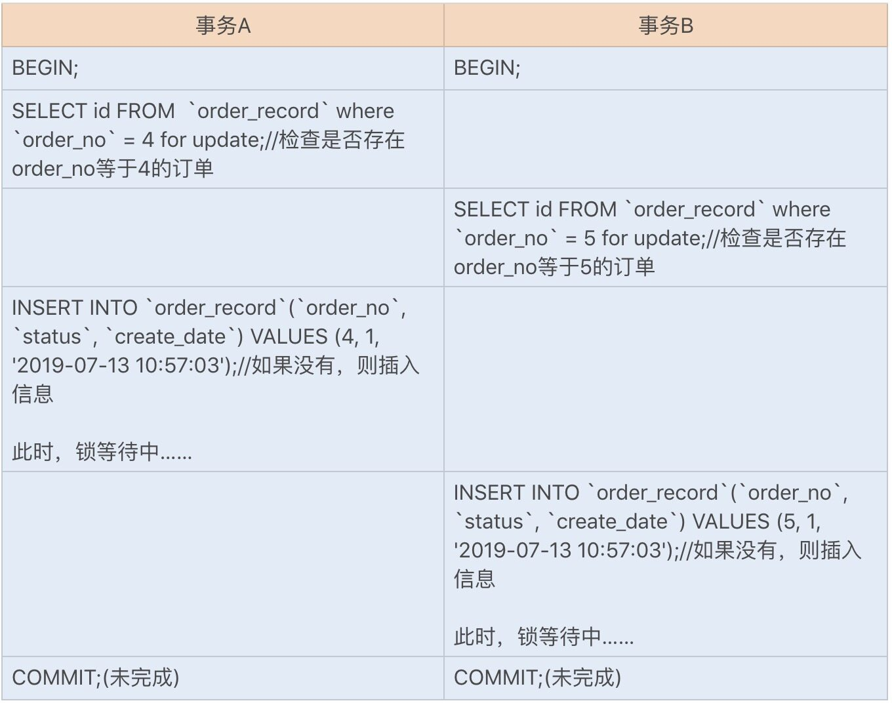

# 35 记一次线上SQL死锁事故：如何避免死锁？

你好，我是刘超。今天我们来聊聊死锁，开始之前，先分享个小故事，相信你可能遇到过，或能从中获得一点启发。

之前我参与过一个项目，在项目初期，我们是没有将读写表分离的，而是基于一个主库完成读写操作。在业务量逐渐增大的时候，我们偶尔会收到系统的异常报警信息，DBA 通知我们数据库出现了死锁异常。

按理说业务开始是比较简单的，就是新增订单、修改订单、查询订单等操作，那为什么会出现死锁呢？经过日志分析，我们发现是作为幂等性校验的一张表经常出现死锁异常。我们和 DBA 讨论之后，初步怀疑是索引导致的死锁问题。后来我们在开发环境中模拟了相关操作，果然重现了该死锁异常。

接下来我们就通过实战来重现下该业务死锁异常。首先，创建一张订单记录表，该表主要用于校验订单重复创建：

```
CREATE TABLE `order_record`  (

  `id` int(11) NOT NULL AUTO_INCREMENT,

  `order_no` int(11) DEFAULT NULL,

  `status` int(4) DEFAULT NULL,

  `create_date` datetime(0) DEFAULT NULL,

  PRIMARY KEY (`id`) USING BTREE,

  INDEX `idx_order_status`(`order_no`,`status`) USING BTREE

) ENGINE = InnoDB

```

为了能重现该问题，我们先将事务设置为手动提交。这里要注意一下，MySQL 数据库和 Oracle 提交事务不太一样，MySQL 数据库默认情况下是自动提交事务，我们可以通过以下命令行查看自动提交事务是否开启：

```
mysql> show variables like 'autocommit';

+---------------+-------+

| Variable_name | Value |

+---------------+-------+

| autocommit    | ON    |

+---------------+-------+

1 row in set (0.01 sec)

```

下面就操作吧，先将 MySQL 数据库的事务提交设置为手动提交，通过以下命令行可以关闭自动提交事务：

```
mysql> set autocommit = 0;

Query OK, 0 rows affected (0.00 sec)

```

订单在做幂等性校验时，先是通过订单号检查订单是否存在，如果不存在则新增订单记录。知道具体的逻辑之后，我们再来模拟创建产生死锁的运行 SQL 语句。首先，我们模拟新建两个订单，并按照以下顺序执行幂等性校验 SQL 语句（垂直方向代表执行的时间顺序）：



此时，我们会发现两个事务已经进入死锁状态。我们可以在 information_schema 数据库中查询到具体的死锁情况，如下图所示：


看到这，你可能会想，为什么 SELECT 要加 for update 排他锁，而不是使用共享锁呢？试想下，如果是两个订单号一样的请求同时进来，就有可能出现幻读。也就是说，一开始事务 A 中的查询没有该订单号，后来事务 B 新增了一个该订单号的记录，此时事务 A 再新增一条该订单号记录，就会创建重复的订单记录。面对这种情况，我们可以使用锁间隙算法来防止幻读。

## 死锁是如何产生的？

上面我们说到了锁间隙，在\[第 33 讲\]中，我已经讲过了并发事务中的锁机制以及行锁的具体实现算法，不妨回顾一下。

行锁的具体实现算法有三种：record lock、gap lock 以及 next-key lock。record lock 是专门对索引项加锁；gap lock 是对索引项之间的间隙加锁；next-key lock 则是前面两种的组合，对索引项以其之间的间隙加锁。

只在可重复读或以上隔离级别下的特定操作才会取得 gap lock 或 next-key lock，在 Select、Update 和 Delete 时，除了基于唯一索引的查询之外，其它索引查询时都会获取 gap lock 或 next-key lock，即锁住其扫描的范围。主键索引也属于唯一索引，所以主键索引是不会使用 gap lock 或 next-key lock。

在 MySQL 中，gap lock 默认是开启的，即 innodb_locks_unsafe_for_binlog 参数值是 disable 的，且 MySQL 中默认的是 RR 事务隔离级别。

当我们执行以下查询 SQL 时，由于 order_no 列为非唯一索引，此时又是 RR 事务隔离级别，所以 SELECT 的加锁类型为 gap lock，这里的 gap 范围是 (4,+∞）。

> SELECT id FROM `demo`.`order_record` where `order_no` = 4 for update;

执行查询 SQL 语句获取的 gap lock 并不会导致阻塞，而当我们执行以下插入 SQL 时，会在插入间隙上再次获取插入意向锁。插入意向锁其实也是一种 gap 锁，它与 gap lock 是冲突的，所以当其它事务持有该间隙的 gap lock 时，需要等待其它事务释放 gap lock 之后，才能获取到插入意向锁。

以上事务 A 和事务 B 都持有间隙 (4,+∞）的 gap 锁，而接下来的插入操作为了获取到插入意向锁，都在等待对方事务的 gap 锁释放，于是就造成了循环等待，导致死锁。

> INSERT INTO `demo`.`order_record`(`order_no`, `status`, `create_date`) VALUES (5, 1, ‘2019-07-13 10:57:03’);

我们可以通过以下锁的兼容矩阵图，来查看锁的兼容性：


## 避免死锁的措施

知道了死锁问题源自哪儿，就可以找到合适的方法来避免它了。

避免死锁最直观的方法就是在两个事务相互等待时，当一个事务的等待时间超过设置的某一阈值，就对这个事务进行回滚，另一个事务就可以继续执行了。这种方法简单有效，在 InnoDB 中，参数 innodb_lock_wait_timeout 是用来设置超时时间的。

另外，我们还可以将 order_no 列设置为唯一索引列。虽然不能防止幻读，但我们可以利用它的唯一性来保证订单记录不重复创建，这种方式唯一的缺点就是当遇到重复创建订单时会抛出异常。

我们还可以使用其它的方式来代替数据库实现幂等性校验。例如，使用 Redis 以及 ZooKeeper 来实现，运行效率比数据库更佳。

## 其它常见的 SQL 死锁问题

这里再补充一些常见的 SQL 死锁问题，以便你遇到时也能知道其原因，从而顺利解决。

我们知道死锁的四个必要条件：互斥、占有且等待、不可强占用、循环等待。只要系统发生死锁，这些条件必然成立。所以在一些经常需要使用互斥共用一些资源，且有可能循环等待的业务场景中，要特别注意死锁问题。

接下来，我们再来了解一个出现死锁的场景。

我们讲过，InnoDB 存储引擎的主键索引为聚簇索引，其它索引为辅助索引。如果使用辅助索引来更新数据库，就需要使用聚簇索引来更新数据库字段。如果两个更新事务使用了不同的辅助索引，或一个使用了辅助索引，一个使用了聚簇索引，就都有可能导致锁资源的循环等待。由于本身两个事务是互斥，也就构成了以上死锁的四个必要条件了。

我们还是以上面的这个订单记录表来重现下聚簇索引和辅助索引更新时，循环等待锁资源导致的死锁问题：


出现死锁的步骤：


综上可知，在更新操作时，我们应该尽量使用主键来更新表字段，这样可以有效避免一些不必要的死锁发生。

## 总结

数据库发生死锁的概率并不是很大，一旦遇到了，就一定要彻查具体原因，尽快找出解决方案，老实说，过程不简单。我们只有先对 MySQL 的 InnoDB 存储引擎有足够的了解，才能剖析出造成死锁的具体原因。

例如，以上我例举的两种发生死锁的场景，一个考验的是我们对锁算法的了解，另外一个考验则是我们对聚簇索引和辅助索引的熟悉程度。

解决死锁的最佳方式当然就是预防死锁的发生了，我们平时编程中，可以通过以下一些常规手段来预防死锁的发生：

1. 在编程中尽量按照固定的顺序来处理数据库记录，假设有两个更新操作，分别更新两条相同的记录，但更新顺序不一样，有可能导致死锁；

1. 在允许幻读和不可重复读的情况下，尽量使用 RC 事务隔离级别，可以避免 gap lock 导致的死锁问题；

1. 更新表时，尽量使用主键更新；

1. 避免长事务，尽量将长事务拆解，可以降低与其它事务发生冲突的概率；

1. 设置锁等待超时参数，我们可以通过 innodb_lock_wait_timeout 设置合理的等待超时阈值，特别是在一些高并发的业务中，我们可以尽量将该值设置得小一些，避免大量事务等待，占用系统资源，造成严重的性能开销。

## 思考题

除了设置 innodb_lock_wait_timeout 参数来避免已经产生死锁的 SQL 长时间等待，你还知道其它方法来解决类似问题吗？
