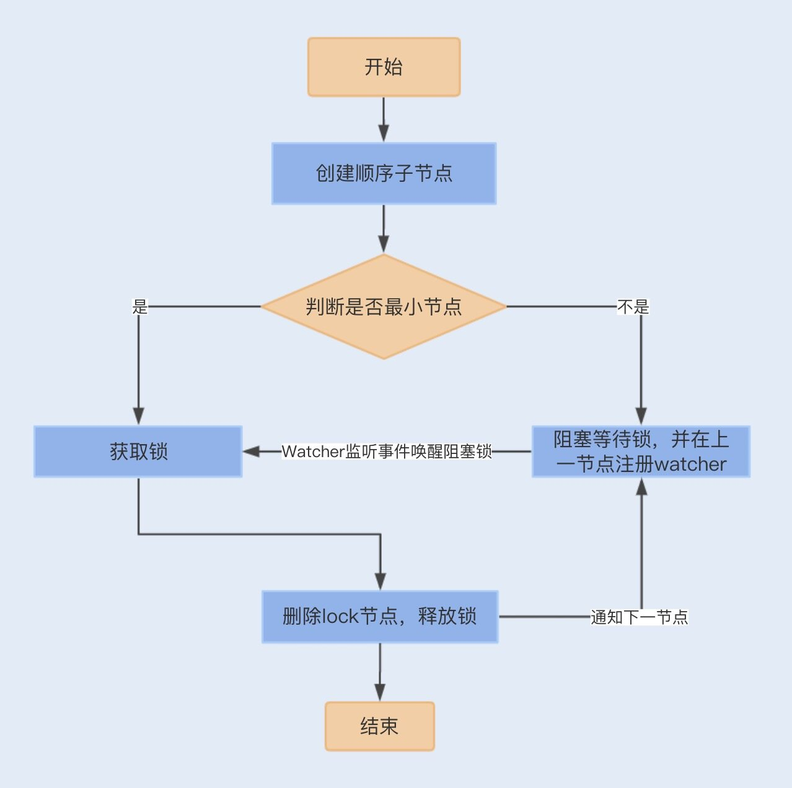

# 41 如何设计更优的分布式锁？

你好，我是刘超。

从这一讲开始，我们就正式进入最后一个模块的学习了，综合性实战的内容来自我亲身经历过的一些案例，其中用到的知识点会相对综合，现在是时候跟我一起调动下前面所学了！

去年双十一，我们的游戏商城也搞了一波活动，那时候我就发现在数据库操作日志中，出现最多的一个异常就是 Interrupted Exception 了，几乎所有的异常都是来自一个校验订单幂等性的 SQL。

因为校验订单幂等性是提交订单业务中第一个操作数据库的，所以幂等性校验也就承受了比较大的请求量，再加上我们还是基于一个数据库表来实现幂等性校验的，所以出现了一些请求事务超时，事务被中断的情况。其实基于数据库实现的幂等性校验就是一种分布式锁的实现。

那什么是分布式锁呢，它又是用来解决哪些问题的呢？

在 JVM 中，在多线程并发的情况下，我们可以使用同步锁或 Lock 锁，保证在同一时间内，只能有一个线程修改共享变量或执行代码块。但现在我们的服务基本都是基于分布式集群来实现部署的，对于一些共享资源，例如我们之前讨论过的库存，在分布式环境下使用 Java 锁的方式就失去作用了。

这时，我们就需要实现分布式锁来保证共享资源的原子性。除此之外，分布式锁也经常用来避免分布式中的不同节点执行重复性的工作，例如一个定时发短信的任务，在分布式集群中，我们只需要保证一个服务节点发送短信即可，一定要避免多个节点重复发送短信给同一个用户。

因为数据库实现一个分布式锁比较简单易懂，直接基于数据库实现就行了，不需要再引入第三方中间件，所以这是很多分布式业务实现分布式锁的首选。但是数据库实现的分布式锁在一定程度上，存在性能瓶颈。

接下来我们一起了解下如何使用数据库实现分布式锁，其性能瓶颈到底在哪，有没有其它实现方式可以优化分布式锁。

## 数据库实现分布式锁

首先，我们应该创建一个锁表，通过创建和查询数据来保证一个数据的原子性：

```
CREATE TABLE `order`  (

  `id` int(11) NOT NULL AUTO_INCREMENT,

  `order_no` int(11) DEFAULT NULL,

  `pay_money` decimal(10, 2) DEFAULT NULL,

  `status` int(4) DEFAULT NULL,

  `create_date` datetime(0) DEFAULT NULL,

  `delete_flag` int(4) DEFAULT NULL,

  PRIMARY KEY (`id`) USING BTREE,

  INDEX `idx_status`(`status`) USING BTREE,

  INDEX `idx_order`(`order_no`) USING BTREE

) ENGINE = InnoDB

```

其次，如果是校验订单的幂等性，就要先查询该记录是否存在数据库中，查询的时候要防止幻读，如果不存在，就插入到数据库，否则，放弃操作。

```
select id from `order` where `order_no`= 'xxxx' for update


```

最后注意下，除了查询时防止幻读，我们还需要保证查询和插入是在同一个事务中，因此我们需要申明事务，具体的实现代码如下：

```
 @Transactional

 public int addOrderRecord(Order order) {

  if(orderDao.selectOrderRecord(order)==null){

               int result = orderDao.addOrderRecord(order);

              if(result>0){

                      return 1;

              }

         }

  return 0;

 }

```

到这，我们订单幂等性校验的分布式锁就实现了。我想你应该能发现为什么这种方式会存在性能瓶颈了。我们在\[第 34 讲\]中讲过，在 RR 事务级别，select 的 for update 操作是基于间隙锁 gap lock 实现的，这是一种悲观锁的实现方式，所以存在阻塞问题。

因此在高并发情况下，当有大量的请求进来时，大部分的请求都会进行排队等待。为了保证数据库的稳定性，事务的超时时间往往又设置得很小，所以就会出现大量事务被中断的情况。

除了阻塞等待之外，因为订单没有删除操作，所以这张锁表的数据将会逐渐累积，我们需要设置另外一个线程，隔一段时间就去删除该表中的过期订单，这就增加了业务的复杂度。

除了这种幂等性校验的分布式锁，有一些单纯基于数据库实现的分布式锁代码块或对象，是需要在锁释放时，删除或修改数据的。如果在获取锁之后，锁一直没有获得释放，即数据没有被删除或修改，这将会引发死锁问题。

## Zookeeper 实现分布式锁

除了数据库实现分布式锁的方式以外，我们还可以基于 Zookeeper 实现。Zookeeper 是一种提供“分布式服务协调“的中心化服务，正是 Zookeeper 的以下两个特性，分布式应用程序才可以基于它实现分布式锁功能。

\*\*顺序临时节点：\*\*Zookeeper 提供一个多层级的节点命名空间（节点称为 Znode），每个节点都用一个以斜杠（/）分隔的路径来表示，而且每个节点都有父节点（根节点除外），非常类似于文件系统。

节点类型可以分为持久节点（PERSISTENT ）、临时节点（EPHEMERAL），每个节点还能被标记为有序性（SEQUENTIAL），一旦节点被标记为有序性，那么整个节点就具有顺序自增的特点。一般我们可以组合这几类节点来创建我们所需要的节点，例如，创建一个持久节点作为父节点，在父节点下面创建临时节点，并标记该临时节点为有序性。

\*\*Watch 机制：\*\*Zookeeper 还提供了另外一个重要的特性，Watcher（事件监听器）。ZooKeeper 允许用户在指定节点上注册一些 Watcher，并且在一些特定事件触发的时候，ZooKeeper 服务端会将事件通知给用户。

我们熟悉了 Zookeeper 的这两个特性之后，就可以看看 Zookeeper 是如何实现分布式锁的了。

首先，我们需要建立一个父节点，节点类型为持久节点（PERSISTENT） ，每当需要访问共享资源时，就会在父节点下建立相应的顺序子节点，节点类型为临时节点（EPHEMERAL），且标记为有序性（SEQUENTIAL），并且以临时节点名称 + 父节点名称 + 顺序号组成特定的名字。

在建立子节点后，对父节点下面的所有以临时节点名称 name 开头的子节点进行排序，判断刚刚建立的子节点顺序号是否是最小的节点，如果是最小节点，则获得锁。

如果不是最小节点，则阻塞等待锁，并且获得该节点的上一顺序节点，为其注册监听事件，等待节点对应的操作获得锁。

当调用完共享资源后，删除该节点，关闭 zk，进而可以触发监听事件，释放该锁。



以上实现的分布式锁是严格按照顺序访问的并发锁。一般我们还可以直接引用 Curator 框架来实现 Zookeeper 分布式锁，代码如下：

```
InterProcessMutex lock = new InterProcessMutex(client, lockPath);

if ( lock.acquire(maxWait, waitUnit) ) 

{

    try 

    {

        // do some work inside of the critical section here

    }

    finally

    {

        lock.release();

    }

}

```

Zookeeper 实现的分布式锁，例如相对数据库实现，有很多优点。Zookeeper 是集群实现，可以避免单点问题，且能保证每次操作都可以有效地释放锁，这是因为一旦应用服务挂掉了，临时节点会因为 session 连接断开而自动删除掉。

由于频繁地创建和删除结点，加上大量的 Watch 事件，对 Zookeeper 集群来说，压力非常大。且从性能上来说，其与接下来我要讲的 Redis 实现的分布式锁相比，还是存在一定的差距。

## Redis 实现分布式锁

相对于前两种实现方式，基于 Redis 实现的分布式锁是最为复杂的，但性能是最佳的。

大部分开发人员利用 Redis 实现分布式锁的方式，都是使用 SETNX+EXPIRE 组合来实现，在 Redis 2.6.12 版本之前，具体实现代码如下：

```
public static boolean tryGetDistributedLock(Jedis jedis, String lockKey, String requestId, int expireTime) {

 

    Long result = jedis.setnx(lockKey, requestId);// 设置锁

    if (result == 1) {// 获取锁成功

        // 若在这里程序突然崩溃，则无法设置过期时间，将发生死锁

        jedis.expire(lockKey, expireTime);// 通过过期时间删除锁

        return true;

    }

    return false;

}

```

这种方式实现的分布式锁，是通过 setnx() 方法设置锁，如果 lockKey 存在，则返回失败，否则返回成功。设置成功之后，为了能在完成同步代码之后成功释放锁，方法中还需要使用 expire() 方法给 lockKey 值设置一个过期时间，确认 key 值删除，避免出现锁无法释放，导致下一个线程无法获取到锁，即死锁问题。

如果程序在设置过期时间之前、设置锁之后出现崩溃，此时如果 lockKey 没有设置过期时间，将会出现死锁问题。

在 Redis 2.6.12 版本后 SETNX 增加了过期时间参数：

```
    private static final String LOCK_SUCCESS = "OK";

    private static final String SET_IF_NOT_EXIST = "NX";

    private static final String SET_WITH_EXPIRE_TIME = "PX";

 

    /**

     * 尝试获取分布式锁

     * @param jedis Redis 客户端

     * @param lockKey 锁

     * @param requestId 请求标识

     * @param expireTime 超期时间

     * @return 是否获取成功

     */

    public static boolean tryGetDistributedLock(Jedis jedis, String lockKey, String requestId, int expireTime) {

 

        String result = jedis.set(lockKey, requestId, SET_IF_NOT_EXIST, SET_WITH_EXPIRE_TIME, expireTime);

 

        if (LOCK_SUCCESS.equals(result)) {

            return true;

        }

        return false;

 

    }

```

我们也可以通过 Lua 脚本来实现锁的设置和过期时间的原子性，再通过 jedis.eval() 方法运行该脚本：

```
    // 加锁脚本

    private static final String SCRIPT_LOCK = "if redis.call('setnx', KEYS[1], ARGV[1]) == 1 then redis.call('pexpire', KEYS[1], ARGV[2]) return 1 else return 0 end";

    // 解锁脚本

    private static final String SCRIPT_UNLOCK = "if redis.call('get', KEYS[1]) == ARGV[1] then return redis.call('del', KEYS[1]) else return 0 end";

```

虽然 SETNX 方法保证了设置锁和过期时间的原子性，但如果我们设置的过期时间比较短，而执行业务时间比较长，就会存在锁代码块失效的问题。我们需要将过期时间设置得足够长，来保证以上问题不会出现。

这个方案是目前最优的分布式锁方案，但如果是在 Redis 集群环境下，依然存在问题。由于 Redis 集群数据同步到各个节点时是异步的，如果在 Master 节点获取到锁后，在没有同步到其它节点时，Master 节点崩溃了，此时新的 Master 节点依然可以获取锁，所以多个应用服务可以同时获取到锁。

### Redlock 算法

Redisson 由 Redis 官方推出，它是一个在 Redis 的基础上实现的 Java 驻内存数据网格（In-Memory Data Grid）。它不仅提供了一系列的分布式的 Java 常用对象，还提供了许多分布式服务。Redisson 是基于 netty 通信框架实现的，所以支持非阻塞通信，性能相对于我们熟悉的 Jedis 会好一些。

Redisson 中实现了 Redis 分布式锁，且支持单点模式和集群模式。在集群模式下，Redisson 使用了 Redlock 算法，避免在 Master 节点崩溃切换到另外一个 Master 时，多个应用同时获得锁。我们可以通过一个应用服务获取分布式锁的流程，了解下 Redlock 算法的实现：

在不同的节点上使用单个实例获取锁的方式去获得锁，且每次获取锁都有超时时间，如果请求超时，则认为该节点不可用。当应用服务成功获取锁的 Redis 节点超过半数（N/2+1，N 为节点数) 时，并且获取锁消耗的实际时间不超过锁的过期时间，则获取锁成功。

一旦获取锁成功，就会重新计算释放锁的时间，该时间是由原来释放锁的时间减去获取锁所消耗的时间；而如果获取锁失败，客户端依然会释放获取锁成功的节点。

具体的代码实现如下：

1. 首先引入 jar 包：

```
<dependency>

      <groupId>org.redisson</groupId>

      <artifactId>redisson</artifactId>

      <version>3.8.2</version>

</dependency>

```

1. 实现 Redisson 的配置文件：

```
@Bean

public RedissonClient redissonClient() {

    Config config = new Config();

    config.useClusterServers()

            .setScanInterval(2000) // 集群状态扫描间隔时间，单位是毫秒

            .addNodeAddress("redis://127.0.0.1:7000).setPassword("1")

            .addNodeAddress("redis://127.0.0.1:7001").setPassword("1")

            .addNodeAddress("redis://127.0.0.1:7002")

            .setPassword("1");

    return Redisson.create(config);

}

```

1. 获取锁操作：

```
long waitTimeout = 10;

long leaseTime = 1;

RLock lock1 = redissonClient1.getLock("lock1");

RLock lock2 = redissonClient2.getLock("lock2");

RLock lock3 = redissonClient3.getLock("lock3");

 

RedissonRedLock redLock = new RedissonRedLock(lock1, lock2, lock3);

// 同时加锁：lock1 lock2 lock3

// 红锁在大部分节点上加锁成功就算成功，且设置总超时时间以及单个节点超时时间

redLock.trylock(waitTimeout,leaseTime,TimeUnit.SECONDS);

...

redLock.unlock();

```

## 总结

实现分布式锁的方式有很多，有最简单的数据库实现，还有 Zookeeper 多节点实现和缓存实现。我们可以分别对这三种实现方式进行性能压测，可以发现在同样的服务器配置下，Redis 的性能是最好的，Zookeeper 次之，数据库最差。

从实现方式和可靠性来说，Zookeeper 的实现方式简单，且基于分布式集群，可以避免单点问题，具有比较高的可靠性。因此，在对业务性能要求不是特别高的场景中，我建议使用 Zookeeper 实现的分布式锁。

## 思考题

我们知道 Redis 分布式锁在集群环境下会出现不同应用服务同时获得锁的可能，而 Redisson 中的 Redlock 算法很好地解决了这个问题。那 Redisson 实现的分布式锁是不是就一定不会出现同时获得锁的可能呢？
