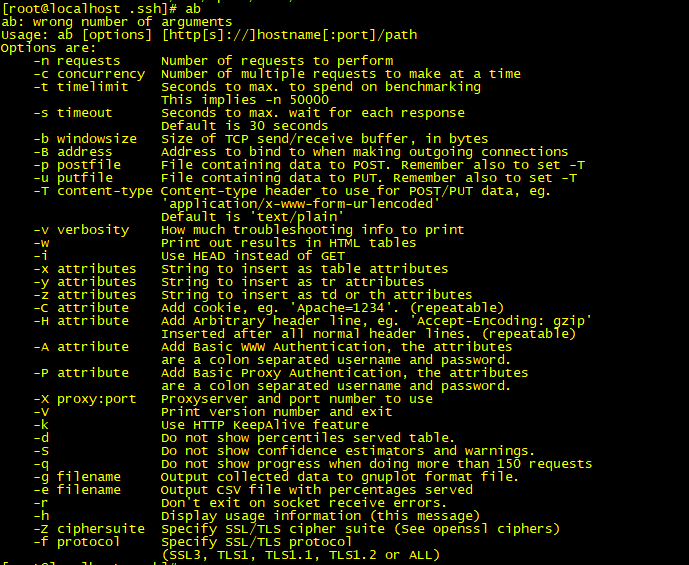
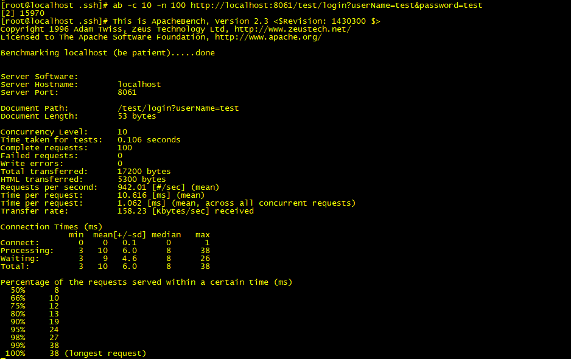
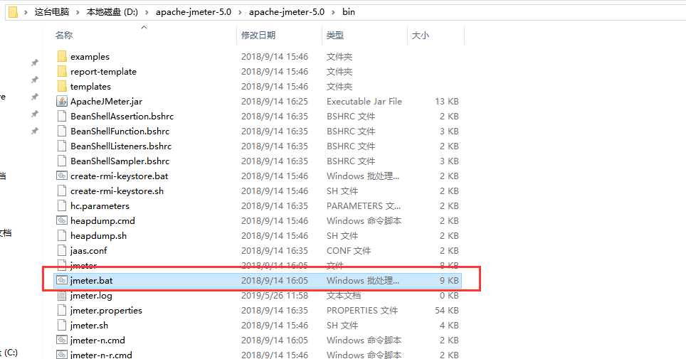
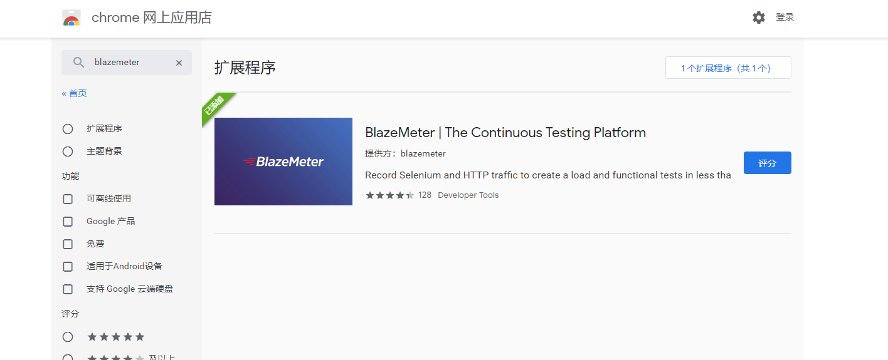
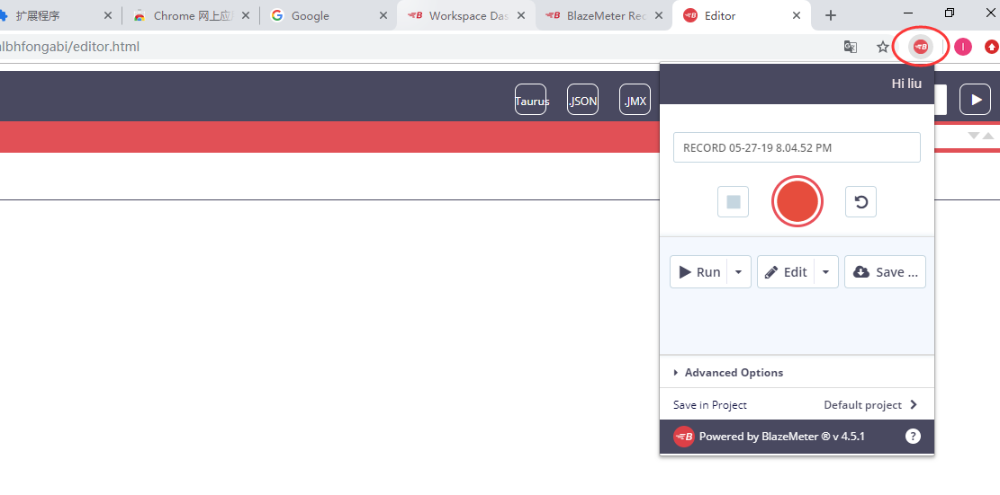
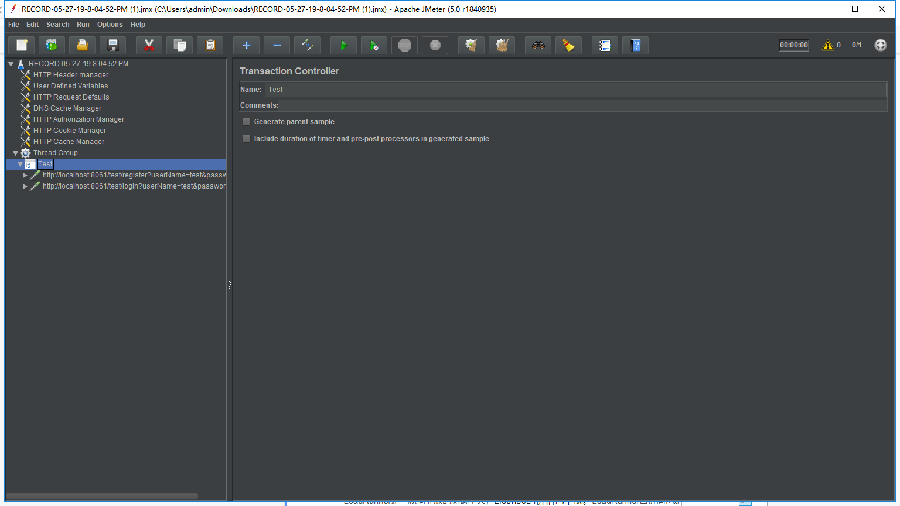
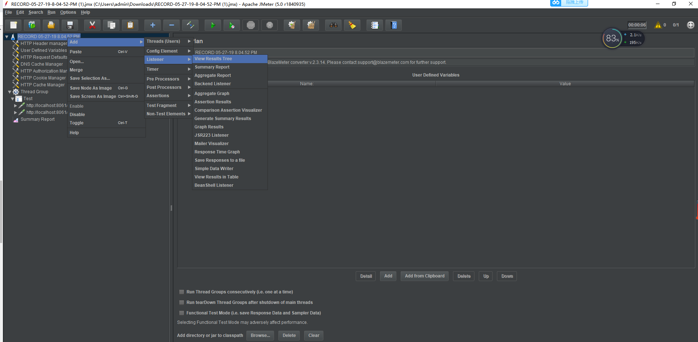
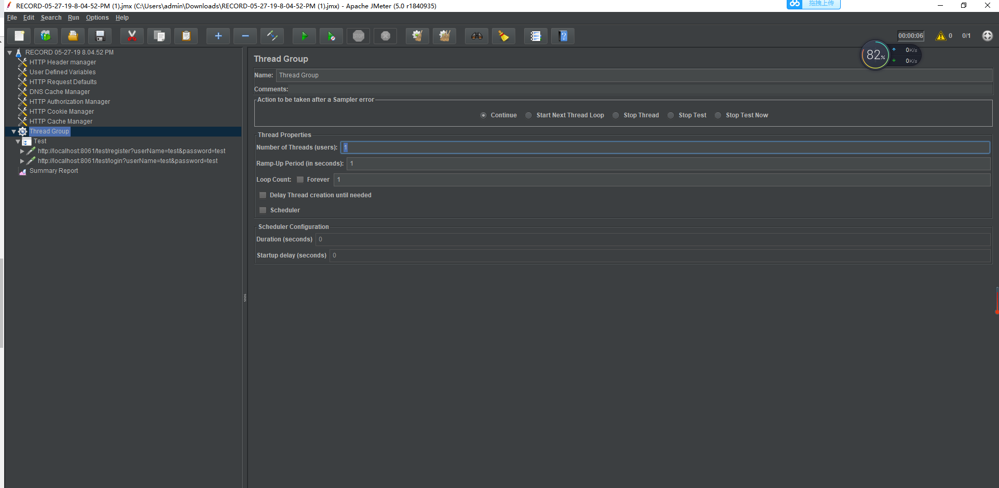
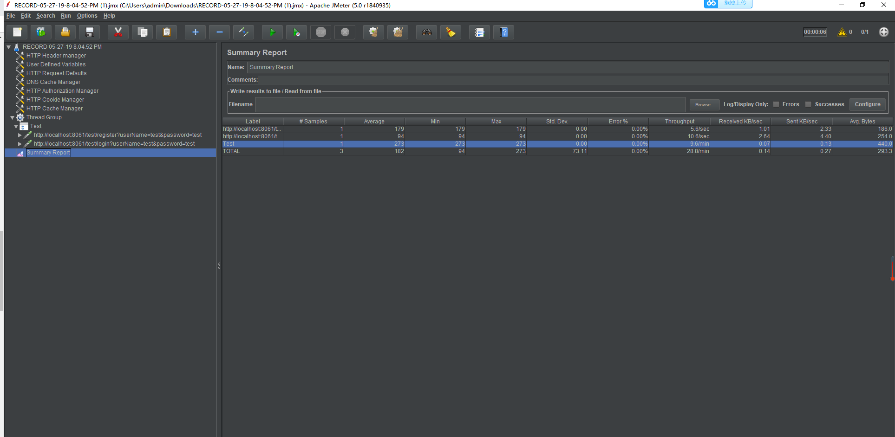
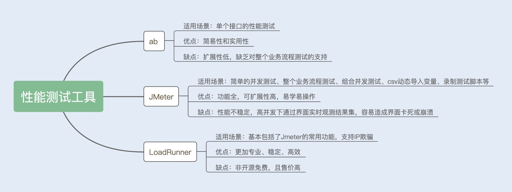

加餐 推荐几款常用的性能测试工具
================

你好，我是刘超。很多同学给我留言想让我讲讲工具，所以我的第一篇加餐就光速来了～

熟练掌握一款性能测试工具，是我们必备的一项技能。他不仅可以帮助我们模拟测试场景（包括并发、复杂的组合场景），还能将测试结果转化成数据或图形，帮助我们更直观地了解系统性能。

常用的性能测试工具
---------

常用的性能测试工具有很多，在这里我将列举几个比较实用的。

对于开发人员来说，首选是一些开源免费的性能（压力）测试软件，例如 ab（ApacheBench）、JMeter 等；对于专业的测试团队来说，付费版的 LoadRunner 是首选。当然，也有很多公司是自行开发了一套量身定做的性能测试软件，优点是定制化强，缺点则是通用性差。

接下来，我会为你重点介绍 ab 和 JMeter 两款测试工具的特点以及常规的使用方法。

### 1.ab

ab 测试工具是 Apache 提供的一款测试工具，具有简单易上手的特点，在测试 Web 服务时非常实用。

ab 可以在 Windows 系统中使用，也可以在 Linux 系统中使用。这里我说下在 Linux 系统中的安装方法，非常简单，只需要在 Linux 系统中输入 yum-y install httpd-tools 命令，就可以了。

安装成功后，输入 ab 命令，可以看到以下提示：



ab 工具用来测试 post get 接口请求非常便捷，可以通过参数指定请求数、并发数、请求参数等。例如，一个测试并发用户数为 10、请求数量为 100 的的 post 请求输入如下：

```
ab -n 100  -c 10 -p 'post.txt' -T 'application/x-www-form-urlencoded' 'http://test.api.com/test/register'


```

post.txt 为存放 post 参数的文档，存储格式如下：

```
usernanme=test&password=test&sex=1


```

**附上几个常用参数的含义：**

* \-n：总请求次数（最小默认为 1）；
* \-c：并发次数（最小默认为 1 且不能大于总请求次数，例如：10 个请求，10 个并发，实际就是 1 人请求 1 次）；
* \-p：post 参数文档路径（-p 和 -T 参数要配合使用）；
* \-T：header 头内容类型（此处切记是大写英文字母 T）。

当我们测试一个 get 请求接口时，可以直接在链接的后面带上请求的参数：

```
ab -c 10 -n 100 http://www.test.api.com/test/login?userName=test&password=test


```

输出结果如下：



**以上输出中，有几项性能指标可以提供给你参考使用：**

* Requests per second：吞吐率，指某个并发用户数下单位时间内处理的请求数；
* Time per request：上面的是用户平均请求等待时间，指处理完成所有请求数所花费的时间 /（总请求数 / 并发用户数）；
* Time per request：下面的是服务器平均请求处理时间，指处理完成所有请求数所花费的时间 / 总请求数；
* Percentage of the requests served within a certain time：每秒请求时间分布情况，指在整个请求中，每个请求的时间长度的分布情况，例如有 50% 的请求响应在 8ms 内，66% 的请求响应在 10ms 内，说明有 16% 的请求在 8ms~10ms 之间。

### 2.JMeter

JMeter 是 Apache 提供的一款功能性比较全的性能测试工具，同样可以在 Windows 和 Linux 环境下安装使用。

JMeter 在 Windows 环境下使用了图形界面，可以通过图形界面来编写测试用例，具有易学和易操作的特点。

JMeter 不仅可以实现简单的并发性能测试，还可以实现复杂的宏基准测试。我们可以通过录制脚本的方式，在 JMeter 实现整个业务流程的测试。JMeter 也支持通过 csv 文件导入参数变量，实现用多样化的参数测试系统性能。

Windows 下的 JMeter 安装非常简单，在官网下载安装包，解压后即可使用。如果你需要打开图形化界面，那就进入到 bin 目录下，找到 jmeter.bat 文件，双击运行该文件就可以了。



JMeter 的功能非常全面，我在这里简单介绍下如何录制测试脚本，并使用 JMeter 测试业务的性能。

录制 JMeter 脚本的方法有很多，一种是使用 Jmeter 自身的代理录制，另一种是使用 Badboy 这款软件录制，还有一种是我下面要讲的，通过安装浏览器插件的方式实现脚本的录制，这种方式非常简单，不用做任何设置。

首先我们安装一个录制测试脚本的插件，叫做 BlazeMeter 插件。你可以在 Chrome 应用商店中找到它，然后点击安装， 如图所示：



然后使用谷歌账号登录这款插件，如果不登录，我们将无法生成 JMeter 文件，安装以及登录成功后的界面如下图所示：



最后点击开始，就可以录制脚本了。录制成功后，点击保存为 JMX 文件，我们就可以通过 JMeter 打开这个文件，看到录制的脚本了，如下图所示：



这个时候，我们还需要创建一个查看结果树，用来可视化查看运行的性能结果集合：



设置好结果树之后，我们可以对线程组的并发用户数以及循环调用次数进行设置：



设置成功之后，点击运行，我们可以看到运行的结果：



JMeter 的测试结果与 ab 的测试结果的指标参数差不多，这里我就不再重复讲解了。

### 3.LoadRunner

LoadRunner 是一款商业版的测试工具，并且 License 的售价不低。

作为一款专业的性能测试工具，LoadRunner 在性能压测时，表现得非常稳定和高效。相比 JMeter，LoadRunner 可以模拟出不同的内网 IP 地址，通过分配不同的 IP 地址给测试的用户，模拟真实环境下的用户。这里我就不展开详述了。

总结
--

三种常用的性能测试工具就介绍完了，最后我把今天的主要内容为你总结了一张图。



现在测试工具非常多，包括阿里云的 PTS 测试工具也很好用，但每款测试工具其实都有自己的优缺点。个人建议，还是在熟练掌握其中一款测试工具的前提下，再去探索其他测试工具的使用方法会更好。
