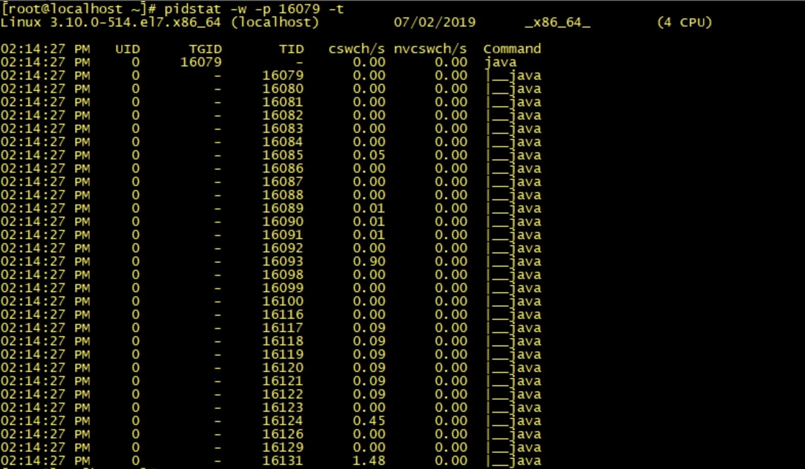
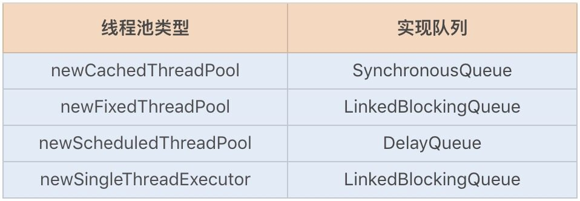

答疑课堂：模块三热点问题解答
==============

你好，我是刘超。

不知不觉“多线程性能优化“已经讲完了，今天这讲我来解答下各位同学在这个模块集中提出的两大问题，第一个是有关监测上下文切换异常的命令排查工具，第二个是有关 blockingQueue 的内容。

也欢迎你积极留言给我，让我知晓你想了解的内容，或者说出你的困惑，我们共同探讨。下面我就直接切入今天的主题了。

使用系统命令查看上下文切换
-------------

在第 15 讲中我提到了上下文切换，其中有用到一些工具进行监测，由于篇幅关系就没有详细介绍，今天我就补充总结几个常用的工具给你。

### 1\. Linux 命令行工具之 vmstat 命令

vmstat 是一款指定采样周期和次数的功能性监测工具，我们可以使用它监控进程上下文切换的情况。


vmstat 1 3 命令行代表每秒收集一次性能指标，总共获取 3 次。以下为上图中各个性能指标的注释：

* **procs** r：等待运行的进程数 b：处于非中断睡眠状态的进程数
* **memory** swpd：虚拟内存使用情况 free：空闲的内存 buff：用来作为缓冲的内存数 cache：缓存大小
* **swap** si：从磁盘交换到内存的交换页数量 so：从内存交换到磁盘的交换页数量
* **io** bi：发送到快设备的块数 bo：从块设备接收到的块数
* **system** in：每秒中断数 cs：每秒上下文切换次数
* **cpu** us：用户 CPU 使用事件 sy：内核 CPU 系统使用时间 id：空闲时间 wa：等待 I/O 时间 st：运行虚拟机窃取的时间

### 2\. Linux 命令行工具之 pidstat 命令

我们通过上述的 vmstat 命令只能观察到哪个进程的上下文切换出现了异常，那如果是要查看哪个线程的上下文出现了异常呢？

pidstat 命令就可以帮助我们监测到具体线程的上下文切换。pidstat 是 Sysstat 中一个组件，也是一款功能强大的性能监测工具。我们可以通过命令 yum install sysstat 安装该监控组件。

通过 pidstat -help 命令，我们可以查看到有以下几个常用参数可以监测线程的性能：


常用参数：

* \-u：默认参数，显示各个进程的 cpu 使用情况；
* \-r：显示各个进程的内存使用情况；
* \-d：显示各个进程的 I/O 使用情况；
* \-w：显示每个进程的上下文切换情况；
* \-p：指定进程号；
* \-t：显示进程中线程的统计信息

首先，通过 pidstat -w -p pid 命令行，我们可以查看到进程的上下文切换：


* cswch/s：每秒主动任务上下文切换数量
* nvcswch/s：每秒被动任务上下文切换数量

之后，通过 pidstat -w -p pid -t 命令行，我们可以查看到具体线程的上下文切换：



### 3\. JDK 工具之 jstack 命令

查看具体线程的上下文切换异常，我们还可以使用 jstack 命令查看线程堆栈的运行情况。jstack 是 JDK 自带的线程堆栈分析工具，使用该命令可以查看或导出 Java 应用程序中的线程堆栈信息。

jstack 最常用的功能就是使用 jstack pid 命令查看线程堆栈信息，通常是结合 pidstat -p pid -t 一起查看具体线程的状态，也经常用来排查一些死锁的异常。


每个线程堆栈的信息中，都可以查看到线程 ID、线程状态（wait、sleep、running 等状态）以及是否持有锁等。

我们可以通过 jstack 16079 > /usr/dump 将线程堆栈信息日志 dump 下来，之后打开 dump 文件，通过查看线程的状态变化，就可以找出导致上下文切换异常的具体原因。例如，系统出现了大量处于 BLOCKED 状态的线程，我们就需要立刻分析代码找出原因。

多线程队列
-----

针对这讲的第一个问题，一份上下文切换的命令排查工具就总结完了。下面我来解答第二个问题，是在 17 讲中呼声比较高的有关 blockingQueue 的内容。

在 Java 多线程应用中，特别是在线程池中，队列的使用率非常高。Java 提供的线程安全队列又分为了阻塞队列和非阻塞队列。

### 1\. 阻塞队列

我们先来看下阻塞队列。阻塞队列可以很好地支持生产者和消费者模式的相互等待，当队列为空的时候，消费线程会阻塞等待队列不为空；当队列满了的时候，生产线程会阻塞直到队列不满。

在 Java 线程池中，也用到了阻塞队列。当创建的线程数量超过核心线程数时，新建的任务将会被放到阻塞队列中。我们可以根据自己的业务需求来选择使用哪一种阻塞队列，阻塞队列通常包括以下几种：

* \*\*ArrayBlockingQueue：\*\*一个基于数组结构实现的有界阻塞队列，按 FIFO（先进先出）原则对元素进行排序，使用 ReentrantLock、Condition 来实现线程安全；
* \*\*LinkedBlockingQueue：\*\*一个基于链表结构实现的阻塞队列，同样按 FIFO （先进先出） 原则对元素进行排序，使用 ReentrantLock、Condition 来实现线程安全，吞吐量通常要高于 ArrayBlockingQueue；
* \*\*PriorityBlockingQueue：\*\*一个具有优先级的无限阻塞队列，基于二叉堆结构实现的无界限（最大值 Integer.MAX\_VALUE - 8）阻塞队列，队列没有实现排序，但每当有数据变更时，都会将最小或最大的数据放在堆最上面的节点上，该队列也是使用了 ReentrantLock、Condition 实现的线程安全；
* \*\*DelayQueue：\*\*一个支持延时获取元素的无界阻塞队列，基于 PriorityBlockingQueue 扩展实现，与其不同的是实现了 Delay 延时接口；
* \*\*SynchronousQueue：\*\*一个不存储多个元素的阻塞队列，每次进行放入数据时, 必须等待相应的消费者取走数据后，才可以再次放入数据，该队列使用了两种模式来管理元素，一种是使用先进先出的队列，一种是使用后进先出的栈，使用哪种模式可以通过构造函数来指定。

Java 线程池 Executors 还实现了以下四种类型的 ThreadPoolExecutor，分别对应以上队列，详情如下：



### 2\. 非阻塞队列

我们常用的线程安全的非阻塞队列是 ConcurrentLinkedQueue，它是一种无界线程安全队列 (FIFO)，基于链表结构实现，利用 CAS 乐观锁来保证线程安全。

下面我们通过源码来分析下该队列的构造、入列以及出列的具体实现。

\*\*构造函数：\*\*ConcurrentLinkedQueue 由 head 、tair 节点组成，每个节点（Node）由节点元素（item）和指向下一个节点的引用 (next) 组成，节点与节点之间通过 next 关联，从而组成一张链表结构的队列。在队列初始化时， head 节点存储的元素为空，tair 节点等于 head 节点。

```
public ConcurrentLinkedQueue() {

   head = tail = new Node<E>(null);

}

 

private static class Node<E> {

        volatile E item;

        volatile Node<E> next;

            .

            .

}

```

\*\*入列：\*\*当一个线程入列一个数据时，会将该数据封装成一个 Node 节点，并先获取到队列的队尾节点，当确定此时队尾节点的 next 值为 null 之后，再通过 CAS 将新队尾节点的 next 值设为新节点。此时 p != t，也就是设置 next 值成功，然后再通过 CAS 将队尾节点设置为当前节点即可。

```
public boolean offer(E e) {

        checkNotNull(e);

        // 创建入队节点

        final Node<E> newNode = new Node<E>(e);

        //t，p 为尾节点，默认相等，采用失败即重试的方式，直到入队成功         

        for (Node<E> t = tail, p = t;;) {

            // 获取队尾节点的下一个节点

            Node<E> q = p.next;

            // 如果 q 为 null，则代表 p 就是队尾节点

            if (q == null) {

                // 将入列节点设置为当前队尾节点的 next 节点

                if (p.casNext(null, newNode)) {

                    // 判断 tail 节点和 p 节点距离达到两个节点

                    if (p != t) // hop two nodes at a time

                        // 如果 tail 不是尾节点则将入队节点设置为 tail。

                        // 如果失败了，那么说明有其他线程已经把 tail 移动过 

                        casTail(t, newNode);  // Failure is OK.

                    return true;

                }

            }

            // 如果 p 节点等于 p 的 next 节点，则说明 p 节点和 q 节点都为空，表示队列刚初始化，所以返回  

            else if (p == q)

                p = (t != (t = tail)) ? t : head;

            else

                // Check for tail updates after two hops.

                p = (p != t && t != (t = tail)) ? t : q;

        }

    }

```

\*\*出列：\*\*首先获取 head 节点，并判断 item 是否为 null，如果为空，则表示已经有一个线程刚刚进行了出列操作，然后更新 head 节点；如果不为空，则使用 CAS 操作将 head 节点设置为 null，CAS 就会成功地直接返回节点元素，否则还是更新 head 节点。

```
    public E poll() {

        // 设置起始点

        restartFromHead:

        for (;;) {

            //p 获取 head 节点

            for (Node<E> h = head, p = h, q;;) {

                // 获取头节点元素

                E item = p.item;

                // 如果头节点元素不为 null，通过 cas 设置 p 节点引用的元素为 null

                if (item != null && p.casItem(item, null)) {

                    // Successful CAS is the linearization point

                    // for item to be removed from this queue.

                    if (p != h) // hop two nodes at a time

                        updateHead(h, ((q = p.next) != null) ? q : p);

                    return item;

                }

                // 如果 p 节点的下一个节点为 null，则说明这个队列为空，更新 head 结点

                else if ((q = p.next) == null) {

                    updateHead(h, p);

                    return null;

                }

                // 节点出队失败，重新跳到 restartFromHead 来进行出队

                else if (p == q)

                    continue restartFromHead;

                else

                    p = q;

            }

        }

    }

```

ConcurrentLinkedQueue 是基于 CAS 乐观锁实现的，在并发时的性能要好于其它阻塞队列，因此很适合作为高并发场景下的排队队列。
