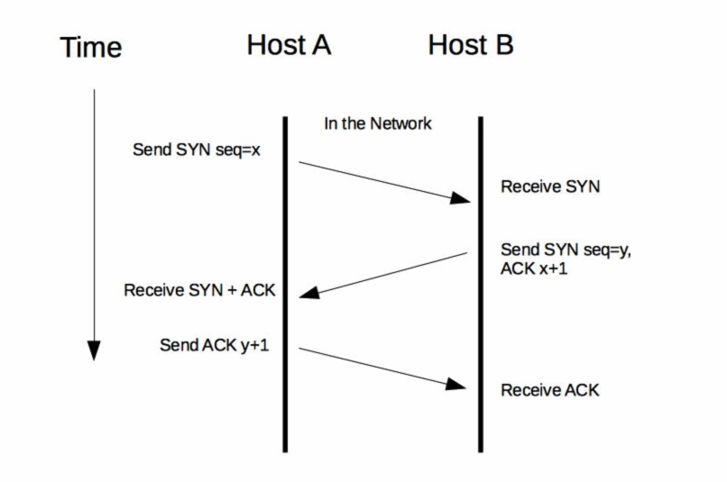
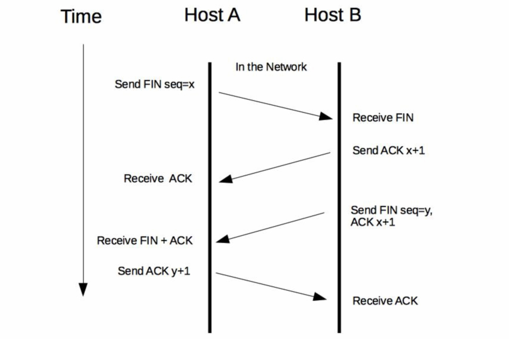
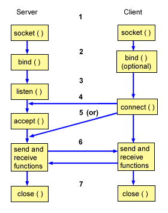

06 如何实现RPC远程服务调用？
=================

专栏上一期我讲过，要完成一次服务调用，首先要解决的问题是服务消费者如何得到服务提供者的地址，其中注册中心扮演了关键角色，服务提供者把自己的地址登记到注册中心，服务消费者就可以查询注册中心得到服务提供者的地址，可以说注册中心犹如海上的一座灯塔，为服务消费者指引了前行的方向。

有了服务提供者的地址后，服务消费者就可以向这个地址发起请求了，但这时候也产生了一个新的问题。你知道，在单体应用时，一次服务调用发生在同一台机器上的同一个进程内部，也就是说调用发生在本机内部，因此也被叫作本地方法调用。在进行服务化拆分之后，服务提供者和服务消费者运行在两台不同物理机上的不同进程内，它们之间的调用相比于本地方法调用，可称之为远程方法调用，简称 RPC（Remote Procedure Call），那么RPC 调用是如何实现的呢？

在介绍 RPC 调用的原理之前，先来想象一下一次电话通话的过程。首先，呼叫者 A 通过查询号码簿找到被呼叫者 B 的电话号码，然后拨打 B 的电话。B 接到来电提示时，如果方便接听的话就会接听；如果不方便接听的话，A 就得一直等待。当等待超过一段时间后，电话会因超时被挂断，这个时候 A 需要再次拨打电话，一直等到 B 空闲的时候，才能接听。

RPC 调用的原理与此类似，我习惯把服务消费者叫作  **客户端** ，服务提供者叫作  **服务端** ，两者通常位于网络上两个不同的地址，要完成一次 RPC 调用，就必须先建立网络连接。建立连接后，双方还必须按照某种约定的协议进行网络通信，这个协议就是通信协议。双方能够正常通信后，服务端接收到请求时，需要以某种方式进行处理，处理成功后，把请求结果返回给客户端。为了减少传输的数据大小，还要对数据进行压缩，也就是对数据进行序列化。

上面就是 RPC 调用的过程，由此可见，想要完成调用，你需要解决四个问题：

* 客户端和服务端如何建立网络连接？
* 服务端如何处理请求？
* 数据传输采用什么协议？
* 数据该如何序列化和反序列化？

客户端和服务端如何建立网络连接？
----------------

根据我的实践经验，客户端和服务端之间基于 TCP 协议建立网络连接最常用的途径有两种。

### 1. HTTP 通信

HTTP 通信是基于应用层 HTTP 协议的，而 HTTP 协议又是基于传输层 TCP 协议的。一次 HTTP 通信过程就是发起一次 HTTP 调用，而一次 HTTP 调用就会建立一个 TCP 连接，经历一次下图所示的“[三次握手](http://condor.depaul.edu/jkristof/technotes/tcp.html)”的过程来建立连接。

完成请求后，再经历一次“四次挥手”的过程来断开连接。

### 2. Socket 通信

Socket 通信是基于 TCP/IP 协议的封装，建立一次 Socket 连接至少需要一对套接字，其中一个运行于客户端，称为 ClientSocket ；另一个运行于服务器端，称为 ServerSocket 。就像下图所描述的，Socket 通信的过程分为四个步骤：服务器监听、客户端请求、连接确认、数据传输。

* 服务器监听：ServerSocket 通过调用 bind() 函数绑定某个具体端口，然后调用 listen() 函数实时监控网络状态，等待客户端的连接请求。
* 客户端请求：ClientSocket 调用 connect() 函数向 ServerSocket 绑定的地址和端口发起连接请求。
* 服务端连接确认：当 ServerSocket 监听到或者接收到 ClientSocket 的连接请求时，调用 accept() 函数响应 ClientSocket 的请求，同客户端建立连接。
* 数据传输：当 ClientSocket 和 ServerSocket 建立连接后，ClientSocket 调用 send() 函数，ServerSocket 调用 receive() 函数，ServerSocket 处理完请求后，调用 send() 函数，ClientSocket 调用 receive() 函数，就可以得到得到返回结果。

直接理解可能有点抽象，你可以把这个过程套入前面我举的“打电话”的例子，可以方便你理解 Socket 通信过程。

当客户端和服务端建立网络连接后，就可以发起请求了。但网络不一定总是可靠的，经常会遇到网络闪断、连接超时、服务端宕机等各种异常，通常的处理手段有两种。

* 链路存活检测：客户端需要定时地发送心跳检测消息（一般是通过 ping 请求）给服务端，如果服务端连续 n 次心跳检测或者超过规定的时间都没有回复消息，则认为此时链路已经失效，这个时候客户端就需要重新与服务端建立连接。
* 断连重试：通常有多种情况会导致连接断开，比如客户端主动关闭、服务端宕机或者网络故障等。这个时候客户端就需要与服务端重新建立连接，但一般不能立刻完成重连，而是要等待固定的间隔后再发起重连，避免服务端的连接回收不及时，而客户端瞬间重连的请求太多而把服务端的连接数占满。

服务端如何处理请求？
----------

假设这时候客户端和服务端已经建立了网络连接，服务端又该如何处理客户端的请求呢？通常来讲，有三种处理方式。

* 同步阻塞方式（BIO），客户端每发一次请求，服务端就生成一个线程去处理。当客户端同时发起的请求很多时，服务端需要创建很多的线程去处理每一个请求，如果达到了系统最大的线程数瓶颈，新来的请求就没法处理了。
* 同步非阻塞方式 (NIO)，客户端每发一次请求，服务端并不是每次都创建一个新线程来处理，而是通过 I/O 多路复用技术进行处理。就是把多个 I/O 的阻塞复用到同一个 select 的阻塞上，从而使系统在单线程的情况下可以同时处理多个客户端请求。这种方式的优势是开销小，不用为每个请求创建一个线程，可以节省系统开销。
* 异步非阻塞方式（AIO），客户端只需要发起一个 I/O 操作然后立即返回，等 I/O 操作真正完成以后，客户端会得到 I/O 操作完成的通知，此时客户端只需要对数据进行处理就好了，不需要进行实际的 I/O 读写操作，因为真正的 I/O 读取或者写入操作已经由内核完成了。这种方式的优势是客户端无需等待，不存在阻塞等待问题。

从前面的描述，可以看出来不同的处理方式适用于不同的业务场景，根据我的经验：

* BIO 适用于连接数比较小的业务场景，这样的话不至于系统中没有可用线程去处理请求。这种方式写的程序也比较简单直观，易于理解。
* NIO 适用于连接数比较多并且请求消耗比较轻的业务场景，比如聊天服务器。这种方式相比 BIO，相对来说编程比较复杂。
* AIO 适用于连接数比较多而且请求消耗比较重的业务场景，比如涉及 I/O 操作的相册服务器。这种方式相比另外两种，编程难度最大，程序也不易于理解。

上面两个问题就是“通信框架”要解决的问题，你可以基于现有的 Socket 通信，在服务消费者和服务提供者之间建立网络连接，然后在服务提供者一侧基于 BIO、NIO 和 AIO 三种方式中的任意一种实现服务端请求处理，最后再花费一些精力去解决服务消费者和服务提供者之间的网络可靠性问题。这种方式对于 Socket 网络编程、多线程编程知识都要求比较高，感兴趣的话可以尝试自己实现一个通信框架。  **但我建议最为稳妥的方式是使用成熟的开源方案** ，比如 Netty、MINA 等，它们都是经过业界大规模应用后，被充分论证是很可靠的方案。

假设客户端和服务端的连接已经建立了，服务端也能正确地处理请求了，接下来完成一次正常地 RPC 调用还需要解决两个问题，即数据传输采用什么协议以及数据该如何序列化和反序列化。

数据传输采用什么协议？
-----------

首先来看第一个问题，数据传输采用什么协议？

最常用的有 HTTP 协议，它是一种开放的协议，各大网站的服务器和浏览器之间的数据传输大都采用了这种协议。还有一些定制的私有协议，比如阿里巴巴开源的 Dubbo 协议，也可以用于服务端和客户端之间的数据传输。无论是开放的还是私有的协议，都必须定义一个“契约”，以便服务消费和服务提供者之间能够达成共识。服务消费者按照契约，对传输的数据进行编码，然后通过网络传输过去；服务提供者从网络上接收到数据后，按照契约，对传输的数据进行解码，然后处理请求，再把处理后的结果进行编码，通过网络传输返回给服务消费者；服务消费者再对返回的结果进行解码，最终得到服务提供者处理后的返回值。

通常协议契约包括两个部分：消息头和消息体。其中消息头存放的是协议的公共字段以及用户扩展字段，消息体存放的是传输数据的具体内容。

以 HTTP 协议为例，下图展示了一段采用 HTTP 协议传输的数据响应报文，主要分为消息头和消息体两部分，其中消息头中存放的是协议的公共字段，比如 Server 代表是服务端服务器类型、Content-Length 代表返回数据的长度、Content-Type 代表返回数据的类型；消息体中存放的是具体的返回结果，这里就是一段 HTML 网页代码。

数据该如何序列化和反序列化？
--------------

再看第二个问题，数据该如何序列化和反序列化。

一般数据在网络中进行传输前，都要先在发送方一端对数据进行编码，经过网络传输到达另一端后，再对数据进行解码，这个过程就是序列化和反序列化。

为什么要对数据进行序列化和反序列化呢？要知道网络传输的耗时一方面取决于网络带宽的大小，另一方面取决于数据传输量。要想加快网络传输，要么提高带宽，要么减小数据传输量，而对数据进行编码的主要目的就是减小数据传输量。比如一部高清电影原始大小为 30GB，如果经过特殊编码格式处理，可以减小到 3GB，同样是 100MB/s 的网速，下载时间可以从 300s 减小到 30s。

常用的序列化方式分为两类：文本类如 XML/JSON 等，二进制类如 PB/Thrift 等，而具体采用哪种序列化方式，主要取决于三个方面的因素。

* 支持数据结构类型的丰富度。数据结构种类支持的越多越好，这样的话对于使用者来说在编程时更加友好，有些序列化框架如 Hessian 2.0 还支持复杂的数据结构比如 Map、List 等。
* 跨语言支持。序列化方式是否支持跨语言也是一个很重要的因素，否则使用的场景就比较局限，比如 Java 序列化只支持 Java 语言，就不能用于跨语言的服务调用了。
* 性能。主要看两点，一个是序列化后的压缩比，一个是序列化的速度。以常用的 PB 序列化和 JSON 序列化协议为例来对比分析，PB 序列化的压缩比和速度都要比 JSON 序列化高很多，所以对性能和存储空间要求比较高的系统选用 PB 序列化更合适；而 JSON 序列化虽然性能要差一些，但可读性更好，更适合对外部提供服务。

总结
---

今天我给你讲解了服务调用需要解决的几个问题，其中你需要掌握：

* **通信框架** 。它主要解决客户端和服务端如何建立连接、管理连接以及服务端如何处理请求的问题。
* **通信协议** 。它主要解决客户端和服务端采用哪种数据传输协议的问题。
* **序列化和反序列化** 。它主要解决客户端和服务端采用哪种数据编解码的问题。

这三个部分就组成了一个完整的 RPC 调用框架，通信框架提供了基础的通信能力，通信协议描述了通信契约，而序列化和反序列化则用于数据的编 / 解码。一个通信框架可以适配多种通信协议，也可以采用多种序列化和反序列化的格式，比如服务化框架 Dubbo 不仅支持 Dubbo 协议，还支持 RMI 协议、HTTP 协议等，而且还支持多种序列化和反序列化格式，比如 JSON、Hession 2.0 以及 Java 序列化等。

思考题
---

gRPC 是一个优秀的跨语言 RPC 调用框架，按照今天我给你讲的服务调用知识，通过阅读[官方文档](https://grpc.io/docs/)，你能给出 gRPC 调用的实现原理吗？

欢迎你在留言区写下自己的思考，与我一起讨论。 %
