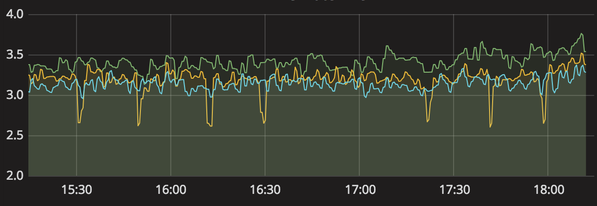
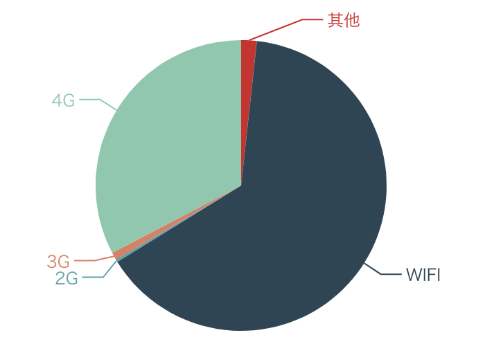
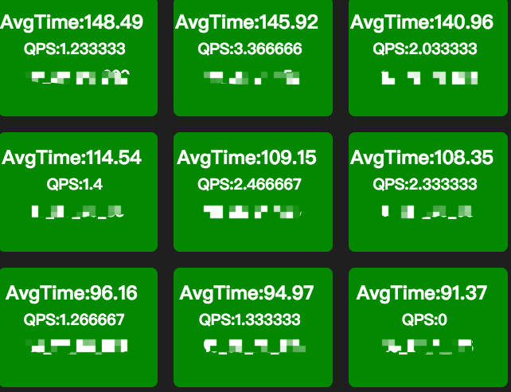

07 如何监控微服务调用？
=============

与单体应用相比，在微服务架构下，一次用户调用会因为服务化拆分后，变成多个不同服务之间的相互调用，这也就需要对拆分后的每个服务都监控起来。

在讲述如何监控微服务调用前，首先你要搞清楚三个问题：监控的对象是什么？具体监控哪些指标？从哪些维度进行监控？下面就从这三个问题开始，一起来看看如何监控微服务调用。

监控对象
----

既然要监控，那么要监控哪些对象呢？根据我的实践经验，对于微服务系统来说，监控对象可以分为四个层次，由上到下可归纳为：

* 用户端监控。通常是指业务直接对用户提供的功能的监控。以微博首页 Feed 为例，它向用户提供了聚合关注的所有人的微博并按照时间顺序浏览的功能，对首页 Feed 功能的监控就属于用户端的监控。
* 接口监控。通常是指业务提供的功能所依赖的具体 RPC 接口的监控。继续以微博首页 Feed 为例，这个功能依赖于用户关注了哪些人的关系服务，每个人发过哪些微博的微博列表服务，以及每条微博具体内容是什么的内容服务，对这几个服务的调用情况的监控就属于接口监控。
* 资源监控。通常是指某个接口依赖的资源的监控。比如用户关注了哪些人的关系服务使用的是 Redis 来存储关注列表，对 Redis 的监控就属于资源监控。
* 基础监控。通常是指对服务器本身的健康状况的监控。主要包括 CPU 利用率、内存使用量、I/O 读写量、网卡带宽等。对服务器的基本监控也是必不可少的，因为服务器本身的健康状况也是影响服务本身的一个重要因素，比如服务器本身连接的网络交换机上联带宽被打满，会影响所有部署在这台服务器上的业务。

监控指标
----

搞清楚要监控的对象之后，需要监控具体哪些指标呢？根据我的实践经验，通常有以下几个业务指标需要重点监控：

* 请求量。请求量监控分为两个维度，一个是实时请求量，一个是统计请求量。实时请求量用 QPS（Queries Per Second）即每秒查询次数来衡量，它反映了服务调用的实时变化情况。统计请求量一般用 PV（Page View）即一段时间内用户的访问量来衡量，比如一天的 PV 代表了服务一天的请求量，通常用来统计报表。
* 响应时间。大多数情况下，可以用一段时间内所有调用的平均耗时来反映请求的响应时间。但它只代表了请求的平均快慢情况，有时候我们更关心慢请求的数量。为此需要把响应时间划分为多个区间，比如 0～10ms、10ms～50ms、50ms～100ms、100ms～500ms、500ms 以上这五个区间，其中 500ms 以上这个区间内的请求数就代表了慢请求量，正常情况下，这个区间内的请求数应该接近于 0；在出现问题时，这个区间内的请求数会大幅增加，可能平均耗时并不能反映出这一变化。除此之外，还可以从 P90、P95、P99、P999 角度来监控请求的响应时间，比如 P99 = 500ms，意思是 99% 的请求响应时间在 500ms 以内，它代表了请求的服务质量，即 SLA。
* 错误率。错误率的监控通常用一段时间内调用失败的次数占调用总次数的比率来衡量，比如对于接口的错误率一般用接口返回错误码为 503 的比率来表示。

监控维度
----

一般来说，要从多个维度来对业务进行监控，具体来讲可以包括下面几个维度：

* 全局维度。从整体角度监控对象的的请求量、平均耗时以及错误率，全局维度的监控一般是为了让你对监控对象的调用情况有个整体了解。
* 分机房维度。一般为了业务的高可用性，服务通常部署在不止一个机房，因为不同机房地域的不同，同一个监控对象的各种指标可能会相差很大，所以需要深入到机房内部去了解。
* 单机维度。即便是在同一个机房内部，可能由于采购年份和批次的不同，位于不同机器上的同一个监控对象的各种指标也会有很大差异。一般来说，新采购的机器通常由于成本更低，配置也更高，在同等请求量的情况下，可能表现出较大的性能差异，因此也需要从单机维度去监控同一个对象。
* 时间维度。同一个监控对象，在每天的同一时刻各种指标通常也不会一样，这种差异要么是由业务变更导致，要么是运营活动导致。为了了解监控对象各种指标的变化，通常需要与一天前、一周前、一个月前，甚至三个月前做比较。
* 核心维度。根据我的经验，业务上一般会依据重要性程度对监控对象进行分级，最简单的是分成核心业务和非核心业务。核心业务和非核心业务在部署上必须隔离，分开监控，这样才能对核心业务做重点保障。

讲到这里先小结一下，  **对于一个微服务来说，你必须明确要监控哪些对象、哪些指标，并且还要从不同的维度进行监控，才能掌握微服务的调用情况** 。明确了这几个关键的问题后，那么该如何搭建一个监控系统，来完成上面这些监控功能呢？

监控系统原理
------

显然，我们要对服务调用进行监控，首先要能收集到每一次调用的详细信息，包括调用的响应时间、调用是否成功、调用的发起者和接收者分别是谁，这个过程叫作数据采集。采集到数据之后，要把数据通过一定的方式传输给数据处理中心进行处理，这个过程叫作数据传输。数据传输过来后，数据处理中心再按照服务的维度进行聚合，计算出不同服务的请求量、响应时间以及错误率等信息并存储起来，这个过程叫作数据处理。最后再通过接口或者 Dashboard 的形式对外展示服务的调用情况，这个过程叫作数据展示。

可见，  **监控系统主要包括四个环节：数据采集、数据传输、数据处理和数据展示** ，下面我来给你讲解下每一个环节的实现原理。

### 1. 数据采集

通常有两种数据收集方式：

* 服务主动上报，这种处理方式通过在业务代码或者服务框架里加入数据收集代码逻辑，在每一次服务调用完成后，主动上报服务的调用信息。
* 代理收集，这种处理方式通过服务调用后把调用的详细信息记录到本地日志文件中，然后再通过代理去解析本地日志文件，然后再上报服务的调用信息。

无论哪种数据采集方式，首先要考虑的问题就是采样率，也就是采集数据的频率。采样率决定了监控的实时性与精确度，一般来说，采样率越高，监控的实时性就越高，精确度也越高。但采样对系统本身的性能也会有一定的影响，尤其是采集后的数据需要写到本地磁盘的时候，过高的采样率会导致系统写入磁盘的 I/O 过高，进而会影响到正常的服务调用。所以设置合理的采用率是数据采集的关键，最好是可以动态控制采样率，在系统比较空闲的时候加大采样率，追求监控的实时性与精确度；在系统负载比较高的时候减小采样率，追求监控的可用性与系统的稳定性。

### 2. 数据传输

数据传输最常用的方式有两种：

* UDP 传输，这种处理方式是数据处理单元提供服务器的请求地址，数据采集后通过 UDP 协议与服务器建立连接，然后把数据发送过去。
* Kafka 传输，这种处理方式是数据采集后发送到指定的 Topic，然后数据处理单元再订阅对应的 Topic，就可以从 Kafka 消息队列中读取到对应的数据。

无论采用哪种传输方式，数据格式都十分重要，尤其是对带宽敏感以及解析性能要求比较高的场景，一般数据传输时采用的数据格式有两种：

* 二进制协议，最常用的就是 PB 对象，它的优点是高压缩比和高性能，可以减少传输带宽并且序列化和反序列化效率特别高。
* 文本协议，最常用的就是 JSON 字符串，它的优点是可读性好，但相比于 PB 对象，传输占用带宽高，并且解析性能也要差一些。

### 3. 数据处理

数据处理是对收集来的原始数据进行聚合并存储。数据聚合通常有两个维度：

* 接口维度聚合，这个维度是把实时收到的数据按照接口名维度实时聚合在一起，这样就可以得到每个接口的实时请求量、平均耗时等信息。
* 机器维度聚合，这个维度是把实时收到的数据按照调用的节点维度聚合在一起，这样就可以从单机维度去查看每个接口的实时请求量、平均耗时等信息。

聚合后的数据需要持久化到数据库中存储，所选用的数据库一般分为两种：

* 索引数据库，比如 Elasticsearch，以倒排索引的数据结构存储，需要查询的时候，根据索引来查询。
* 时序数据库，比如 OpenTSDB，以时序序列数据的方式存储，查询的时候按照时序如 1min、5min 等维度来查询。

### 4. 数据展示

数据展示是把处理后的数据以 Dashboard 的方式展示给用户。数据展示有多种方式，比如曲线图、饼状图、格子图展示等。

* 曲线图。一般是用来监控变化趋势的，比如下面的曲线图展示了监控对象随着时间推移的变化趋势，可以看出来这段时间内变化比较小，曲线也比较平稳。

* 饼状图。一般是用来监控占比分布的，比如下面这张饼图展示了使用不同的手机网络占比情况，可见 Wi-Fi 和 4G 的占比明显要高于 3G 和 2G。

* 格子图。主要做一些细粒度的监控，比如下面这张格子图代表了不同的机器的接口调用请求量和耗时情况，展示结果一目了然。

总结
---

服务监控在微服务改造过程中的重要性不言而喻，没有强大的监控能力，改造成微服务架构后，就无法掌控各个不同服务的情况，在遇到调用失败时，如果不能快速发现系统的问题，对于业务来说就是一场灾难。

搭建一个服务监控系统，涉及数据采集、数据传输、数据处理、数据展示等多个环节，每个环节都需要根据自己的业务特点选择合适的解决方案，关于监控技术方案的选型我会在专栏后面进行详解。

思考题
---

最后请你思考一下，你所在的技术团队目前采用的监控系统，都监控了哪些业务数据？包含哪些业务指标？都有哪些维度？你觉得是否合理？

欢迎你在留言区写下自己的思考，与我一起讨论。 %
