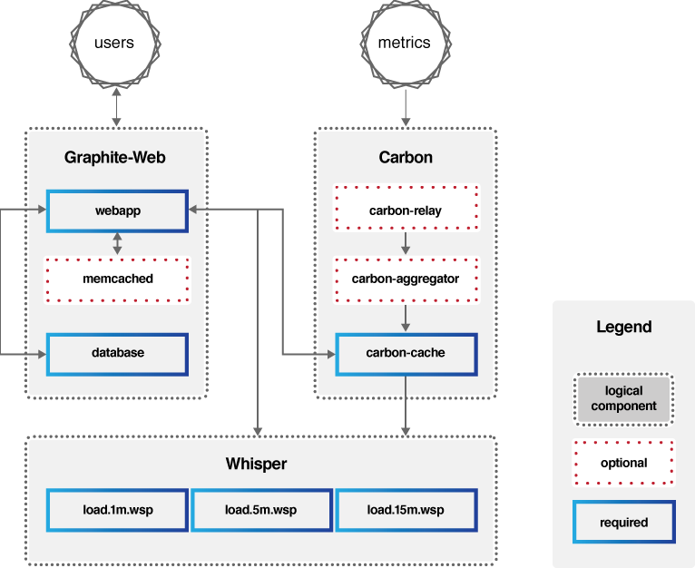
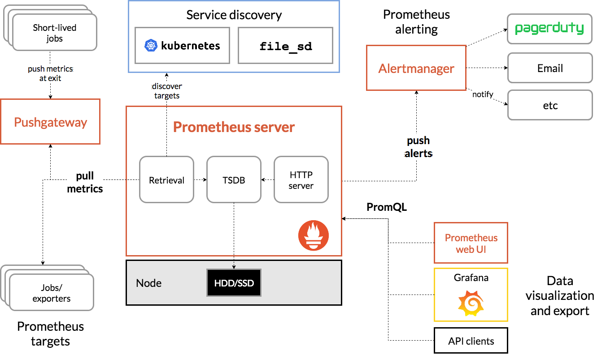

# 15 如何搭建一个可靠的监控系统？

[专栏第 7 期](http://time.geekbang.org/column/article/15109)我给你讲解了监控系统的实现原理，先来简单回顾一下，一个监控系统的组成主要涉及四个环节：数据收集、数据传输、数据处理和数据展示。不同的监控系统实现方案，在这四个环节所使用的技术方案不同，适合的业务场景也不一样。

目前，比较流行的开源监控系统实现方案主要有两种：以[ELK](https://www.elastic.co/cn/)为代表的集中式日志解决方案，以及[Graphite](https://graphite.readthedocs.io/en/latest/index.html)、[TICK](https://www.influxdata.com/time-series-platform/)和[Prometheus](https://prometheus.io/)等为代表的时序数据库解决方案。接下来我就以这几个常见的监控系统实现方案，谈谈它们的实现原理，分别适用于什么场景，以及具体该如何做技术选型。

## ELK

ELK 是 Elasticsearch、Logstash、Kibana 三个开源软件产品首字母的缩写，它们三个通常配合使用，所以被称为 ELK Stack，它的架构可以用下面的图片来描述。

（图片来源：[https://cdn-images-1.medium.com/max/1600/1\*mwSvtVy_qGz0nTjaYbvwpw.png](https://cdn-images-1.medium.com/max/1600/1*mwSvtVy_qGz0nTjaYbvwpw.png)）

这三个软件的功能也各不相同。

- Logstash 负责数据收集和传输，它支持动态地从各种数据源收集数据，并对数据进行过滤、分析、格式化等，然后存储到指定的位置。
- Elasticsearch 负责数据处理，它是一个开源分布式搜索和分析引擎，具有可伸缩、高可靠和易管理等特点，基于 Apache Lucene 构建，能对大容量的数据进行接近实时的存储、搜索和分析操作，通常被用作基础搜索引擎。
- Kibana 负责数据展示，也是一个开源和免费的工具，通常和 Elasticsearch 搭配使用，对其中的数据进行搜索、分析并且以图表的方式展示。

这种架构因为需要在各个服务器上部署 Logstash 来从不同的数据源收集数据，所以比较消耗 CPU 和内存资源，容易造成服务器性能下降，因此后来又在 Elasticsearch、Logstash、Kibana 之外引入了 Beats 作为数据收集器。相比于 Logstash，Beats 所占系统的 CPU 和内存几乎可以忽略不计，可以安装在每台服务器上做轻量型代理，从成百上千或成千上万台机器向 Logstash 或者直接向 Elasticsearch 发送数据。

其中，Beats 支持多种数据源，主要包括：

- Packetbeat，用来收集网络流量数据。
- Topbeat，用来收集系统、进程的 CPU 和内存使用情况等数据。
- Filebeat，用来收集文件数据。
- Winlogbeat，用来收集 Windows 事件日志收据。

Beats 将收集到的数据发送到 Logstash，经过 Logstash 解析、过滤后，再将数据发送到 Elasticsearch，最后由 Kibana 展示，架构就变成下面这张图里描述的了。

（图片来源：[https://logz.io/wp-content/uploads/2018/08/image21-1024x328.png](https://logz.io/wp-content/uploads/2018/08/image21-1024x328.png)）

## Graphite

Graphite 的组成主要包括三部分：Carbon、Whisper、Graphite-Web，它的架构可以用下图来描述。

- Carbon：主要作用是接收被监控节点的连接，收集各个指标的数据，将这些数据写入 carbon-cache 并最终持久化到 Whisper 存储文件中去。
- Whisper：一个简单的时序数据库，主要作用是存储时间序列数据，可以按照不同的时间粒度来存储数据，比如 1 分钟 1 个点、5 分钟 1 个点、15 分钟 1 个点三个精度来存储监控数据。
- Graphite-Web：一个 Web App，其主要功能绘制报表与展示，即数据展示。为了保证 Graphite-Web 能及时绘制出图形，Carbon 在将数据写入 Whisper 存储的同时，会在 carbon-cache 中同时写入一份数据，Graphite-Web 会先查询 carbon-cache，如果没有再查询 Whisper 存储。

（图片来源：[https://graphiteapp.org/img/architecture_diagram.png](https://graphiteapp.org/img/architecture_diagram.png)）

也就是说 Carbon 负责数据处理，Whisper 负责数据存储，Graphite-Web 负责数据展示，可见 Graphite 自身并不包含数据采集组件，但可以接入[StatsD](https://github.com/etsy/statsd)等开源数据采集组件来采集数据，再传送给 Carbon。

其中 Carbon 对写入的数据格式有一定的要求，比如：

```bash
servers.www01.cpuUsage 42 1286269200
products.snake-oil.salesPerMinute 123 1286269200
[one minute passes]
servers.www01.cpuUsageUser 44 1286269260
products.snake-oil.salesPerMinute 119 1286269260
```

其中“servers.www01.cpuUsage 42 1286269200”是“key” + 空格分隔符 + “value + 时间戳”的数据格式，“servers.www01.cpuUsage”是以“.”分割的 key，代表具体的路径信息，“42”是具体的值，“1286269200”是当前的 Unix 时间戳。

Graphite-Web 对外提供了 HTTP API 可以查询某个 key 的数据以绘图展示，查询方式如下。

```bash
http://graphite.example.com/render?target=servers.www01.cpuUsage&
width=500&height=300&from=-24h
```

这个 HTTP 请求意思是查询 key“servers.www01.cpuUsage”在过去 24 小时的数据，并且要求返回 500\*300 大小的数据图。

除此之外，Graphite-Web 还支持丰富的函数，比如：

```properties
target=sumSeries(products.*.salesPerMinute)

```

代表了查询匹配规则“products.\*.salesPerMinute”的所有 key 的数据之和。

## TICK

TICK 是 Telegraf、InfluxDB、Chronograf、Kapacitor 四个软件首字母的缩写，是由 InfluxData 开发的一套开源监控工具栈，因此也叫作 TICK Stack，它的架构可以看用下面这张图来描述。

（图片来源：[https://2bjee8bvp8y263sjpl3xui1a-wpengine.netdna-ssl.com/wp-content/uploads/Tick-Stack-Complete.png](https://2bjee8bvp8y263sjpl3xui1a-wpengine.netdna-ssl.com/wp-content/uploads/Tick-Stack-Complete.png)）

从这张图可以看出，其中 Telegraf 负责数据收集，InfluxDB 负责数据存储，Chronograf 负责数据展示，Kapacitor 负责数据告警。

这里面，InfluxDB 对写入的数据格式要求如下。

```xml
<measurement>[,<tag-key>=<tag-value>...] <field-key>=<field-value>[,<field2-key>=<field2-value>...] [unix-nano-timestamp]

```

下面我用一个具体示例来说明它的格式。

```bash
cpu,host=serverA,region=us_west value=0.64 1434067467100293230

```

其中，“cpu,host=serverA,region=us_west value=0.64 1434067467100293230”代表了 host 为 serverA、region 为 us_west 的服务器 CPU 的值是 0.64，时间戳是 1434067467100293230，时间精确到 nano。

## Prometheus

还有一种比较有名的时间序数据库解决方案 Prometheus，它是一套开源的系统监控报警框架，受 Google 的集群监控系统 Borgmon 启发，由工作在 SoundCloud 的 Google 前员工在 2012 年创建，后来作为社区开源项目进行开发，并于 2015 年正式发布，2016 年正式加入 CNCF（Cloud Native Computing Foundation），成为受欢迎程度仅次于 Kubernetes 的项目，它的架构可以用下图来描述。

（图片来源：[https://prometheus.io/assets/architecture.png](https://prometheus.io/assets/architecture.png)）

从这张图可以看出，Prometheus 主要包含下面几个组件：

- Prometheus Server：用于拉取 metrics 信息并将数据存储在时间序列数据库。
- Jobs/exporters：用于暴露已有的第三方服务的 metrics 给 Prometheus Server，比如 StatsD、Graphite 等，负责数据收集。
- Pushgateway：主要用于短期 jobs，由于这类 jobs 存在时间短，可能在 Prometheus Server 来拉取 metrics 信息之前就消失了，所以这类的 jobs 可以直接向 Prometheus Server 推送它们的 metrics 信息。
- Alertmanager：用于数据报警。
- Prometheus web UI：负责数据展示。

它的工作流程大致是：

- Prometheus Server 定期从配置好的 jobs 或者 exporters 中拉取 metrics 信息，或者接收来自 Pushgateway 发过来的 metrics 信息。
- Prometheus Server 把收集到的 metrics 信息存储到时间序列数据库中，并运行已经定义好的 alert.rules，向 Alertmanager 推送警报。
- Alertmanager 根据配置文件，对接收的警报进行处理，发出告警。
- 通过 Prometheus web UI 进行可视化展示。

Prometheus 存储数据也是用的时间序列数据库，格式如下。

```xml
<metric name>{<label name>=<label value>, …}

```

比如下面这段代码代表了位于集群 cluster 1 上，节点 IP 为 1.1.1.1，端口为 80，访问路径为“/a”的 http 请求的总数为 100。

```xml
http_requests_total{instance="1.1.1.1:80",job="cluster1",location="/a"} 100

```

讲到这里，四种监控系统的解决方案都已经介绍完了，接下来我们对比一下这四种方案，看看如何选型。

## 选型对比

我们从监控系统的四个环节来分别对比。

### 1. 数据收集

ELK 是通过在每台服务器上部署 Beats 代理来采集数据；Graphite 本身没有收据采集组件，需要配合使用开源收据采集组件，比如 StatsD；TICK 使用了 Telegraf 作为数据采集组件；Prometheus 通过 jobs/exporters 组件来获取 StatsD 等采集过来的 metrics 信息。

### 2. 数据传输

ELK 是 Beats 采集的数据传输给 Logstash，经过 Logstash 清洗后再传输给 Elasticsearch；Graphite 是通过第三方采集组件采集的数据，传输给 Carbon；TICK 是 Telegraf 采集的数据，传输给 InfluxDB；而 Prometheus 是 Prometheus Server 隔一段时间定期去从 jobs/exporters 拉取数据。可见前三种都是采用“推数据”的方式，而 Prometheus 是采取拉数据的方式，因此 Prometheus 的解决方案对服务端的侵入最小，不需要在服务端部署数据采集代理。

### 3. 数据处理

ELK 可以对日志的任意字段索引，适合多维度的数据查询，在存储时间序列数据方面与时间序列数据库相比会有额外的性能和存储开销。除此之外，时间序列数据库的几种解决方案都支持多种功能的数据查询处理，功能也更强大。

- Graphite 通过 Graphite-Web 支持正则表达式匹配、sumSeries 求和、alias 给监控项重新命名等函数功能，同时还支持这些功能的组合，比如下面这个表达式的意思是，要查询所有匹配路径“stats.open.profile.\*.API.\_comments_flow”的监控项之和，并且把监控项重命名为 Total QPS。

```bash
alias(sumSeries(stats.openapi.profile.*.API._comments_flow.total_count,"Total QPS"))

```

- InfluxDB 通过类似 SQL 语言的 InfluxQL，能对监控数据进行复杂操作，比如查询一分钟 CPU 的使用率，用 InfluxDB 实现的示例是：

```sql
SELECT 100 - usage_idel FROM "autogen"."cpu" WHERE time > now() - 1m and "cpu"='cpu0'

```

- Prometheus 通过私有的 PromQL 查询语言，如果要和上面 InfluxDB 实现同样的功能，PromQL 语句如下，看起来更加简洁。

```bash
100 - (node_cpu{job="node",mode="idle"}[1m]) 

```

### 4. 数据展示

Graphite、TICK 和 Prometheus 自带的展示功能都比较弱，界面也不好看，不过好在它们都支持[Grafana](https://grafana.com/)来做数据展示。Grafana 是一个开源的仪表盘工具，它支持多种数据源比如 Graphite、InfluxDB、Prometheus 以及 Elasticsearch 等。ELK 采用了 Kibana 做数据展示，Kibana 包含的数据展示功能比较强大，但只支持 Elasticsearch，而且界面展示 UI 效果不如 Grafana 美观。

## 总结

以上几种监控系统实现方式，所采用的技术均为开源的，其中：

- ELK 的技术栈比较成熟，应用范围也比较广，除了可用作监控系统外，还可以用作日志查询和分析。
- Graphite 是基于时间序列数据库存储的监控系统，并且提供了功能强大的各种聚合函数比如 sum、average、top5 等可用于监控分析，而且对外提供了 API 也可以接入其他图形化监控系统如 Grafana。
- TICK 的核心在于其时间序列数据库 InfluxDB 的存储功能强大，且支持类似 SQL 语言的复杂数据处理操作。
- Prometheus 的独特之处在于它采用了拉数据的方式，对业务影响较小，同时也采用了时间序列数据库存储，而且支持独有的 PromQL 查询语言，功能强大而且简洁。

从对实时性要求角度考虑，时间序列数据库的实时性要好于 ELK，通常可以做到 10s 级别内的延迟，如果对实时性敏感的话，建议选择时间序列数据库解决方案。

从使用的灵活性角度考虑，几种时间序列数据库的监控处理功能都要比 ELK 更加丰富，使用更灵活也更现代化。

所以如果要搭建一套新的监控系统，我建议可以考虑采用 Graphite、TICK 或者 Prometheus 其中之一。不过 Graphite 还需要搭配数据采集系统比如 StatsD 或者 Collectd 使用，而且界面展示建议使用 Grafana 接入 Graphite 的数据源，它的效果要比 Graphite Web 本身提供的界面美观很多。TICK 提供了完整的监控系统框架，包括从数据采集、数据传输、数据处理再到数据展示，不过在数据展示方面同样也建议用 Grafana 替换掉 TICK 默认的数据展示组件 Chronograf，这样展示效果更好。Prometheus 因为采用拉数据的方式，所以对业务的侵入性最小，比较适合 Docker 封装好的云原生应用，比如 Kubernetes 默认就采用了 Prometheus 作为监控系统。

## 思考题

通过我今天的讲解，你应该知道了 Graphite、TICK 以及 Prometheus 存储监控数据都采用了时间序列数据库，它们在存储和性能上有什么不同之处吗？

欢迎你在留言区写下自己的思考，与我一起讨论。 :
