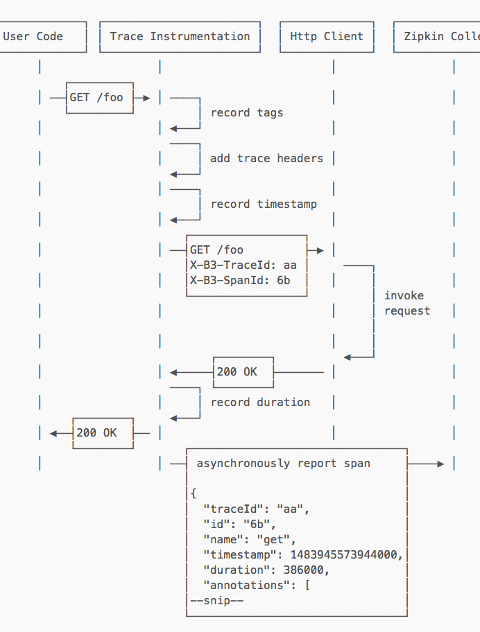
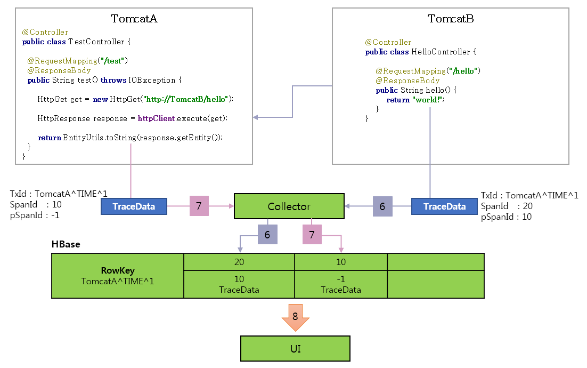
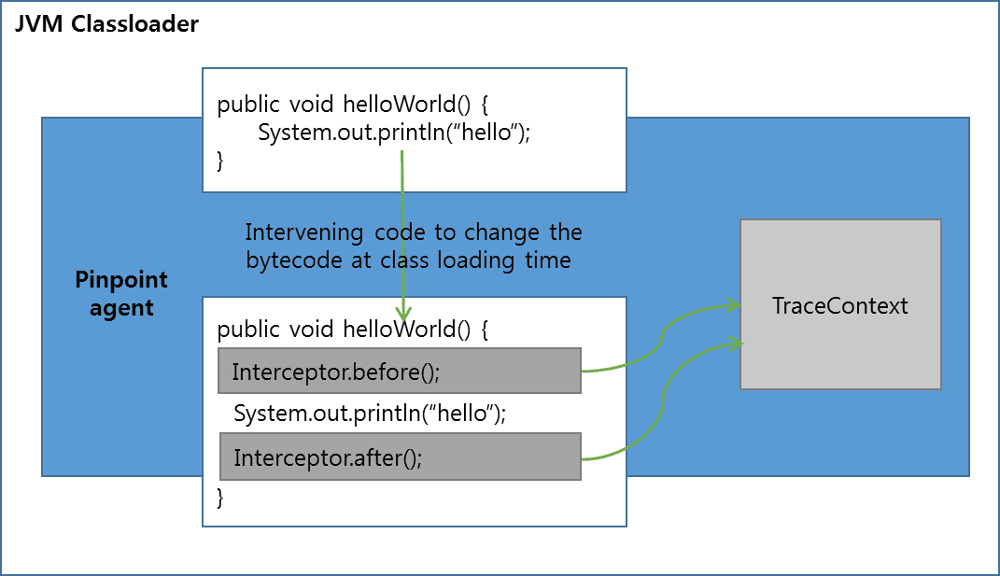
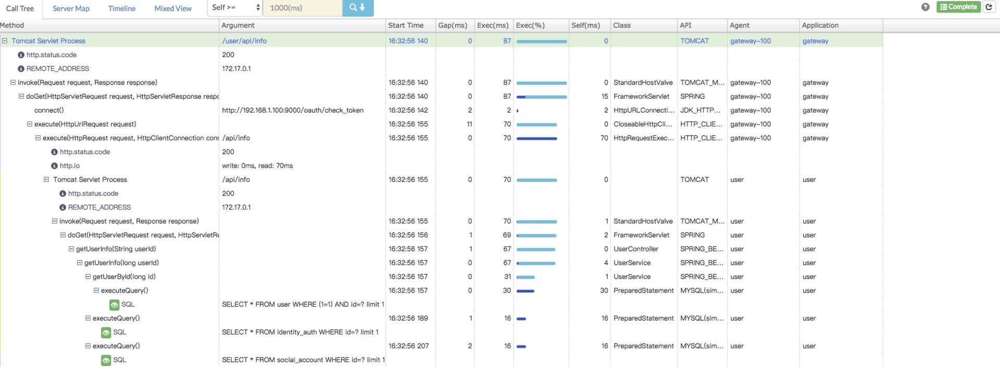
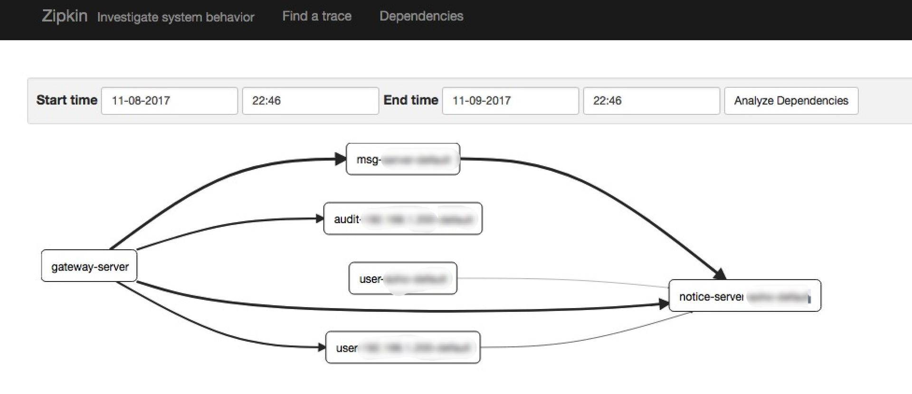
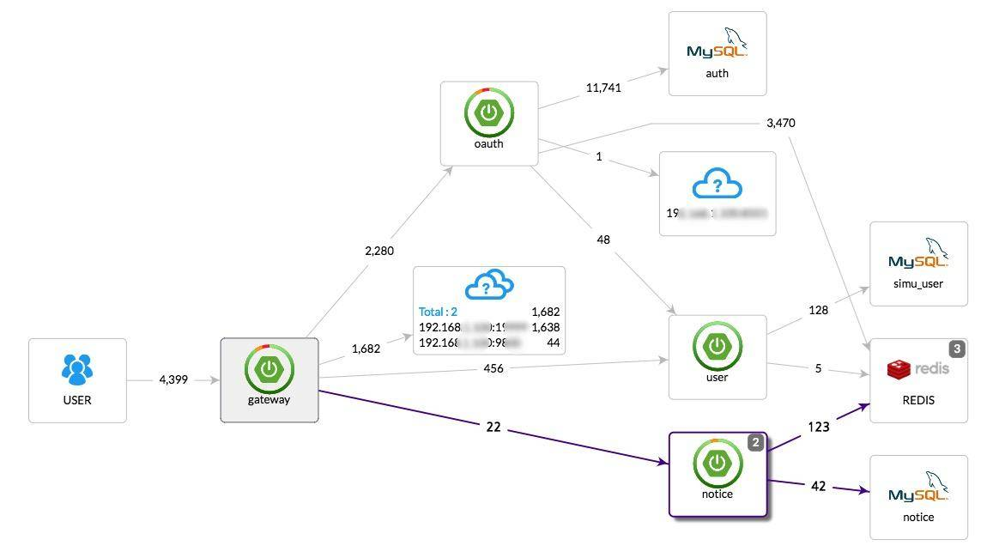

# 16 如何搭建一套适合你的服务追踪系统？

[专栏第 8 期](http://time.geekbang.org/column/article/15273)我给你讲了服务追踪系统的原理以及实现，简单回顾一下服务追踪系统的实现，主要包括三个部分。

- 埋点数据收集，负责在服务端进行埋点，来收集服务调用的上下文数据。
- 实时数据处理，负责对收集到的链路信息，按照 traceId 和 spanId 进行串联和存储。
- 数据链路展示，把处理后的服务调用数据，按照调用链的形式展示出来。

如果要自己从 0 开始实现一个服务追踪系统，针对以上三个部分你都必须有相应的解决方案。首先你需要在业务代码的框架层开发调用拦截程序，在调用的前后收集相关信息，把信息传输给到一个统一的处理中心。然后处理中心需要实时处理收集到链路信息，并按照 traceId 和 spanId 进行串联，处理完以后再存到合适的存储中。最后还要能把存储中存储的信息，以调用链路图或者调用拓扑图的形式对外展示。

可以想象这个技术难度以及开发工作量都不小，对于大部分中小业务团队来说，都十分具有挑战。不过幸运的是，业界已经有不少开源的服务追踪系统实现，并且应用范围也已经十分广泛，对大部分的中小业务团队来说，足以满足对服务追踪系统的需求。

业界比较有名的服务追踪系统实现有阿里的鹰眼、Twitter 开源的 OpenZipkin，还有 Naver 开源的 Pinpoint，它们都是受 Google 发布的 Dapper 论文启发而实现的。其中阿里的鹰眼解决方案没有开源，而且由于阿里需要处理数据量比较大，所以鹰眼的定位相对定制化，不一定适合中小规模的业务团队，感兴趣的同学可以点击本期文章末尾“拓展阅读”进行学习。

下面我主要来介绍下开源实现方案 OpenZipkin 和 Pinpoint，再看看它们有什么区别。

## OpenZipkin

OpenZipkin 是 Twitter 开源的服务追踪系统，下面这张图展示了它的架构设计。

（图片来源：[https://zipkin.io/public/img/architecture-1.png](https://zipkin.io/public/img/architecture-1.png)）

从图中看，OpenZipkin 主要由四个核心部分组成。

- Collector：负责收集探针 Reporter 埋点采集的数据，经过验证处理并建立索引。
- Storage：存储服务调用的链路数据，默认使用的是 Cassandra，是因为 Twitter 内部大量使用了 Cassandra，你也可以替换成 Elasticsearch 或者 MySQL。
- API：将格式化和建立索引的链路数据以 API 的方式对外提供服务，比如被 UI 调用。
- UI：以图形化的方式展示服务调用的链路数据。

它的工作原理可以用下面这张图来描述。

（图片来源：[https://zipkin.io/pages/architecture.html](https://zipkin.io/pages/architecture.html)）

具体流程是，通过在业务的 HTTP Client 前后引入服务追踪代码，这样在 HTTP 方法“/foo”调用前，生成 trace 信息：TraceId：aa、SpanId：6b、annotation：GET /foo，以及当前时刻的 timestamp：1483945573944000，然后调用结果返回后，记录下耗时 duration，之后再把这些 trace 信息和 duration 异步上传给 Zipkin Collector。

## Pinpoint

Pinpoint 是 Naver 开源的一款深度支持 Java 语言的服务追踪系统，下面这张图是它的架构设计。

（图片来源：[http://naver.github.io/pinpoint/1.7.3/images/pinpoint-architecture.png](https://naver.github.io/pinpoint/1.7.3/images/pinpoint-architecture.png)）

Pinpoint 主要也由四个部分组成。

- Pinpoint Agent：通过 Java 字节码注入的方式，来收集 JVM 中的调用数据，通过 UDP 协议传递给 Collector，数据采用 Thrift 协议进行编码。
- Pinpoint Collector：收集 Agent 传过来的数据，然后写到 HBase Storgage。
- HBase Storage：采用 HBase 集群存储服务调用的链路信息。
- Pinpoint Web UI：通过 Web UI 展示服务调用的详细链路信息。

它的工作原理你可以看这张图。

（图片来源：[http://naver.github.io/pinpoint/1.7.3/images/td_figure6.png](https://naver.github.io/pinpoint/1.7.3/images/td_figure6.png)）

具体来看，就是请求进入 TomcatA，然后生成 TraceId：TomcatA^ TIME ^ 1、SpanId：10、pSpanId：-1（代表是根请求），接着 TomatA 调用 TomcatB 的 hello 方法，TomcatB 生成 TraceId：TomcatA^ TIME ^1、新的 SpanId：20、pSpanId：10（代表是 TomcatA 的请求），返回调用结果后将 trace 信息发给 Collector，TomcatA 收到调用结果后，将 trace 信息也发给 Collector。Collector 把 trace 信息写入到 HBase 中，Rowkey 就是 traceId，SpanId 和 pSpanId 都是列。然后就可以通过 UI 查询调用链路信息了。

## 选型对比

根据我的经验，考察服务追踪系统主要从下面这几个方面。

### 1. 埋点探针支持平台的广泛性

OpenZipkin 和 Pinpoint 都支持哪些语言平台呢？

OpenZipkin 提供了不同语言的 Library，不同语言实现时需要引入不同版本的 Library。

官方提供了 C#、Go、Java、JavaScript、Ruby、Scala、PHP 等主流语言版本的 Library，而且开源社区还提供了更丰富的不同语言版本的 Library，详细的可以点击[这里](https://zipkin.io/pages/existing_instrumentations)查看；而 Pinpoint 目前只支持 Java 语言。

所以从探针支持的语言平台广泛性上来看，OpenZipkin 比 Pinpoint 的使用范围要广，而且开源社区很活跃，生命力更强。

### 2. 系统集成难易程度

再来看下系统集成的难易程度。

以 OpenZipkin 的 Java 探针 Brave 为例，它只提供了基本的操作 API，如果系统要想集成 Brave，必须在配置里手动里添加相应的配置文件并且增加 trace 业务代码。具体来讲，就是你需要先修改工程的 POM 依赖，以引入 Brave 相关的 JAR 包。

```xml
<dependencyManagement>
    <dependencies>
      <dependency>
        <groupId>io.zipkin.brave</groupId>
        <artifactId>brave-bom</artifactId>
        <version>${brave.version}</version>
        <type>pom</type>
        <scope>import</scope>
      </dependency>
    </dependencies>
  </dependencyManagement>
```

然后假如你想收集每一次 HTTP 调用的信息，你就可以使用 Brave 在 Apache Httpclient 基础上封装的 httpClient，它会记录每一次 HTTP 调用的信息，并上报给 OpenZipkin。

```bash
httpclient =TracingHttpClientBuilder.create(tracing).build();

```

而 Pinpoint 是通过字节码注入的方式来实现拦截服务调用，从而收集 trace 信息的，所以不需要代码做任何改动。Java 字节码注入的大致原理你可以参考下图。

（图片来源：[http://naver.github.io/pinpoint/1.7.3/images/td_figure3.png](https://naver.github.io/pinpoint/1.7.3/images/td_figure3.png)）

我来解释一下，就是 JVM 在加载 class 二进制文件时，动态地修改加载的 class 文件，在方法的前后执行拦截器的 before() 和 after() 方法，在 before() 和 after() 方法里记录 trace() 信息。而应用不需要修改业务代码，只需要在 JVM 启动时，添加类似下面的启动参数就可以了。

```properties
-javaagent:$AGENT_PATH/pinpoint-bootstrap-$VERSION.jar
-Dpinpoint.agentId=<Agent's UniqueId>
-Dpinpoint.applicationName=<The name indicating a same service (AgentId collection)
```

所以从系统集成难易程度上看，Pinpoint 要比 OpenZipkin 简单。

### 3. 调用链路数据的精确度

从下面这张 OpenZipkin 的调用链路图可以看出，OpenZipkin 收集到的数据只到接口级别，进一步的信息就没有了。

（图片来源：[http://ovcjgn2x0.bkt.clouddn.com/zipkin-info.jpg](http://ovcjgn2x0.bkt.clouddn.com/zipkin-info.jpg)）

再来看下 Pinpoint，因为 Pinpoint 采用了字节码注入的方式实现 trace 信息收集，所以它能拿到的信息比 OpenZipkin 多得多。从下面这张图可以看出，它不仅能够查看接口级别的链路调用信息，还能深入到调用所关联的数据库信息。

（图片来源：[http://ovcjgn2x0.bkt.clouddn.com/pp-info.jpg](http://ovcjgn2x0.bkt.clouddn.com/pp-info.jpg)）

同理在绘制链路拓扑图时，OpenZipkin 只能绘制服务与服务之间的调用链路拓扑图，比如下面这张示意图。

（图片来源：[http://ovcjgn2x0.bkt.clouddn.com/zipdependency1.jpg](http://ovcjgn2x0.bkt.clouddn.com/zipdependency1.jpg)）

而 Pinpoint 不仅能够绘制服务与服务之间，还能绘制与 DB 之间的调用链路拓扑图，比如下图。

（图片来源：[http://ovcjgn2x0.bkt.clouddn.com/ppreal.jpg](http://ovcjgn2x0.bkt.clouddn.com/ppreal.jpg)）

所以，从调用链路数据的精确度上看，Pinpoint 要比 OpenZipkin 精确得多。

## 总结

今天我给你讲解了两个开源服务追踪系统 OpenZipkin 和 Pinpoint 的具体实现，并从埋点探针支持平台广泛性、系统集成难易程度、调用链路数据精确度三个方面对它们进行了对比。

从选型的角度来讲，如果你的业务采用的是 Java 语言，那么采用 Pinpoint 是个不错的选择，因为它不需要业务改动一行代码就可以实现 trace 信息的收集。除此之外，Pinpoint 不仅能看到服务与服务之间的链路调用，还能看到服务内部与资源层的链路调用，功能更为强大，如果你有这方面的需求，Pinpoint 正好能满足。

如果你的业务不是 Java 语言实现，或者采用了多种语言，那毫无疑问应该选择 OpenZipkin，并且，由于其开源社区很活跃，基本上各种语言平台都能找到对应的解决方案。不过想要使用 OpenZipkin，还需要做一些额外的代码开发工作，以引入 OpenZipkin 提供的 Library 到你的系统中。

除了 OpenZipkin 和 Pinpoint，业界还有其他开源追踪系统实现，比如 Uber 开源的 Jaeger，以及国内的一款开源服务追踪系统 SkyWalking。不过由于目前应用范围不是很广，这里就不详细介绍了，感兴趣的同学可以点击“拓展阅读”自行学习。

## 思考题

OpenZipkin 在探针采集完数据后有两种方式把数据传递给 Collector，一种是通过 HTTP 调用，一种是基于 MQ 的异步通信方式，比如使用 RabbitMQ 或者 Kafka，你觉得哪种方式更好一些？为什么？

欢迎你在留言区写下自己的思考，与我一起讨论。

______________________________________________________________________

**拓展阅读：**

阿里巴巴鹰眼：[http://ppt.geekbang.org/slide/download/939/595f4cdcb9d52.pdf/18](http://ppt.geekbang.org/slide/download/939/595f4cdcb9d52.pdf/18)

Jaeger：[https://www.jaegertracing.io](https://www.jaegertracing.io/)

SkyWalking：[https://github.com/apache/incubator-skywalking](https://github.com/apache/incubator-skywalking) .
