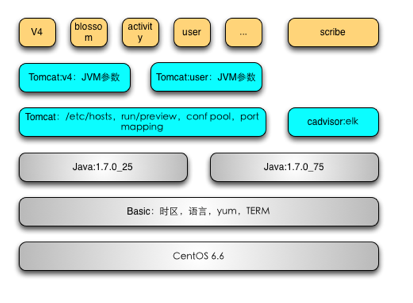

25 微服务为什么要容器化？
==============

专栏前面的文章，我主要给你讲解了微服务架构的基础组成以及在具体落地实践过程中的会遇到的问题和解决方案，这些是掌握微服务架构最基础的知识。从今天开始，我们将进一步深入微服务架构进阶的内容，也就是微服务与容器、DevOps 之间的关系。它们三个虽然分属于不同领域，但却有着千丝万缕的关系，可以说没有容器的普及，就没有微服务架构的蓬勃发展，也就没有 DevOps 今天的盛行其道。

之后我还会具体分析它们三者之间是如何紧密联系的，今天我们先来看微服务为什么要容器化。

微服务带来的问题
--------

单体应用拆分成多个微服务后，能够实现快速开发迭代，但随之带来的问题是测试和运维部署的成本的提升。相信拆分微服务的利弊你早已耳熟能详，我讲个具体的例子。微博业务早期就是一个大的单体 Web 应用，在测试和运维的时候，只需要把 Web 应用打成一个大的 WAR 包，部署到 Tomcat 中去就行了。后来拆分成多个微服务之后，有的业务需求需要同时修改多个微服务的代码，这时候就有多个微服务都需要打包、测试和上线发布，一个业务需求就需要同时测试多个微服务接口的功能，上线发布多个系统，给测试和运维的工作量增加了很多。这个时候就需要有办法能够减轻测试和运维的负担，我在上一讲给出的解决方案是 DevOps。

DevOps 可以简单理解为开发和运维的结合，服务的开发者不再只负责服务的代码开发，还要负责服务的测试、上线发布甚至故障处理等全生命周期过程，这样的话就把测试和运维从微服务拆分后所带来的复杂工作中解放出来。DevOps 要求开发、测试和发布的流程必须自动化，这就需要  **保证开发人员将自己本地部署测试通过的代码和运行环境，能够复制到测试环境中去，测试通过后再复制到线上环境进行发布**。虽然这个过程看上去好像复制代码一样简单，但在现实时，本地环境、测试环境以及线上环境往往是隔离的，软件配置环境的差异也很大，这也导致了开发、测试和发布流程的割裂。

而且还有一个问题是，拆分后的微服务相比原来大的单体应用更加灵活，经常要根据实际的访问量情况做在线扩缩容，而且通常会采用在公有云上创建的 ECS 来扩缩容。这又给微服务的运维带来另外一个挑战，因为公有云上创建的 ECS 通常只包含了基本的操作系统环境，微服务运行依赖的软件配置等需要运维再单独进行初始化工作，因为不同的微服务的软件配置依赖不同，比如 Java 服务依赖了 JDK，就需要在 ECS 上安装 JDK，而且可能不同的微服务依赖的 JDK 版本也不相同，一般情况下新的业务可能依赖的版本比较新比如 JDK 8，而有些旧的业务可能依赖的版本还是 JDK 6，为此服务部署的初始化工作十分繁琐。

而容器技术的诞生恰恰解决了上面这两个问题，为什么容器技术可以解决本地、测试、线上环境的隔离，解决部署服务初始化繁琐的问题呢？下面我就以业界公认的容器标准 Docker 为例，来看看 Docker 是如何解决这两个问题的。

什么是 Docker
----------

Docker 是容器技术的一种，事实上已经成为业界公认的容器标准，要理解 Docker 的工作原理首先得知道什么是容器。

容器翻译自英文的 Container 一词，而 Container 又可以翻译成集装箱。我们都知道，**集装箱的作用就是，在港口把货物用集装箱封装起来，然后经过货轮从海上运输到另一个港口，再在港口卸载后通过大货车运送到目的地。这样的话，货物在世界的任何地方流转时，都是在集装箱里封装好的，不需要根据是在货轮上还是大货车上而对货物进行重新装配**。同样，在软件的世界里，容器也起到了相同的作用，只不过它封装的是软件的运行环境。容器的本质就是 Linux 操作系统里的进程，但与操作系统中运行的一般进程不同的是，容器通过[Namespace](https://en.wikipedia.org/wiki/Linux_namespaces)和[Cgroups](https://zh.wikipedia.org/wiki/Cgroups)这两种机制，可以拥有自己的 root 文件系统、自己的网络配置、自己的进程空间，甚至是自己的用户 ID 空间，这样的话容器里的进程就像是运行在宿主机上的另外一个单独的操作系统内，从而实现与宿主机操作系统里运行的其他进程隔离。

Docker 也是基于 Linux 内核的 Cgroups、Namespace 机制来实现进程的封装和隔离的，那么 Docker 为何能把容器技术推向一个新的高度呢？这就要从 Docker 在容器技术上的一项创新 Docker 镜像说起。虽然容器解决了应用程序运行时隔离的问题，但是要想实现应用能够从一台机器迁移到另外一台机器上还能正常运行，就必须保证另外一台机器上的操作系统是一致的，而且应用程序依赖的各种环境也必须是一致的。Docker 镜像恰恰就解决了这个痛点，具体来讲，就是**Docker 镜像不光可以打包应用程序本身，而且还可以打包应用程序的所有依赖，甚至可以包含整个操作系统**。这样的话，你在你自己本机上运行通过的应用程序，就可以使用 Docker 镜像把应用程序文件、所有依赖的软件以及操作系统本身都打包成一个镜像，可以在任何一个安装了 Docker 软件的地方运行。

Docker 镜像解决了 DevOps 中微服务运行的环境难以在本地环境、测试环境以及线上环境保持一致的难题。如此一来，开发就可以把在本地环境中运行测试通过的代码，以及依赖的软件和操作系统本身打包成一个镜像，然后自动部署在测试环境中进行测试，测试通过后再自动发布到线上环境上去，整个开发、测试和发布的流程就打通了。

同时，无论是使用内部物理机还是公有云的机器部署服务，都可以利用 Docker 镜像把微服务运行环境封装起来，从而屏蔽机器内部物理机和公有云机器运行环境的差异，实现同等对待，降低了运维的复杂度。

微服务容器化实践
--------

Docker 能帮助解决服务运行环境可迁移问题的关键，就在于 Docker 镜像的使用上，实际在使用 Docker 镜像的时候往往并不是把业务代码、依赖的软件环境以及操作系统本身直接都打包成一个镜像，而是利用 Docker 镜像的**分层机制** ，在每一层通过编写 Dockerfile 文件来逐层打包镜像。这是因为虽然不同的微服务依赖的软件环境不同，但是还是存在大大小小的相同之处，因此在打包 Docker 镜像的时候，可以分层设计、逐层复用，这样的话可以减少每一层镜像文件的大小。

下面我就以微博的业务 Docker 镜像为例，来实际讲解下生产环境中如何使用 Docker 镜像。正如下面这张图所描述的那样，微博的 Docker 镜像大致分为四层。

* 基础环境层。这一层定义操作系统运行的版本、时区、语言、yum 源、TERM 等。
* 运行时环境层。这一层定义了业务代码的运行时环境，比如 Java 代码的运行时环境 JDK 的版本。
* Web 容器层。这一层定义了业务代码运行的容器的配置，比如 Tomcat 容器的 JVM 参数。
* 业务代码层。这一层定义了实际的业务代码的版本，比如是 V4 业务还是 blossom 业务。



这样的话，每一层的镜像都是在上一层镜像的基础上添加新的内容组成的，以微博 V4 镜像为例，V4 业务的 Dockerfile 文件内容如下：

```bash
FROM registry.intra.weibo.com/weibo_rd_content/tomcat_feed:jdk8.0.40_tomcat7.0.81_g1_dns
ADD confs /data1/confs/
ADD node_pool /data1/node_pool/
ADD authconfs /data1/authconfs/
ADD authkey.properties /data1/
ADD watchman.properties /data1/
ADD 200.sh /data1/weibo/bin/200.sh
ADD 503.sh /data1/weibo/bin/503.sh
ADD catalina.sh /data1/weibo/bin/catalina.sh
ADD server.xml /data1/weibo/conf/server.xml
ADD logging.properties /data1/weibo/conf/logging.properties
ADD ROOT /data1/weibo/webapps/ROOT/
RUN chmod +x /data1/weibo/bin/200.sh /data1/weibo/bin/503.sh /data1/weibo/bin/catalina.sh
WORKDIR /data1/weibo/bin
```

FROM 代表了上一层镜像文件是“tomcat\_feed:jdk8.0.40\_tomcat7.0.81\_g1\_dns”，从名字可以看出上一层镜像里包含了 Java 运行时环境 JDK 和 Web 容器 Tomcat，以及 Tomcat 的版本和 JVM 参数等；ADD 就是要在这层镜像里添加的文件， 这里主要包含了业务的代码和配置等；RUN 代表这一层镜像启动时需要执行的命令；WORKDIR 代表了这一层镜像启动后的工作目录。这样的话就可以通过 Dockerfile 文件在上一层镜像的基础上完成这一层镜像的制作。

总结
---

今天我给你讲解了微服务拆分后相比于传统的单体应用所带来的两个问题，一个是测试和发布工作量的提升，另一个是在弹性扩缩容时不同微服务所要求的软件运行环境差异带来的机器初始化复杂度的提升，而 Docker 利用 Docker 镜像对软件运行环境的完美封装正好解决了这两个问题。

正是因为 Docker 可以做到一处通过、到处运行，所以对业务的价值极大，解决了以前应用程序在开发环境、测试环境以及生产环境之间的移植难的问题，极大提高了运维自动化的水平，也为 DevOps 理念的流行和业务上云提供了基础。

可见容器化改造对微服务是十分必要的，但 Docker 也不是“银弹”，同样会产生新的复杂度问题，比如引入 Docker 后旧的针对物理机的运维模式就无法适应了，需要一种新的针对容器的运维模式。所以接下来，我将分三期，给你详细讲解微服务容器化后该如何运维。

思考题
---

Docker 的概念乍一看与虚拟机有些类似，你认为它们有什么不同之处吗？分别适合什么应用场景？

欢迎你在留言区写下自己的思考，与我一起讨论。 =
