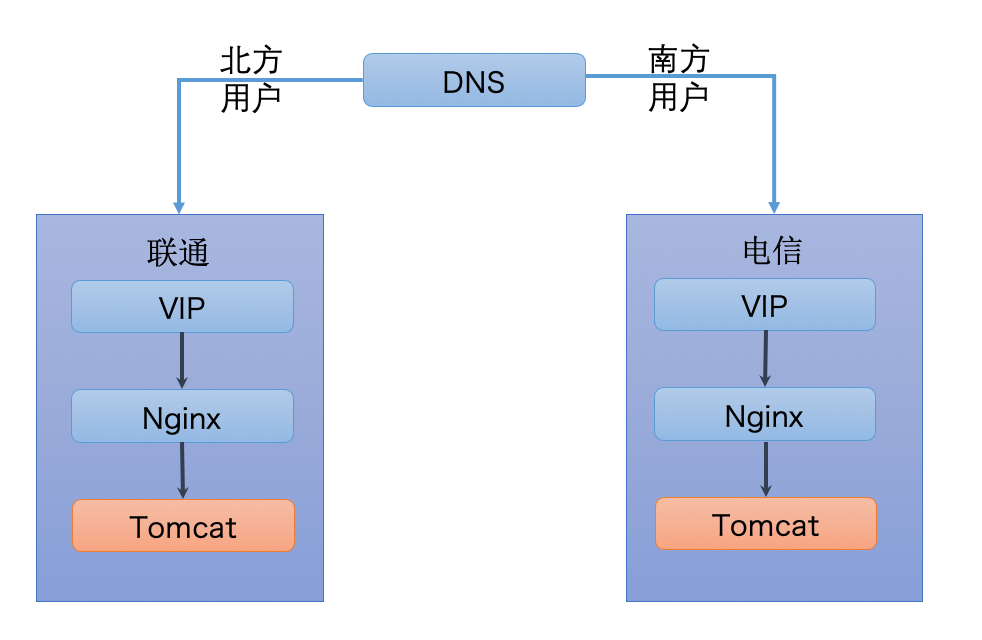
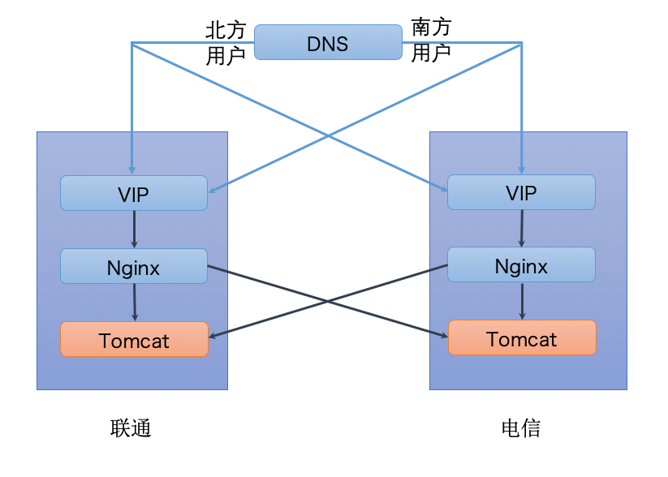
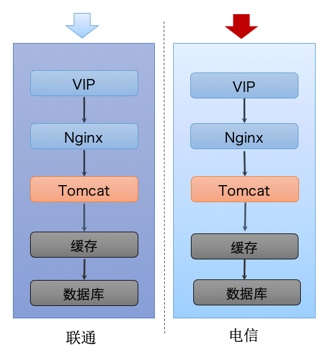
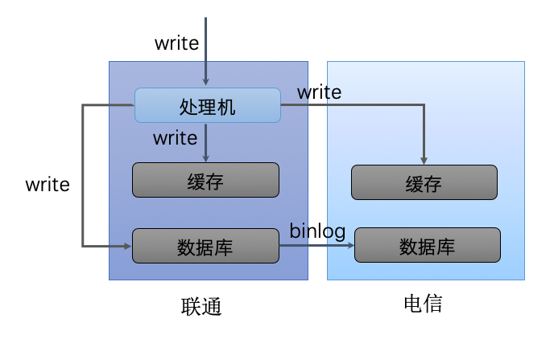
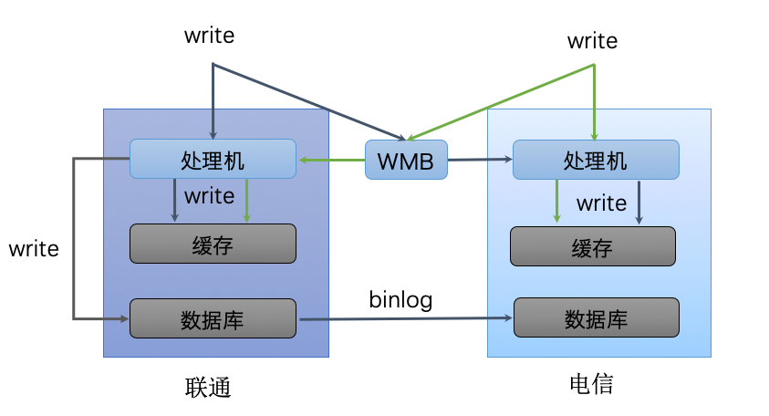
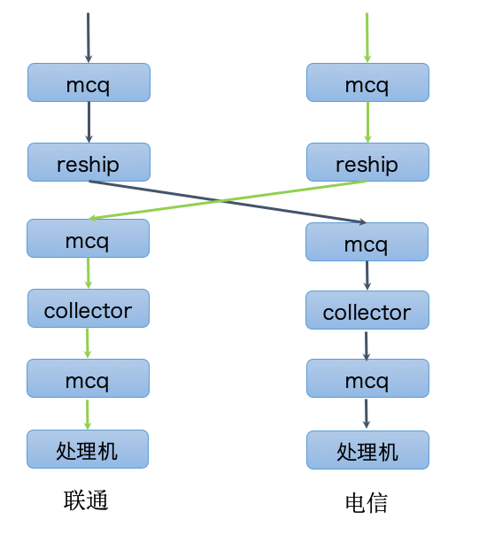
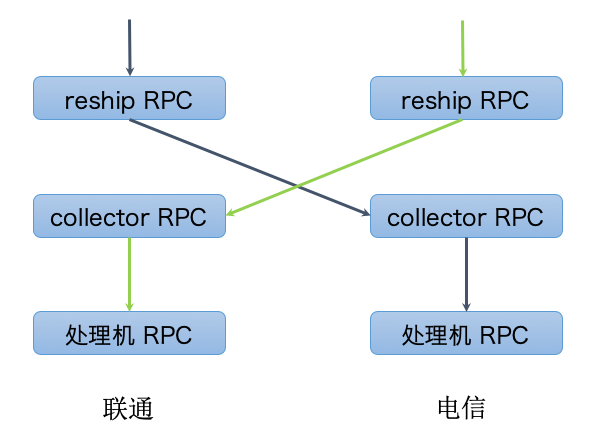
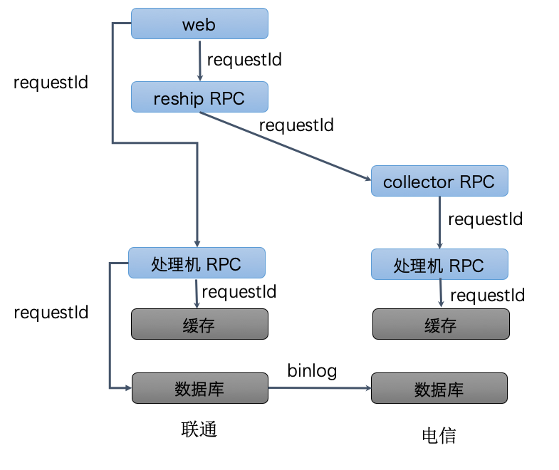

# 31 微服务多机房部署实践

专栏前面我在讲服务治理时提到过，为了实现高可用性，微服务一般要部署在多个机房，保证有一个机房因为各种不可抗力因素导致不可用时，可以把流量切换到其他可用机房来避免故障。但是，是不是只要部署到多个机房就万事大吉了呢？你有没有想过这几个问题呢？

- 一切正常时用户请求该访问哪个机房？
- 多个机房之间的数据如何同步？
- 多个机房之间的数据如何确保持一致性？

你看多机房部署并非看似那么轻松，里面还有不少门道。接下来，我就以微博业务实践为例，跟你聊聊微服务实际进行多机房部署时是如何解决这些关键问题的。

## 多机房负载均衡

当服务部署在多个机房时，最简单的就是遵循用户就近访问的原则，比如北方用户访问联通机房，南方用户访问电信机房。微博的服务也是同时部署在联通和电信机房，你可以看下面这张图，访问时根据用户访问的 IP，通过 DNS 解析到不同的机房，如果是北方用户就访问联通机房，南方用户就访问电信机房。并且为了实现负载均衡，还会在每个机房分别部署四层负载均衡器 VIP 以及七层负载均衡器 Nginx。比如来自北方用户的请求通过 DNS 解析到联通机房下任意一个 VIP，然后通过 VIP 把请求转发给联通机房下任意一个 Nginx，Nginx 再把请求转发给联通机房下任意一个 Tomcat 容器，通过这种方式来实现各个机房内高并发访问下的负载均衡。

当然这是最理想的情况，在实际部署时经常会遇到下面的情况：

- 某个机房的流量比较大，但是该机房的服务器规模有限并不足以支撑线上流量。
- 某个机房服务有问题，需要切一部分流量到另外一个机房。

因此在实际部署时，有时候并不能完全遵循就近访问的原则，而是要  **根据需要调配流量，达到各个机房流量均衡的目的** 。在实践中可以通过两种方法来切换流量：一种是在 DNS 解析时，把一部分北方用户的请求解析到电信机房的 VIP 或者把一部分南方用户的请求解析到联通机房的 VIP；另一种是在 Nginx 转发请求时，把一部分电信机房的 Tomcat 容器配置到联通机房的 Nginx 的 upstream 里或者把一部分联通机房的 Tomcat 容器配置到电信机房的 Nginx 的 upstream 里。这两种方法的示意你可以看下面这张图。

## 多机房数据同步

想要实现服务部署到多机房供用户访问是有前提的，这个前提是每个机房的数据都是一样的，用户访问哪个机房都可以获取到一样的数据，这就要求多个机房之间的数据必须保持同步。对于微博这种高并发访问的服务来说，数据通常都会有两层存储即缓存层和数据库层，就像下图所展示的。缓存层是为了存储用户经常访问的数据，尤其是在高并发访问下可以用缓存 cache 住绝大多数用户请求，减少对数据库层的压力，这是因为数据库层要直接访问磁盘，相比缓存层直接访问内存来说，响应要慢得多。

如此一来，要保证多个机房的数据一致，不仅要保证数据库层的数据一致，还需要保证缓存层的数据一致，应该如何实现呢？

\\1. 主从机房架构

主从机房数据同步方案如下图所示。主从机房架构是以一个机房为主机房，所有的写请求都只发给主机房的处理机，由主机房的处理机来更新本机房的缓存和数据库，其他机房的缓存也通过主机房的处理机来更新，而数据库则通过 MySQL 的 binlog 同步机制的方式实现数据同步。

上面这种架构把所有的写请求都发给主机房，由主机房来负责写所有机房的缓存和本机房的数据库，而其他机房的数据库则通过 MySQL 的 binlog 同步机制实现数据同步。显然这样做有一个很大的风险，那就是如果主机房出现问题，就没法更新缓存和数据库了，所以就有了第二种方案。

\\2. 独立机房架构

这种架构的数据同步方案如下图所示，联通和电信机房都有写请求，并通过一个叫 WMB 的消息同步组件把各自机房的写请求同步一份给对方机房，这样的话相当于每个机房都有全量的写请求。每个机房的处理机接收到写请求后更新各自机房的缓存，只有一个机房会更新数据库，其他机房的数据库通过 MySQL 的 binlog 同步机制实现数据同步。

独立机房架构相比于主从机房架构的优势在于任意一个机房出现问题，都不影响别的机房的数据更新，因为每个机房的写消息都是全量的，所以每个机房可以更新自己的缓存，并从数据库主库同步数据。其实独立机房架构的关键点在于 WMB 消息同步组件，它可以把各个机房之间的写请求进行同步。下面我就详细讲讲 WMB 消息同步组建是如何实现的。

WMB 消息同步组件的功能就是把一个机房的写请求发给另外一个机房，它的实现原理可以用下面这张图来描述，分为两个部分：

- reship，负责把本机房的写请求分发一份给别的机房。
- collector，负责从别的机房读取写请求，然后再把请求转发给本机房的处理机。

那么该如何实现 WMB 的消息同步功能呢？根据我的实践经验，主要有两种方案，一种是通过 MCQ 消息队列，一种是通过 RPC 调用。

- MCQ 消息队列实现

下面这张图是采用 MCQ 消息队列的实现方案，从图中你可以看到联通机房的写请求写入到联通机房的 MCQ 里，然后联通机房的 reship 就从联通机房的 MCQ 里读取，再写入到电信机房的 MCQ 里，电信机房的 collector 就可以从电信机房的 MCQ 里读取到写请求，再写入到电信机房的另外一个 MCQ 里，电信机房的队列机就会从这个 MCQ 里读取写请求，然后更新缓存。可见采用这种方案的一个缺点是流程比较长，需要多次与 MCQ 消息队列打交道，当有大量写请求到来时，不仅要扩容 reship 和 collector 确保有足够的处理能力，还需要扩容 MCQ 消息队列以确保能够承受大量读取和写入，一种更加简单的方案是采用 RPC 调用来实现。

- RPC 调用实现

下面这张图是采用 RPC 调用的实现方案，从图中你可以看到联通机房的写请求会调用联通机房的 reship RPC，然后联通机房的 reship RPC 就会调用电信机房的 collector RPC，这样电信机房的 collector RPC 就会调用电信机房的处理机 RPC，从而实现把联通机房的写请求同步给电信机房的处理机进行处理。

## 多机房数据一致性

解决了多机房数据同步的问题之后，还要确保同步后的数据是一致的，因为在同步过程中，会因为各种原因导致各机房之间的数据不一致，这就需要有机制能确保数据的一致性。而且考虑到不同业务的特征对数据一致性的要求也不相同，类似金融类的业务要求多机房之间的数据必须是强一致的，也就是一个机房的数据必须时刻同另外一个机房的数据完全一致；而社交媒体类的业务则要求没那么高，只需要能达到最终一致即可。微博的服务主要是通过  **消息对账机制**    来保证最终一致性，下面我们来看下如何通过消息对账机制来保证最终一致性。

你可以先看下面这张图，系统会给每一次写请求生成一个全局唯一的 requestId，联通机房的写请求一方面会调用联通机房的处理机 RPC 来修改缓存和数据库，另一方面还会调用联通机房的 reship RPC，reship RPC 再调用电信机房的 collector RPC 来同步写请求，电信机房的 collector RPC 最后会调用电信机房的处理 RPC 来更新缓存。在这整个过程的每一个环节，requestId 始终保持向下传递，无论是处理成功或者失败都记录一条包含 requestId 和机房标记的处理日志，并写到 Elasticsearch 集群上去。然后通过一个定时线程，每隔 1 分钟去扫描 Elasticsearch 集群上的日志，找出包含同一个 requestId 的不同机房的处理日志，然后验证是否在各个机房请求都处理成功了，如果有的机房某一阶段处理失败，则可以根据日志信息重试该阶段直到成功，从而保证数据的最终一致性。

## 总结

今天我给你讲解了微服务多机房部署时要面临的三个问题，一是多机房访问时如何保证负载均衡，二是多机房之间的数据如何保证同步，三是多机房之间的数据如何保证一致性，并给出了微博在多机房部署微服务时所采取的解决方案，对于大部分中小业务团队应该都有借鉴意义。可以说多机房部署是非常有必要的，尤其是对可用性要求很高的业务来说，通过多机房部署能够实现异地多活，尤其可以避免因为施工把光缆挖断导致整个服务不可用的情况发生，也是业务上云实现混合云部署的前提。下一期我再来聊聊微服务混合云部署的实践，你可以对多机房部署的重要性有更深的认识。

## 思考题

在讲解多机房数据同步实践的时候，我提到了微博采用了 WMB 消息同步组件的方案，除了这种方案你是否有了解过其他多机房数据同步的方案？它们是如何实现的？

欢迎你在留言区写下自己的思考，与我一起讨论。 %
