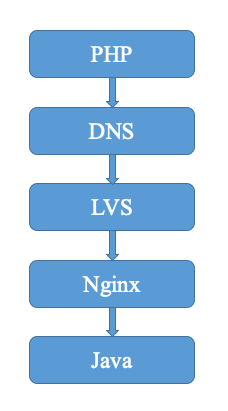
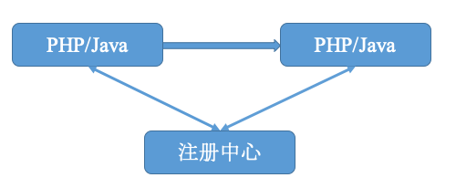
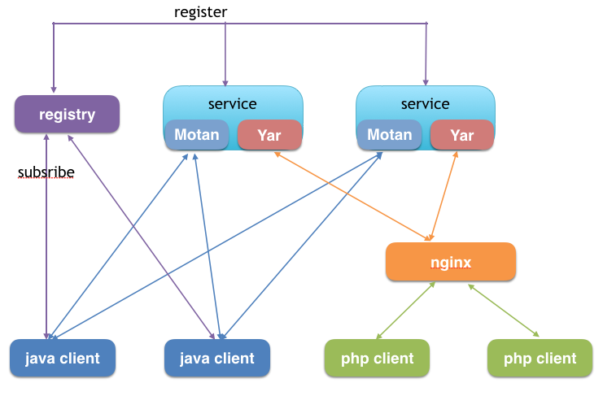
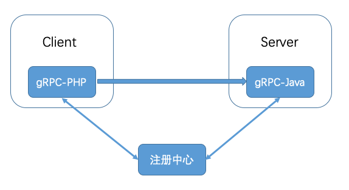
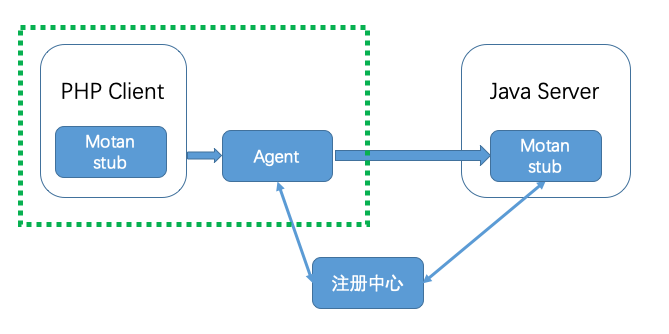
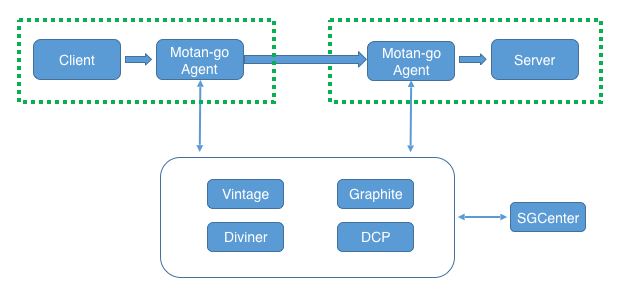

35 微博Service Mesh实践之路（上）
========================

专栏上一期我们聊了 Service Mesh 的代表作 Istio，由于 Istio 的设计理念非常新，并且它诞生在微服务容器化和 Kubernetes 云平台火爆之后，所以从设计和实现上，Istio 都天生对云原生应用更友好。

但是现实是不是也是那么美好呢？对于一个已经上线运行多年的业务系统来说，要想从经典的微服务架构走上 Istio 这条看似完美的道路并不容易，各种内部基础设施的定制化以及业务稳定性优先准则等因素，都注定了大多数公司要走出一条自己的 Service Mesh 实践之路。今天我就来带你回顾下微博是如何一步步走向 Service Mesh 的。

跨语言服务调用的需求
----------

我在前面讲过，微博的服务化框架采用的是自研的 Motan，Motan 诞生于 2013 年，出于微博平台业务单体化架构拆分为微服务改造的需求，在结合当时的开源服务化框架和自身实际的需求，选择了采用自研的方式。而且由于微博平台的业务采用的是 Java 语言开发，所以 Motan 早期只支持 Java 语言。后期随着微博业务的高速发展，越来越多的 PHP 业务开始登上舞台，于是在微博的流量体系中，主要是三股服务之间的相互调用：一个是 Java 与 Java 语言，一个是 PHP 和 Java 语言，一个是 PHP 和 PHP 语言。Java 应用之间的调用采用的是 Motan 协议，而 Java 应用与 PHP、PHP 与 PHP 应用之间采用的都是 HTTP 协议。我回忆了一下当时一次 PHP 与 Java 之间的 HTTP 调用过程，大致需要经过 DNS 解析、四层 LVS 负载均衡、七层 Nginx 负载均衡，最后才能调用 Java 应用本身。

从上面这张图可以看出，一次 HTTP 调用的链路相当长，从我的实践来看，经常会遇到好几个问题。

 **第一个问题：中间链路损耗大 **。由于一次 HTTP 调用要经过 DNS、LVS、Nginx 这三个基础设施，每一层都会带来相应的损耗。我曾经在线上就碰到过因为 DNS 解析延迟、LVS 带宽打满引起的网络延迟，以及 Nginx 本地磁盘写满引起的转发延迟等各种情况，造成接口响应在中间链路的损耗甚至超过了接口本身业务逻辑执行的时间。** 第二个问题：全链路扩容难 **。由于微博业务经常要面临突发热点事件带来的流量冲击，所以需要能够随时随地动态扩缩容。其实在应用本身这一层扩容并不是难点，比较麻烦的是四七层负载均衡设备的动态扩缩容，它涉及如何评估容量、如何动态申请节点并及时修改生效等，要完成一次全链路扩容的话，复杂度非常高，所以最后往往采取的办法是给四七层负载均衡设备预备足够的冗余度，在峰值流量到来时，只扩容应用本身。** 第三个问题：混合云部署难**。专栏前面我讲过微博的业务目前采用的是混合云部署，也就是在内网私有云和公有云上都有业务部署，同样也需要部署四七层负载均衡设备，并且要支持公有云上的请求经过 DNS 解析后要能够转发到公有云上的负载均衡设备上去，避免跨专线访问带来不必要的网络延迟和专线带宽占用。

因此，迫切需要一种支持跨语言调用的服务化框架，使得跨语言应用之间的调用能够像 Java 应用之间的调用一样，不需要经过其他中间链路转发，做到直接交互，就像下图描述的那样。

Yar 协议的初步尝试
-----------

为此，微博最开始考虑基于 Motan 框架进行扩展，使其支持 PHP 语言的 Yar 协议，下面是扩展后的架构图。这个架构的思路是 PHP 客户端的服务发现通过 Nginx 来支持，经过 Nginx 把 PHP 的 Yar 协议请求转发给服务端，由于 Motan 框架中了适配 Yar 协议，服务端会把 PHP 的 Yar 协议请求转换成 Motan 请求来处理，处理完后再转成 Yar 协议的返回值经过 Nginx 返回给客户端。

但这种架构主要存在两个问题。**第一个问题 **：Motan 协议与 Yar 协议在基本数据结构和序列化方式的支持有所不同，需要经过复杂的协议转换。** 第二个问题** ：服务调用还必须依赖 Nginx，所以调用链路多了一层，在应用部署和扩容时都要考虑 Nginx。

gRPC 会是救命稻草吗
------------

时间往后推演，gRPC 横空出世，它良好的跨语言特性，以及高效的序列化格式的特性吸引了我们，于是便开始考虑在 Motan 中集成 gRPC，来作为跨语言通信的协议。当时设计了下图的架构，这个架构的思路是利用 gRPC 来生成 PHP 语言的 Client，然后在 Motan 框架中加入对 gRPC 协议的支持，这样的话 PHP 语言的 Client 就可以通过 gRPC 请求来调用 Java 服务。

但在我们的实际测试中，发现微博的业务场景并不适合 gRPC 协议，因为 gRPC 协议高度依赖 PB 序列化，而 PHP 对 PB 的兼容性不是很好，在微博的业务场景下一个接口返回值有可能超过几十 KB，此时在 PHP Client 端 PB 数据结构解析成 JSON 对象的耗时甚至达到几十毫秒，这对业务来说是不可接受的。而且 gRPC 当时还不支持 PHP 作为 Server 对外提供服务，也不满足微博这部分业务场景的需要。

代理才是出路
------

考虑到 PHP 语言本身没有常驻内存控制的能力，在实现服务注册和发现以及其他各种服务框架功能时，仅靠 PHP-FPM 进程本身难以实现，因此需要一个统一常驻内存的进程来帮助完成服务框架的各种功能。一开始我们考虑过使用本地守护进程和 OpenResty 的 Timer 来实现服务发现，但其他服务框架的功能不太好实现，比如专栏前面提到的各种复杂的负载均衡策略、双发、熔断等。为此，我们希望通过一个 Agent 也就是代理，来帮助 PHP 进程来完成服务框架的各种功能，PHP 进程本身只需要负责运行业务逻辑的代码，以及最简单的 Motan 协议解析。基于这个思路，当时我们设计了下面这个架构，它的思路就是在 PHP 进程的本地也部署一个 Agent，PHP 进程发出去的请求都经过 Agent 进行处理后，再发给对应的 Java 应用。

向 Service Mesh 迈进
-----------------

2017 年，就在我们开始采用 Agent 方案对业务进行改造，以支持 PHP 应用调用 Java 应用服务化的时候，Service Mesh 的概念突然火热起来，并随着 Istio 的发布风靡业界。相信经过我前面对 Service Mesh 的讲解，你一定会发现这里的 Agent 不恰恰就是 Service Mesh 中的 SideCar 吗？没错，我们跨语言调用的解决方案竟然与 Service Mesh 的理念不谋而合。借鉴 Service Mesh 的思想，我们也对 Agent 方案进一步演化，不仅客户端的调用需要经过本地的 Agent 处理后再转发给服务端，服务端在处理前也需要经过本地的 Agent，最后再由服务端业务逻辑处理，下面是它的架构图。如此一来，业务只需要进行集成最简单的 Motan 协议解析，而不需要关心其他服务框架功能，可以理解为业务只需要集成一个轻量级的 Client 用于 Motan 协议解析，而繁杂的服务框架功能全都由 Agent 来实现，从而实现业务与框架功能的解耦。

从上面的图中你可以看出，这个架构与上一期我们聊的 Istio 大体思路相同，但是区别还是很明显的，可以概括为以下几点：

* 都通过 SideCar 方式部署的代理来实现流量转发，Istio 里使用的是 Envoy，而 Weibo Mesh 采用的是自研的 Motan-go Agent。这里有一个很明显的区别是，Weibo Mesh 中业务代码还需要集成一个轻量级的 Client，所以对业务有一定的倾入性；而 Istio 采用的是 iptables 技术，拦截网络请求给 Envoy，所以业务无需做任何变更，更适合云原生应用。在微博的业务场景下，由于大部分业务并不是云原生应用，都是部署在物理机或者虚拟机集群之中的，所以需要根据自己的业务特点来决定 SideCar 的部署方式。而且 Weibo Mesh 中的轻量级 Client 除了实现基本的 Motan 协议的解析功能之外，还添加了一些业务需要的特性，比如为了防止 Agent 不可用，在本地保存了一份服务节点的本地快照，必要时 Client 可以访问本地快照获得节点的地址，直接向服务节点 Server 发起调用，而不需要经过 Agent 转发处理，只不过这个时候就丧失了 Agent 的服务治理功能。
* Weibo Mesh 和 Istio 都具备服务治理功能，只不过 Istio 是通过 Control Plane 来控制 Proxy 来实现，并且 Control Plane 包括三个组件 Pilot、Mixer 以及 Citedar，三者各司其职。而 Weibo Mesh 是通过统一的服务治理中心来控制 Agent，从而实现服务治理的。这是因为微博本身的各种基础设施大部分是自研的，比如注册和配置中心是自研的 Vintage、监控系统是自己基于 Graphite 改造的、容器平台 DCP 以及负责容量评估的 Diviner 也是自研的，为此需要一个统一的地方把这些基础设施串联起来。而 Istio 好像就为开源而生，设计之初就要考虑如何更好地集成并支持各类开源方案，比如专门抽象出 Mixer 组件来对接各种监控和日志系统。

总结
---

今天我给你讲解了微博是如何一步步走向 Service Mesh 之路的，从这个过程你可以看出微博的 Weibo Mesh 并不是一开始就是设计成这样的，它是随着业务的发展，对跨语言服务调用的需求日趋强烈，才开始探索如何使得原有仅支持 Java 语言的服务化框架 Motan 支持多语言，在这个过程中又不断尝试了各种解决方案之后，才笃定了走 Agent 代理这条路，并实际应用到线上。而随着 Service Mesh 概念的兴起，微博所采用的 Agent 代理的解决方案与 Service Mesh 理念不谋而合，于是在 Agent 代理的方案中吸纳 Service Mesh 的思想，进一步演变成如今的 Weibo Mesh。所以说一个可靠的架构从来都不是设计出来的，是逐步演进而来的。

思考题
---

如果要支持更多不同语言应用之间的相互调用，你觉得 Weibo Mesh 中的轻量级的 Client 需要做哪些工作？

欢迎你在留言区写下自己的思考，与我一起讨论。
