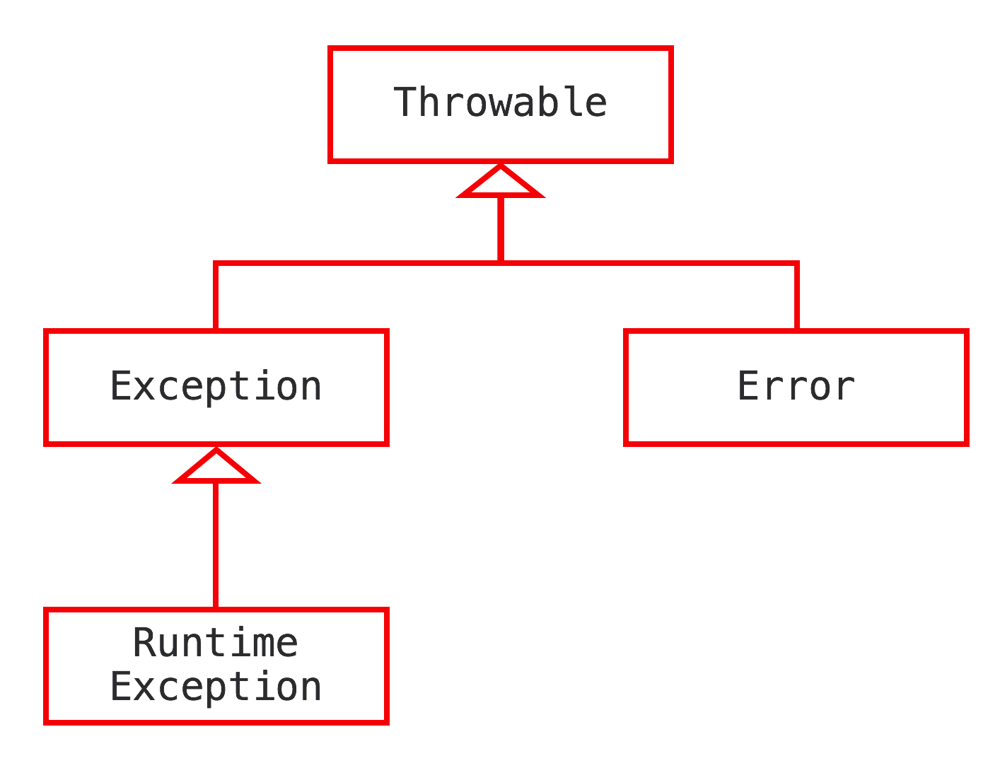
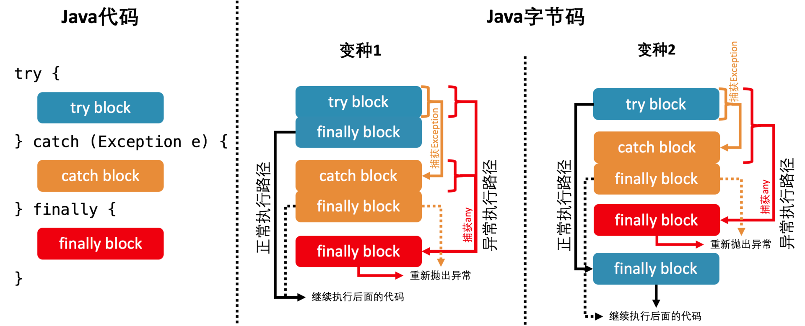

06 JVM是如何处理异常的？
===============

今天我们来讲讲 Java 虚拟机的异常处理。首先提醒你一下，本篇文章代码较多，你可以点击文稿查看具体代码。

众所周知，异常处理的两大组成要素是抛出异常和捕获异常。这两大要素共同实现程序控制流的非正常转移。

抛出异常可分为显式和隐式两种。显式抛异常的主体是应用程序，它指的是在程序中使用“throw”关键字，手动将异常实例抛出。

隐式抛异常的主体则是 Java 虚拟机，它指的是 Java 虚拟机在执行过程中，碰到无法继续执行的异常状态，自动抛出异常。举例来说，Java 虚拟机在执行读取数组操作时，发现输入的索引值是负数，故而抛出数组索引越界异常（ArrayIndexOutOfBoundsException）。

捕获异常则涉及了如下三种代码块。

1. try 代码块：用来标记需要进行异常监控的代码。
2. catch 代码块：跟在 try 代码块之后，用来捕获在 try 代码块中触发的某种指定类型的异常。除了声明所捕获异常的类型之外，catch 代码块还定义了针对该异常类型的异常处理器。在 Java 中，try 代码块后面可以跟着多个 catch 代码块，来捕获不同类型的异常。Java 虚拟机会从上至下匹配异常处理器。因此，前面的 catch 代码块所捕获的异常类型不能覆盖后边的，否则编译器会报错。
3. finally 代码块：跟在 try 代码块和 catch 代码块之后，用来声明一段必定运行的代码。它的设计初衷是为了避免跳过某些关键的清理代码，例如关闭已打开的系统资源。

在程序正常执行的情况下，这段代码会在 try 代码块之后运行。否则，也就是 try 代码块触发异常的情况下，如果该异常没有被捕获，finally 代码块会直接运行，并且在运行之后重新抛出该异常。

如果该异常被 catch 代码块捕获，finally 代码块则在 catch 代码块之后运行。在某些不幸的情况下，catch 代码块也触发了异常，那么 finally 代码块同样会运行，并会抛出 catch 代码块触发的异常。在某些极端不幸的情况下，finally 代码块也触发了异常，那么只好中断当前 finally 代码块的执行，并往外抛异常。

上面这段听起来有点绕，但是等我讲完 Java 虚拟机的异常处理机制之后，你便会明白这其中的道理。

异常的基本概念
-------

在 Java 语言规范中，所有异常都是 Throwable 类或者其子类的实例。Throwable 有两大直接子类。第一个是 Error，涵盖程序不应捕获的异常。当程序触发 Error 时，它的执行状态已经无法恢复，需要中止线程甚至是中止虚拟机。第二子类则是 Exception，涵盖程序可能需要捕获并且处理的异常。



Exception 有一个特殊的子类 RuntimeException，用来表示“程序虽然无法继续执行，但是还能抢救一下”的情况。前边提到的数组索引越界便是其中的一种。

RuntimeException 和 Error 属于 Java 里的非检查异常（unchecked exception）。其他异常则属于检查异常（checked exception）。在 Java 语法中，所有的检查异常都需要程序显式地捕获，或者在方法声明中用 throws 关键字标注。通常情况下，程序中自定义的异常应为检查异常，以便最大化利用 Java 编译器的编译时检查。

异常实例的构造十分昂贵。这是由于在构造异常实例时，Java 虚拟机便需要生成该异常的栈轨迹（stack trace）。该操作会逐一访问当前线程的 Java 栈帧，并且记录下各种调试信息，包括栈帧所指向方法的名字，方法所在的类名、文件名，以及在代码中的第几行触发该异常。

当然，在生成栈轨迹时，Java 虚拟机会忽略掉异常构造器以及填充栈帧的 Java 方法（Throwable.fillInStackTrace），直接从新建异常位置开始算起。此外，Java 虚拟机还会忽略标记为不可见的 Java 方法栈帧。我们在介绍 Lambda 的时候会看到具体的例子。

既然异常实例的构造十分昂贵，我们是否可以缓存异常实例，在需要用到的时候直接抛出呢？从语法角度上来看，这是允许的。然而，该异常对应的栈轨迹并非 throw 语句的位置，而是新建异常的位置。

因此，这种做法可能会误导开发人员，使其定位到错误的位置。这也是为什么在实践中，我们往往选择抛出新建异常实例的原因。

Java 虚拟机是如何捕获异常的？
-----------------

在编译生成的字节码中，每个方法都附带一个异常表。异常表中的每一个条目代表一个异常处理器，并且由 from 指针、to 指针、target 指针以及所捕获的异常类型构成。这些指针的值是字节码索引（bytecode index，bci），用以定位字节码。

其中，from 指针和 to 指针标示了该异常处理器所监控的范围，例如 try 代码块所覆盖的范围。target 指针则指向异常处理器的起始位置，例如 catch 代码块的起始位置。

```
 

public static void main(String[] args) {

  try {

    mayThrowException();

  } catch (Exception e) {

    e.printStackTrace();

  }

}

// 对应的 Java 字节码

public static void main(java.lang.String[]);

  Code:

    0: invokestatic mayThrowException:()V

    3: goto 11

    6: astore_1

    7: aload_1

    8: invokevirtual java.lang.Exception.printStackTrace

   11: return

  Exception table:

    from  to target type

      0   3   6  Class java/lang/Exception  // 异常表条目

 

```

举个例子，在上图的 main 方法中，我定义了一段 try-catch 代码。其中，catch 代码块所捕获的异常类型为 Exception。

编译过后，该方法的异常表拥有一个条目。其 from 指针和 to 指针分别为 0 和 3，代表它的监控范围从索引为 0 的字节码开始，到索引为 3 的字节码结束（不包括 3）。该条目的 target 指针是 6，代表这个异常处理器从索引为 6 的字节码开始。条目的最后一列，代表该异常处理器所捕获的异常类型正是 Exception。

当程序触发异常时，Java 虚拟机会从上至下遍历异常表中的所有条目。当触发异常的字节码的索引值在某个异常表条目的监控范围内，Java 虚拟机会判断所抛出的异常和该条目想要捕获的异常是否匹配。如果匹配，Java 虚拟机会将控制流转移至该条目 target 指针指向的字节码。

如果遍历完所有异常表条目，Java 虚拟机仍未匹配到异常处理器，那么它会弹出当前方法对应的 Java 栈帧，并且在调用者（caller）中重复上述操作。在最坏情况下，Java 虚拟机需要遍历当前线程 Java 栈上所有方法的异常表。

finally 代码块的编译比较复杂。当前版本 Java 编译器的做法，是复制 finally 代码块的内容，分别放在 try-catch 代码块所有正常执行路径以及异常执行路径的出口中。



针对异常执行路径，Java 编译器会生成一个或多个异常表条目，监控整个 try-catch 代码块，并且捕获所有种类的异常（在 javap 中以 any 指代）。这些异常表条目的 target 指针将指向另一份复制的 finally 代码块。并且，在这个 finally 代码块的最后，Java 编译器会重新抛出所捕获的异常。

如果你感兴趣的话，可以用 javap 工具来查看下面这段包含了 try-catch-finally 代码块的编译结果。为了更好地区分每个代码块，我定义了四个实例字段：tryBlock、catchBlock、finallyBlock、以及 methodExit，并且仅在对应的代码块中访问这些字段。

```
public class Foo {

  private int tryBlock;

  private int catchBlock;

  private int finallyBlock;

  private int methodExit;

 

  public void test() {

    try {

      tryBlock = 0;

    } catch (Exception e) {

      catchBlock = 1;

    } finally {

      finallyBlock = 2;

    }

    methodExit = 3;

  }

}

 

 

$ javap -c Foo

...

  public void test();

    Code:

       0: aload_0

       1: iconst_0

       2: putfield      #20                 // Field tryBlock:I

       5: goto          30

       8: astore_1

       9: aload_0

      10: iconst_1

      11: putfield      #22                 // Field catchBlock:I

      14: aload_0

      15: iconst_2

      16: putfield      #24                 // Field finallyBlock:I

      19: goto          35

      22: astore_2

      23: aload_0

      24: iconst_2

      25: putfield      #24                 // Field finallyBlock:I

      28: aload_2

      29: athrow

      30: aload_0

      31: iconst_2

      32: putfield      #24                 // Field finallyBlock:I

      35: aload_0

      36: iconst_3

      37: putfield      #26                 // Field methodExit:I

      40: return

    Exception table:

       from    to  target type

           0     5     8   Class java/lang/Exception

           0    14    22   any

 

  ...

 

```

可以看到，编译结果包含三份 finally 代码块。其中，前两份分别位于 try 代码块和 catch 代码块的正常执行路径出口。最后一份则作为异常处理器，监控 try 代码块以及 catch 代码块。它将捕获 try 代码块触发的、未被 catch 代码块捕获的异常，以及 catch 代码块触发的异常。

这里有一个小问题，如果 catch 代码块捕获了异常，并且触发了另一个异常，那么 finally 捕获并且重抛的异常是哪个呢？答案是后者。也就是说原本的异常便会被忽略掉，这对于代码调试来说十分不利。

Java 7 的 Supressed 异常以及语法糖
--------------------------

Java 7 引入了 Supressed 异常来解决这个问题。这个新特性允许开发人员将一个异常附于另一个异常之上。因此，抛出的异常可以附带多个异常的信息。

然而，Java 层面的 finally 代码块缺少指向所捕获异常的引用，所以这个新特性使用起来非常繁琐。

为此，Java 7 专门构造了一个名为 try-with-resources 的语法糖，在字节码层面自动使用 Supressed 异常。当然，该语法糖的主要目的并不是使用 Supressed 异常，而是精简资源打开关闭的用法。

在 Java 7 之前，对于打开的资源，我们需要定义一个 finally 代码块，来确保该资源在正常或者异常执行状况下都能关闭。

资源的关闭操作本身容易触发异常。因此，如果同时打开多个资源，那么每一个资源都要对应一个独立的 try-finally 代码块，以保证每个资源都能够关闭。这样一来，代码将会变得十分繁琐。

```
  FileInputStream in0 = null;

  FileInputStream in1 = null;

  FileInputStream in2 = null;

  ...

  try {

    in0 = new FileInputStream(new File("in0.txt"));

    ...

    try {

      in1 = new FileInputStream(new File("in1.txt"));

      ...

      try {

        in2 = new FileInputStream(new File("in2.txt"));

        ...

      } finally {

        if (in2 != null) in2.close();

      }

    } finally {

      if (in1 != null) in1.close();

    }

  } finally {

    if (in0 != null) in0.close();

  }

 

```

Java 7 的 try-with-resources 语法糖，极大地简化了上述代码。程序可以在 try 关键字后声明并实例化实现了 AutoCloseable 接口的类，编译器将自动添加对应的 close() 操作。在声明多个 AutoCloseable 实例的情况下，编译生成的字节码类似于上面手工编写代码的编译结果。与手工代码相比，try-with-resources 还会使用 Supressed 异常的功能，来避免原异常“被消失”。

```
public class Foo implements AutoCloseable {

  private final String name;

  public Foo(String name) { this.name = name; }

 

  @Override

  public void close() {

    throw new RuntimeException(name);

  }

 

  public static void main(String[] args) {

    try (Foo foo0 = new Foo("Foo0"); // try-with-resources

         Foo foo1 = new Foo("Foo1");

         Foo foo2 = new Foo("Foo2")) {

      throw new RuntimeException("Initial");

    }

  }

}

 

// 运行结果：

Exception in thread "main" java.lang.RuntimeException: Initial

        at Foo.main(Foo.java:18)

        Suppressed: java.lang.RuntimeException: Foo2

                at Foo.close(Foo.java:13)

                at Foo.main(Foo.java:19)

        Suppressed: java.lang.RuntimeException: Foo1

                at Foo.close(Foo.java:13)

                at Foo.main(Foo.java:19)

        Suppressed: java.lang.RuntimeException: Foo0

                at Foo.close(Foo.java:13)

                at Foo.main(Foo.java:19)

 

```

除了 try-with-resources 语法糖之外，Java 7 还支持在同一 catch 代码块中捕获多种异常。实际实现非常简单，生成多个异常表条目即可。

```
// 在同一 catch 代码块中捕获多种异常

try {

  ...

} catch (SomeException | OtherException e) {

  ...

}

```

总结与实践
-----

今天我介绍了 Java 虚拟机的异常处理机制。

Java 的异常分为 Exception 和 Error 两种，而 Exception 又分为 RuntimeException 和其他类型。RuntimeException 和 Error 属于非检查异常。其他的 Exception 皆属于检查异常，在触发时需要显式捕获，或者在方法头用 throws 关键字声明。

Java 字节码中，每个方法对应一个异常表。当程序触发异常时，Java 虚拟机将查找异常表，并依此决定需要将控制流转移至哪个异常处理器之中。Java 代码中的 catch 代码块和 finally 代码块都会生成异常表条目。

Java 7 引入了 Supressed 异常、try-with-resources，以及多异常捕获。后两者属于语法糖，能够极大地精简我们的代码。

那么今天的实践环节，你可以看看其他控制流语句与 finally 代码块之间的协作。

```
 

// 编译并用 javap -c 查看编译后的字节码

public class Foo {

  private int tryBlock;

  private int catchBlock;

  private int finallyBlock;

  private int methodExit;

 

  public void test() {

    for (int i = 0; i < 100; i++) {

      try {

        tryBlock = 0;

        if (i < 50) {

          continue;

        } else if (i < 80) {

          break;

        } else {

          return;

        }

      } catch (Exception e) {

        catchBlock = 1;

      } finally {

        finallyBlock = 2;

      }

    }

    methodExit = 3;

  }

}

```
